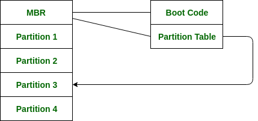

# 操作系统中的引导块

为了使计算机开始运行，当它启动或重新启动时，需要有一个初始程序来运行。这个被称为**引导程序**（bootstrap）的初始程序需要简单。它必须初始化系统的各个方面，从CPU寄存器到设备控制器以及主内存的内容，然后启动操作系统。

为了完成这项工作，引导程序基本上会在磁盘上找到操作系统内核，然后加载内核到内存中，之后它会跳转到初始地址以开始操作系统的执行。

### 为什么使用ROM：

对于当今大多数计算机来说，引导程序存储在只读存储器（ROM）中。

1. 这个位置适合存储，因为这个位置不需要初始化，而且位置是固定的，这样处理器在上电或重置时就可以开始执行。
2. ROM基本上是只读存储器，因此它不会受到计算机病毒的影响。
3. 与硬盘或网络存储等其他类型的存储器相比，ROM访问速度更快，因为它直接存储在计算机的主板上。这可以提高系统的性能。

问题是，更改引导代码基本上需要更改ROM硬件芯片。由于这个原因，大多数系统现在在启动区有一个小型的引导加载程序，它的唯一工作是从磁盘上获取完整的引导程序。通过这种方式，我们现在可以轻松更改完整的引导程序，并且新版本可以轻松写入磁盘。

完整的引导程序存储在磁盘上固定位置的**引导块**中。具有启动分区的磁盘称为启动磁盘。引导ROM中的代码基本上指示读取控制器将引导块读入内存，然后开始执行代码。完整的引导程序比启动ROM中的引导加载程序更复杂，它基本上能够从磁盘的非固定位置加载完整的操作系统以启动操作系统。尽管完整的引导程序非常小。

### 示例：

让我们通过Windows 2000的启动过程示例来理解这一点。

Windows 2000基本上将其引导代码存储在硬盘的第一个扇区中。此外，Windows 2000允许将硬盘划分为一个或多个分区。这个分区被识别为启动分区，它基本上包含操作系统和设备驱动程序。

Windows 2000的启动从运行系统ROM内存中的代码开始。这段代码指示系统直接从MBR读取代码。此外，引导代码还包含一个表格，列出了硬盘的分区以及一个标志，指示系统从哪个分区启动。一旦系统识别了启动分区，它就读取第一个扇区，即称为启动扇区，并继续执行其余的启动过程，包括加载各种系统服务。

下图显示了Windows 2000从磁盘启动的过程。

### 优点：

1. 引导块设计得小巧高效，允许操作系统在启动过程中快速加载。
2. 它们可以用来验证操作系统的完整性，确保系统未被篡改或感染恶意软件。
3. 引导块可以用来修复与启动相关的问题，如损坏的启动扇区，通过提供恢复选项和诊断工具。
4. 它们可以用来配置系统硬件和软件设置，如BIOS设置、网络设置和启动程序。
5. **防止磁盘故障：** 引导块可以用来创建关键系统文件的备份副本，如启动扇区或引导加载程序，这些文件可以在磁盘故障时用来恢复系统。
6. **与不同硬件配置的兼容性：** 引导块可以定制以适应不同的硬件配置，包括不同类型的存储设备、处理器和内存配置。
7. **减少系统停机时间：** 引导块可以用来执行系统维护和更新，这些可以在不中断用户工作或造成系统停机的情况下完成。
8. **提高安全性：** 引导块可以用来执行系统安全策略，如密码要求、访问控制和加密，这有助于保护系统免受未经授权的访问和数据泄露。
9. **定制：** 引导块可以定制以包含额外的功能或功能，如诊断工具、系统实用程序或第三方应用程序，这有助于简化系统管理和故障排除。

### 缺点：

1. 引导块可能容易受到恶意软件攻击，因为它们在操作系统的安全功能激活之前就被加载到内存中。
2. 它们可能会占用大量的内存，这可能会影响系统的整体性能。
3. 引导块可能与所有硬件配置不兼容，这可能导致兼容性问题和启动失败。
4. 如果引导块损坏，它可能会阻止系统启动，需要高级恢复工具和技术专长来修复。
5. **有限的存储容量：** 引导块通常在大小上受到限制，可能没有足够的空间来包含操作系统和硬件设备所需的所有驱动程序、应用程序和配置设置。
6. **修改困难：** 引导块被设计为低级系统组件，可能需要专门的工具和技术专长来修改或更新，这可能既耗时又复杂。
7. **潜在的不稳定性：** 引导块是关键的系统组件，它们的设计或实施中的任何错误或问题都可能导致系统不稳定、崩溃和数据丢失。
8. **故障排除的复杂性：** 引导块问题可能难以诊断和排除，需要对系统架构和低级编程技能有高级了解。
9. **与软件和固件的兼容性：** 引导块可能需要更新以确保与新的软件和固件版本兼容，这对于拥有多样化硬件和软件配置的组织来说可能是一个挑战。

