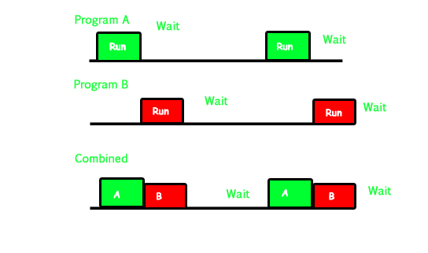
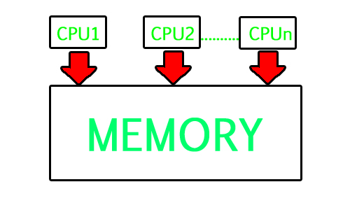
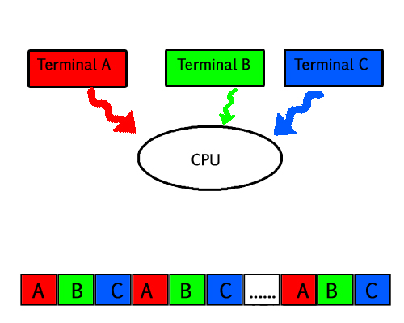
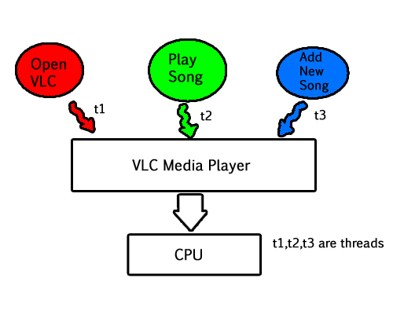

# 多程序、多任务处理、多线程和多进程之间的区别

最后更新：2023年3月25日

1. **多程序 -** 多编程是指在相同时间在主存储器中保持多个程序以供执行。
2. **多进程 -** 计算机同时使用多个CPU。
3. **多任务处理 -** 多任务处理不过是带有轮询调度算法的多编程。
4. **多线程** 是多任务处理的扩展。

| 特性 | 多程序 | 多任务处理 | 多线程 | 多进程 |
|---|---|---|---|---|
| 定义 | 在单个CPU上运行多个程序 | 在单个CPU上运行多个任务（应用程序） | 在单个任务（应用程序）内运行多个线程 | 在多个CPU（或核心）上运行多个进程 |
| 资源共享 | 程序之间共享资源（CPU、内存） | 任务之间共享资源（CPU、内存） | 线程之间共享资源（CPU、内存） | 每个进程拥有自己的资源集（CPU、内存） |
| 调度 | 使用轮询或基于优先级的调度来为程序分配CPU时间 | 使用基于优先级或时间片的调度来为任务分配CPU时间 | 使用基于优先级或时间片的调度来为线程分配CPU时间 | 每个进程可以有自己的调度算法 |
| 内存管理 | 每个程序拥有自己的内存空间 | 每个任务拥有自己的内存空间 | 线程在任务内共享内存空间 | 每个进程拥有自己的内存空间 |
| 上下文切换 | 在程序之间切换需要上下文切换 | 在任务之间切换需要上下文切换 | 在线程之间切换需要上下文切换 | 在进程之间切换需要上下文切换 |
| 进程间通信（IPC） | 使用消息传递或共享内存进行IPC | 使用消息传递或共享内存进行IPC | 使用线程同步机制（例如锁、信号量）进行IPC | 使用进程间通信机制（例如管道、套接字）进行IPC |

### 1. 多编程 –

在现代计算机系统中，通常有多个并发应用程序进程希望执行。现在，操作系统的责任是有效和高效地管理所有进程。操作系统最重要的方面之一是多编程。在计算机系统中，有多个进程等待执行，即它们在等待CPU分配给它们并开始执行时。这些进程也称为作业。现在，主存储器太小，无法容纳所有这些进程或作业。因此，这些进程最初保留在称为作业池的区域中。这个作业池包括所有等待分配主存储器和CPU的进程。CPU从所有等待的作业中选择一个作业，将其从作业池带到主存储器并开始执行。处理器执行一个作业，直到它被某个外部因素中断或它进行I/O任务。**非多编程系统的工作原理 –**

- 在非多编程系统中，一旦一个作业离开CPU并进行其他任务（比如I/O），CPU就变得空闲。CPU不断等待，直到这个作业（之前正在执行的作业）回来并恢复与CPU的执行。因此，在此期间CPU一直空闲。
- 现在它有一个缺点，即CPU在很长一段时间内保持空闲。此外，等待执行的其他作业可能没有机会执行，因为CPU仍然分配给早期的作业。这提出了一个非常严重的问题，即使其他作业已准备好执行，CPU也没有分配给它们，因为CPU分配给了实际上并未使用它（因为它正忙于I/O任务）的作业。
- 无法发生一个作业使用CPU 1小时，而其他作业在队列中等待5小时的情况。为了避免这种情况并实现CPU的有效利用，提出了多编程的概念。

多编程的主要思想是最大化CPU时间。**多编程系统的工作原理 –**

- 在多编程系统中，一旦一个作业进行I/O任务，操作系统就会中断该作业，从作业池（等待队列）中选择另一个作业，给这个新作业分配CPU并开始执行。前一个作业继续执行其I/O操作，而这个新作业执行CPU绑定任务。假设第二个作业也进行I/O任务，CPU选择第三个作业并开始执行它。一旦一个作业完成其I/O操作并返回进行CPU任务，CPU就分配给它。
- 通过这种方式，系统不会因等待I/O任务完成而浪费CPU时间。因此，多编程的最终目标是只要有足够的进程准备执行，就让CPU保持忙碌。这样，就可以通过一次执行一个程序的一部分，然后执行另一个程序的一部分，然后再执行另一个程序的一部分，依此类推，从而在单个处理器上执行多个程序。因此，CPU永远不会保持空闲。

在下面的图片中，程序A运行一段时间后进入等待状态。与此同时，程序B开始执行。所以CPU不会浪费资源，并给程序B一个运行的机会。

### 2. 多进程 –

在单处理器系统中，一次只能执行一个进程。多进程是指在单个计算机系统中同时使用两个或更多CPU（处理器）。该术语还指系统能够在单个计算机系统中支持多个处理器的能力。现在由于有多个处理器可用，因此可以同时执行多个进程。这些多处理器共享计算机总线，有时时钟、内存和外围设备也会共享。**多进程系统的工作原理 –**

- 借助多进程，可以同时执行许多进程。假设有P1、P2、P3和P4等进程等待执行。现在在单处理器系统中，首先会执行一个进程，然后是另一个，然后再另一个，依此类推。
- 但在多进程中，每个进程可以分配给不同的处理器进行执行。如果它是一个双核处理器（2个处理器），则两个进程可以同时执行，因此速度将是两倍，类似地，四核处理器的速度将是单处理器的四倍。

**为什么使用多进程 –**

- 多处理器系统的主要优点是在更短的时间内完成更多工作。当需要非常高的速度来处理大量数据时，使用这类系统。与单处理器系统相比，多进程系统可以节省资金，因为处理器可以共享外围设备和电源。

多进程是指硬件（即CPU单元）而不是软件（即运行进程）。如果底层硬件提供多个处理器，那就是多进程。它是系统利用多个处理器计算能力的能力。**多编程和多进程之间的区别 –**

- 系统可以通过同时运行多个程序来实现多编程，并通过拥有多个物理处理器来实现多进程。多进程和多编程之间的区别在于，多进程基本上是在多个处理器上同时执行多个进程，而多编程是在主存储器中保持多个程序并仅使用单个CPU同时执行它们。

### 3. 多任务处理 –

顾名思义，多任务处理是指同时执行多个任务（比如进程、程序、线程等）。在现代操作系统中，我们能够同时播放MP3音乐、在Microsoft Word中编辑文档、在Google Chrome中上网冲浪，这是通过多任务处理实现的。多任务处理是多编程的逻辑扩展。多任务处理与多编程的主要区别在于，多编程仅基于上下文切换的概念，而多任务处理基于时间共享以及上下文切换的概念。**多任务处理系统的工作原理 –**

- 在时间共享系统中，每个进程都被分配了特定的时间量，进程意味着要执行。假设有4个进程P1、P2、P3、P4准备执行。所以每个进程都被分配了一定的时间量，它们将执行，例如时间量为5纳秒（5 ns）。当一个进程开始执行（比如P2），它将执行指定的时间量（5 ns）。5纳秒后，CPU开始执行另一个进程（比如P3）。

- 如上图所示，任何时候CPU只执行一个任务，而其他任务在等待它们的轮次。当CPU重新分配给另一个任务时，就实现了并行性的幻觉。即所有三个任务A、B和C似乎同时发生，因为它们共享时间。

### 4. 多线程 –

线程是CPU使用的基本单位。多线程是一种执行模型，它允许单个进程同时（即在该进程的“上下文”内）运行多个代码段（即线程）。例如VLC播放器，一个线程用于打开VLC播放器，一个线程用于播放特定歌曲，另一个线程用于向播放列表添加新歌。多线程是进程同时被多个用户使用并管理同一用户的多个请求的能力，而无需拥有程序的多个副本。**多线程系统的工作原理 –** 示例1 –

- 假设有一个Web服务器处理客户端请求。现在，如果它作为单线程进程执行，那么它将无法同时处理多个请求。首先，一个客户端将提出其请求并完成执行，然后服务器才能处理另一个客户端请求。这是一项非常昂贵、耗时和费力的任务。为了避免这种情况，可以利用多线程。
- 现在，每当有新的客户端请求进来时，Web服务器简单地为处理此请求创建一个新线程，并恢复其执行以接收更多客户端请求。因此，Web服务器的任务是监听新的客户端请求并为每个单独的请求创建线程。每个新创建的线程处理一个客户端请求，从而减轻了Web服务器的负担。

下图完全描述了VLC播放器示例：

**多线程的优点 –**

- 多线程的好处包括提高了响应性。由于程序中有多个线程，因此如果一个线程执行时间过长或被阻塞，其余线程仍可正常执行。因此，通过其余线程，整个程序保持对用户的响应性。
- 多线程的另一个优点是成本较低。创建全新的进程和分配资源是一项耗时的任务，但由于线程共享父进程的资源，创建线程和在它们之间切换相对容易。因此，多线程是现代操作系统的需要。

