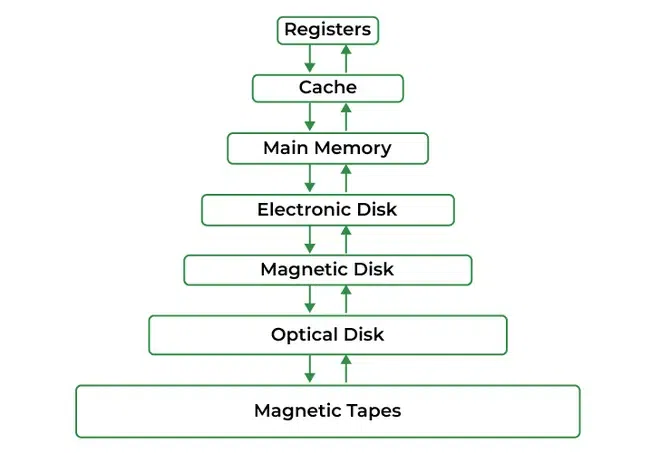
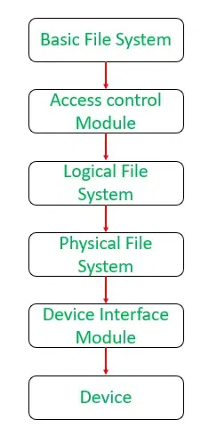
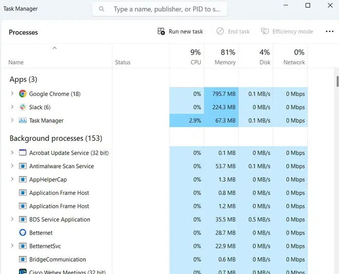
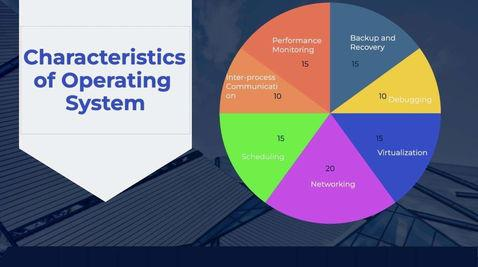

# 操作系统的功能

## 什么是操作系统？

操作系统是管理计算机硬件的软件。它还为应用程序提供基础，并充当计算机用户和计算机硬件之间的中介。操作系统执行的主要任务是分配资源和服务，例如分配内存、设备、处理器和信息。操作系统还包括管理这些资源的程序，如交通控制器、调度器、内存管理模块、I/O程序和文件系统。操作系统简单地提供了一个环境，其他程序可以在其中进行有用的工作。

## 为什么使用操作系统？

操作系统用作计算机硬件和用户之间的通信渠道。它作为系统硬件和最终用户之间的中间件。操作系统处理以下责任：

- 它控制所有计算机资源。
- 它为用户程序提供有价值的服务。
- 它协调用户程序的执行。
- 它为用户提供资源。
- 它提供界面（虚拟机）给用户。
- 它隐藏软件的复杂性。
- 它支持多种执行模式。
- 它监控用户程序的执行以防止错误。

## 操作系统的功能

### 内存管理

操作系统管理主存储器或主存储器。主存储器由大量的字节或字组成，每个字节或字都被分配了某个地址。主存储器是快速存储，并且可以被CPU直接访问。为了执行程序，它应该首先被加载到主存储器中。操作系统管理分配和回收内存给各种进程，并确保其他进程不会消耗分配给一个进程的内存。操作系统执行以下活动进行内存管理：

- 它跟踪主存储器，即哪些字节的内存被哪些用户程序使用。已经分配的内存地址和尚未使用的内存地址。
- 在多编程中，操作系统决定进程获得内存访问的顺序，以及多长时间。
- 当进程请求时分配内存给进程，并在进程终止或执行I/O操作时回收内存。

### 处理器管理

在多编程环境中，操作系统决定进程按什么顺序访问处理器，以及每个进程有多少处理时间。操作系统的这一功能称为进程调度。操作系统执行以下活动进行处理器管理。

操作系统通过分配各种作业给处理器并确保每个进程从处理器获得足够的时间来正常运作来管理工作。

跟踪进程的状态。执行此任务的程序被称为交通控制器。将CPU（处理器）分配给进程。当不再需要进程时，回收处理器。

.webp)

### 设备管理

操作系统通过其各自的驱动程序管理设备通信。它执行以下活动进行设备管理。

- 跟踪连接到系统的所有设备。指定负责每个设备的程序，称为输入/输出控制器。
- 决定哪个进程可以访问某个设备以及多长时间。
- 有效和高效地分配设备。当不再需要时，回收设备。
- 有各种输入和输出设备。操作系统控制这些输入输出设备的工作。
- 它接收来自这些设备的请求，执行特定任务，并与请求进程通信。

### 文件管理

文件系统被组织成目录以便于或轻松导航和使用。这些目录可能包含其他目录和其他文件。操作系统执行以下文件管理活动。它跟踪存储位置、用户访问设置、每个文件的状态等。这些设施统称为文件系统。操作系统以有组织的方式跟踪有关创建、删除、传输、复制和存储文件的信息。它还通过防止未经授权的访问来维护这些文件中存储的数据的完整性，包括文件目录结构。

### 用户界面或命令解释器

用户通过操作系统与计算机系统交互。因此，操作系统充当用户和计算机硬件之间的界面。此用户界面通过一组命令或图形用户界面（GUI）提供。通过此界面，用户与应用程序和机器硬件进行交互。

### 启动计算机

启动或重新启动计算机的过程称为引导。如果计算机完全关闭然后打开，则称为冷启动。温启动是使用操作系统重新启动计算机的过程。

### 安全

操作系统使用密码保护来保护用户数据和类似的技术。它还防止未经授权的程序和用户数据访问。操作系统提供各种技术，确保用户数据的完整性和机密性。以下安全措施用于保护用户数据：

- 通过登录保护，防止未经授权的访问。
- 通过保持防火墙活动，防止入侵。
- 保护系统内存免受恶意访问。
- 显示与系统漏洞相关的信息。

### 控制系统性能

操作系统在控制和优化系统性能方面发挥关键作用。它们作为硬件和软件之间的中介，确保计算资源的有效利用。一个基本方面是资源分配，其中操作系统分配CPU时间、内存和I/O设备给不同进程，努力提供公平和最优的资源利用。进程调度，一个关键功能，有助于决定哪些进程或线程应该何时运行，防止任何单一任务独占CPU并实现有效的多任务处理。

### 作业记账

操作系统跟踪各种任务和用户使用的时间和资源，这些信息可用于跟踪特定用户或用户组的资源使用情况。在多任务操作系统中，多个程序同时运行，操作系统决定哪些应用程序应该按什么顺序运行以及如何分配时间给每个应用程序。

### 错误检测辅助

操作系统不断监控系统以检测错误并避免计算机系统故障。操作系统不时检查系统是否有任何外部威胁或恶意软件活动。它还检查硬件是否有任何损坏。此过程向用户显示多个警报，以便对系统造成的任何损坏采取适当行动。

### 协调其他软件和用户

操作系统还协调并分配解释器、编译器、汇编器和其他软件给计算机系统的各个用户。简单来说，将操作系统视为计算机的交通警察。它指导和管理不同软件程序如何共享计算机资源而不造成混乱。它确保当您想要使用程序时，它可以顺利运行，而不会崩溃或给其他人造成问题。所以，它就像一个友好的警官，确保繁忙道路上的交通顺畅，确保每个人都能顺利到达目的地，而不发生任何事故或拥堵。

### 执行基本计算机任务

操作系统负责管理各种外围设备，如鼠标、键盘和打印机。如今大多数操作系统都是即插即用。这些操作系统自动识别并配置设备，无需用户干预。

### 网络管理

- **网络通信**：将它们视为您互联网流量的交通警察。操作系统帮助计算机彼此通信和连接到互联网。它们管理数据如何在网络中打包和发送，确保数据安全且按正确顺序到达。
- **设置和监控**：将它们视为您的互联网连接的设置和保安。它们还让您设置网络连接，如Wi-Fi或以太网，并监控您的网络状况。它们确保计算机有效且安全地使用网络，如调整您的互联网速度或保护计算机免受在线威胁。

## 操作系统提供的服务

操作系统为用户提供某些服务，可以按以下方式列出：

- **用户界面**：几乎所有操作系统都有用户界面（UI）。这个界面可以采取多种形式。一种是命令行界面（CLI），它使用文本命令和输入命令的方法（例如，键盘输入特定格式和特定选项的命令）。另一种是批处理界面，其中命令和控制命令的指令输入到文件中，然后执行这些文件。最常见的是使用图形用户界面（GUI）。界面是一个窗口系统，用指向设备来指导输入输出，从菜单中选择，并使用键盘输入文本。
- **程序执行**：操作系统负责执行所有类型的程序，无论是用户程序还是系统程序。操作系统利用各种资源以高效运行所有类型的功能。
- **处理输入/输出操作**：操作系统负责处理所有类型的输入，即来自键盘、鼠标、桌面等的输入。操作系统最适当地处理所有类型的输入和输出。

  例如，所有类型的外围设备（如鼠标或键盘）之间存在差异，操作系统负责在它们之间处理数据。
- **文件系统操作**：操作系统负责就如何在存储设备上存储所有类型的数据或文件（如软盘/硬盘/U盘等）做出决策。操作系统决定如何操作和存储数据。
- **资源分配**：操作系统确保通过决定谁使用哪个资源多长时间来适当使用所有可用资源。所有决策都由操作系统做出。
- **记账**：操作系统跟踪计算机系统中同时发生的所有功能。所有详细信息，如发生的错误类型，都由操作系统记录。
- **信息和资源保护**：操作系统负责以最保护的方式使用机器上所有可用的信息和资源。操作系统必须挫败任何外部资源企图破坏任何类型的数据或信息。
- **通信**：操作系统实现一个进程到另一个进程的通信以交换信息。这种通信可能发生在在同一计算机上执行的进程之间，也可能发生在通过计算机网络连接的不同计算机系统上执行的进程之间。
- **系统服务**：操作系统提供各种系统服务，如打印、时间和日期管理以及事件日志记录。
- **错误检测**：操作系统需要不断检测和纠正错误。错误可能发生在CPU和内存硬件中（例如，内存错误或电源故障），在I/O设备中（例如，磁盘上的奇偶校验错误、网络上的连接故障或打印机中缺纸），以及在用户程序中（算术溢出、尝试访问非法内存位置或CPU使用过多）。对于每种类型的错误，操作系统应采取适当的行动以确保正确和一致的计算。

所有这些服务都由操作系统确保，以便用户更方便地使编程任务更轻松。各种不同的操作系统或多或少提供相同的服务。

## 操作系统的特性

- **虚拟化**：操作系统可以提供虚拟化功能，允许多个操作系统或操作系统实例在单个物理机器上运行。这可以提高资源利用率，并在不同的操作系统或应用程序之间提供隔离。
- **网络**：操作系统提供网络功能，允许计算机系统通过网络连接到其他系统和设备。这可以包括网络协议、网络接口和网络安全等功能。
- **调度**：操作系统提供调度算法，确定任务在系统上的执行顺序。这些算法根据任务的资源需求和其他因素优先级排序任务，以优化系统性能。
- **进程间通信**：操作系统提供应用程序相互通信的机制，允许它们共享数据和协调活动。
- **性能监控**：操作系统提供监控系统性能的工具，包括CPU使用情况、内存使用情况、磁盘使用情况和网络活动。这有助于识别性能瓶颈并优化系统性能。
- **备份和恢复**：操作系统提供备份和恢复机制，以在系统故障或数据丢失的情况下保护数据。
- **调试**：操作系统提供调试工具，允许开发人员识别和修复系统中的软件错误和其他问题。

## 结论

简而言之，操作系统执行诸如管理计算机硬件、运行应用程序、处理文件系统和提供用户界面等基本功能。它确保软硬件之间的顺畅交互，使计算机更易于使用且更高效。

