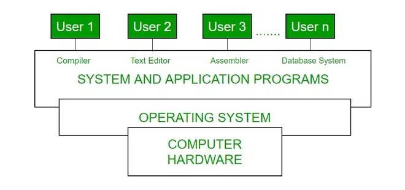
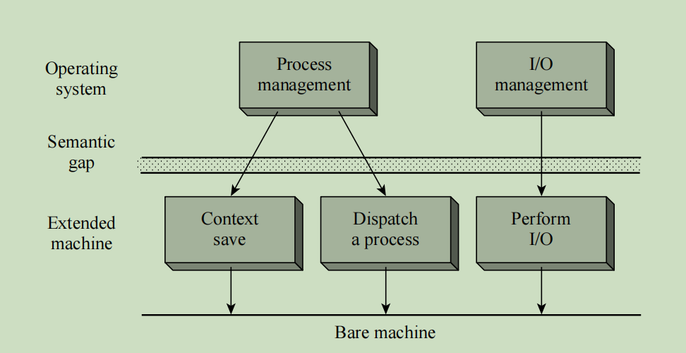

# 操作系统简介 第一部分

## 操作系统介绍

操作系统充当计算机用户和计算机硬件之间的中介。简而言之，它是计算机硬件和用户之间的接口。操作系统的目的是为用户提供一个方便、高效的程序执行环境。

操作系统是管理计算机硬件的软件。硬件必须提供适当的机制，以确保计算机系统的正确运行，并防止用户程序干扰系统的正常运行。一个更常见的定义是，操作系统是计算机上始终运行的一个程序（通常称为内核），其余的都是应用程序。

涉及在程序之间分配资源，例如内存、处理器、设备和信息操作例程。同样，操作系统有程序来执行这些任务，如交通控制器、调度器、内存管理模块、I/O程序和文件系统。

## 操作系统的历史

操作系统多年来一直在发展。下表显示了操作系统的历史。

| 代 | 年份 | 使用的电子设备 | OS设备类型 |
| --- | --- | --- | --- |
| 第一代 | 1945-55 | 真空管 | 插线板 |
| 第二代 | 1955-65 | 晶体管 | 批处理系统 |
| 第三代 | 1965-80 | 集成电路(IC) | 多编程 |
| 第四代 | 1980年至今 | 大规模集成 | 个人电脑 |

## 操作系统的特性

现在让我们讨论操作系统的一些重要特性：

- **设备管理：** 操作系统跟踪所有设备。因此，它也被称为输入/输出控制器，决定哪个进程获得设备，何时获得，以及使用多长时间。
- **文件管理：** 它分配和回收资源，还决定谁获得资源。
- **作业记账：** 跟踪各种作业或用户使用的时间和资源。
- **错误检测辅助工具：** 包含生成转储、跟踪、错误消息和其他调试和错误检测方法的方法。
- **内存管理：** 负责管理计算机的一级内存，包括哪部分正在被谁使用，以及检查多少是空闲或已使用的，并分配进程。
- **处理器管理：** 分配处理器给进程，然后在不再需要或作业完成后释放处理器。
- **控制系统性能：** 记录请求服务和系统之间的延迟。
- **安全性：** 使用密码或某种保护技术防止未经授权的程序和数据访问。
- **便利性：** 操作系统使计算机更易于使用。
- **效率：** 操作系统允许计算机系统资源的有效使用。
- **进化能力：** 操作系统应该构造得允许有效开发、测试和引入新的系统功能，同时不干扰服务。
- **吞吐量：** 操作系统应该构造得可以提供最大吞吐量（单位时间内的任务数）。

要深入了解操作系统和其他基础计算机科学概念，请探索GeeksforGeeks GATE CS自学课程。本课程全面覆盖核心科目，帮助你为技术竞争考试和成功的技术职业生涯打下坚实的基础。在专家指导下，用结构化的内容迈出你的学习之旅的下一步。

## 常见操作系统列表

有多种类型的操作系统，每种都有其独特的特性：

### **Windows 操作系统**

- **开发商**：Microsoft
- **关键特性**：用户友好的界面，软件兼容性，硬件支持，强大的游戏支持。
- **优势**：大多数用户易于使用，第三方应用程序广泛支持，频繁更新和支持。
- **典型用例**：个人计算，商业环境，游戏。

### macOS

- **开发商**：Apple。
- **关键特性**：时尚、直观的用户界面，与其他Apple产品的强整合，强大的安全特性，高性能和稳定性。
- **优势**：针对Apple硬件优化，Apple生态系统中无缝体验，卓越的图形和多媒体能力。
- **典型用例**：创意产业（设计、视频编辑、音乐制作），个人计算，专业环境。

### Linux

- **开发商**：社区驱动（各种发行版）。
- **关键特性**：开源且高度可定制，强大的安全性和稳定性，轻量级，可在旧硬件上运行，有大量的发行版（例如，Ubuntu，Fedora，Debian）。
- **优势**：免费使用和分发，强大的社区支持，适合服务器和开发环境。
- **典型用例**：服务器和数据中心，开发和编程，技术爱好者的个人计算。

### Unix

- **开发商**：最初由AT&T贝尔实验室，有各种商业和开源版本可用
- **关键特性**：多用户和多任务能力，强大的安全性和稳定性，强大的命令行界面，可移植到不同的硬件平台
- **优势**：可靠和稳健的性能，适合高性能计算和服务器，广泛的网络支持
- **典型用例**：服务器和工作站，开发环境，研究和学术环境

## 操作系统的功能

- **资源管理：** 当操作系统中发生并行访问时，意味着多个用户正在访问系统，操作系统作为资源管理器，其责任是向用户提供硬件。它减少了系统的负载。
- **进程管理：** 包括各种任务，如进程的**调度和终止**。这是通过CPU调度算法来完成的。
- **存储管理：** 文件系统机制用于管理存储。**NIFS**、**CIFS**、**CFS**、**NFS**等是一些文件系统。所有数据都存储在硬盘的不同轨道上，这些都由存储管理器管理。它包括**硬盘**。
- **内存管理：** 指管理一级内存。操作系统必须跟踪多少内存已被使用，以及由谁使用。它必须决定哪个进程需要内存空间以及多少。操作系统还必须分配和回收内存空间。
- **安全/隐私管理：** 操作系统还使用密码提供隐私，以防止未经授权的应用程序访问程序或数据。例如，Windows使用**Kerberos**认证来防止未经授权的数据访问。

操作系统作为用户界面的进程：

1. 用户
2. 系统和应用程序
3. 操作系统
4. 硬件

每一台通用计算机都包括硬件、一个或多个操作系统、系统程序和应用程序。硬件包括内存、CPU、ALU、I/O设备、外围设备和存储设备。系统程序包括编译器、加载器、编辑器、操作系统等。

计算机系统的概览视图

每台计算机都必须有一个操作系统才能运行其他程序。操作系统协调各种系统程序和应用程序对硬件的使用，以满足不同用户的需求。它简单地提供了一个环境，让其他程序可以在此环境中做有用的工作。

操作系统是一组在计算机机器上运行的程序包，使其能够高效运行。它管理从键盘识别输入、管理磁盘上的文件和目录、在屏幕上显示输出以及控制外围设备的简单任务。

## 操作系统的分层设计

图. 分层操作系统

扩展机器提供了诸如上下文保存、调度、交换和I/O启动等操作。操作系统层位于扩展机器层之上。这种安排大大简化了操作系统模块的编码和测试，通过将函数的算法与其原始操作的实现分开，使得测试、调试和修改操作系统模块比在单体操作系统中更容易。我们说，较低的层提供了一个抽象，即扩展机器。我们称操作系统层为操作系统的顶层。

## 操作系统的目的和任务

操作系统执行多项任务，并且它还有助于实现许多目的，如下所述。我们将看到操作系统如何通过它执行的任务帮助我们更好地服务。

### 操作系统的目的

- 它控制计算系统资源在各个用户和任务之间的分配和使用。
- 它为程序员提供了一个接口，简化了应用程序程序的编码和调试。

### 操作系统的任务

1. 提供使用编辑器创建和修改程序和数据文件的设施。
2. 提供编译器，将用户程序从高级语言翻译成机器语言。
3. 提供加载程序，将编译的程序代码移动到计算机的内存中以供执行。
4. 提供处理I/O编程细节的例程。

## I/O系统管理

跟踪设备状态的模块称为I/O流量控制器。每个I/O设备都有一个设备处理程序，它驻留在与该设备相关联的单独进程中。

I/O子系统包括

- 包括缓冲、缓存和假脱机的内存管理组件。
- 通用设备驱动程序接口。

## 特定硬件设备的驱动程序

下面提到的是特定硬件设备所需的驱动程序。这里我们讨论了汇编器、编译器和解释器、加载器。

### **汇编器**

汇编器的输入是一个汇编语言程序。输出是一个目标程序加上使加载器能够准备目标程序以供执行的信息。曾经，计算机程序员可以利用基本机器通过硬件解释某些基本指令。他会通过编写一系列一和零（机器语言）并将它们放入机器的内存中来为这台计算机编程。汇编语言的例子包括

### **编译器和解释器**

高级语言——例如C、C++、Java、Python等（大约300多种著名的高级语言）由编译器和解释器处理。编译器是一个程序，它接受一个“高级语言”的源程序，并一次性产生机器代码。一些编译语言是FORTRAN、COBOL、C、C++、Rust和Go。解释器是一个程序，它做同样的事情，但是将高级代码转换为机器代码是逐行进行的，而不是一次性完成的。解释语言的例子是
- Python
- Perl
- Ruby

#### **加载器**

加载器是一个例程，它加载目标程序并准备它以供执行。有各种加载方案：绝对、重定位和直接链接。一般来说，加载器必须加载、重定位和链接目标程序。加载器是一个程序，它将程序放入内存并为执行做好准备。在简单的加载方案中，汇编器在辅助设备上输出程序的机器语言翻译，而加载器将其放置在核心中。加载器将用户程序的机器语言版本放入内存，并将控制权转移给它。由于加载器程序比汇编器小得多，因此它为用户提供了更多的核心。

## 操作系统的组成部分

操作系统有两个基本组成部分。

- 外壳
- 内核

### 外壳

外壳是操作系统的最外层，它处理与用户的交互。外壳的主要任务是管理用户和操作系统之间的交互。外壳通过向用户提供适当的输入来提供更好的通信，它还解释输入以供操作系统使用，并处理来自操作系统的输出。它作为用户和操作系统之间的通信方式。

### 内核

内核是操作系统的一个组成部分，它作为核心组件。其余组件依赖内核提供操作系统提供的重要服务。内核是操作系统和硬件之间的主要接口。

#### 内核的功能

内核执行以下功能。

- 它有助于控制系统调用。
- 它有助于I/O管理。
- 它有助于管理应用程序、内存等。

#### 内核的类型

下面提到了四种内核类型。

- 单体内核
- 微内核
- 混合内核
- Exokernel

更多信息，请参考操作系统中的内核。

### 32位和64位操作系统的区别

| 32位操作系统 | 64位操作系统 |
| --- | --- |
| 32位操作系统需要运行32位处理器，因为它们无法在64位处理器上运行。 | 64位处理器可以在任何操作系统上运行，如32位操作系统或64位操作系统。 |
| 32位操作系统提供低效的性能。 | 64位操作系统提供高效的性能。 |
| 32位操作系统管理的数据量比64位操作系统少。 | 64位操作系统可以存储大量的数据。 |
| 32位操作系统可以寻址2^32字节的RAM。 | 64位操作系统可以寻址2^64字节的RAM。 |

**操作系统的基本目标是**

- 高效使用：确保计算机资源的有效使用。
- 用户便利：提供方便使用计算机系统的方法。
- 非干扰：防止干扰其用户的活动。

#### 高效使用

操作系统必须确保计算机系统的基本资源——内存、CPU和I/O设备（如磁盘和打印机）的有效使用。如果程序不使用分配给它的资源，可能会导致效率低下。通过监控资源使用并在必要时采取纠正措施，可以获得资源的有效使用。然而，监控资源使用会增加开销，从而降低使用效率。实际上，强调高效使用的操作系统通过限制其关注点仅在一些重要资源（如CPU和内存）的效率上，或者根本不监控资源使用，而是以保证高效率的方式处理用户程序和资源，从而限制了它们的开销。

**用户便利**

在计算机的早期，用户便利等同于基本需求——能够以高级语言编写程序并执行就被认为是足够的。早期操作系统的使用经验导致了对更好服务的需求，这在当时意味着对用户请求的快速响应。随着计算机在新领域的使用，用户便利的其他方面也随之发展。早期操作系统有命令行界面，要求用户输入命令并指定其参数的值。用户需要大量的培训才能学会使用命令，这是可以接受的，因为大多数用户是科学家或计算机专业人员。然而，为了促进新类别用户的计算机使用，需要更简单的界面。因此，发展了图形用户界面（GUI）。这些界面使用屏幕上的图标来表示程序和文件，并将鼠标点击图标和相关菜单视为有关它们的命令。在许多方面，这一举措可以与20世纪上半叶驾驶技能的普及相提并论。随着时间的推移，驾驶技能从一项专业技能变成了可以通过有限的培训和经验获得的技能。

**非干扰**

计算机用户可能会面临各种干扰其计算活动的情况。他的程序执行可能会被其他人的行为打断，或者他希望使用的操作系统服务也可能以类似的方式被打断。操作系统通过为程序和操作系统服务分配资源以供独占使用，并防止对资源的非法访问，从而防止这种干扰。另一种形式的干扰涉及存储在用户文件中的程序和数据。

## 操作系统的优势

- 它有助于管理设备中的数据，即内存管理。
- 它有助于最大限度地利用计算机硬件。
- 它有助于维护设备的安全性。
- 它有助于高效地运行不同的应用程序。

## 操作系统的缺点

- 操作系统可能对某些人来说难以使用。
- 一些操作系统昂贵且需要大量的维护。
- 如果被黑客使用，操作系统可能会受到威胁。

## 结论

操作系统（OS）——我们这样称呼现代计算API的核心，它直接在您和机器之间进行交互。不同类型的操作系统具有其独特的特性，因此我们可以选择适合不同应用的操作系统。Windows（广泛使用）、macOS（高安全级别）、Linux（灵活的操作系统）以及Android和iOS等较小的系统/设备，这都取决于您的需求。

就像技术的进步一样，操作系统将始终在管理诸如安全性和增强用户体验等任务中发挥作用。选择操作系统时的几个重点领域也是，做好当前的工作，并为将来的任务做好准备。

