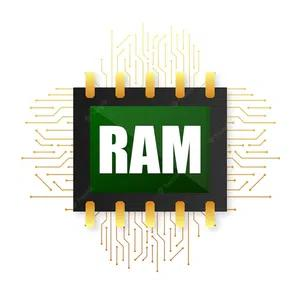
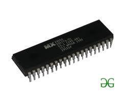

# 随机存取存储器（RAM）和只读存储器（ROM）

内存是计算机系统的基本组成部分，对于高效执行各种任务至关重要。它在计算机的运行中起着至关重要的作用，影响着速度、性能和数据管理。在计算机内存领域，两种主要类型尤为突出：随机存取存储器（RAM）和只读存储器（ROM）。理解RAM和ROM之间的区别对于了解它们在计算机操作中的各自角色至关重要。RAM能够实现高效的处理和多任务处理，而ROM则为系统功能提供必要的稳定性和可靠性。这两种内存类型共同确保了计算机能够在数字环境中平稳有效地运行。

## 内存类型

内存是计算机系统最关键的元素，因为没有它，计算机甚至无法执行简单任务。两种类型的内存（RAM和ROM）对计算机都很重要，但它们服务于不同的目的。RAM用于存储计算机当前正在使用的数据，而ROM用于存储计算机启动和运行所需的数据。RAM比ROM更快，因为它存储的数据可以按任意顺序访问和修改，而存储在ROM中的数据只能读取。

计算机内存分为两种基本类型：

1. 主存储器（RAM和ROM）
2. 辅助存储器（硬盘、CD等）

## 随机存取存储器（RAM）

**随机存取存储器（RAM）** 是一种计算机内存，用于临时存储计算机当前正在使用或处理的数据。RAM是易失性内存，这意味着存储在其中的数据在断电时会丢失。RAM通常用于存储操作系统、应用程序程序和计算机当前正在使用的数据。

- 它也被称为读写存储器、主存储器或一级存储器。
- CPU在执行程序期间所需的程序和数据存储在这种内存中。
- 它是一种易失性内存，因为断电后数据会丢失。

### 随机存取存储器（RAM）的类型

- 静态RAM（SRAM）
- 动态RAM（DRAM）

**1. 静态RAM：** SRAM代表静态随机存取存储器。它是一种半导体，广泛应用于计算机设备和微处理器中。

**2. 动态RAM：** DRAM代表动态随机存取存储器。它由电容器构成，数据保存时间比静态RAM短。

## 动态RAM和静态RAM的区别

| 参数 | DRAM | SRAM |
| --- | --- | --- |
| 结构 | 由微小的电容器构成，会漏电。 | 由类似D触发器的电路构成。 |
| 数据保持 | 需要每几毫秒充一次电以维持数据。 | 只要电源可用，就能保持其内容。 |
| 成本 | 便宜。 | 昂贵。 |
| 速度 | 比SRAM慢。 | 比DRAM快。 |
| 存储容量 | 每个芯片可以存储许多位。 | 每个芯片不能存储许多位。 |
| 功耗 | 功耗较低。 | 功耗较高。 |
| 热量产生 | 产生较少热量。 | 产生较多热量。 |
| 典型用途 | 用于主存储器。 | 用于高速缓存。 |

### 随机存取存储器（RAM）的优点

- **速度：** RAM比其他类型的存储（如硬盘或固态硬盘）快得多，这意味着计算机可以更快地访问存储在RAM中的数据。
- **灵活性：** RAM是易失性内存，这意味着存储在其中的数据可以轻易地被修改或删除。这使其成为存储计算机当前正在使用或处理的数据的理想选择。
- **容量：** RAM的容量可以轻松升级，这允许计算机在内存中存储更多数据，从而提高性能。
- **功耗管理：** 与硬盘和固态硬盘相比，RAM的功耗较低，这使其成为便携设备的理想的内存。

### 随机存取存储器（RAM）的缺点

- **易失性：** RAM是易失性内存，这意味着存储在其中的数据在断电时会丢失。这对于需要保存的重要数据（如未保存的工作或未备份的文件）可能是一个问题。
- **容量：** RAM的容量有限，尽管可以升级，但可能仍然不足以满足某些需要大量内存的应用程序或任务。
- **成本：** 与其他类型的内存（如硬盘或固态硬盘）相比，RAM可能相对昂贵，这可能使得升级计算机或设备的内存更加昂贵。

## 只读存储器（ROM）

**只读存储器（ROM）** 是一种计算机内存，用于永久存储不需要修改的数据。ROM是非易失性内存，这意味着即使断电，存储在其中的数据也能保留。ROM通常用于存储计算机的BIOS（基本输入/输出系统），其中包含启动计算机的指令，以及其他硬件设备的固件。

- 存储对操作系统至关重要的关键信息，如启动计算机所必需的程序。
- 它是非易失性的。
- 总是保留其数据。
- 用于嵌入式系统或不需要更改程序的地方。
- 用于计算器和外围设备。
- ROM进一步细分为四种类型：M _ROM_、_PROM_、_EPROM_和_EEPROM_。

### 只读存储器（ROM）的类型

1. PROM（可编程只读存储器）
2. EPROM（可擦除可编程只读存储器）
3. EEPROM（电擦除可编程只读存储器）
4. MROM（掩码只读存储器）

**1. PROM（可编程只读存储器）：** 它可以由用户编程。一旦编程，其中的数据和指令就不能更改。

**2. EPROM（可擦除可编程只读存储器）：** 它可以重新编程。要擦除其中的数据，需要将其暴露于紫外线下。要重新编程，需要擦除所有先前的数据。

**3. EEPROM（电擦除可编程只读存储器）：** 可以通过施加电场来擦除数据，无需紫外线。我们可以擦除芯片的部分区域。

**4. MROM（掩码只读存储器）：** 掩码ROM是一种在生产时被屏蔽的只读存储器。与其他类型的ROM一样，掩码ROM不允许用户更改存储在其中的数据。如果可以，该过程将困难或缓慢。

### 只读存储器（ROM）的优点

- **非易失性：** ROM是非易失性内存，这意味着即使断电，存储在其中的数据也能保留。这使其成为存储不需要修改的数据（如BIOS或其他硬件设备的固件）的理想选择。
- **可靠性：** 由于存储在ROM中的数据不容易被修改，因此它比其他类型的内存更不容易受到损坏或错误的影响。
- **功耗管理：** 与其他类型的内存相比，ROM的功耗较低，这使其成为便携设备的理想的内存。

### 只读存储器（ROM）的缺点

- **有限的灵活性：** ROM是只读内存，这意味着存储在其中的数据不能被修改。这可能成为需要更新或修改的应用程序或固件的问题。
- **有限的容量：** ROM的容量通常有限，升级它可能很困难或昂贵。
- **成本：** 与其他类型的内存（如硬盘或固态硬盘）相比，ROM可能相对昂贵，这可能使得升级计算机或设备的内存更加昂贵。

## 随机存取存储器（RAM）和只读存储器（ROM）的区别

| 参数 | RAM | ROM |
| --- | --- | --- |
| 存储类型 | 临时存储。 | 永久存储。 |
| 存储容量 | 以MB存储数据。 | 以GB存储数据。 |
| 数据易失性 | 易失性。 | 非易失性。 |
| 用途 | 用于正常操作。 | 用于计算机启动过程。 |
| 数据写入速度 | 写入数据更快。 | 写入数据较慢。 |

## 结论

在计算机内存领域，随机存取存储器（RAM）和只读存储器（ROM）扮演着关键角色，每种都有其独特的目的。将RAM视为计算机的繁忙工作区——数据临时存储并随时可供快速任务和修改。

然而，这个工作区是短暂的；一旦断电，信息也会消失。

通过把握这两种内存类型之间的区别，我们可以更好地了解它们对计算机平稳运行的贡献，确保RAM的快速响应或ROM的可靠持久性，每种内存在数字环境中都不可或缺。
