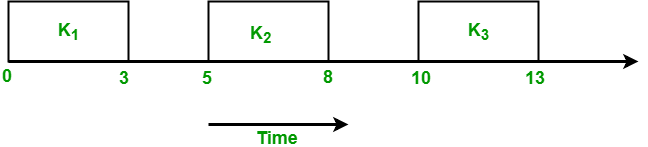
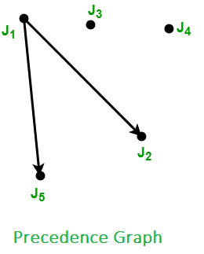
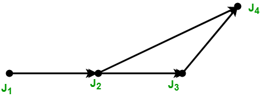

# 实时系统中的任务

系统受到实时性的约束，即响应应在指定的时间限制内得到保证，或者系统应满足指定的截止期限。例如飞行控制系统、实时监控等。

实时系统中有四种类型的任务：

1. 周期性任务
2. 动态任务
3. 关键任务
4. 非关键任务

- **周期性任务**：在周期性任务中，作业以规律的时间间隔发布。周期性任务是一种在固定时间间隔后重复自身的任务。周期性任务由四个元组表示：**T** ****i**** **= < Φ** ****i**** **, P** ****i**** **, e** ****i**** **, D** ****i**** **>**

  其中，
  - **Φ** ****i**** – 任务的相位。相位是任务中第一个作业的发布时间。如果未提及相位，则假定第一个作业的发布时间为零。
  - **P** ****i**** – 任务的周期，即两个连续作业发布时间之间的时间间隔。
  - **e** ****i**** – 任务的执行时间。
  - **D** ****i**** – 任务的相对截止期限。

  例如：考虑任务Ti，周期=5，执行时间=3

  未给出相位，因此假定第一个作业的发布时间为零。所以这个任务的第一个作业在t = 0时首次发布，然后执行3秒，接着下一个作业在t = 5时发布，执行3秒，然后下一个作业在t = 10时发布。因此作业在t = 5k处发布，其中k = 0, 1, ..., n

  

  一组周期性任务的超周期是该组中所有任务周期的最小公倍数。例如，两个任务T1和T2分别具有周期4和5，将具有超周期，H = lcm(p1, p2) = lcm(4, 5) = 20。超周期是作业发布时间模式开始重复的时间。

- **动态任务**：它是由事件的发生调用的顺序程序。事件可能由系统外部或内部的过程生成。动态到达的任务可以根据它们发生时间的临界性和知识进行分类。
  1. **非周期性任务**：在这种类型的任务中，作业在任意时间间隔内发布，即随机地。非周期性任务具有宽松的截止期限或没有截止期限。
  2. **偶发性任务**：它们类似于非周期性任务，即它们在随机实例中重复。唯一的区别在于偶发性任务有硬截止期限。偶发性任务由三个元组表示：**T** ****i**** **=(e** ****i**** **, g** ****i**** **, D** ****i**** **)**

     其中

     **e** ****i**** – 任务的执行时间。

     **g** ****i**** – 两个连续实例发生之间的最小间隔。

     **D** ****i**** – 任务的相对截止期限。

- **关键任务**：

  关键任务是那些及时执行至关重要的任务。如果错过了截止期限，就会发生灾难。

  例如，生命支持网络和飞机的稳定性控制。如果关键任务以更高的频率执行，这是至关重要的。

- **非关键任务**：

  非关键任务是真实的时间任务。顾名思义，它们对应用程序并不关键。然而，它们可以管理时间，改变数据，因此如果未在截止期限内完成，它们就变得无用。调度这些任务的目标是提高在截止期限内成功执行的作业水平。

**抖动**：有时实际作业的发布时间是未知的。只知道ri在一个范围内 \[ ri-, ri\+ \]。这个范围被称为发布时间抖动。这里ri–是作业可以发布的最早时间，ri\+是作业可以发布的最晚时间。只知道作业执行时间的范围 \[ ei-, ei\+ \]。这里ei–是作业完成执行所需的最短时间，ei\+是作业完成执行所需的最长时间。

**作业的优先级约束**：如果任务中的作业可以按任何顺序执行，则它们是独立的。如果任务中的作业必须按特定顺序执行，则称作业具有优先级约束。为了表示作业的优先级约束，使用偏序关系<。这称为优先级关系。如果作业Ji是作业Jj的前驱，则Ji < Jj，即Jj不能开始执行直到Ji完成。如果Ji < Jj并且没有其他作业Jk使得Ji < Jk < Jj，则Ji是Jj的直接前驱。如果Ji和Jj独立，则Ji < Jj和Jj < Ji均不成立。

表示优先级约束的有效方法是使用有向图G = (J, <)，其中J是作业集。这个图称为优先级图。作业由图的顶点表示，优先级约束用有向边表示。如果有从Ji到Jj的有向边，则意味着Ji是Jj的直接前驱。例如：考虑一个任务T，有5个作业J1, J2, J3, J4, 和 J5，使得J2和J5不能开始执行直到J1完成，并且没有其他约束。

这个例子的优先级约束是：

J1 < J2 和 J1 < J5

优先级图的集合表示：

1. `< (1) = { }`
2. `< (2) = {1}`
3. `< (3) = { }`
4. `< (4) = { }`
5. `< (5) = {1}`

考虑另一个例子，给定一个优先级图，你必须找出优先级约束

从上述图中，我们得出以下优先级约束：

1. `J1 < J2`
2. `J2 < J3`
3. `J2 < J4`
4. `J3 < J4`

