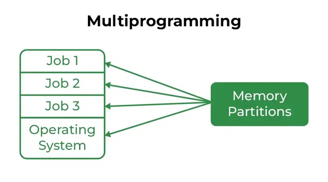
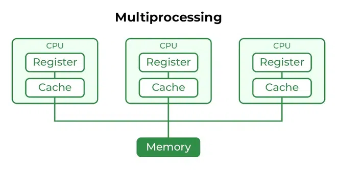
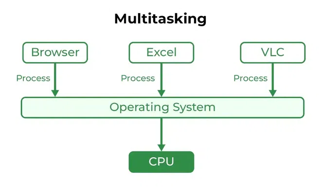
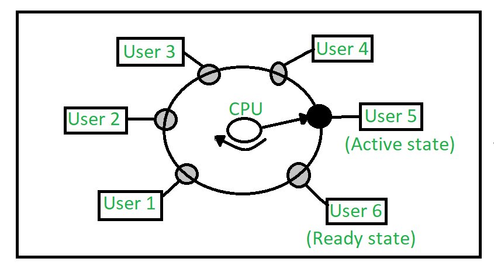

# 操作系统的类型

## 操作系统简介

操作系统执行所有基本任务，如管理文件、进程和内存。因此，操作系统充当所有资源的**资源管理器**。因此，操作系统成为用户和机器之间的界面。它是设备中必需的软件之一。

操作系统是一种软件，它作为系统程序和硬件之间的界面。有许多类型的操作系统，其中许多在下面提到。让我们来看看它们。

## 操作系统的类型

下面提到了几种类型的操作系统。

- 批处理操作系统
- 多程序系统
- 多处理系统
- 多任务操作系统
- 分时操作系统
- 分布式操作系统
- 网络操作系统
- 实时操作系统

## 1. 批处理操作系统

这种类型的操作系统不与计算机直接交互。有一个操作员负责将具有相同需求的类似作业分组到批处理中。操作员负责对具有相似需求的作业进行排序。批处理操作系统旨在通过成组处理作业来有效管理和执行大量作业。

.webp)

### 批处理操作系统的优点

- 多个用户可以共享批处理系统。
- 批处理系统的空闲时间非常少。
- 在批处理系统中重复大量工作很容易管理。

### 批处理操作系统的缺点

- 批处理系统难以调试。
- 有时成本较高。
- 如果任何作业失败，其他作业将不得不等待未知时间。
- 在批处理操作系统中，作业在队列中的处理时间通常难以准确预测。
- 在队列中时，很难准确预测作业完成所需的确切时间。

**批处理操作系统的示例：** 工资单系统、银行对账单等。

## 2. 多程序操作系统

多程序操作系统可以简单地描述为在主存储器中存在多个程序，并且可以随时执行其中任何一个。这主要用于更好地利用资源。

### 多程序操作系统的优点

- 多编程提高了系统的吞吐量。
- 它有助于减少响应时间。

### 多程序操作系统的缺点

- 没有设施允许用户与系统资源进行交互。

## 3. 多处理操作系统

多处理操作系统是一种操作系统，其中使用多个CPU来执行资源。它提高了系统的吞吐量。

### 多处理操作系统的优点

- 它增加了系统的吞吐量。
- 由于有多个处理器，所以如果一个处理器失败，我们可以继续使用另一个处理器。

### 多处理操作系统的缺点

- 由于有多个CPU，它可能更复杂，有些难以理解。

## 4. 多任务操作系统

多任务操作系统简单来说是一个具有轮询调度算法设施的多程序操作系统。它可以同时运行多个程序。

多任务系统有两种类型，如下所示。

- 抢占式多任务
- 合作多任务

### 多任务操作系统的优点

- 多任务操作系统可以同时执行多个程序。
- 它具有适当的内存管理。

### 多任务操作系统的缺点

- 如果多次运行大型程序，系统会变热。

## 5. 分时操作系统

每个任务都分配了一定的时间来执行，以使所有任务都能顺利进行。每个用户都获得了CPU的使用时间，就像他们使用单一系统一样。这些系统也被称为多任务系统。任务可以来自单个用户或不同用户。每个任务获得执行的时间称为量子。这个时间间隔结束后，操作系统会切换到下一个任务。

### 分时操作系统的优点

- 每个任务都有平等的机会。
- 软件重复的可能性较小。
- 可以减少CPU空闲时间。
- 资源共享：分时系统允许多个用户共享硬件资源，如CPU、内存和外围设备，降低硬件成本，提高效率。
- 提高生产力：分时允许用户同时工作，从而减少等待使用计算机的时间。这种提高的生产力意味着在更短的时间内完成更多的工作。
- 提高用户体验：分时提供交互式环境，允许用户实时与计算机通信，提供比批处理更好的用户体验。

### 分时操作系统的缺点

- 可靠性问题。
- 必须注意用户程序和数据的安全性和完整性。
- 数据通信问题。
- 高开销：分时系统的开销比其他操作系统高，因为需要调度、上下文切换以及支持多个用户的其他开销。
- 复杂性：分时系统复杂，需要高级软件来同时管理多个用户。这种复杂性增加了错误和错误的机会。
- 安全风险：多个用户共享资源时，安全风险增加。分时系统需要仔细管理用户访问、认证和授权，以确保数据和软件的安全性。

### 分时操作系统的示例

- **IBM VM/CMS**：IBM VM/CMS是1972年首次推出的分时操作系统。它今天仍在使用，提供了一个虚拟机环境，允许多个用户运行自己的操作系统和应用程序实例。
- **TSO (Time Sharing Option)**：TSO是IBM在1960年代为IBM System/360大型机首次推出的分时操作系统。它允许多个用户同时访问同一台计算机，运行自己的应用程序。
- **Windows Terminal Services**：Windows Terminal Services是一个分时操作系统，允许多个用户远程访问Windows服务器。用户可以实时运行自己的应用程序并访问共享资源，如打印机和网络存储。

## 6. 分布式操作系统

这些类型的操作系统是计算机技术领域的最新进展，并且正在以极快的速度在全球范围内被广泛接受。各种自治互联计算机使用共享通信网络进行通信。独立系统拥有自己的存储单元和CPU。这些被称为松散耦合系统或分布式系统。这些系统的处理器在大小和功能上有所不同。使用这些类型的操作系统的主要好处是，用户总是可以访问实际上不在自己的系统上，但在该网络中连接的其他系统上的文件或软件，即在连接的设备内启用了远程访问。

### 分布式操作系统的优点

- 一个系统的故障不会影响其他网络通信，因为所有系统都是彼此独立的。
- 电子邮件提高了数据交换速度。
- 由于资源共享，计算速度非常高且耐用。
- 减少了主机计算机的负载。
- 这些系统很容易扩展，因为可以轻松地将许多系统添加到网络中。
- 减少了数据处理延迟。

### 分布式操作系统的缺点

- 主网络的故障将停止整个通信。
- 建立分布式系统所使用的语言尚未明确定义。
- 这些类型的系统不易获得，因为它们非常昂贵。不仅如此，底层软件非常复杂，尚未被很好地理解。

**分布式操作系统的示例**：LOCUS等。

### 分布式操作系统的问题

- 网络导致分布式系统节点之间的数据传输延迟。这种延迟可能导致不同节点中的数据视图不一致，并且难以知道系统中事件发生的先后顺序。
- 调度、资源分配和死锁检测等控制功能需要在多个节点上执行，以实现计算加速并在计算机或网络组件故障时提供可靠的操作。
- 在不同节点中存在的进程交换的消息可能通过公共网络传输，并穿过不受分布式操作系统控制的计算机系统。入侵者可能利用这一特性篡改消息，或创建假消息以欺骗认证过程并伪装成系统的用户。

## 7. 网络操作系统

这些系统在服务器上运行，并提供管理数据、用户、组、安全性、应用程序和其他网络功能的能力。这些类型的操作系统允许在小型专用网络上共享对文件、打印机、安全性、应用程序和其他网络功能的访问。网络操作系统的另一个重要方面是，所有用户都清楚了解网络中其他用户的基础配置、他们的个人连接等，这就是为什么这些计算机被称为紧密耦合系统。

### 网络操作系统的优点

- 高度稳定的中央服务器。
- 通过服务器处理安全问题。
- 可以轻松地将新技术和硬件升级集成到系统中。
- 可以从不同位置和类型的系统远程访问服务器。

### 网络操作系统的缺点

- 服务器成本高。
- 用户必须依赖中央位置进行大多数操作。
- 需要定期进行维护和更新。

**网络操作系统的示例**：Microsoft Windows Server 2003、Microsoft Windows Server 2008、UNIX、Linux、Mac OS X、Novell NetWare、BSD等。

## 8. 实时操作系统

这些类型的操作系统为实时系统服务。处理并响应输入所需的时间间隔非常小。这个时间间隔称为**响应时间**。实时系统用于非常严格的时间要求，如导弹系统、空中交通控制系统、机器人等。

### 实时操作系统的类型

- **硬实时系统**：硬实时操作系统适用于时间约束非常严格且连最短可能的延迟也不能接受的应用程序。这些系统旨在拯救生命，如自动降落伞或安全气囊，这些在事故发生时需要随时可用。这些系统中很少发现虚拟内存。
- **软实时系统**：这些操作系统适用于时间约束不那么严格的应用程序。

更多信息，请参考硬实时操作系统和软实时操作系统之间的区别。

### 实时操作系统的优点

- **最大消耗**：设备和系统的最大化利用，从而从所有资源中获得更多产出。
- **任务切换**：这些系统中分配给任务切换的时间非常少。例如，在旧系统中，从一个任务切换到另一个任务大约需要10微秒，而在最新系统中，需要3微秒。
- **专注于应用程序**：专注于运行应用程序，而不是排队中的应用程序。
- 实时操作系统在**嵌入式系统中**：由于程序尺寸小，实时操作系统也可以用于运输等嵌入式系统中。
- **无错误**：这些类型的系统无错误。
- **内存分配**：在这些类型的系统中，内存分配得到了很好的管理。

### 实时操作系统的缺点

- **有限的任务**：同时运行的任务非常少，并且它们对避免错误的少数应用程序的关注非常少。
- **使用重型系统资源**：有时系统资源不太好，而且它们也很昂贵。
- **复杂算法**：算法非常复杂，设计师很难编写。
- **设备驱动程序和中断信号**：需要特定的设备驱动程序和中断信号，以便尽早响应中断。
- **线程优先级**：设置线程优先级并不好，因为这些系统很容易不切换任务。

**实时操作系统的示例**：科学实验、医学成像系统、工业控制系统、武器系统、机器人、空中交通控制系统等。

## 结论

操作系统有各种类型，每种都用于特定需求。无论是管理大量作业、允许多个用户同时工作、协调网络计算机，还是确保关键系统中的及时执行。了解这些类型有助于为正确的工作选择合适的操作系统，确保效率和有效性。

