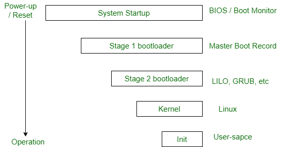
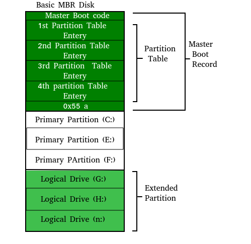

# 计算机启动时发生了什么？

没有运行程序的计算机只是一堆无用的电子设备。计算机在开机时首先需要启动一个特殊的程序，称为操作系统。操作系统的工作是通过处理控制计算机硬件的复杂细节来帮助其他计算机程序工作。

## 计算机启动时发生了什么？

1. 电源向计算机的各个组件，如主板、硬盘和风扇，发送电力。
2. BIOS（基本输入/输出系统）初始化并执行开机自检（POST），检查基本硬件组件以确保它们正常工作。如果检测到任何问题，可能会显示错误消息。
3. 操作系统（OS），如Windows或macOS，从硬盘或其他存储设备加载到计算机的RAM（随机存取存储器）中。
4. 操作系统随后初始化自己的组件和驱动程序，并向用户展示登录屏幕或桌面环境。

### 启动过程概述

启动过程是每次打开计算机时都会发生的事情。你实际上看不到它，因为它发生得太快了。你按下电源按钮，几分钟后（如果是像HDD这样的慢速存储，可能需要几分钟）Windows 10、Windows 11或你使用的任何操作系统就都加载好了。

BIOS芯片告诉它在固定位置查找一个特殊的程序，称为引导加载程序（在Linux下，引导加载程序称为Grub或LILO）。引导加载程序被拉入内存并启动。引导加载程序的工作是启动真正的操作系统。

### BIOS的功能

**1. POST（开机自检）：** 开机自检每次打开计算机时都会发生。它听起来很复杂，因为它确实有点复杂。计算机在开机时要做很多事情，这只是其中的一部分。

- 它初始化各种硬件设备。
- 这是一个重要的过程，以确保所有设备顺利运行，没有任何冲突。遵循ACPI的BIOS会创建描述计算机中设备的表格。
- POST首先检查BIOS，然后测试CMOS RAM。
- 如果这里没有问题，POST继续检查CPU、显卡等硬件设备，以及硬盘、软驱、Zip驱动器或CD/DVD驱动器等二级存储设备。
- 如果发现一些错误，则在屏幕上显示错误消息或听到一系列蜂鸣声。
- 这些蜂鸣声被称为POST蜂鸣代码。

**2. 主引导记录：** 主引导记录（MBR）是磁盘开头的特殊引导扇区。MBR包含加载操作系统其余部分的代码，称为引导加载程序。这个复杂的过程（称为启动过程）从POST（开机自检）开始，到BIOS在硬盘上搜索MBR结束，MBR通常位于第一个扇区、第一个磁头、第一个柱面（柱面0、磁头0、扇区1）。

典型的结构如下：

引导加载程序存储在计算机的EPROM、ROM或其他非易失性存储器中。当计算机开启或重启时，它首先执行开机自检，也称为POST。如果POST成功且未发现问题，引导加载程序将把操作系统加载到计算机的内存中。然后，计算机将能够快速访问、加载和运行操作系统。

**3. init：** init是内核启动序列的最后一步。它查找文件_/etc/inittab_以查看是否有_initdefault_的条目。它用于确定系统的初始运行级别。运行级别用于决定操作系统的初始状态。

一些运行级别包括：

- **级别0：** 系统停机。
- **级别1：** 单用户模式。
- **级别2：** 完整的多用户模式，无网络。
- **级别3：** 完整的多用户模式，有网络。
- **级别4：** 用户可定义。
- **级别5：** 完整的多用户模式，有网络和X显示管理器。
- **级别6：** 重启。

上述init的设计称为SysV（发音为System five）。现在已编写了几种其他init的实现。一些流行的实现是systemd和upstart。自2006年以来，Ubuntu一直在使用upstart。有关upstart的更多详细信息可以在这里找到。

init的下一步是启动支持网络和其他服务的各种守护进程。X服务器守护进程是最重要的守护进程之一。它管理显示、键盘和鼠标。当X服务器守护进程启动时，你会看到一个图形界面，并且会显示登录屏幕。

**4. 系统配置：**

BIOS允许用户配置各种系统设置，例如：

1. 启动顺序：这决定了计算机检查可启动设备的顺序。例如，如果启动顺序设置为首先“硬盘”，计算机将尝试从硬盘启动，然后才会检查其他设备，如CD/DVD驱动器或USB驱动器。
2. 时间和日期：BIOS存储时间和日期信息，用户可以设置和调整这些信息。这些信息由操作系统和各种应用程序使用。
3. 硬件设置：BIOS提供配置各种硬件设置的选项，如CPU电压、时钟速度和内存时序。这些设置可用于优化系统性能，但应仅由具有适当知识的高级用户更改。

**5. 安全性：**

BIOS还可以提供诸如以下安全功能：

1. 密码保护：BIOS可以设置为要求输入密码才能访问某些功能或防止未经授权的计算机启动。这在防止未经授权访问敏感数据时非常有用。
2. 安全启动：安全启动是一个功能，确保在启动过程中只加载受信任的操作系统引导加载程序、驱动程序和固件。这有助于防止恶意软件和其他未经授权的软件在系统上运行。
3. TPM（可信平台模块）：一些现代主板内置了TPM，提供基于硬件的安全功能，如加密、数字证书和安全密钥存储。这有助于保护敏感数据并防止未经授权访问系统。
