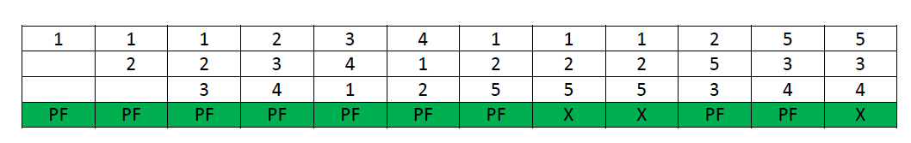
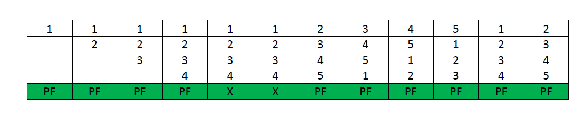

# 操作系统中的贝拉迪异常（Belady's Anomaly）页面替换算法

在操作系统中，进程数据被加载到固定大小的数据块中，每个数据块被称为一个页面。处理器将这些页面加载到固定大小的内存块中，这些内存块被称为帧。通常，每个页面的大小总是等于帧的大小。

当页面在内存中未找到且需要从磁盘加载时，会发生页面错误。如果发生页面错误，并且所有内存帧都已被分配，那么就需要在请求新页面时替换内存中的页面。这被称为请求分页。由页面替换算法指定替换哪个页面。常用的页面替换算法包括先进先出（FIFO）、最近最少使用（LRU）、最优页面替换算法等。

## 什么是页面错误？

页面错误是计算机操作系统中发生的一种中断或异常，当程序试图访问当前未加载到物理RAM（随机存取存储器）中的内存页面时会发生。相反，该页面存储在称为页面文件或交换空间的磁盘存储空间中。

通常，增加进程虚拟内存的帧数量，其执行速度会更快，因为页面错误发生的次数减少。有时，情况正好相反，即在为进程分配更多帧时，发生更多的页面错误。这种最意想不到的结果被称为**贝拉迪异常**。

## 什么是贝拉迪异常？

**贝拉迪异常**是指增加页面帧数量导致给定内存访问模式下页面错误数量增加的现象。

这种现象通常发生在以下页面替换算法中：

- 先进先出（FIFO）
- 第二机会算法
- 随机页面替换算法

## 贝拉迪异常的原因

其他两种常用的页面替换算法是最优和LRU算法，但贝拉迪异常在这些算法中永远不会发生，因为它们属于基于栈的页面替换算法类别。

**基于栈的算法**是这样一个算法，它可以证明对于_N_帧，内存中的页面集合总是_N+1_帧内存中页面集合的子集。对于LRU替换，内存中的页面集合将是最近引用的_n_个页面。如果帧数量增加，那么这些_n_个页面仍将是最近引用的，因此仍将在内存中。而在FIFO中，如果页面_b_在页面_a_之前进入物理内存，那么_b_的替换优先级就高于_a_，但这与页面帧的数量无关，因此，FIFO不遵循基于栈的页面替换策略，因此遭受贝拉迪异常。

**示例**：考虑以下图表，以理解基于栈的页面替换算法的行为


图表说明了给定的页面集合，即3帧内存中的{0, 1, 2}，不是4帧内存中的页面集合{0, 1, 4, 5}的子集，这是基于栈算法属性的违规情况。这种情况在FIFO算法中经常可以看到。

## FIFO中的贝拉迪异常

假设一个系统在内存中没有加载任何页面，并使用FIFO页面替换算法。考虑以下引用字符串：

```
1, 2, 3, 4, 1, 2, 5, 1, 2, 3, 4, 5
```

**案例1：**如果系统有3帧，使用FIFO页面替换算法处理给定的引用字符串，总共发生了9次页面错误。下图说明了示例中发生的页面错误模式。



**案例2：**如果系统有4帧，使用FIFO页面替换算法处理给定的引用字符串，总共发生了10次页面错误。下图说明了示例中发生的页面错误模式。



从上述示例中可以看出，在使用FIFO页面替换算法时，增加帧数量导致页面错误数量从9增加到10。

> **注意 -** 并非每个字符串引用模式都会导致FIFO中的贝拉迪异常，但确实存在某些类型的字符串引用，它们在增加帧数量时会恶化FIFO的性能。

## 为什么基于栈的算法不会遭受异常？

所有基于栈的算法都不会遭受贝拉迪异常，因为这些类型的算法为页面（替换）分配优先级，该优先级与页面帧的数量无关。此类策略的例子包括最优、LRU和LFU。此外，这些算法还具有一个很好的模拟属性，即可以通过单次遍历引用字符串来计算任何页面帧数量的未命中率（或命中率）。

在LRU算法中，每次引用页面时，都会将其移至栈顶，因此，栈顶的_n_个页面是最近使用的_n_个页面。即使帧数量增加到_n+1_，栈顶也将有最近使用的_n+1_个页面。

可以使用类似的示例来计算LRU算法中的页面错误数量。假设一个系统在内存中没有加载任何页面，并使用LRU页面替换算法。考虑以下引用字符串：

```
1, 2, 3, 4, 1, 2, 5, 1, 2, 3, 4, 5
```

**案例1：**如果系统有3帧，使用LRU页面替换算法处理给定的引用字符串，总共发生了10次页面错误。下图说明了示例中发生的页面错误模式。


**案例2：**如果系统有4帧，使用LRU页面替换算法处理给定的引用字符串，则总共发生了8次页面错误。下图显示了示例中页面错误的模式。


## 如何消除贝拉迪异常？

可以使用基于栈的方法来消除贝拉迪算法。这些是一些此类算法的例子：

- 最优页面替换算法
- 最近最少使用算法（LRU）

这些算法基于这样一个理念：如果页面长时间不活跃，则它不经常被使用。因此，最好忘记这个页面。这允许改进内存管理并消除贝拉迪异常。

**结论：** 页面错误数量受多种因素显著影响，例如引用字符串的长度和可用的空闲页面帧数量。由于缓存尺寸小以及缓存内容变化率鲁莽，也会出现异常。此外，即使增加帧数量，页面错误数量也固定的情况也可以视为异常。通常，像**随机页面替换算法**这样的算法也容易受到贝拉迪异常的影响，因为它可能表现得像先进先出（FIFO）页面替换算法。但基于栈的算法通常对所有这些情况都免疫，因为它们保证了在增加帧时会有更好的页面命中率。

## 贝拉迪异常的特点

- **页面错误率：** 页面错误率是在执行进程过程中发生的页面错误数量。当分配给进程的页面帧数量增加时，会发生贝拉迪异常，页面错误率会增加。
- **页面替换算法：** 贝拉迪异常特定于某些页面替换算法，包括先进先出（FIFO）算法和第二次机会算法。
- **系统工作负载：** 当系统工作负载变化时，可能会发生贝拉迪异常。具体来说，当工作负载中的页面引用数量增加时，可能会发生这种情况。
- **页面帧分配：** 当分配给进程的页面帧数量增加，但系统中页面帧的总数保持不变时，可能会发生贝拉迪异常。这是因为增加分配给进程的页面帧数量最初会减少页面错误数量，但当工作负载增加时，增加的页面帧数量可能导致进程更频繁地从其工作集中逐出页面，从而导致更多的页面错误。
- **对性能的影响：** 贝拉迪异常可能会显著影响系统性能，因为它可能导致更多的页面错误和更慢的系统性能。它还可能使得为进程选择最优页面帧数量变得具有挑战性。

## 优点

- **更好的算法行为洞察：** 贝拉迪异常可以提供有关页面替换算法如何工作以及在不同情况下如何表现的洞察。这有助于为特定用例设计和优化算法。
- **改进的算法性能：** 在某些情况下，增加分配给进程的帧数量实际上可以改善算法性能，即使它导致更多的页面错误。这是因为拥有更多的帧可以减少页面替换的频率，从而提高整体性能。

## 缺点

- **可预测性差：** 贝拉迪异常可能使得预测算法在不同帧和页面配置下的性能变得困难，从而导致性能不可预测和系统不稳定。
- **增加的开销：** 在某些情况下，增加分配给进程的帧数量可能导致增加的开销和资源使用，这可能对系统性能产生负面影响。
- **违反直觉的行为：** 贝拉迪异常可能导致违反直觉的行为，其中增加分配给进程的帧数量导致更多的页面错误，这可能对用户和系统管理员来说令人困惑。
- **优化难度：** 贝拉迪异常可能使得为特定用例优化页面替换算法变得困难，因为算法的行为可能是不可预测和不一致的。

## 结论

当程序访问当前不在 RAM 中的页面时，会发生页面错误，从而触发从磁盘加载页面的进程。Belady 的异常描述了一种违反直觉的情况，即增加内存帧的数量可能会导致某些算法（如 FIFO）出现更多页面错误。这种异常突出了选择高效页面替换算法的重要性。基于堆栈的算法（如 LRU 和 Optimal）不受 Belady 异常的影响，并且通常提供更可预测的性能。
