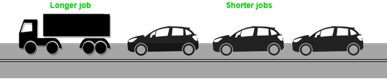

# 操作系统中的车队效应

车队效应是与先来先服务（FCFS）算法相关的现象，由于一些慢速进程，整个操作系统的速度会下降。

## 什么是车队效应？

FCFS算法是非抢占式的，也就是说，一旦CPU时间被分配给一个进程，其他进程只有在当前进程完成后才能获得CPU时间。FCFS调度的这一特性导致了所谓的车队效应。假设就绪队列中有一个CPU密集型（长执行时间）进程，以及几个相对执行时间短但频繁需要输入/输出（I/O）操作的I/O密集型进程。

## 操作系统中车队效应的步骤

步骤如下：

1. **I/O密集型进程首先被分配CPU时间。**由于它们不太占用CPU，因此它们很快就被执行并转到I/O队列。
2. **现在，CPU密集型进程被分配CPU时间。**由于它的执行时间很长，所以需要时间来完成。
3. **当CPU密集型进程正在执行时，I/O密集型进程完成了它们的I/O操作并被移回就绪队列。**
4. **然而，I/O密集型进程被迫等待，因为CPU密集型进程尚未完成。**这导致I/O设备处于空闲状态。
5. **当CPU密集型进程结束后，它被送到I/O队列，以便它可以访问I/O设备。**
6. **与此同时，I/O密集型进程获得所需的CPU时间并再次回到I/O队列。**
7. **但在车队效应中，它们被迫等待，因为CPU密集型进程仍在访问I/O设备。**结果，CPU现在处于空闲状态。

## 避免操作系统中车队效应的措施

因此，在车队效应中，一个慢速进程拖慢了整个进程集合的性能，并导致CPU时间和其他设备的浪费。为了避免车队效应，可以使用像轮询调度这样的抢占式调度算法——由于较小的进程不必等待太长时间来获得CPU时间——使它们的执行更快，并减少闲置资源。

## 操作系统中车队效应的例子

考虑有三个进程，P1、P2和P3。进程P3的执行时间最长。

下表中使用的公式计算等待时间和周转时间：

> 等待时间 = 周转时间 - 执行时间

> 周转时间 = 完成时间 - 到达时间

进程P3在第一种情况下首先进入队列，但它拥有所有进程中最长的执行时间。因为我们使用的是FCFS调度技术，所以CPU首先执行进程P3。

根据这个时间表，CPU的平均等待时间将会相当长。这就是车队效应造成的。其他进程P1和P2将不得不等待46个时间单位才能轮到它们，无论它们的执行时间有多短。现在，这个时间表遭受了饥饿问题。

| 进程ID | 到达时间 | 执行时间 | 完成时间 | 周转时间 | 等待时间 |
| --- | --- | --- | --- | --- | --- |
| P1 | 1 | 1 | 42 | 41 | 40 |
| P2 | 1 | 3 | 45 | 44 | 41 |
| P3 | 0 | 42 | 46 | 46 | 4 |

平均等待时间 = 85 / 3。

在第二个例子中，如果进程P1在队列末尾到达，而其他进程P2和P3在此之前完成，那么饥饿问题就不会发生。

让我们再看一个例子，看看两种情况下的等待时间有何不同。尽管这个时间表的长度相同（45个单位），但这个时间表的等待时间会更少。

| 进程ID | 到达时间 | 执行时间 | 完成时间 | 周转时间 | 等待时间 |
| --- | --- | --- | --- | --- | --- |
| P1 | 0 | 2 | 4 | 2 | 0 |
| P2 | 0 | 1 | 3 | 3 | 2 |
| P3 | 1 | 42 | 45 | 44 | 2 |

**平均等待时间 = 4 / 3**

