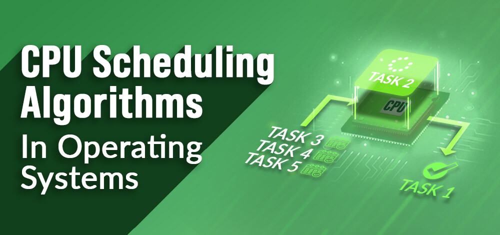

# 操作系统中的CPU调度

调度进程/工作是为了按时完成工作。**CPU调度**是一种允许一个进程使用CPU，而另一个进程由于缺少某些资源（如I/O等）而延迟（处于待机状态），从而使CPU得到充分利用的过程。CPU调度的目的是使系统更有效率、更快和更公平。

CPU调度是操作系统工作的关键部分。它决定CPU在任何给定时间应该处理哪个任务（或进程）。这很重要，因为CPU一次只能处理一个任务，但通常有很多任务需要处理。在这篇文章中，我们将详细讨论CPU调度。

每当CPU空闲时，操作系统必须选择一个准备启动的进程。选择过程由临时（CPU）调度器完成。调度器在准备启动的内存进程中进行选择，并将CPU分配给其中一个。

## 什么是进程？

在计算中，进程是**由一个或多个线程执行的计算机程序的实例**。它包含程序代码及其活动。根据操作系统（OS），进程可能由多个并发执行指令的执行线程组成。

## 如何有效使用进程内存？

进程内存被划分为四个部分，以实现高效操作：

- **文本段**由集成的程序代码组成，当程序启动时从固定存储中读取。
- **数据类**由全局和静态变量组成，在主操作之前分布和执行。
- 堆用于灵活的或动态的内存分配，由new、delete、malloc、free等调用管理。
- 栈用于局部变量。当宣布时，为局部变量保留栈中的空间。

要进一步了解，可以参考我们关于**操作系统中进程状态**的详细文章。

## 什么是进程调度？

进程调度是进程管理器处理从CPU中移除活动进程，并根据特定策略选择另一个进程的过程。

进程调度是多道程序设计应用的一个组成部分。这类操作系统允许多个进程同时被加载到可用内存中，并且加载的共享CPU进程使用重复时间。

进程调度器有三种类型：

- 长期或作业调度器
- 短期或CPU调度器
- 中期调度器

## 为什么需要调度进程？

- **调度**在许多不同的计算机环境中都很重要。最重要的领域之一是调度哪些程序将在CPU上工作。这项任务由计算机的操作系统（OS）处理，我们可以选择多种方式来配置程序。
- **进程调度**允许操作系统为每个进程分配CPU时间。使用进程调度系统的另一个重要原因是它使CPU始终忙碌。这使得程序的响应时间更短。
- 考虑到可能有数百个需要工作的程序，操作系统必须启动程序、停止它、切换到另一个程序等。操作系统配置系统在CPU中运行另一个程序的方式称为“上下文切换”。如果操作系统不断地在提供的CPU中进行上下文切换程序，它可以给用户一个棘手的想法，即他或她可以同时运行任何他或她想运行的程序。
- 现在我们知道我们可以在给定的CPU上运行1个程序，我们知道我们可以使用上下文切换来移除另一个程序，我们如何选择我们需要运行的程序，以及使用什么程序？

这就是**调度**的用武之地！首先，你确定指标，比如说“直到结束的时间量”。我们将这个指标定义为“从功能进入系统直到完成的时间间隔”。其次，你决定一个减少指标的指标。我们希望我们的任务尽快结束。

## 为什么需要CPU调度算法？

**CPU调度**是决定哪个进程将拥有CPU使用权，而另一个进程被暂停的过程。CPU调度的主要功能是确保每当CPU空闲时，操作系统至少已经选择了准备使用队列中的一个进程。

在多道程序设计中，如果长期调度器选择了多个I/O绑定进程，那么大部分时间CPU都处于空闲状态。有效程序的功能是提高资源利用率。

如果大多数操作系统将状态从性能更改为等待，那么系统可能总是有失败的机会。因此，为了最小化这种过剩，操作系统需要调度任务，以充分利用CPU并避免死锁的可能性。

## 进程调度算法的目标

- 在最高水平上利用CPU。**尽可能保持CPU忙碌**。
- **CPU分配应该是公平的**。
- **吞吐量应该最大**。即每个时间单位内完成执行的进程数量应该最大化。
- **最小化周转时间**，即进程完成执行所需的时间应该是最少的。
- 应该有**最小等待时间**，进程不应该在就绪队列中饿死。
- **最小响应时间**。这意味着进程产生第一个响应的时间应该尽可能少。

## CPU调度中使用的术语

- **到达时间**：进程到达就绪队列的时间。
- **完成时间**：进程完成执行的时间。
- **执行时间**：进程需要CPU执行的时间。
- **周转时间**：完成时间和到达时间之间的时间差。
  - 周转时间 = 完成时间 - 到达时间

- **等待时间(W.T)**：周转时间和执行时间之间的时间差。
  - 等待时间 = 周转时间 - 执行时间

## 设计CPU调度算法时要注意的事项

不同的**CPU调度算法**有不同的结构，选择特定算法取决于多种因素。已经提出了许多条件来比较CPU调度算法。

标准包括：

- **CPU利用率**：任何CPU算法的主要目的是尽可能保持CPU忙碌。理论上，CPU利用率可以从0到100，但在实时系统中，根据系统负载，它在40到90之间变化。
- **吞吐量**：平均每单位时间内完成的进程数量称为吞吐量。输出可能取决于进程的长度或持续时间。
- **周转时间**：对于特定进程，重要的条件是执行该进程需要多长时间。从进程交付到完成所需的时间称为转换时间。转换时间是等待内存访问、排队等待、使用CPU和等待I/O的时间。
- **等待时间**：调度算法不影响进程一旦开始执行所需完成过程的时间。它只影响进程的等待时间，即在就绪队列中等待过程的时间。
- **响应时间**：在协作系统中，周转时间不是最佳选择。进程可能会提前产生一些结果，并在将先前结果释放给用户的同时继续计算新结果。因此，另一种方法是从提交应用程序进程到发出第一个响应所需的时间。这种度量称为响应时间。

## 有哪些不同类型的CPU调度算法？

主要有两种调度方法：

- **抢占式调度**：当进程从运行状态切换到就绪状态，或从等待状态切换到就绪状态时，使用抢占式调度。
- **非抢占式调度**：当进程终止，或当进程从运行状态切换到等待状态时，使用非抢占式调度。

现在我们来一一了解这些CPU调度算法：

### 1. 先来先服务（FCFS）

**FCFS**被认为是所有操作系统调度算法中最简单的。先来先服务调度算法规定，首先请求CPU的进程首先被分配CPU，并使用FIFO队列实现。

#### FCFS的特点

- FCFS支持非抢占式和抢占式CPU调度算法。
- 任务总是根据先来先服务的概念执行。
- FCFS易于实现和使用。
- 这种算法在性能上不太高效，等待时间相当高。

#### FCFS的优点

- 易于实现
- 先来先服务方法

#### FCFS的缺点

- FCFS受到**车队效应**的影响。
- 平均等待时间远高于其他算法。
- FCFS非常简单且易于实现，因此效率不高。

要了解如何实现这种CPU调度算法，请参考我们关于先来先服务调度的详细文章。

### 2. 最短作业优先（SJF）

**最短作业优先（SJF）**是一种调度过程，它选择等待时间最短的进程作为下一个要执行的进程。这种调度方法可能是抢占式的，也可能不是抢占式的。显著减少了其他等待执行的进程的平均等待时间。SJF的全称是最短作业优先。

#### SJF的特点

- 在所有等待的进程中，CPU总是分配给执行时间最短的进程。
- 如果两个进程具有相同的执行时间，则使用FCFS（先来先服务）来打破平局，即首先到达的进程首先被处理。
- SJF CPU调度可以是抢占式和非抢占式。

#### SJF的优点

- 由于SJF减少了平均等待时间，因此它比先来先服务调度算法更好。
- SJF通常用于长期调度

#### SJF的缺点

- SJF的一个缺点是饥饿。
- 很多时候，预测即将到来的CPU请求的长度变得复杂

要了解如何实现这种CPU调度算法，请参考我们关于最短作业优先的详细文章。

### 3. 最长作业优先（LJF）

**最长作业优先（LJF）**调度过程与最短作业优先（SJF）正好相反，顾名思义，该算法基于这样一个事实：具有最大执行时间的进程首先被处理。最长作业优先是非抢占式的。

#### LJF的特点

- 在所有等待的进程中，CPU总是分配给具有最大执行时间的进程。
- 如果两个进程具有相同的执行时间，则使用FCFS（先来先服务）来打破平局，即首先到达的进程首先被处理。
- LJF CPU调度可以是抢占式和非抢占式。

#### LJF的优点

- 没有其他任务可以在最长的作业或进程完全执行之前调度。
- 所有作业或进程大约在同一时间完成。

#### LJF的缺点

- 通常，LJF算法给出了非常高的平均等待时间和平均周转时间。
- 这可能导致车队效应。

要了解如何实现这种CPU调度算法，请参考我们关于最长作业优先调度的详细文章。

### 4. 优先级调度

**抢占式优先级CPU调度算法**是一种基于进程优先级的抢占式CPU调度方法。在这个算法中，编辑器将函数设置为重要，这意味着最重要的进程必须首先完成。在任何冲突的情况下，即有多个具有相等价值的进程，那么最重要的CPU调度算法就基于FCFS（先来先服务）算法工作。

#### 优先级调度的特点

- 根据优先级调度任务。
- 当更高优先级的工作到达并且一个低优先级的任务正在执行时，更高优先级的进程将取代低优先级进程，后者将被暂停，直到执行完成。
- 数字越小，进程的优先级越高。

#### 优先级调度的优点

- 平均等待时间比FCFS少
- 复杂度较低

#### 优先级调度的缺点

- 抢占式优先级CPU调度算法最常见的缺点之一是饥饿问题。这是一个进程必须等待更长的时间才能被调度到CPU的问题。这种情况称为饥饿问题。

要了解如何实现这种CPU调度算法，请参考我们关于优先级抢占式调度算法的详细文章。

### 5. 轮询

**轮询**是一种CPU调度算法，其中每个进程循环地分配一个固定的时间槽。它是先来先服务CPU调度算法的抢占式版本。轮询CPU算法通常关注时间共享技术。

#### 轮询的特点

- 它简单、易于使用、无饥饿，因为所有进程都获得平衡的CPU分配。
- 作为一种核心方法，在CPU调度中使用最广泛。
- 它被认为是抢占式的，因为进程被分配给CPU的时间非常有限。

#### 轮询的优点

- 轮询似乎很公平，因为每个进程都获得相等的CPU份额。
- 新创建的进程被添加到就绪队列的末尾。

要了解如何实现这种CPU调度算法，请参考我们关于轮询调度算法的详细文章。

### 6. 最短剩余时间优先（SRTF）

**最短剩余时间优先**是最短作业优先的抢占式版本，我们之前已经讨论过，其中处理器被分配给即将完成的作业。在SRTF中，选择剩余完成时间最短的进程执行。

#### SRTF的特点

- SRTF算法使作业的处理速度比SJF算法快，假设不计算它的开销。
- 在SRTF中，上下文切换的次数比SJF多，占用了CPU宝贵的处理时间。这增加了它的处理时间，减少了它的快速处理优势。

#### SRTF的优点

- 在SRTF中，短作业处理得非常快。
- 系统还需要很少的开销，因为它只在进程完成或添加新进程时才做决定。

#### SRTF的缺点

- 像最短作业优先一样，它也有可能导致进程饥饿。
- 如果不断添加短作业，长作业可能会被无限期地推迟。

要了解如何实现这种CPU调度算法，请参考我们关于最短剩余时间优先的详细文章。

### 7. 最长剩余时间优先（LRTF）

**最长剩余时间优先**是最长作业优先调度算法的抢占式版本。这种调度算法被操作系统用来系统地为即将到来的进程编程。这种算法优先调度那些剩余完成时间最长的进程。

#### LRTF的特点

- 在所有等待的进程中，CPU总是分配给具有最大执行时间的进程。
- 如果两个进程具有相同的执行时间，则使用FCFS（先来先服务）来打破平局，即首先到达的进程首先被处理。
- LRTF CPU调度可以是抢占式和非抢占式。

#### LRTF的优点

- 最大化长作业的吞吐量。
- 减少上下文切换。
- 实现简单。

#### LRTF的缺点

- 这种算法给出了非常高的平均等待时间和平均周转时间。
- 这可能导致车队效应。

要了解如何实现这种CPU调度算法，请参考我们关于最长剩余时间优先的详细文章。

### 8. 最高响应比优先（HRRN）

**最高响应比优先**是一种非抢占式CPU调度算法，被认为是最优化的调度算法之一。顾名思义，我们需要找到所有可用进程的响应比，并选择具有最高响应比的进程。一旦选择了一个进程，它将一直运行直到完成。

#### HRRN的特点

- HRRN的**标准**是**响应比**，**模式**是非抢占式的。
- HRRN被认为是最短作业优先的修改版，以减少饥饿问题。
- 与SJF相比，在HRRN调度算法中，CPU分配给下一个具有**最高响应比**的进程，而不是具有较少执行时间的进程。

> **响应比 = (W + S)/S**
>
> 这里，**W**是进程迄今为止的等待时间，**S**是进程的执行时间。

#### HRRN的优点

- HRRN调度算法通常比最短作业优先调度表现更好。
- 减少了更长作业的等待时间，也鼓励了更短的作业。

#### HRRN的缺点

- 实现HRRN调度是不可能的，因为无法提前知道每个作业的执行时间。
- 在这种调度中，可能会对CPU造成过载。

要了解如何实现这种CPU调度算法，请参考我们关于最高响应比优先的详细文章。

### 9. 多队列调度

在就绪队列中的进程可以被划分为不同的类别，每个类别都有自己的调度需求。例如，常见的划分是**前台（交互式）**进程和**后台（批处理）**进程。这两类有不同的调度需求。对于这种情况，使用**多级队列调度**。

上图中描述的进程如下：

- **系统进程**：CPU本身有自己的进程要运行，通常称为系统进程。
- **交互式进程**：交互式进程是一种需要相同类型交互的进程。
- **批处理进程**：批处理通常是操作系统中的一种技术，在开始处理之前，它将程序和数据收集在一起形成**批次**。

#### 多级队列调度的优点

- 多级队列的主要优点是它具有低调度开销。

#### 多级队列调度的缺点

- 饥饿问题
- 它在性质上是固定的

要了解如何实现这种CPU调度算法，请参考我们关于多级队列调度的详细文章。

### 10. 多级反馈队列调度

**多级反馈队列调度（MLFQ）**CPU调度类似于**多级队列调度**，但在这个过程中，进程可以在队列之间移动。因此，它比多级队列调度更有效。

#### 多级反馈队列调度的特点

- 在多级队列调度算法中，进程在进入系统时被永久分配到一个队列，并且不允许进程在队列之间移动。
- 由于进程被永久分配到队列，这种设置具有低调度开销的优点，
- 但另一方面，它的缺点是不灵活。

#### 多级反馈队列调度的优点

- 它更灵活
- 它允许不同的进程在不同的队列之间移动

#### 多级反馈队列调度的缺点

- 它也会产生CPU开销
- 它是最复杂的算法。

要了解如何实现这种CPU调度算法，请参考我们关于多级反馈队列调度的详细文章。

## 不同CPU调度算法之间的比较

以下是不同CPU调度算法之间的简要比较：

| 算法 | 分配方式 | 复杂度 | 平均等待时间（AWT） | 抢占 | 饥饿 | 性能 |
| --- | --- | --- | --- | --- | --- | --- |
| FCFS | 根据进程到达时间分配CPU | 简单且易于实现 | 大 | 否 | 否 | 慢速 |
| SJF | 基于最低CPU执行时间（BT） | 比FCFS复杂 | 比FCFS小 | 否 | 是 | 最小平均等待时间 |
| LJFS | 基于最高的CPU执行时间（BT） | 比FCFS复杂 | 取决于一些措施，例如到达时间、进程大小等 | 否 | 是 | 大周转时间 |
| LRTF | 与LJFS相同，CPU分配基于最高的CPU执行时间（BT）。但它是抢占式的 | 比FCFS复杂 | 取决于一些措施，例如到达时间、进程大小等 | 是 | 是 | 优先考虑更长的作业 |
| SRTF | 与SJF相同，CPU分配基于最低CPU执行时间（BT）。但它是抢占式的 | 比FCFS复杂 | 取决于一些措施，例如到达时间、进程大小等 | 是 | 是 | 优先考虑更短的作业 |
| RR | 根据进程到达顺序分配固定时间片（TQ） | 时间片大小决定复杂度 | 与SJF和优先级调度相比大 | 是 | 否 | 每个进程都给定了相当固定的时间 |
| 优先级抢占式 | 根据优先级。更大的优先级任务首先执行 | 这种类型比FCFS简单 | 比FCFS小 | 是 | 是 | 表现良好，但包含饥饿问题 |
| 优先级非抢占式 | 根据优先级，监控新进入的更高优先级作业 | 这种类型比抢占式优先级简单 | 抢占式比FCFS小 | 否 | 是 | 对批处理系统最有益 |
| MLQ | 根据进程所在的较大队列优先级分配 | 比优先级调度算法复杂 | 比FCFS小 | 否 | 是 | 表现良好，但包含饥饿问题 |
| MFLQ | 根据进程所在的较大优先级队列分配 | 它是最复杂的，但复杂度取决于TQ大小 | 在许多情况下比所有调度类型都小 | 否 | 否 | 良好表现 |

## 结论

总之，CPU调度是操作系统的一个基本组成部分，在管理进程如何分配CPU时间方面起着至关重要的作用。有效的CPU调度确保系统高效运行，保持进程间的公平性，并满足各种性能标准。不同的调度算法，如先来先服务（FCFS）、最短作业优先（SJN）、优先级调度和轮询（RR），各有其优势，适用于不同类型的工作负载和系统需求。

