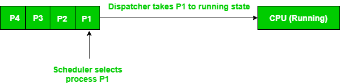

# 调度器和分派器之间的区别

调度器是特殊的系统软件，以各种方式处理进程调度。它们的主要任务是选择要提交到系统中的作业，并决定运行哪个进程。

调度器有三种类型：

1. **长期（作业）调度器** - 由于最初主存储器的尺寸较小，所有程序都存储在辅助存储器中。当它们被存储或加载到主存储器中时，它们被称为进程。这是长期调度器的决定，确定有多少进程将停留在就绪队列中。因此，用简单的话说，长期调度器决定系统的多道程序设计程度。
2. **中期调度器** - 大多数情况下，运行中的进程需要I/O操作，这不需要CPU。因此，在进程执行过程中，当需要I/O操作时，操作系统将该进程从运行队列发送到阻塞队列。当进程完成其I/O操作后，它应该再次被转移到就绪队列。所有这些决定都由中期调度器做出。中期调度是**交换**的一部分。
3. **短期（CPU）调度器** - 当主存储器中有很多进程时，最初所有进程都存在于就绪队列中。在所有进程中，需要选择一个进程进行执行。这个决定由短期调度器处理。让我们看一下下面给出的图。它可能为你提供一个更清晰的视角。

**分派器** - 分派器是一个特殊程序，它在调度器之后起作用。当调度器完成选择进程的工作时，是分派器将该进程带到所需的状态/队列。分派器是在短期调度器选择进程后，给予进程对CPU控制权的模块。此功能包括以下内容：

- 切换上下文
- 切换到用户模式
- 跳转到用户程序中的适当位置以重新启动该程序

**分派器的作用**：

1. 分派器将CPU控制权交给短期调度器选定的进程。
2. 分派器是通信工作者，接收和传输信息以协调执行服务的其他人员和车辆的操作。
3. 分派器是一个特殊程序，它在调度器之后起作用。
4. 当调度器完成选择进程的工作时，是分派器将该进程带到所需的状态/队列。

**调度器和分派器之间的区别** - 考虑这样一种情况，多个进程位于就绪队列中等待执行。CPU不能同时执行所有这些进程，因此操作系统必须根据使用的调度算法选择特定进程。因此，这种在各种进程中选择一个进程的程序由**调度器**完成。一旦调度器从队列中选择了一个进程，**分派器**就进入了画面，是分派器将该进程从就绪队列移动到运行状态。因此，调度器给分派器一个有序的进程列表，分派器随着时间的推移将它们移到CPU。**示例** - 就绪队列中有4个进程，P1、P2、P3、P4；它们的到达时间分别是t0、t1、t2、t3。使用先进先出（FIFO）调度算法。因为P1先到达，调度器将决定它是应该首先执行的第一个进程，分派器将从就绪队列中移除P1并将其交给CPU。然后调度器将决定P2是下一个应该执行的进程，所以当分派器返回队列以获取新进程时，它将取P2并将其交给CPU。这对P3和P4也以相同的方式继续。

| 属性 | 分派器 | 调度器 |
| --- | --- | --- |
| **定义** | 分派器是将CPU控制权交给短期调度器选定的进程的模块 | 调度器是在各种进程中选择进程的东西 |
| **类型** | 分派器没有不同类型。它只是一个代码段 | 有3种类型的调度器，即长期、短期、中期 |
| **依赖性** | 分派器的工作依赖于调度器。即分派器必须等到调度器选择一个进程 | 调度器独立工作。它需要时立即工作 |
| **算法** | 分派器没有特定的算法来实现 | 调度器使用各种算法，如FCFS、SJF、RR等 |
| **所需时间** | 分派器所需的时间称为调度延迟 | 调度器所需的时间通常可以忽略不计。因此我们忽略它 |
| **功能** | 分派器还负责：上下文切换、切换到用户模式、当进程再次启动时跳转到适当的位置 | 调度器的唯一工作是选择进程 |
| **任务** | 分派器将CPU分配给短期调度器选定的进程 | 调度器执行三项任务。作业调度（长期调度器）、CPU调度（短期调度器）和交换（中期调度器） |
| **目的** | 将进程从就绪队列移到CPU | 选择进程并决定运行哪个进程 |
| **执行时间** | 需要非常短的执行时间 | 需要比分派器更长的执行时间 |
| **交互** | 分派器与CPU和选定的进程一起工作 | 调度器与就绪队列和分派器一起工作 |

