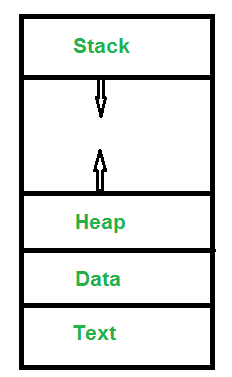
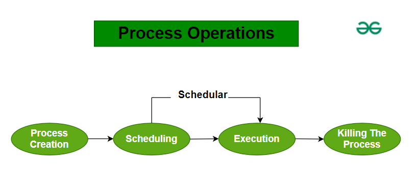

# 进程管理简介

## 什么是进程管理？

进程管理是操作系统的一个关键部分。它控制进程的执行方式，并通过处理活动进程来控制计算机的运行。这包括停止进程、设置哪些进程应获得更多关注等。你也可以在自己的计算机上管理进程。

操作系统负责管理进程的启动、停止和调度，这些是系统上运行的程序。操作系统使用多种方法来防止死锁、促进进程间通信和同步进程。有效的资源分配、无冲突的进程执行和最优的系统性能都由称职的进程管理保证。操作系统的这一基本组成部分可以同时执行多个应用程序，增强系统的利用率和响应性。

## 进程在内存中的样子

进程在内存中被划分为几个不同的部分，每个部分都有不同的用途。以下是进程在内存中的典型样子：

- **文本段**：进程有时也被称为文本段，也包括由程序计数器的值表示的当前活动。
- **栈**：栈包含临时数据，如函数参数、返回地址和局部变量。
- **数据段**：包含全局变量。
- **堆段**：在进程运行时动态分配的内存。

## 进程的特性

进程具有以下属性：

- **进程ID**：操作系统分配的唯一标识符。
- **进程状态**：可以是就绪、运行等。
- **CPU寄存器**：如程序计数器（在进程被换入和换出CPU时必须保存和恢复CPU寄存器）
- **记账信息**：用于进程执行的CPU数量、时间限制、执行ID等
- **I/O状态信息**：例如，分配给进程的设备、打开的文件等
- **CPU调度信息**：例如，优先级（不同的进程可能有不同的优先级，例如，较短的进程在最短作业优先调度中被赋予高优先级）

进程的所有上述属性也被称为进程的**上下文**。每个进程都有自己的进程控制块（PCB），即每个进程都有一个唯一的PCB。上述所有属性都是PCB的一部分。

## 进程的状态

进程处于以下状态之一：

- **新建**：新创建的进程（或正在创建的进程）。
- **就绪**：创建后进程进入就绪状态，即进程已准备好执行。
- **运行**：当前在CPU中运行的进程（单处理器中一次只能有一个进程在执行）。
- **等待（或阻塞）**：当进程请求I/O访问时。
- **完成（或终止）**：进程完成了执行。
- **挂起就绪**：当就绪队列变满时，一些进程被移动到挂起就绪状态
- **挂起阻塞**：当等待队列变满时。

## 进程操作

操作系统中的进程操作指的是操作系统执行的用于管理进程的各种活动。这些操作包括进程创建、进程调度、执行和杀死进程。以下是关键的进程操作：

### 进程创建

操作系统中的进程创建是生成新进程的行为。这个新进程是程序的一个实例，可以独立执行。

### 调度

一旦进程准备运行，它就进入“就绪队列”。调度器的工作是从这个队列中挑选一个进程并开始其执行。

### 执行

执行意味着CPU开始处理进程。在这段时间里，进程可能会：

- 如果需要执行I/O操作，则移动到等待队列。
- 如果有更高优先级的进程需要CPU，则被阻塞。

### 杀死进程

进程完成任务后，操作系统结束它并移除其进程控制块（PCB）。

## 进程的上下文切换

保存一个进程的上下文并加载另一个进程的上下文的过程被称为上下文切换。简单来说，它就像将进程从运行状态加载和卸载到就绪状态。

### 上下文切换何时发生？

上下文切换发生：

- 当一个高优先级的进程进入就绪状态时（即优先级高于正在运行的进程）。
- 发生中断。
- 用户和内核模式切换（虽然不是必要的）
- 使用抢占式CPU调度。

### 上下文切换与模式切换

当CPU特权级别发生变化时，例如当系统调用被执行或发生故障时，会发生模式切换。内核以比标准用户任务更特权的模式工作。如果用户进程想要访问只有内核才能访问的东西，就必须进行模式切换。在模式切换期间，当前执行的进程不需要改变。模式切换通常发生在进程上下文切换中。只有内核才能引起上下文切换。

## CPU密集型与I/O密集型进程

CPU密集型进程需要更多的CPU时间或在运行状态花费更多时间。I/O密集型进程需要更多的I/O时间，CPU时间较少。I/O密集型进程在等待状态花费更多时间。

进程计划是操作系统进程管理的一个组成部分。它指的是操作系统用来决定下一个运行哪个进程的机制。进程调度的目标是通过最大化CPU利用率、最小化执行时间和提高系统响应时间来提高整体系统性能。

## 进程调度算法

操作系统可以使用不同的调度算法来调度进程。以下是一些常用的定时算法：

- **先来先服务（FCFS）**：这是最简单的调度算法，进程按照先来先服务的顺序执行。FCFS是抢占式的，这意味着一旦进程开始执行，它会继续执行，直到完成或等待I/O。
- **最短作业优先（SJF）**：SJF是一种抢占式调度算法，选择执行时间最短的进程。执行时间是进程完成执行所需的时间。SJF最小化了进程的平均等待时间。
- **轮转（RR）**：轮转是一种抢占式调度算法，为每个进程在一轮中保留固定时间。如果进程在指定时间内没有完成执行，它会被阻塞并添加到队列的末尾。RR确保公平地分配CPU时间给所有进程，并避免饥饿。
- **优先级调度**：这种调度算法为每个进程分配优先级，优先级最高的进程首先执行。可以根据进程类型、重要性或资源需求设置优先级。
- **多级队列**：这种调度算法将就绪队列分成几个不同的队列，每个队列有不同的优先级。进程根据其优先级排队，每个队列使用自己的调度算法。当不同类型的进程具有不同的优先级时，这种调度算法很有用。

## 进程管理的优点

- **运行多个程序**：进程管理允许你同时运行多个应用程序，例如，一边浏览网页一边听音乐。
- **进程隔离**：它确保不同的程序不会相互干扰，因此一个程序中的问题不会导致另一个程序崩溃。
- **公平使用资源**：它确保像CPU时间和内存这样的资源在程序之间公平共享，即使是低优先级的程序也有机会运行。
- **平滑切换**：它有效地处理程序之间的切换，快速保存和加载它们的状态，以保持系统的响应性并最小化延迟。

## 进程管理的缺点

- **开销**：进程管理使用系统资源，因为操作系统需要跟踪各种数据结构和调度队列。这需要CPU时间和内存，可能会影响系统的性能。
- **复杂性**：设计和维护操作系统很复杂，因为需要复杂的调度算法和资源分配方法。
- **死锁**：为了使进程顺利运行，操作系统使用像信号量和互斥锁这样的机制。然而，这些可能导致死锁，进程无限期地等待彼此。
- **增加上下文切换**：在多任务系统中，操作系统频繁地在进程之间切换。存储和加载每个进程的状态（上下文切换）需要时间和计算能力，这可能会减慢系统速度。

## 结论

总之，进程管理是操作系统的一个重要功能，确保多个程序能够顺利高效地运行。它涉及创建、调度和终止进程，以及管理资源和处理进程间的通信。有效的进程管理优化了系统资源的使用，保持了系统的稳定性，并提高了计算机的整体性能和响应性。理解和实施健全的进程管理策略对于维护高效可靠的计算环境至关重要。

