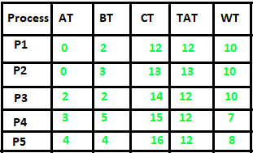

# 最长剩余时间优先 (LRTF) 或抢占式最长作业优先 CPU 调度算法

**最长剩余时间优先 (LRTF)** 是最长作业优先 (LJF) 调度算法的抢占式版本。在这种调度算法中，我们找到剩余时间最长的进程，然后处理它，即在一段时间后（假设每单位时间检查一次）检查是否有其他具有更长执行时间的进程到达。

## 最长剩余时间优先 (LRTF) 的特点

- 在所有在等待队列中等待的进程中，CPU 总是分配给具有最长执行时间的进程。
- 如果两个进程具有相同的执行时间，则使用先到先服务 (FCFS) 的方式打破平局，即首先到达的进程先被处理。
- LJF CPU 调度可以是抢占式和非抢占式的。

## 最长剩余时间优先 (LRTF) 的优点

- 在最长的作业或进程完全执行之前，没有其他进程可以执行。
- 所有作业或进程大约在同一时间完成。

## 最长剩余时间优先 (LRTF) 的缺点

- 这种算法为给定的一组进程提供了非常高的平均等待时间和平均周转时间。
- 这可能导致护航效应。
- 可能发生的情况是，一个短作业可能永远不会被执行，而系统不断执行更长的进程。
- 它降低了处理速度，从而降低了系统的效率和利用率。

## 最长剩余时间优先 (LRTF) CPU 调度算法

- **步骤 1：** 首先，根据它们的到达时间将进程按升序排序。
- **步骤 2：** 选择具有最短到达时间但最多执行时间的进程。
- **步骤 3：** 然后处理它 1 单位时间。检查在这个执行时间之前是否有其他进程到达。
- **步骤 4：** 重复上述两个步骤，直到执行所有进程。

## 展示抢占式最长作业优先 CPU 调度算法工作的示例：

**示例-1：** 考虑以下四个进程 P1、P2、P3 和 P4 的到达时间和执行时间表。

| 进程 | 到达时间 | 执行时间 |
| --- | --- | --- |
| P1 | 1 毫秒 | 2 毫秒 |
| P2 | 2 毫秒 | 4 毫秒 |
| P3 | 3 毫秒 | 6 毫秒 |
| P4 | 4 毫秒 | 8 毫秒 |

**最长剩余时间优先 CPU 调度算法将按照下面提到的步骤工作：**

**在时间 = 1 时，**

- 可用进程：P1。因此，选择 P1 并执行 1 毫秒。

| 时间实例 | 进程 | 到达时间 | 等待表 | 执行时间 | 初始执行时间 | 剩余执行时间 |
| --- | --- | --- | --- | --- | --- | --- |
| **1-2毫秒** | **P1** | **1毫秒** |  | **1毫秒** | **2毫秒** | **1毫秒** |

**在时间 = 2 时，**

- 可用进程：P1, P2。
- 因此，选择 P2 并执行 1 毫秒（因为 P1 的 B.T = 1 小于 P2 的 B.T = 4）

  <table >
    <tr>
      <th>时间实例</th>
      <th>进程</th>
      <th>到达时间</th>
      <th>等待表</th>
      <th>执行时间</th>
      <th>初始突发时间</th>
      <th>剩余突发时间</th>
    </tr>
    <tr>
      <td rowspan="2">2 - 3ms</td>
      <td>P1</td>
      <td>1ms</td>
      <td rowspan="2">P1</td>
      <td>0ms</td>
      <td>1ms</td>
      <td>1ms</td>
    </tr>
    <tr>
      <td>P2</td>
      <td>2ms</td>
      <td>1ms</td>
      <td>4ms</td>
      <td>3ms</td>
    </tr>
  </table>

**在时间 = 3 时，**

- 可用进程：P1, P2, P3。
- 因此，选择 P3 并执行 1 毫秒（因为，P1 的 B.T = 1, P2 的 B.T = 3, P3 的 B.T = 6）

  <table >
    <tr>
      <th>时间实例</th>
      <th>进程</th>
      <th>到达时间</th>
      <th>等待表</th>
      <th>执行时间</th>
      <th>初始突发时间</th>
      <th>剩余突发时间</th>
    </tr>
    <tr>
      <td rowspan="3">3 - 4ms</td>
      <td>P1</td>
      <td>1ms</td>
      <td rowspan="3">P1, P2</td>
      <td>0ms</td>
      <td>1ms</td>
      <td>1ms</td>
    </tr>
    <tr>
      <td>P2</td>
      <td>2ms</td>
      <td>0ms</td>
      <td>3ms</td>
      <td>3ms</td>
    </tr>
    <tr>
      <td>P3</td>
      <td>3ms</td>
      <td>1ms</td>
      <td>6ms</td>
      <td>5ms</td>
    </tr>
  </table>

**在时间 = 4 时，**

- 可用进程：P1, P2, P3, P4。
- 因此，选择 P4（因为 P4 的执行时间最大）并执行 1 毫秒（因为，P1 的 B.T = 1, P2 的 B.T = 3, P3 的 B.T = 5, P4 的 B.T = 8）

  <table >
    <tr>
      <th>时间实例</th>
      <th>进程</th>
      <th>到达时间</th>
      <th>等待表</th>
      <th>执行时间</th>
      <th>初始突发时间</th>
      <th>剩余突发时间</th>
    </tr>
    <tr>
      <td rowspan="4">4 - 5ms</td>
      <td>P1</td>
      <td>1ms</td>
      <td rowspan="4">P1, P2, P3</td>
      <td>0ms</td>
      <td>1ms</td>
      <td>1ms</td>
    </tr>
    <tr>
      <td>P2</td>
      <td>2ms</td>
      <td>0ms</td>
      <td>3ms</td>
      <td>3ms</td>
    </tr>
    <tr>
      <td>P3</td>
      <td>3ms</td>
      <td>0ms</td>
      <td>5ms</td>
      <td>5ms</td>
    </tr>
    <tr>
      <td>P4</td>
      <td>4ms</td>
      <td>1ms</td>
      <td>8ms</td>
      <td>7ms</td>
    </tr>
  </table>

**在时间 = 5 时，**

- 可用进程：P1, P2, P3, P4,
- 进程 P4 将继续执行，因为没有其他进程的执行时间大于进程 P4

  <table >
    <tr>
      <th>时间实例</th>
      <th>进程</th>
      <th>到达时间</th>
      <th>等待表</th>
      <th>执行时间</th>
      <th>初始突发时间</th>
      <th>剩余突发时间</th>
    </tr>
    <tr>
      <td rowspan="4">5 - 7ms</td>
      <td>P1</td>
      <td>1ms</td>
      <td rowspan="4">P1, P2, P3</td>
      <td>0ms</td>
      <td>1ms</td>
      <td>1ms</td>
    </tr>
    <tr>
      <td>P2</td>
      <td>2ms</td>
      <td>0ms</td>
      <td>3ms</td>
      <td>3ms</td>
    </tr>
    <tr>
      <td>P3</td>
      <td>3ms</td>
      <td>0ms</td>
      <td>5ms</td>
      <td>5ms</td>
    </tr>
    <tr>
      <td>P4</td>
      <td>4ms</td>
      <td>2ms</td>
      <td>7ms</td>
      <td>5ms</td>
    </tr>
  </table>

**在时间 = 7 时，**

- 进程 P3 和 P4 剩余执行时间相同，
- 因此如果两个进程具有相同的执行时间，则使用先到先服务 (FCFS) 的方式打破平局，即首先到达的进程先被处理。
- 因此 P3 将被执行 1 毫秒

  <table >
    <tr>
      <th>时间实例</th>
      <th>进程</th>
      <th>到达时间</th>
      <th>等待表</th>
      <th>执行时间</th>
      <th>初始突发时间</th>
      <th>剩余突发时间</th>
    </tr>
    <tr>
      <td rowspan="4">7 - 8ms</td>
      <td>P1</td>
      <td>1ms</td>
      <td rowspan="4">P1, P2, P4</td>
      <td>0ms</td>
      <td>1ms</td>
      <td>1ms</td>
    </tr>
    <tr>
      <td>P2</td>
      <td>2ms</td>
      <td>0ms</td>
      <td>3ms</td>
      <td>3ms</td>
    </tr>
    <tr>
      <td>P3</td>
      <td>3ms</td>
      <td>1ms</td>
      <td>5ms</td>
      <td>4ms</td>
    </tr>
    <tr>
      <td>P4</td>
      <td>4ms</td>
      <td>0ms</td>
      <td>5ms</td>
      <td>5ms</td>
    </tr>
  </table>

**在时间 = 8 时，**

- 可用进程：P1, P2, P3, P4,
- 进程 P4 将再次继续执行，因为没有其他进程的执行时间大于进程 P4

  <table >
    <tr>
      <th>时间实例</th>
      <th>进程</th>
      <th>到达时间</th>
      <th>等待表</th>
      <th>执行时间</th>
      <th>初始突发时间</th>
      <th>剩余突发时间</th>
    </tr>
    <tr>
      <td rowspan="4">8 - 9ms</td>
      <td>P1</td>
      <td>1ms</td>
      <td rowspan="4">P1, P2, P3</td>
      <td>0ms</td>
      <td>1ms</td>
      <td>1ms</td>
    </tr>
    <tr>
      <td>P2</td>
      <td>2ms</td>
      <td>0ms</td>
      <td>3ms</td>
      <td>3ms</td>
    </tr>
    <tr>
      <td>P3</td>
      <td>3ms</td>
      <td>0ms</td>
      <td>4ms</td>
      <td>4ms</td>
    </tr>
    <tr>
      <td>P4</td>
      <td>4ms</td>
      <td>1ms</td>
      <td>5ms</td>
      <td>4ms</td>
    </tr>
  </table>

**在时间 = 9 时，**

- 可用进程：P1, P2, P3, P4,
- 进程 P3 将继续执行基于 FCFS 规则。

  <table >
    <tr>
      <th>时间实例</th>
      <th>进程</th>
      <th>到达时间</th>
      <th>等待表</th>
      <th>执行时间</th>
      <th>初始突发时间</th>
      <th>剩余突发时间</th>
    </tr>
    <tr>
      <td rowspan="4">9 - 10ms</td>
      <td>P1</td>
      <td>1ms</td>
      <td rowspan="4">P1, P2, P4</td>
      <td>0ms</td>
      <td>1ms</td>
      <td>1ms</td>
    </tr>
    <tr>
      <td>P2</td>
      <td>2ms</td>
      <td>0ms</td>
      <td>3ms</td>
      <td>3ms</td>
    </tr>
    <tr>
      <td>P3</td>
      <td>3ms</td>
      <td>1ms</td>
      <td>4ms</td>
      <td>3ms</td>
    </tr>
    <tr>
      <td>P4</td>
      <td>4ms</td>
      <td>0ms</td>
      <td>4ms</td>
      <td>4ms</td>
    </tr>
  </table>

**在时间 = 10 时，**

- 可用进程：P1, P2, P3, P4,
- 现在 P4 的执行时间最大，因此它将进一步执行。

<table >
<tr>
<th>时间实例</th>
<th>进程</th>
<th>到达时间</th>
<th>等待表</th>
<th>执行时间</th>
<th>初始突发时间</th>
<th>剩余突发时间</th>
</tr>
<tr>
<td rowspan="4">10 - 11ms</td>
<td>P1</td>
<td>1ms</td>
<td rowspan="4">P1, P2, P3</td>
<td>0ms</td>
<td>1ms</td>
<td>1ms</td>
</tr>
<tr>
<td>P2</td>
<td>2ms</td>
<td>0ms</td>
<td>3ms</td>
<td>3ms</td>
</tr>
<tr>
<td>P3</td>
<td>3ms</td>
<td>0ms</td>
<td>3ms</td>
<td>3ms</td>
</tr>
<tr>
<td>P4</td>
<td>4ms</td>
<td>1ms</td>
<td>4ms</td>
<td>3ms</td>
</tr>
</table>

**在时间 = 11 时，**

- 可用进程：P1, P2, P3, P4,
- 进程 P2 将继续执行，因为 P2, P3, P4 的执行时间相同
- 因此，在这种情况下，进一步的执行将基于 FCFS 规则决定，即首先到达的进程先被处理。

<table >
<tr>
<th>时间实例</th>
<th>进程</th>
<th>到达时间</th>
<th>等待表</th>
<th>执行时间</th>
<th>初始突发时间</th>
<th>剩余突发时间</th>
</tr>
<tr>
<td rowspan="4">11 - 12ms</td>
<td>P1</td>
<td>1ms</td>
<td rowspan="4">P1, P3, P4</td>
<td>0ms</td>
<td>1ms</td>
<td>1ms</td>
</tr>
<tr>
<td>P2</td>
<td>2ms</td>
<td>1ms</td>
<td>3ms</td>
<td>2ms</td>
</tr>
<tr>
<td>P3</td>
<td>3ms</td>
<td>0ms</td>
<td>3ms</td>
<td>3ms</td>
</tr>
<tr>
<td>P4</td>
<td>4ms</td>
<td>0ms</td>
<td>3ms</td>
<td>3ms</td>
</tr>
</table>

**在时间 = 12 时，**

- 可用进程：P1, P2, P3, P4,
- 进程 P3 将继续执行基于上述解释。

<table >
<tr>
<th>时间实例</th>
<th>进程</th>
<th>到达时间</th>
<th>等待表</th>
<th>执行时间</th>
<th>初始突发时间</th>
<th>剩余突发时间</th>
</tr>
<tr>
<td rowspan="4">12 - 13ms</td>
<td>P1</td>
<td>1ms</td>
<td rowspan="4">P1, P2, P4</td>
<td>0ms</td>
<td>1ms</td>
<td>1ms</td>
</tr>
<tr>
<td>P2</td>
<td>2ms</td>
<td>0ms</td>
<td>2ms</td>
<td>2ms</td>
</tr>
<tr>
<td>P3</td>
<td>3ms</td>
<td>1ms</td>
<td>3ms</td>
<td>2ms</td>
</tr>
<tr>
<td>P4</td>
<td>4ms</td>
<td>0ms</td>
<td>3ms</td>
<td>3ms</td>
</tr>
</table>

**在时间 = 13 时，**

- 可用进程：P1, P2, P3, P4,
- 现在 P4 的执行时间最大，因此它将进一步执行。

<table >
<tr>
<th>时间实例</th>
<th>进程</th>
<th>到达时间</th>
<th>等待表</th>
<th>执行时间</th>
<th>初始突发时间</th>
<th>剩余突发时间</th>
</tr>
<tr>
<td rowspan="4">13 - 14ms</td>
<td>P1</td>
<td>1ms</td>
<td rowspan="4">P1, P2, P3</td>
<td>0ms</td>
<td>1ms</td>
<td>1ms</td>
</tr>
<tr>
<td>P2</td>
<td>2ms</td>
<td>0ms</td>
<td>2ms</td>
<td>2ms</td>
</tr>
<tr>
<td>P3</td>
<td>3ms</td>
<td>0ms</td>
<td>2ms</td>
<td>2ms</td>
</tr>
<tr>
<td>P4</td>
<td>4ms</td>
<td>1ms</td>
<td>3ms</td>
<td>2ms</td>
</tr>
</table>

**在时间 = 14 时，**

- 可用进程：P1, P2, P3, P4
- 现在，进程 P2 将再次首先开始执行

<table >
<tr>
<th>时间实例</th>
<th>进程</th>
<th>到达时间</th>
<th>等待表</th>
<th>执行时间</th>
<th>初始突发时间</th>
<th>剩余突发时间</th>
</tr>
<tr>
<td rowspan="4">14 - 15ms</td>
<td>P1</td>
<td>1ms</td>
<td rowspan="4">P1, P3, P4</td>
<td>0ms</td>
<td>1ms</td>
<td>1ms</td>
</tr>
<tr>
<td>P2</td>
<td>2ms</td>
<td>1ms</td>
<td>2ms</td>
<td>1ms</td>
</tr>
<tr>
<td>P3</td>
<td>3ms</td>
<td>0ms</td>
<td>2ms</td>
<td>2ms</td>
</tr>
<tr>
<td>P4</td>
<td>4ms</td>
<td>0ms</td>
<td>2ms</td>
<td>2ms</td>
</tr>
</table>

**在时间 = 15 时，**

- 可用进程：P1, P2, P3, P4, 现在 P3 将执行

<table >
<tr>
<th>时间实例</th>
<th>进程</th>
<th>到达时间</th>
<th>等待表</th>
<th>执行时间</th>
<th>初始突发时间</th>
<th>剩余突发时间</th>
</tr>
<tr>
<td rowspan="4">15 - 16ms</td>
<td>P1</td>
<td>1ms</td>
<td rowspan="4">P1, P2, P4</td>
<td>0ms</td>
<td>1ms</td>
<td>1ms</td>
</tr>
<tr>
<td>P2</td>
<td>2ms</td>
<td>0ms</td>
<td>1ms</td>
<td>1ms</td>
</tr>
<tr>
<td>P3</td>
<td>3ms</td>
<td>1ms</td>
<td>2ms</td>
<td>1ms</td>
</tr>
<tr>
<td>P4</td>
<td>4ms</td>
<td>0ms</td>
<td>2ms</td>
<td>2ms</td>
</tr>
</table>

**在时间 = 16 时，**

- 可用进程：P1, P2, P3, P4,
- 这里，P4 将执行，因为它在所有进程中具有最长的执行时间

<table >
<tr>
<th>时间实例</th>
<th>进程</th>
<th>到达时间</th>
<th>等待表</th>
<th>执行时间</th>
<th>初始突发时间</th>
<th>剩余突发时间</th>
</tr>
<tr>
<td rowspan="4">16 - 17ms</td>
<td>P1</td>
<td>1ms</td>
<td rowspan="4">P1, P2, P3</td>
<td>0ms</td>
<td>1ms</td>
<td>1ms</td>
</tr>
<tr>
<td>P2</td>
<td>2ms</td>
<td>0ms</td>
<td>1ms</td>
<td>1ms</td>
</tr>
<tr>
<td>P3</td>
<td>3ms</td>
<td>0ms</td>
<td>1ms</td>
<td>1ms</td>
</tr>
<tr>
<td>P4</td>
<td>4ms</td>
<td>1ms</td>
<td>2ms</td>
<td>1ms</td>
</tr>
</table>

**在时间 = 17 时，**

- 可用进程：P1, P2, P3, P4,
- 进程 P1 将在这里执行基于上述解释

<table >
<tr>
<th>时间实例</th>
<th>进程</th>
<th>到达时间</th>
<th>等待表</th>
<th>执行时间</th>
<th>初始突发时间</th>
<th>剩余突发时间</th>
</tr>
<tr>
<td rowspan="4">17 - 18ms</td>
<td>P1</td>
<td>1ms</td>
<td rowspan="4">P2, P3, P4</td>
<td>1ms</td>
<td>1ms</td>
<td>0ms</td>
</tr>
<tr>
<td>P2</td>
<td>2ms</td>
<td>0ms</td>
<td>1ms</td>
<td>1ms</td>
</tr>
<tr>
<td>P3</td>
<td>3ms</td>
<td>0ms</td>
<td>1ms</td>
<td>1ms</td>
</tr>
<tr>
<td>P4</td>
<td>4ms</td>
<td>0ms</td>
<td>1ms</td>
<td>1ms</td>
</tr>
</table>

**在时间 = 18 时，**

- 可用进程：P2, P3, P4,
- 进程 P2 将执行。

<table >
<tr>
<th>时间实例</th>
<th>进程</th>
<th>到达时间</th>
<th>等待表</th>
<th>执行时间</th>
<th>初始突发时间</th>
<th>剩余突发时间</th>
</tr>
<tr>
<td rowspan="3">18 - 19ms</td>
<td>P2</td>
<td>2ms</td>
<td rowspan="3">P3, P4</td>
<td>1ms</td>
<td>1ms</td>
<td>0ms</td>
</tr>
<tr>
<td>P3</td>
<td>3ms</td>
<td>0ms</td>
<td>1ms</td>
<td>1ms</td>
</tr>
<tr>
<td>P4</td>
<td>4ms</td>
<td>0ms</td>
<td>1ms</td>
<td>1ms</td>
</tr>
</table>

**在时间 = 19 时，**

- 可用进程：P3, P4,
- 进程 P3 将执行。

<table >
<tr>
<th>时间实例</th>
<th>进程</th>
<th>到达时间</th>
<th>等待表</th>
<th>执行时间</th>
<th>初始突发时间</th>
<th>剩余突发时间</th>
</tr>
<tr>
<td rowspan="2">19 - 20ms</td>
<td>P3</td>
<td>3ms</td>
<td rowspan="2">P4</td>
<td>1ms</td>
<td>1ms</td>
<td>0ms</td>
</tr>
<tr>
<td>P4</td>
<td>4ms</td>
<td>0ms</td>
<td>1ms</td>
<td>1ms</td>
</tr>
</table>

**在时间 = 20 时，**

- 进程 P4 将执行到最后。

<table>
<tr>
<th>时间实例</th>
<th>进程</th>
<th>到达时间</th>
<th>等待表</th>
<th>执行时间</th>
<th>初始突发时间</th>
<th>剩余突发时间</th>
</tr>
<tr>
<td>20 - 21ms</td>
<td>P4</td>
<td>4ms</td>
<td></td>
<td>1ms</td>
<td>1ms</td>
<td>0ms</td>
</tr>
</table>

**在时间 = 22 时，**

- 进程 P4 将完成其执行。

进程的**整体执行**如下所示：

<table >
<tr>
<th>时间实例</th>
<th>进程</th>
<th>到达时间</th>
<th>等待表</th>
<th>执行时间</th>
<th>初始突发时间</th>
<th>剩余突发时间</th>
</tr>
<tr>
<td>1 - 2ms</td>
<td>P1</td>
<td>1ms</td>
<td></td>
<td>1ms</td>
<td>2ms</td>
<td>1ms</td>
</tr>
<tr>
<td rowspan="2">2 - 3ms</td>
<td>P1</td>
<td>1ms</td>
<td rowspan="2">P1</td>
<td>0ms</td>
<td>1ms</td>
<td>1ms</td>
</tr>
<tr>
<td>P2</td>
<td>2ms</td>
<td>1ms</td>
<td>4ms</td>
<td>3ms</td>
</tr>
<tr>
<td rowspan="3">3 - 4ms</td>
<td>P1</td>
<td>1ms</td>
<td rowspan="3">P1, P2</td>
<td>0ms</td>
<td>1ms</td>
<td>1ms</td>
</tr>
<tr>
<td>P2</td>
<td>2ms</td>
<td>0ms</td>
<td>3ms</td>
<td>3ms</td>
</tr>
<tr>
<td>P3</td>
<td>3ms</td>
<td>1ms</td>
<td>6ms</td>
<td>5ms</td>
</tr>
<tr>
<td rowspan="4">4 - 5ms</td>
<td>P1</td>
<td>1ms</td>
<td rowspan="4">P1, P2, P3</td>
<td>0ms</td>
<td>1ms</td>
<td>1ms</td>
</tr>
<tr>
<td>P2</td>
<td>2ms</td>
<td>0ms</td>
<td>3ms</td>
<td>3ms</td>
</tr>
<tr>
<td>P3</td>
<td>3ms</td>
<td>0ms</td>
<td>5ms</td>
<td>5ms</td>
</tr>
<tr>
<td>P4</td>
<td>4ms</td>
<td>1ms</td>
<td>8ms</td>
<td>7ms</td>
</tr>
<tr>
<td rowspan="4">5 - 7ms</td>
<td>P1</td>
<td>1ms</td>
<td rowspan="4">P1, P2, P3</td>
<td>0ms</td>
<td>1ms</td>
<td>1ms</td>
</tr>
<tr>
<td>P2</td>
<td>2ms</td>
<td>0ms</td>
<td>3ms</td>
<td>3ms</td>
</tr>
<tr>
<td>P3</td>
<td>3ms</td>
<td>0ms</td>
<td>5ms</td>
<td>5ms</td>
</tr>
<tr>
<td>P4</td>
<td>4ms</td>
<td>2ms</td>
<td>7ms</td>
<td>5ms</td>
</tr>
<tr>
<td rowspan="4">7 - 8ms</td>
<td>P1</td>
<td>1ms</td>
<td rowspan="4">P1, P2, P4</td>
<td>0ms</td>
<td>1ms</td>
<td>1ms</td>
</tr>
<tr>
<td>P2</td>
<td>2ms</td>
<td>0ms</td>
<td>3ms</td>
<td>3ms</td>
</tr>
<tr>
<td>P3</td>
<td>3ms</td>
<td>1ms</td>
<td>5ms</td>
<td>4ms</td>
</tr>
<tr>
<td>P4</td>
<td>4ms</td>
<td>0ms</td>
<td>7ms</td>
<td>5ms</td>
</tr>
<tr>
<td rowspan="4">8 - 9ms</td>
<td>P1</td>
<td>1ms</td>
<td rowspan="4">P1, P2, P3</td>
<td>0ms</td>
<td>1ms</td>
<td>1ms</td>
</tr>
<tr>
<td>P2</td>
<td>2ms</td>
<td>0ms</td>
<td>3ms</td>
<td>3ms</td>
</tr>
<tr>
<td>P3</td>
<td>3ms</td>
<td>0ms</td>
<td>4ms</td>
<td>4ms</td>
</tr>
<tr>
<td>P4</td>
<td>4ms</td>
<td>1ms</td>
<td>5ms</td>
<td>4ms</td>
</tr>
<tr>
<td rowspan="4">9 - 10ms</td>
<td>P1</td>
<td>1ms</td>
<td rowspan="4">P1, P2, P4</td>
<td>0ms</td>
<td>1ms</td>
<td>1ms</td>
</tr>
<tr>
<td>P2</td>
<td>2ms</td>
<td>0ms</td>
<td>3ms</td>
<td>3ms</td>
</tr>
<tr>
<td>P3</td>
<td>3ms</td>
<td>1ms</td>
<td>4ms</td>
<td>3ms</td>
</tr>
<tr>
<td>P4</td>
<td>4ms</td>
<td>0ms</td>
<td>4ms</td>
<td>4ms</td>
</tr>
<tr>
<td rowspan="4">10 - 11ms</td>
<td>P1</td>
<td>1ms</td>
<td rowspan="4">P1, P2, P3</td>
<td>0ms</td>
<td>1ms</td>
<td>1ms</td>
</tr>
<tr>
<td>P2</td>
<td>2ms</td>
<td>0ms</td>
<td>3ms</td>
<td>3ms</td>
</tr>
<tr>
<td>P3</td>
<td>3ms</td>
<td>0ms</td>
<td>3ms</td>
<td>3ms</td>
</tr>
<tr>
<td>P4</td>
<td>4ms</td>
<td>1ms</td>
<td>4ms</td>
<td>3ms</td>
</tr>
<tr>
<td rowspan="4">11 - 12ms</td>
<td>P1</td>
<td>1ms</td>
<td rowspan="4">P1, P3, P4</td>
<td>0ms</td>
<td>1ms</td>
<td>1ms</td>
</tr>
<tr>
<td>P2</td>
<td>2ms</td>
<td>1ms</td>
<td>3ms</td>
<td>2ms</td>
</tr>
<tr>
<td>P3</td>
<td>3ms</td>
<td>0ms</td>
<td>3ms</td>
<td>3ms</td>
</tr>
<tr>
<td>P4</td>
<td>4ms</td>
<td>0ms</td>
<td>3ms</td>
<td>3ms</td>
</tr>
<tr>
<td rowspan="4">12 - 13ms</td>
<td>P1</td>
<td>1ms</td>
<td rowspan="4">P1, P2, P4</td>
<td>0ms</td>
<td>1ms</td>
<td>1ms</td>
</tr>
<tr>
<td>P2</td>
<td>2ms</td>
<td>0ms</td>
<td>2ms</td>
<td>2ms</td>
</tr>
<tr>
<td>P3</td>
<td>3ms</td>
<td>1ms</td>
<td>3ms</td>
<td>2ms</td>
</tr>
<tr>
<td>P4</td>
<td>4ms</td>
<td>0ms</td>
<td>3ms</td>
<td>3ms</td>
</tr>
<tr>
<td rowspan="4">13 - 14ms</td>
<td>P1</td>
<td>1ms</td>
<td rowspan="4">P1, P2, P3</td>
<td>0ms</td>
<td>1ms</td>
<td>1ms</td>
</tr>
<tr>
<td>P2</td>
<td>2ms</td>
<td>0ms</td>
<td>2ms</td>
<td>2ms</td>
</tr>
<tr>
<td>P3</td>
<td>3ms</td>
<td>0ms</td>
<td>2ms</td>
<td>2ms</td>
</tr>
<tr>
<td>P4</td>
<td>4ms</td>
<td>1ms</td>
<td>3ms</td>
<td>2ms</td>
</tr>
<tr>
<td rowspan="4">14 - 15ms</td>
<td>P1</td>
<td>1ms</td>
<td rowspan="4">P1, P3, P4</td>
<td>0ms</td>
<td>1ms</td>
<td>1ms</td>
</tr>
<tr>
<td>P2</td>
<td>2ms</td>
<td>1ms</td>
<td>2ms</td>
<td>1ms</td>
</tr>
<tr>
<td>P3</td>
<td>3ms</td>
<td>0ms</td>
<td>2ms</td>
<td>2ms</td>
</tr>
<tr>
<td>P4</td>
<td>4ms</td>
<td>0ms</td>
<td>2ms</td>
<td>2ms</td>
</tr>
<tr>
<td rowspan="4">15 - 16ms</td>
<td>P1</td>
<td>1ms</td>
<td rowspan="4">P1, P2, P4</td>
<td>0ms</td>
<td>1ms</td>
<td>1ms</td>
</tr>
<tr>
<td>P2</td>
<td>2ms</td>
<td>0ms</td>
<td>1ms</td>
<td>1ms</td>
</tr>
<tr>
<td>P3</td>
<td>3ms</td>
<td>1ms</td>
<td>2ms</td>
<td>1ms</td>
</tr>
<tr>
<td>P4</td>
<td>4ms</td>
<td>0ms</td>
<td>2ms</td>
<td>2ms</td>
</tr>
<tr>
<td rowspan="4">16 - 17ms</td>
<td>P1</td>
<td>1ms</td>
<td rowspan="4">P1, P2, P3</td>
<td>0ms</td>
<td>1ms</td>
<td>1ms</td>
</tr>
<tr>
<td>P2</td>
<td>2ms</td>
<td>0ms</td>
<td>1ms</td>
<td>1ms</td>
</tr>
<tr>
<td>P3</td>
<td>3ms</td>
<td>0ms</td>
<td>1ms</td>
<td>1ms</td>
</tr>
<tr>
<td>P4</td>
<td>4ms</td>
<td>1ms</td>
<td>2ms</td>
<td>1ms</td>
</tr>
<tr>
<td rowspan="4">17 - 18ms</td>
<td>P1</td>
<td>1ms</td>
<td rowspan="4">P2, P3, P4</td>
<td>1ms</td>
<td>1ms</td>
<td>0ms</td>
</tr>
<tr>
<td>P2</td>
<td>2ms</td>
<td>0ms</td>
<td>1ms</td>
<td>1ms</td>
</tr>
<tr>
<td>P3</td>
<td>3ms</td>
<td>0ms</td>
<td>1ms</td>
<td>1ms</td>
</tr>
<tr>
<td>P4</td>
<td>4ms</td>
<td>0ms</td>
<td>1ms</td>
<td>1ms</td>
</tr>
<tr>
<td rowspan="3">18 - 19ms</td>
<td>P2</td>
<td>2ms</td>
<td rowspan="3">P3, P4</td>
<td>1ms</td>
<td>1ms</td>
<td>0ms</td>
</tr>
<tr>
<td>P3</td>
<td>3ms</td>
<td>0ms</td>
<td>1ms</td>
<td>1ms</td>
</tr>
<tr>
<td>P4</td>
<td>4ms</td>
<td>0ms</td>
<td>1ms</td>
<td>1ms</td>
</tr>
<tr>
<td rowspan="2">19 - 20ms</td>
<td>P3</td>
<td>3ms</td>
<td rowspan="2">P4</td>
<td>1ms</td>
<td>1ms</td>
<td>0ms</td>
</tr>
<tr>
<td>P4</td>
<td>4ms</td>
<td>0ms</td>
<td>1ms</td>
<td>1ms</td>
</tr>
<tr>
<td>20 - 21ms</td>
<td>P4</td>
<td>4ms</td>
<td></td>
<td>1ms</td>
<td>1ms</td>
<td>0ms</td>
</tr>
</table>
**注意：** 在给定的时间间隔内，由于没有可用的进程，CPU 将空闲 0 到 1 单位时间。 

**甘特图** 如下所示：

由于完成时间 (C.T) 可以通过甘特图直接确定，并且

> **周转时间 (TAT)**
>
> = (完成时间) – (到达时间)
>
> 同时，**等待时间 (WT)**
>
> = (周转时间) – (执行时间)

因此，最终表格如下所示，

> 总周转时间 = 68 毫秒
>
> 所以，**平均周转时间** = 68/4 = 17.00 毫秒
>
> 以及，总等待时间 = 48 毫秒
>
> 所以 **平均等待时间** = 48/4 = 12.00 毫秒

**示例-2：** 考虑以下四个进程 P1, P2, P3, P4 和 P5 的到达时间和执行时间表。

| 进程 | 到达时间 | 执行时间 |
| --- | --- | --- |
| P1 | 0毫秒 | 2毫秒 |
| P2 | 0毫秒 | 3毫秒 |
| P3 | 2毫秒 | 2毫秒 |
| P4 | 3毫秒 | 5毫秒 |
| P5 | 4毫秒 | 4毫秒 |

与示例-1 类似，这个示例的甘特图如下，

由于完成时间 (CT) 可以通过甘特图直接确定，并且

> **周转时间 (TAT)**
>
> = (完成时间) – (到达时间)
>
> 同时，**等待时间 (WT)**
>
> = (周转时间) – (执行时间)

因此，最终表格如下所示，

> 总周转时间 = 61 毫秒
>
> 所以，**平均周转时间** = 61/5 = 12.20 毫秒
>
> 以及，总等待时间 = 45 毫秒
>
> 所以，**平均等待时间** = 45/5 = 9.00 毫秒

