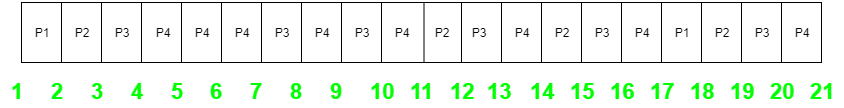

# 最长剩余时间优先 (LRTF) CPU 调度程序

我们给出了一些具有到达时间和执行时间的进程，我们需要找出给定进程的完成时间 (CT)、周转时间 (TAT)、平均周转时间 (Avg TAT)、等待时间 (WT) 和平均等待时间 (AWT)。

```
先决条件：CPU 调度 | 最长剩余时间优先 (LRTF) 算法
```

LRTF 是一种抢占式调度算法。它的平局规则是先来先服务 (FCFS)，如果 FCFS 不能打破平局，那么我们使用进程 ID 作为平局的规则。

**示例：** 考虑以下四个进程 P1、P2、P3 和 P4 的到达时间和执行时间表。

```
进程   到达时间   执行时间
P1      1 毫秒      2 毫秒
P2      2 毫秒      4 毫秒
P3      3 毫秒      6 毫秒
P4      4 毫秒      8 毫秒
```

甘特图如下所示，



由于完成时间 (CT) 可以通过甘特图直接确定，并且

```
周转时间 (TAT)
= (完成时间) - (到达时间)

同时，等待时间 (WT)
= (周转时间) - (执行时间)
```

因此，

**输出：**

```
总周转时间 = 68 毫秒
所以，平均周转时间 = 68/4 = 17.00 毫秒

以及，总等待时间 = 48 毫秒
所以，平均等待时间 = 12.00 毫秒
```

**算法：**

- **步骤 1：** 创建一个包含所有必要字段的进程结构，如 AT (到达时间)，BT(执行时间)，CT(完成时间)，TAT(周转时间)，WT(等待时间)。
- **步骤 2：** 根据进程的到达时间 (AT) 对进程进行排序。
- **步骤 3：** 将当前时间 (时间变量) 初始化为 0，并在所有已到达的进程中找到剩余执行时间 (BT) 最长的进程。执行该进程每个单独的单元，即，将时间变量增加 1 并减少该进程的 BT 1。
- **步骤 4：** 如果任何进程完成执行，则将其 CT(完成时间) 更新为当前时间 (时间变量)。
- **步骤 5：** 如果执行中的进程的 BT 变为 0，则将其 CT 更新为当前时间 (时间变量) 并从待执行进程列表中移除。
- **步骤 6：** 如果所有进程都已执行，退出循环。
- **步骤 7：** 在为每个进程计算出 CT 后，找出 TAT (周转时间) 和 WT (等待时间)。

```
(TAT = CT - AT)
(WT  = TAT - BT)
```

**算法实现**

::: 算法实现

```c++ [C++]
#include <bits/stdc++.h>

using namespace std;

// creating a structure of a process
struct process {
	int processno;
	int AT;
	int BT;

	// for backup purpose to print in last
	int BTbackup;
	int WT;
	int TAT;
	int CT;
};

// creating a structure of 4 processes
struct process p[4];

// variable to find the total time
int totaltime = 0;
int prefinaltotal = 0;

// comparator function for sort()
bool compare(process p1, process p2)
{
	// compare the Arrival time of two processes
	return p1.AT < p2.AT;
}

// finding the largest Arrival Time among all the available
// process at that time
int findlargest(int at)
{
	int max = 0, i;
	for (i = 0; i < 4; i++) {
		if (p[i].AT <= at) {
			if (p[i].BT > p[max].BT)
				max = i;
		}
	}

	// returning the index of the process having the largest BT
	return max;
}

// function to find the completion time of each process
int findCT()
{

	int index;
	int flag = 0;
	int i = p[0].AT;
	while (1) {
		if (i <= 4) {
			index = findlargest(i);
		}

		else
			index = findlargest(4);
		cout << "Process executing at time " << totaltime
			<< " is: P" << index + 1 << "\t";

		p[index].BT -= 1;
		totaltime += 1;
		i++;

		if (p[index].BT == 0) {
			p[index].CT = totaltime;
			cout << " Process P" << p[index].processno 
				<< " is completed at " << totaltime;
		}
		cout << endl;

		// loop termination condition
		if (totaltime == prefinaltotal)
			break;
	}
}

int main()
{

	int i;

	// initializing the process number
	for (i = 0; i < 4; i++) {
		p[i].processno = i + 1;
	}

	// cout<<"arrival time of 4 processes : ";
	for (i = 0; i < 4; i++) // taking AT
	{
		p[i].AT = i + 1;
	}

	// cout<<" Burst time of 4 processes : ";
	for (i = 0; i < 4; i++) {

		// assigning {2, 4, 6, 8} as Burst Time to the processes
		// backup for displaying the output in last
		// calculating total required time for terminating 
		// the function().
		p[i].BT = 2 * (i + 1);
		p[i].BTbackup = p[i].BT;
		prefinaltotal += p[i].BT;
	}

	// displaying the process before executing
	cout << "PNo\tAT\tBT\n";

	for (i = 0; i < 4; i++) {
		cout << p[i].processno << "\t";
		cout << p[i].AT << "\t";
		cout << p[i].BT << "\t";
		cout << endl;
	}
	cout << endl;

	// sorting process according to Arrival Time
	sort(p, p + 4, compare);

	// calculating initial time when execution starts
	totaltime += p[0].AT;

	// calculating to terminate loop
	prefinaltotal += p[0].AT;
	findCT();
	int totalWT = 0;
	int totalTAT = 0;
	for (i = 0; i < 4; i++) {
		// since, TAT = CT - AT
		p[i].TAT = p[i].CT - p[i].AT;
		p[i].WT = p[i].TAT - p[i].BTbackup;

		// finding total waiting time
		totalWT += p[i].WT;

		// finding total turn around time
		totalTAT += p[i].TAT;
	}

	cout << "After execution of all processes ... \n";

	// after all process executes
	cout << "PNo\tAT\tBT\tCT\tTAT\tWT\n";

	for (i = 0; i < 4; i++) {
		cout << p[i].processno << "\t";
		cout << p[i].AT << "\t";
		cout << p[i].BTbackup << "\t";
		cout << p[i].CT << "\t";
		cout << p[i].TAT << "\t";
		cout << p[i].WT << "\t";
		cout << endl;
	}

	cout << endl;
	cout << "Total TAT = " << totalTAT << endl;
	cout << "Average TAT = " << totalTAT / 4.0 << endl;
	cout << "Total WT = " << totalWT << endl;
	cout << "Average WT = " << totalWT / 4.0 << endl;
	return 0;
}

```

```java [Java ]
// Java Program to implement
// longest remaining time first
import java.util.*;

class GFG 
{

// creating a class of a process
static class process {
	int processno;
	int AT;
	int BT;

	// for backup purpose to print in last
	int BTbackup;
	int WT;
	int TAT;
	int CT;
}

static process[] p = new process[4];

// variable to find the total time
static int totaltime = 0;
static int prefinaltotal = 0;

// finding the largest Arrival Time among all the
// available process at that time
static int findlargest(int at)
{
	int max = 0, i;
	for (i = 0; i < 4; i++) {
	if (p[i].AT <= at) {
		if (p[i].BT > p[max].BT)
		max = i;
	}
	}

	// returning the index of the process having the
	// largest BT
	return max;
}

// function to find the completion time of each process
static void findCT()
{

	int index;
	int flag = 0;
	int i = p[0].AT;
	while (true) {
	if (i <= 4) {
		index = findlargest(i);
	}

	else
		index = findlargest(4);
	System.out.print("Process executing at time "
					+ totaltime + " is: P"
					+ (index + 1) + "\t");

	p[index].BT -= 1;
	totaltime += 1;
	i++;

	if (p[index].BT == 0) {
		p[index].CT = totaltime;
		System.out.println(
		" Process P" + p[index].processno
		+ " is completed at " + totaltime);
	}
	System.out.println();

	// loop termination condition
	if (totaltime == prefinaltotal)
		break;
	}
}

public static void main(String[] args)
{
	int i;

	// initializing the process number
	for (i = 0; i < 4; i++) {
	p[i] = new process();
	p[i].processno = i + 1;
	}

	for (i = 0; i < 4; i++) // taking AT
	{
	p[i].AT = i + 1;
	}

	for (i = 0; i < 4; i++) {

	// assigning {2, 4, 6, 8} as Burst Time to the
	// processes backup for displaying the output in
	// last calculating total required time for
	// terminating the function().
	p[i].BT = 2 * (i + 1);
	p[i].BTbackup = p[i].BT;
	prefinaltotal += p[i].BT;
	}

	// displaying the process before executing
	System.out.print("PNo\tAT\tBT\n");

	for (i = 0; i < 4; i++) {
	System.out.print(p[i].processno + "\t");
	System.out.print(p[i].AT + "\t");
	System.out.println(p[i].BT + "\t");
	}
	System.out.println();
	Arrays.sort(p, (process p1, process p2) -> {
	return p1.AT - p2.AT;
	});

	// calculating initial time when execution starts
	totaltime += p[0].AT;

	// calculating to terminate loop
	prefinaltotal += p[0].AT;
	findCT();
	int totalWT = 0;
	int totalTAT = 0;
	for (i = 0; i < 4; i++) {
	// since, TAT = CT - AT
	p[i].TAT = p[i].CT - p[i].AT;
	p[i].WT = p[i].TAT - p[i].BTbackup;

	// finding total waiting time
	totalWT += p[i].WT;

	// finding total turn around time
	totalTAT += p[i].TAT;
	}

	System.out.print(
	"After execution of all processes ... \n");

	// after all process executes
	System.out.print("PNo\tAT\tBT\tCT\tTAT\tWT\n");

	for (i = 0; i < 4; i++) {
	System.out.print(p[i].processno + "\t");
	System.out.print(p[i].AT + "\t");
	System.out.print(p[i].BTbackup + "\t");
	System.out.print(p[i].CT + "\t");
	System.out.print(p[i].TAT + "\t");
	System.out.println(p[i].WT + "\t");
	}

	System.out.println();
	System.out.println("Total TAT = " + totalTAT);
	System.out.println("Average TAT = "
					+ (totalTAT / 4.0));
	System.out.println("Total WT = " + totalWT);
	System.out.println("Average WT = " + totalWT / 4.0);
}
}

// This code is contributed by Karandeep Singh

```
```py [Python3 ]
# Python3 program to implement 
# Longest Remaining Time First 

# creating a structure of 4 processes
p = []
for i in range(4):
	p.append([0, 0, 0, 0, 0, 0, 0])

# variable to find the total time 
totaltime = 0
prefinaltotal = 0

# finding the largest Arrival Time 
# among all the available process 
# at that time 
def findlargest(at):
	max = 0
	for i in range(4):
		if (p[i][1] <= at):
			if (p[i][2] > p[max][2]) :
				max = i 
	
	# returning the index of the 
	# process having the largest BT 
	return max

# function to find the completion
# time of each process 
def findCT(totaltime): 
	index = 0
	flag = 0
	i = p[0][1] 
	while (1): 
		if (i <= 4):
			index = findlargest(i) 
		else:
			index = findlargest(4) 
		print("Process execute at time ",
					totaltime, end = " ")
		print(" is: P", index + 1, 
						sep = "", end = " ")
		p[index][2] -= 1
		totaltime += 1
		i += 1
		if (p[index][2] == 0): 
				p[index][6] = totaltime 
				print("Process P", p[index][0], 
						sep = "", end = " ")
				print(" is completed at ", 
					totaltime, end = " ")
		print()
		
		# loop termination condition 
		if (totaltime == prefinaltotal): 
			break

# Driver code 
if __name__ =="__main__":
	
	# initializing the process number 
	for i in range(4): 
		p[i][0] = i + 1

	for i in range(4): # taking AT
		p[i][1] = i + 1

	for i in range(4): 

		# assigning 2, 4, 6, 8 as Burst Time 
		# to the processes backup for displaying
		# the output in last calculating total
		# required time for terminating the function(). 
		p[i][2] = 2 * (i + 1) 
		p[i][3] = p[i][2] 
		prefinaltotal += p[i][2] 

	# displaying the process before executing 
	print("PNo\tAT\tBT")

	for i in range(4): 
		print(p[i][0], "\t", 
			p[i][1], "\t", p[i][2])
	print()
	
	# sorting process according to Arrival Time 
	p = sorted(p, key = lambda p:p[1]) 

	# calculating initial time when
	# execution starts 
	totaltime += p[0][1]

	# calculating to terminate loop 
	prefinaltotal += p[0][1] 
	findCT(totaltime) 
	totalWT = 0
	totalTAT = 0
	for i in range(4):
		
		# since, TAT = CT - AT 
		p[i][5] = p[i][6]- p[i][1] 
		p[i][4] = p[i][5] - p[i][3] 

		# finding total waiting time 
		totalWT += p[i][4] 

		# finding total turn around time 
		totalTAT += p[i][5] 

	print("\nAfter execution of all processes ... ")

	# after all process executes 
	print("PNo\tAT\tBT\tCT\tTAT\tWT" )

	for i in range(4): 
		print(p[i][0], "\t", p[i][1], "\t", 
			p[i][3], "\t", end = " ")
		print(p[i][6], "\t", 
			p[i][5], "\t", p[i][4])
	print()
	print("Total TAT = ", totalTAT)
	print("Average TAT = ", totalTAT / 4.0)
	print("Total WT = ", totalWT)
	print("Average WT = ", totalWT / 4.0)

# This code is contributed by
# Shubham Singh(SHUBHAMSINGH10)

```
```js [JavaScript ]
// JavaScript program to implement
// Longest Remaining Time First

// creating a structure of 4 processes
const p = [];
for (let i = 0; i < 4; i++) {
	p.push([0, 0, 0, 0, 0, 0, 0]);
}

// variable to find the total time
let totaltime = 0;
let prefinaltotal = 0;

// finding the largest Arrival Time
// among all the available process
// at that time
function findlargest(at) {
	let max = 0;
	for (let i = 0; i < 4; i++) {
		if (p[i][1] <= at) {
			if (p[i][2] > p[max][2]) {
				max = i;
			}
		}
	}

	// returning the index of the
	// process having the largest BT
	return max;
}

// function to find the completion
// time of each process
function findCT(totaltime) {
	let index = 0;
	let flag = 0;
	let i = p[0][1];
	while (true) {
		if (i <= 4) {
			index = findlargest(i);
		} else {
			index = findlargest(4);
		}
		console.log("Process execute at time ", totaltime, " is: P", index + 1);
		p[index][2] -= 1;
		totaltime += 1;
		i += 1;
		if (p[index][2] == 0) {
			p[index][6] = totaltime;
			console.log(
				"Process P",
				p[index][0],
				" is completed at ",
				totaltime
			);
		}
		console.log();

		// loop termination condition
		if (totaltime == prefinaltotal) {
			break;
		}
	}
}

// Driver code
// initializing the process number
for (let i = 0; i < 4; i++) {
	p[i][0] = i + 1;
}

for (let i = 0; i < 4; i++) {
	// taking AT
	p[i][1] = i + 1;
}

for (let i = 0; i < 4; i++) {
	// assigning 2, 4, 6, 8 as Burst Time
	// to the processes backup for displaying
	// the output in last calculating total
	// required time for terminating the function().
	p[i][2] = 2 * (i + 1);
	p[i][3] = p[i][2];
	prefinaltotal += p[i][2];
}

// displaying the process before executing
console.log("PNo\tAT\tBT");
for (let i = 0; i < 4; i++) {
	console.log(p[i][0], "\t", p[i][1], "\t", p[i][2]);
}
console.log();

// sorting process according to Arrival Time
p.sort(function(a, b) {
	return a[1] - b[1];
});

// calculating initial time when
// execution starts
totaltime += p[0][1];

// calculating to terminate loop
prefinaltotal += p[0][1];
findCT(totaltime);
let totalWT = 0;
let totalTAT = 0;
for (let i = 0; i < 4; i++) {
	// since, TAT = CT - AT 
	p[i][5] = p[i][6] - p[i][1]
	p[i][4] = p[i][5] - p[i][3]

	// finding total waiting time 
	totalWT += p[i][4]

	// finding total turn around time 
	totalTAT += p[i][5]
}
console.log("\nAfter execution of all processes ... ")

// after all process executes 
console.log("PNo\tAT\tBT\tCT\tTAT\tWT")

for (var i = 0; i < 4; i++) {
	process.stdout.write(p[i][0] + "\t" + p[i][1] + "\t" +
		p[i][3] + "\t ");
	process.stdout.write(p[i][6] + "\t" + p[i][5] + "\t" +
		p[i][4] + "\t\n");
}
console.log("\nTotal TAT = ", totalTAT)
console.log("Average TAT = ", totalTAT / 4.0)
console.log("Total WT = ", totalWT)
console.log("Average WT = ", totalWT / 4.0)


// This code is contributed by
// phasing17

```
```c# [C# ]
using System;

public class GFG 
{ 
// creating a class of a process
public class process 
{
	public int processno; 
	public int AT; 
	public int BT; 

	// for backup purpose to print in last
	public int BTbackup;
	public int WT; 
	public int TAT; 
	public int CT; 
} 

public static process[] p = new process[4]; 

// variable to find the total time
public static int totaltime = 0; 
public static int prefinaltotal = 0; 

// finding the largest Arrival Time among all the
// available process at that time
public static int findlargest(int at) 
{ 
	int max = 0, i; 
	for (i = 0; i < 4; i++) 
	{ 
	if (p[i].AT <= at) 
	{ 
		if (p[i].BT > p[max].BT) 
		max = i; 
	} 
	} 

	// returning the index of the process having the
	// largest BT
	return max; 
} 

// function to find the completion time of each process
public static void findCT() 
{ 

	int index; 
	int flag = 0; 
	int i = p[0].AT; 
	while (true) 
	{ 
	if (i <= 4) 
	{ 
		index = findlargest(i); 
	} 

	else
		index = findlargest(4); 
	System.Console.WriteLine("Process executing at time "
					+ totaltime + " is: P"
					+ (index + 1) + "\t"); 

	p[index].BT -= 1; 
	totaltime += 1; 
	i++; 

	if (p[index].BT == 0) 
	{ 
		p[index].CT = totaltime; 
		System.Console.WriteLine( 
		" Process P" + p[index].processno 
		+ " is completed at " + totaltime); 
	} 
	System.Console.WriteLine(); 

	// loop termination condition
	if (totaltime == prefinaltotal) 
		break; 
	} 
} 

public static void Main(string[] args) 
{ 
	int i; 

	// initializing the process number
	for (i = 0; i < 4; i++) 
	{ 
	p[i] = new process(); 
	p[i].processno = i + 1; 
	} 

	for (i = 0; i < 4; i++) // taking AT 
	{ 
	p[i].AT = i + 1; 
	} 

	for (i = 0; i < 4; i++) 
	{ 

	// assigning {2, 4, 6, 8} as Burst Time to the
	// processes backup for displaying the output in
	// last calculating total required time for
	// terminating the function().
	p[i].BT = 2 * (i + 1); 
	p[i].BTbackup = p[i].BT; 
	prefinaltotal += p[i].BT; 
	} 

	// displaying the process before executing
	System.Console.WriteLine("PNo\tAT\tBT\n"); 

	for (i = 0; i < 4; i++) 
	{ 
	System.Console.Write(p[i].processno + "\t"); 
	System.Console.Write(p[i].AT + "\t"); 
	System.Console.WriteLine(p[i].BT + "\t"); 
	} 
	System.Console.WriteLine(); 
	Array.Sort(p, delegate(process p1, process p2) 
	{ 
	return p1.AT - p2.AT; 
	}); 

	// calculating initial time when execution starts
	totaltime += p[0].AT; 

	// calculating to terminate loop
	prefinaltotal += p[0].AT; 
	findCT(); 
	int totalWT = 0; 
	int totalTAT = 0; 
	for (i = 0; i < 4; i++) 
	{ 
	// since, TAT = CT - AT
	p[i].TAT = p[i].CT - p[i].AT; 
	p[i].WT = p[i].TAT - p[i].BTbackup; 

	// finding total waiting time
	totalWT += p[i].WT; 

	// finding total turn around time
	totalTAT += p[i].TAT; 
	} 

	System.Console.Write( 
	"After execution of all processes ... \n"); 

	// after all process executes
	System.Console.Write("PNo\tAT\tBT\tCT\tTAT\tWT\n"); 

	for (i = 0; i < 4; i++) 
	{ 
	System.Console.Write(p[i].processno + "\t"); 
	System.Console.Write(p[i].AT + "\t"); 
	System.Console.Write(p[i].BTbackup + "\t"); 
	System.Console.Write(p[i].CT + "\t"); 
	System.Console.Write(p[i].TAT + "\t"); 
	System.Console.WriteLine(p[i].WT + "\t"); 
	} 

	System.Console.WriteLine(); 
	System.Console.WriteLine("Total TAT = " + totalTAT); 
	System.Console.WriteLine("Average TAT = "
					+ (totalTAT / 4.0)); 
	System.Console.WriteLine("Total WT = " + totalWT); 
	System.Console.WriteLine("Average WT = " + totalWT / 4.0); 
} 
}

```
:::

**输出**

```
PNo    AT    BT
1    1    2    
2    2    4    
3    3    6    
4    4    8    

Process executing at time 1 is: P1    
Process executing at time 2 is: P2    
Process executing at time 3 is: P3    
Process executing at time 4 is: P4    
Process executing at time 5 is: P4    
Process executing at time 6 is: P4    
Process executing at time 7 is: P3    
Process executing at time 8 is: P4    
Process executing at time 9 is: P3    
Process executing at time 10 is: P4    
Process executing at time 11 is: P2    
Process executing at time 12 is: P3    
Process executing at time 13 is: P4    
Process executing at time 14 is: P2    
Process executing at time 15 is: P3    
Process executing at time 16 is: P4    
Process executing at time 17 is: P1     Process P1 is completed at 18
Process executing at time 18 is: P2     Process P2 is completed at 19
Process executing at time 19 is: P3     Process P3 is completed at 20
Process executing at time 20 is: P4     Process P4 is completed at 21
After execution of all processes ... 
PNo    AT    BT    CT    TAT    WT
1    1    2    18    17    15    
2    2    4    19    17    13    
3    3    6    20    17    11    
4    4    8    21    17    9    

Total TAT = 68
Average TAT = 17
Total WT = 48
Average WT = 12 
```