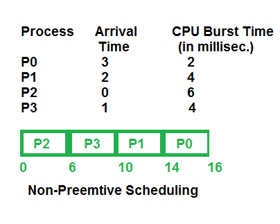

# 抢占式和非抢占式调度

在操作系统中，调度是将进程接入系统资源（主要是CPU）的方法。高效的调度对于优化系统性能和用户满意度至关重要。CPU调度主要有两种类型：抢占式和非抢占式。

理解抢占式和非抢占式调度之间的差异有助于设计和选择适合各种类型操作系统的正确调度算法。在本文中，你将了解抢占式和非抢占式调度的区别。但首先，你需要在了解差异之前先理解抢占式和非抢占式调度。

## 什么是抢占式调度？

抢占式调度是在进程从运行状态切换到就绪状态，或从等待状态切换到就绪状态时使用。资源（主要是CPU周期）被分配给进程有限的时间，然后被取走，如果该进程仍然有剩余的CPU突发时间，则该进程再次被放回就绪队列。该进程停留在就绪队列中，直到它下次有机会执行。

基于抢占式调度的算法有轮询（Round Robin, RR）、最短剩余时间优先（Shortest Remaining Time First, SRTF）、优先级（抢占式版本）等。

#### 抢占式调度的优点

- 由于进程可能不会垄断处理器，这是一种更可靠的方法。
- 每次发生都阻止了正在进行的任务的完成。
- 提高了平均响应时间。
- 在多道程序环境中使用这种方法更有利。
- 操作系统确保每个使用CPU的进程都使用相同数量的CPU时间。

#### 抢占式调度的缺点

- 必须使用有限的计算资源。
- 挂起运行中的进程、更改上下文和调度新进进程都需要更多时间。
- 如果同时到达多个高优先级进程，低优先级进程将不得不等待。

## 什么是非抢占式调度？

非抢占式调度是在进程终止，或进程从运行状态切换到等待状态时使用。在这种调度中，一旦资源（CPU周期）被分配给进程，该进程就持有CPU直到它被终止或达到等待状态。在非抢占式调度的情况下，不会在执行中途中断正在运行的CPU进程。相反，它等到进程完成其CPU突发时间，然后才可以将CPU分配给另一个进程。

基于非抢占式调度的算法有：最短作业优先（Shortest Job First, SJF基本上是非抢占式的）和优先级（非抢占式版本）等。

#### 非抢占式调度的优点

- 它有最小的调度负担。
- 这是一个非常简单的过程。
- 使用较少的计算资源。
- 它有很高的吞吐率。

#### 非抢占式调度的缺点

- 它对进程的响应时间非常长。
- 错误可能导致计算机冻结。

## 抢占式和非抢占式调度之间的主要区别

- 在抢占式调度中，CPU被分配给进程有限的时间，而在非抢占式调度中，CPU被分配给进程直到它终止或切换到等待状态。
- 在抢占式调度中，执行中的进程在执行中途被更高优先级的到来所中断，而在非抢占式调度中，执行中的进程不会被中断，直到其执行完成。
- 在抢占式调度中，存在将进程从就绪状态切换到运行状态，反之亦然，以及维护就绪队列的开销。而在非抢占式调度中没有将进程从运行状态切换到就绪状态的开销。
- 在抢占式调度中，如果高优先级的进程频繁到达就绪队列，那么低优先级的进程可能要等待很长时间，并可能遭受饥饿。在非抢占式调度中，如果CPU被分配给具有较长突发时间的进程，那么具有较短CPU突发时间的后来进程可能要遭受饥饿。
- 抢占式调度通过允许关键进程在到达就绪队列时访问CPU（无论当前执行哪个进程），从而实现灵活性。非抢占式调度被称为刚性的，因为即使关键进程进入就绪队列，正在运行CPU的进程也不会被打扰。
- 抢占式调度必须维护共享数据的完整性，因此它是成本相关的，这在非抢占式调度中并非如此。

| 参数 | 抢占式调度 | 非抢占式调度 |
| --- | --- | --- |
| **基础** | 在此资源（CPU周期）被分配给进程有限的时间。 | 一旦资源（CPU周期）被分配给进程，该进程就持有它直到完成其突发时间或切换到等待状态 |
| **中断** | 进程可能在中途被中断。 | 进程不能在中途被中断，直到它自己终止或时间用完 |
| **饥饿** | 如果具有高优先级的进程频繁到达就绪队列，低优先级进程可能会饥饿 | 如果CPU被分配给具有较长突发时间的进程，那么具有较短CPU突发时间的后来进程可能会饥饿 |
| **开销** | 调度进程有开销 | 没有开销 |
| **灵活性** | 灵活 | 刚性 |
| **成本** | 成本相关 | 无成本相关 |
| **CPU利用率** | 在抢占式调度中，CPU利用率高 | 在非抢占式调度中，CPU利用率低 |
| **等待时间** | 抢占式调度等待时间较短 | 非抢占式调度等待时间较长 |
| **响应时间** | 抢占式调度响应时间较短 | 非抢占式调度响应时间较长 |
| **决策制定** | 调度器做出决策，基于优先级和时间片分配 | 决策由进程本身做出，操作系统只遵循进程的指令 |
| **进程控制** | 操作系统对进程调度有更多控制 | 操作系统对进程调度控制较少 |
| **开销** | 由于频繁上下文切换，开销较高 | 由于上下文切换不频繁，开销较低 |
| **示例** | 抢占式调度的示例有轮询和最短剩余时间优先 | 非抢占式调度的示例有先来先服务和最短作业优先 |

## 结论

抢占式调度允许操作系统中断并重新分配CPU给不同的进程，使其对高优先级任务响应迅速且高效。非抢占式调度允许进程在没有中断的情况下运行至完成，简化了系统，但可能会造成其他任务的延迟。选择这些方法取决于系统对性能和简单性的需求。

