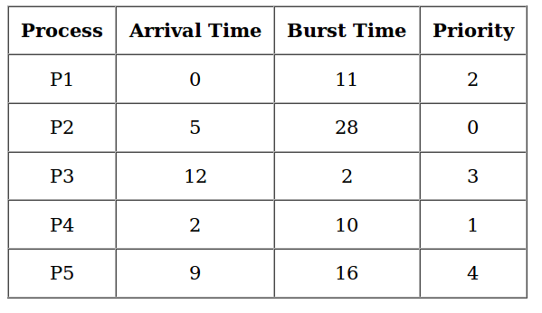
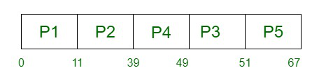

# 优先级CPU调度与不同到达时间|第二部分


优先级调度是一种非抢占式算法，也是批处理系统中最常见的调度算法之一。每个进程首先被分配到达时间（先到的进程先处理），如果两个进程的到达时间相同，则比较它们的优先级（优先级高的进程先处理）。此外，如果两个进程的优先级相同，则比较进程编号（编号小的进程先处理）。这个过程在所有进程都执行完毕后重复进行。

**实现步骤：**

1. 首先输入进程的到达时间、执行时间和优先级。
2. 首先调度具有最低到达时间的进程，如果有两个或更多具有最低到达时间的进程，则优先级最高的进程将首先被调度。
3. 现在，根据进程的到达时间和优先级进一步调度进程。（这里我们假设优先级数字越低表示优先级越高）。如果两个进程的优先级相同，则根据进程编号进行排序。
4. 一旦所有进程都已到达，我们可以根据它们的优先级进行调度。

**注意：** 在问题中，将明确指出哪个数字具有更高的优先级，哪个数字具有更低的优先级。

**甘特图：**



**示例：**

```
输入：
进程编号 -> 1 2 3 4 5
到达时间 -> 0 1 3 2 4
执行时间 -> 3 6 1 2 4
优先级 -> 3 4 9 7 8
输出：
进程编号  到达时间  执行时间  完成时间  周转时间  等待时间
1         0       3        3       3       0
2         1       6        9       8       2
3         3       1        16      13      12
4         2       2        11      9       7
5         4       4        15      11      7
平均等待时间：5.6
平均周转时间：8.8
```

::: code-group
```cpp [C++]
// C++ implementation for Priority Scheduling with 
//Different Arrival Time priority scheduling
/*1. sort the processes according to arrival time 
2. if arrival time is same the acc to priority
3. apply fcfs
*/

#include <bits/stdc++.h>

using namespace std;

#define totalprocess 5

// Making a struct to hold the given input 

struct process
{
int at,bt,pr,pno;
};

process proc[50];

/*
Writing comparator function to sort according to priority if 
arrival time is same 
*/

bool comp(process a,process b)
{
if(a.at == b.at)
{
return a.pr<b.pr;
}
else
{
    return a.at<b.at;
}
}

// Using FCFS Algorithm to find Waiting time
void get_wt_time(int wt[])
{
// declaring service array that stores cumulative burst time 
int service[50];

// Initialising initial elements of the arrays
service[0] = proc[0].at;
wt[0]=0;


for(int i=1;i<totalprocess;i++)
{
service[i]=proc[i-1].bt+service[i-1];

wt[i]=service[i]-proc[i].at;

// If waiting time is negative, change it into zero
    
    if(wt[i]<0)
    {
    wt[i]=0;
    }
}

}

void get_tat_time(int tat[],int wt[])
{
// Filling turnaroundtime array

for(int i=0;i<totalprocess;i++)
{
    tat[i]=proc[i].bt+wt[i];
}
    
}

void findgc()
{
//Declare waiting time and turnaround time array
int wt[50],tat[50];

double wavg=0,tavg=0;

// Function call to find waiting time array
get_wt_time(wt);
//Function call to find turnaround time
get_tat_time(tat,wt);
    
int stime[50],ctime[50];

stime[0] = proc[0].at;
ctime[0]=stime[0]+tat[0];

// calculating starting and ending time
for(int i=1;i<totalprocess;i++)
    {
        stime[i]=ctime[i-1];
        ctime[i]=stime[i]+tat[i]-wt[i];
    }
    
cout<<"Process_no\tStart_time\tComplete_time\tTurn_Around_Time\tWaiting_Time"<<endl;
    
    // display the process details
    
for(int i=0;i<totalprocess;i++)
    {
        wavg += wt[i];
        tavg += tat[i];
        
        cout<<proc[i].pno<<"\t\t"<<
            stime[i]<<"\t\t"<<ctime[i]<<"\t\t"<<
            tat[i]<<"\t\t\t"<<wt[i]<<endl;
    }
    
        // display the average waiting time
        //and average turn around time
    
    cout<<"Average waiting time is : ";
    cout<<wavg/(float)totalprocess<<endl;
    cout<<"average turnaround time : ";
    cout<<tavg/(float)totalprocess<<endl;

}

int main()
{
int arrivaltime[] = { 1, 2, 3, 4, 5 };
int bursttime[] = { 3, 5, 1, 7, 4 };
int priority[] = { 3, 4, 1, 7, 8 };
    
for(int i=0;i<totalprocess;i++)
{
    proc[i].at=arrivaltime[i];
    proc[i].bt=bursttime[i];
    proc[i].pr=priority[i];
    proc[i].pno=i+1;
    } 
    
    //Using inbuilt sort function
    
    sort(proc,proc+totalprocess,comp);
    
    //Calling function findgc for finding Gantt Chart
    
    findgc(); 

    return 0;
}

// This code is contributed by Anukul Chand.

```
```java [Java]
import java.util.*;

class Process {
    int at, bt, pr, pno;

    Process(int pno, int at, int bt, int pr) {
        this.pno = pno;
        this.pr = pr;
        this.at = at;
        this.bt = bt;
    }
}

public class PriorityScheduling {
    static final int totalprocess = 5;
    static Process proc[] = new Process[totalprocess];

    static boolean comp(Process a, Process b) {
        if (a.at == b.at) {
            return a.pr < b.pr;
        } else {
            return a.at < b.at;
        }
    }

    static void get_wt_time(int wt[]) {
        int service[] = new int[totalprocess];
        service[0] = proc[0].at;
        wt[0] = 0;

        for (int i = 1; i < totalprocess; i++) {
            service[i] = proc[i - 1].bt + service[i - 1];
            wt[i] = service[i] - proc[i].at;
            if (wt[i] < 0) {
                wt[i] = 0;
            }
        }
    }

    static void get_tat_time(int tat[], int wt[]) {
        for (int i = 0; i < totalprocess; i++) {
            tat[i] = proc[i].bt + wt[i];
        }
    }

    static void findgc() {
        int wt[] = new int[totalprocess];
        int tat[] = new int[totalprocess];
        double wavg = 0, tavg = 0;

        get_wt_time(wt);
        get_tat_time(tat, wt);

        int stime[] = new int[totalprocess];
        int ctime[] = new int[totalprocess];

        stime[0] = proc[0].at;
        ctime[0] = stime[0] + tat[0];

        for (int i = 1; i < totalprocess; i++) {
            stime[i] = ctime[i - 1];
            ctime[i] = stime[i] + tat[i] - wt[i];
        }

        System.out.println("Process_no\tStart_time\tComplete_time\tTurn_Around_Time\tWaiting_Time");

        for (int i = 0; i < totalprocess; i++) {
            wavg += wt[i];
            tavg += tat[i];

            System.out.println(proc[i].pno + "\t\t" + stime[i] + "\t\t" + ctime[i] + "\t\t" + tat[i] + "\t\t\t" + wt[i]);
        }

        System.out.println("Average waiting time is : " + wavg / totalprocess);
        System.out.println("Average turnaround time : " + tavg / totalprocess);
    }

    public static void main(String[] args) {
        int arrivaltime[] = {1, 2, 3, 4, 5};
        int bursttime[] = {3, 5, 1, 7, 4};
        int priority[] = {3, 4, 1, 7, 8};

        for (int i = 0; i < totalprocess; i++) {
            proc[i] = new Process(i + 1, arrivaltime[i], bursttime[i], priority[i]);
        }

        Arrays.sort(proc, (a, b) -> {
            if (a.at == b.at) {
                return a.pr - b.pr;
            } else {
                return a.at - b.at;
            }
        });

        findgc();
    }
}

```
```python [Python3]
# Python3 implementation for Priority Scheduling with 
# Different Arrival Time priority scheduling 
"""1. sort the processes according to arrival time 
   2. if arrival time is same the acc to priority 
   3. apply fcfs """
 
totalprocess = 5
proc = []
for i in range(5):
    l = []
    for j in range(4):
        l.append(0)
    proc.append(l)

# Using FCFS Algorithm to find Waiting time 
def get_wt_time( wt): 

    # declaring service array that stores
    # cumulative burst time 
    service = [0] * 5

    # Initialising initial elements 
    # of the arrays 
    service[0] = 0
    wt[0] = 0

    for i in range(1, totalprocess): 
        service[i] = proc[i - 1][1] + service[i - 1] 
        wt[i] = service[i] - proc[i][0] + 1

        # If waiting time is negative,
        # change it o zero 
        if(wt[i] < 0) :     
            wt[i] = 0
        
def get_tat_time(tat, wt): 

    # Filling turnaroundtime array 
    for i in range(totalprocess):
        tat[i] = proc[i][1] + wt[i] 

def findgc():
    
    # Declare waiting time and
    # turnaround time array 
    wt = [0] * 5
    tat = [0] * 5

    wavg = 0
    tavg = 0

    # Function call to find waiting time array 
    get_wt_time(wt) 
    
    # Function call to find turnaround time 
    get_tat_time(tat, wt) 

    stime = [0] * 5
    ctime = [0] * 5
    stime[0] = 1
    ctime[0] = stime[0] + tat[0]
    
    # calculating starting and ending time 
    for i in range(1, totalprocess): 
        stime[i] = ctime[i - 1] 
        ctime[i] = stime[i] + tat[i] - wt[i] 

    print("Process_no\tStart_time\tComplete_time",
               "\tTurn_Around_Time\tWaiting_Time")

    # display the process details 
    for i in range(totalprocess):
        wavg += wt[i] 
        tavg += tat[i] 
        
        print(proc[i][3], "\t\t", stime[i], 
                         "\t\t", end = " ")
        print(ctime[i], "\t\t", tat[i], "\t\t\t", wt[i]) 


    # display the average waiting time 
    # and average turn around time 
    print("Average waiting time is : ", end = " ")
    print(wavg / totalprocess)
    print("average turnaround time : " , end = " ")
    print(tavg / totalprocess)

# Driver code 
if __name__ =="__main__":
    arrivaltime = [1, 2, 3, 4, 5]
    bursttime = [3, 5, 1, 7, 4]
    priority = [3, 4, 1, 7, 8] 
    
    for i in range(totalprocess): 

        proc[i][0] = arrivaltime[i] 
        proc[i][1] = bursttime[i] 
        proc[i][2] = priority[i] 
        proc[i][3] = i + 1
    
    # Using inbuilt sort function 
    proc = sorted (proc, key = lambda x:x[2])
    proc = sorted (proc)
    
    # Calling function findgc for
    # finding Gantt Chart 
    findgc() 

# This code is contributed by
# Shubham Singh(SHUBHAMSINGH10)

```
```csharp [C#]
// C# implementation for Priority Scheduling with 
// Different Arrival Time priority scheduling 
// 1. sort the processes according to arrival time 
// 2. if arrival time is same the acc to priority 
// 3. apply fcfs
using System;

class Program
{
    static int totalprocess = 5;
    static int[][] proc = new int[totalprocess][];
    static int[] arrivaltime = new int[] {1, 2, 3, 4, 5};
    static int[] bursttime = new int[] {3, 5, 1, 7, 4};
    static int[] priority = new int[] {3, 4, 1, 7, 8};


    // Driver code
    static void Main(string[] args)
    {
        for (int i = 0; i < totalprocess; i++)
        {
            proc[i] = new int[4];
            proc[i][0] = arrivaltime[i];
            proc[i][1] = bursttime[i];
            proc[i][2] = priority[i];
            proc[i][3] = i + 1;
        }

        Array.Sort(proc, (x, y) => x[2].CompareTo(y[2]));
        Array.Sort(proc, (x, y) => x[0].CompareTo(y[0]));
        Findgc();
    }
    
    // Using FCFS Algorithm to find Waiting time 
    static void GetWtTime(int[] wt)
    {
        
        // declaring service array that stores
        // cumulative burst time 
        int[] service = new int[totalprocess];
        
        // Initialising initial elements 
        // of the arrays
        service[0] = 0;
        wt[0] = 0;

        for (int i = 1; i < totalprocess; i++)
        {
            service[i] = proc[i - 1][1] + service[i - 1];
            wt[i] = service[i] - proc[i][0] + 1;

            // If waiting time is negative,
            // change it o zero 
            if (wt[i] < 0)
            {
                wt[i] = 0;
            }
        }
    }

    // Filling turnaroundtime array
    static void GetTatTime(int[] tat, int[] wt)
    {
        for (int i = 0; i < totalprocess; i++)
        {
            tat[i] = proc[i][1] + wt[i];
        }
    }

    static void Findgc()
    {
        
        // Declare waiting time and
        // turnaround time array 
        int[] wt = new int[totalprocess];
        int[] tat = new int[totalprocess];
        int wavg = 0;
        int tavg = 0;
        
         // Function call to find waiting time array 
        GetWtTime(wt);
        
        // Function call to find turnaround time
        GetTatTime(tat, wt);
        int[] stime = new int[totalprocess];
        int[] ctime = new int[totalprocess];
        stime[0] = 1;
        ctime[0] = stime[0] + tat[0];

        Console.WriteLine("Process_no\tStart_time\tComplete_time\tTurn_Around_Time\tWaiting_Time");

        // calculating starting and ending time
        for (int i = 0; i < totalprocess; i++)
        {
            wavg += wt[i];
            tavg += tat[i];
            Console.WriteLine(proc[i][3] + "\t\t" + stime[i] + "\t\t" + ctime[i] + "\t\t" + tat[i] + "\t\t\t" + wt[i]);
            
            
            // display the process details
            if (i != totalprocess - 1)
            {
                stime[i + 1] = ctime[i];
                ctime[i + 1] = stime[i + 1] + tat[i + 1] - wt[i + 1];
            }
        }

        // display the average waiting time 
        // and average turn around time
        Console.WriteLine("Average waiting time is: " + (double)wavg / totalprocess);
        Console.WriteLine("Average turnaround time is: " + (double)tavg / totalprocess);
    }
}

// This code is contributed by shiv1o43g

```
```js [Javascript]
var totalprocess = 5;
var proc = [];
for (var i = 0; i < 5; i++) {
    var l = [];
    for (var j = 0; j < 4; j++) {
        l.push(0);
    }
    proc.push(l);
}

function get_wt_time(wt) {
    var service = new Array(5).fill(0);
    service[0] = 0;
    wt[0] = 0;
    for (var i = 1; i < totalprocess; i++) {
        service[i] = proc[i - 1][1] + service[i - 1];
        wt[i] = service[i] - proc[i][0] + 1;
        if (wt[i] < 0) {
            wt[i] = 0;
        }
    }
}

function get_tat_time(tat, wt) {
    for (var i = 0; i < totalprocess; i++) {
        tat[i] = proc[i][1] + wt[i];
    }
}

function findgc() {
    var wt = new Array(5).fill(0);
    var tat = new Array(5).fill(0);
    var wavg = 0;
    var tavg = 0;
    get_wt_time(wt);
    get_tat_time(tat, wt);
    var stime = new Array(5).fill(0);
    var ctime = new Array(5).fill(0);
    stime[0] = 1;
    ctime[0] = stime[0] + tat[0];
    for (var i = 1; i < totalprocess; i++) {
        stime[i] = ctime[i - 1];
        ctime[i] = stime[i] + tat[i] - wt[i];
    }
    console.log("Process_no\tStart_time\tComplete_time\tTurn_Around_Time\tWaiting_Time"
    );
    for (var i = 0; i < totalprocess; i++) {
        wavg += wt[i];
        tavg += tat[i];
        console.log(
        proc[i][3] +
        "\t\t" +
        stime[i] +
        "\t\t" +
        ctime[i] +
        "\t\t" +
        tat[i] +
        "\t\t\t" +
        wt[i]
        );
    }
    console.log("Average waiting time is : " + wavg / totalprocess);
    console.log("average turnaround time : " + tavg / totalprocess);
}

var arrivaltime = [1, 2, 3, 4, 5];
var bursttime = [3, 5, 1, 7, 4];
var priority = [3, 4, 1, 7, 8];
for (var i = 0; i < totalprocess; i++) {
    proc[i][0] = arrivaltime[i];
    proc[i][1] = bursttime[i];
    proc[i][2] = priority[i];
    proc[i][3] = i + 1;
}

proc.sort(function (a, b) {
    if (a[2] == b[2]) {
    return a[0] - b[0];
    } else {
    return a[2] - b[2];
    }
});
findgc();

// This code is contributed by shiv1o43g

```
:::

**输出**

```
Process_no Start_time Complete_time Turn_Around_Time Waiting_Time
1           1           4              3              0 
2           5           10             8              3
3           4           5              2              1
4          10           17             13             6
5          17           21             16             12
Average Waiting Time is : 4.4 
Average Turn Around time is : 8.4
```
**时间复杂度：** O(N \* logN)，其中 N 是进程总数。

**辅助空间：** O(N)
