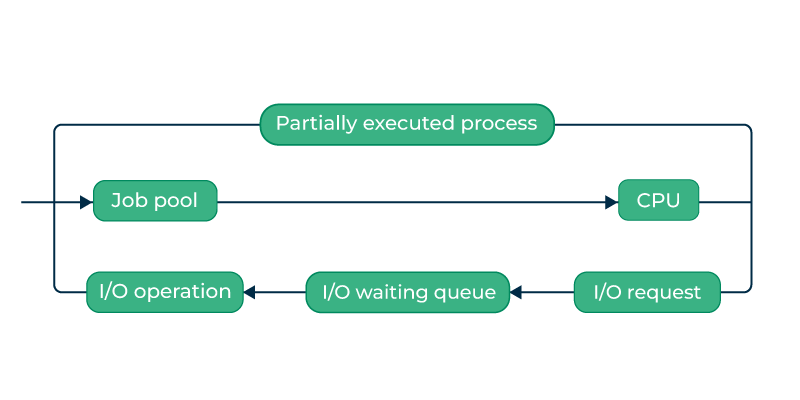

# 操作系统中的进程调度

在计算中，进程是由一个或多个线程执行的计算机程序的实例。调度在许多不同的计算机环境中都很重要。调度的一个重要领域是哪些程序将在CPU上运行。这项任务由计算机的操作系统（OS）处理，我们可以选择多种方式来配置程序。

进程调度器是操作系统的基本组件，负责决定进程由CPU执行的顺序。简单来说，它们管理CPU如何在多个争夺其注意力的任务或进程之间分配时间。在这篇文章中，我们将讨论：

## 什么是进程调度？

进程调度是进程管理器的活动，它处理从CPU中移除正在运行的进程，并根据特定策略选择另一个进程。

进程调度是多道程序设计操作系统的一个重要部分。这类操作系统允许多个进程同时被加载到可执行内存中，并通过时间多路复用共享CPU。

进程调度器

## 调度的分类

调度分为两类：

- **非抢占式**：在这种情况下，进程的资源不能在进程完成运行之前被取走。当一个运行中的进程结束并转换到等待状态时，资源才会切换。
- **抢占式**：在这种情况下，操作系统为进程分配资源的预定期限。在资源分配期间，进程从运行状态切换到就绪状态，或者从等待状态切换到就绪状态。这种切换发生是因为CPU可能会给予其他进程优先权，并用更高优先级的进程替换当前活动的进程。

## 进程调度器的类型

进程调度器有三种类型：

### **1. 长期或作业调度器**

它将新进程带入“就绪状态”。它控制多道程序设计的度，即在任何给定时间点处于就绪状态的进程数量。长期调度器在I/O密集型和CPU密集型进程之间做出谨慎选择非常重要。I/O密集型任务大部分时间用于输入和输出操作，而CPU密集型进程则在CPU上花费时间。作业调度器通过保持两者之间的平衡来提高效率。它们在高层次上运行，通常用于批处理系统。

### **2. 短期或CPU调度器**

它负责从就绪状态中选择一个进程，将其调度到运行状态。注意：短期调度器只选择进程进行调度，并不将进程加载到运行中。这里使用了所有的调度算法。CPU调度器负责确保没有因长时间运行的进程而导致的饥饿。

短期调度器

调度器负责将短期调度器选定的进程加载到CPU上（就绪到运行状态）上下文切换仅由调度器完成。调度器执行以下操作：

- 切换上下文。
- 切换到用户模式。
- 跳转到新加载程序的适当位置。

### **3. 中期调度器**

它负责暂停和恢复进程。它主要进行交换（将进程从主内存移动到磁盘，反之亦然）。进行交换可能是为了改善进程组合，或者因为内存需求的变化导致内存超额分配，需要释放内存。它有助于在I/O绑定和CPU绑定之间保持完美平衡。它降低了多道程序设计的度。

中期调度器

## 其他调度器

- **I/O调度器**：I/O调度器负责管理I/O操作的执行，如读取和写入磁盘或网络。它们可以使用各种算法来确定I/O操作的执行顺序，如FCFS（先来先服务）或RR（轮询）。
- **实时调度器**：在实时系统中，实时调度器确保关键任务在指定的时间内完成。它们可以使用各种算法来优先排序和调度任务，如EDF（最早截止时间优先）或RM（速率单调）。

## 调度器之间的比较

| 长期调度器 | 短期调度器 | 中期调度器 |
| --- | --- | --- |
| 它是作业调度器 | 它是CPU调度器 | 它是进程交换调度器。|
| 通常速度比短期调度器慢 | 速度在所有调度器中最快 | 速度介于短期和长期调度器之间。|
| 它控制多道程序设计的度 | 对多道程序设计程度的控制较少 | 它降低了多道程序设计的度。|
| 在时间共享系统中几乎不存在或不存在 | 它是最小的时间共享系统 | 它是时间共享系统的组成部分。|
| 它可以重新将进程调入内存，允许继续执行 | 它选择那些准备执行的进程 | 它可以重新将进程调入内存，可以继续执行。|

## 两状态进程模型短期

“运行”和“非运行”状态用于描述两状态进程模型。

- **运行**：当进程被创建时，新创建的进程以运行状态加入系统。
- **非运行**：当前未运行的进程被保存在队列中并等待执行。每个队列中的条目都包含指向特定进程的指针。队列系统使用链表来实现。这就是调度器的用法。当一个进程停止时，它被移到等待队列的末尾。根据进程成功或失败，该进程将被丢弃。调度器随后从队列中选择一个进程来运行。

## 上下文切换

为了使进程执行能够在以后从同一点继续，上下文切换是一种将CPU的状态或上下文存储和恢复到进程控制块中的机制。上下文切换器使得多个进程能够通过这种方法共享单个CPU。多任务操作系统必须包含上下文切换的功能。

当调度器将CPU从执行一个进程切换到执行另一个进程时，当前运行进程的状态被保存到进程控制块中。然后从其自己的PCB加载用于设置计算机、寄存器等的状态，以便下一个要运行的进程。之后，第二个进程可以开始处理。

.png)

上下文切换

为了使进程执行能够在以后从同一点继续，上下文切换是一种将CPU的状态或上下文存储和恢复到进程控制块中的机制。上下文切换器使得多个进程能够通过这种方法共享单个CPU。多任务操作系统必须包含上下文切换的功能。

- 程序计数器
- 调度信息
- 基址和限制寄存器值
- 当前使用的寄存器
- 已更改的状态
- I/O状态信息
- 会计信息

## 结论

总之，进程调度器是操作系统的重要组成部分，它们管理CPU如何处理多个任务或进程。它们确保进程被高效执行，充分利用CPU资源并保持系统响应性。通过在正确的时间选择正确的进程来运行，调度器有助于优化整体系统性能，改善用户体验，并确保在竞争进程之间公平访问CPU资源。

