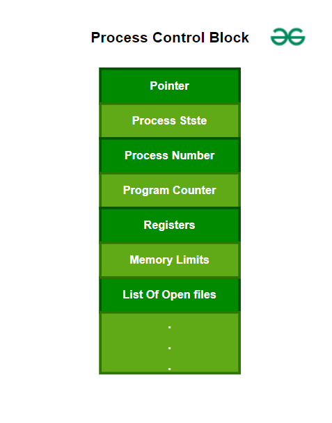

# 进程表和进程控制块（PCB）

在创建进程时，操作系统执行多项操作。为了识别进程，它为每个进程分配一个进程标识号（PID）。由于操作系统支持多程序设计，它需要跟踪所有进程。为了完成这项任务，使用进程控制块（PCB）来跟踪进程的执行状态。每个内存块包含有关进程状态、程序计数器、栈指针、打开文件的状态、调度算法等的信息。

当进程从一种状态转换到另一种状态时，所有这些信息都是必需的，并且必须保存。当进程进行状态转换时，操作系统必须更新进程的PCB中的信息。进程控制块（PCB）包含有关进程的信息，即寄存器、时间片、优先级等。进程表是PCB的数组，逻辑上包含系统中所有当前进程的PCB。

## 进程控制块的结构

进程控制块（PCB）是操作系统用来管理有关进程的信息的数据结构。进程控制保留许多管理进程高效所需的重要信息。下图有助于解释这些关键数据项。

- **指针**：这是在进程从一种状态切换到另一种状态时需要保存的栈指针，以保留进程的当前位置。
- **进程状态**：它存储进程的状态。
- **进程编号**：每个进程都被分配一个唯一的ID，称为进程ID或PID，用于存储进程标识符。
- **程序计数器**：程序计数器存储计数器，其中包含进程下一条要执行的指令的地址。
- **寄存器**：在PCB中的寄存器，它是一个数据结构。当进程运行并且它的时间片到期时，进程特定的寄存器的当前值将存储在PCB中，然后进程被换出。当进程被安排运行时，从PCB读取寄存器值并写入CPU寄存器。这是PCB中寄存器的主要目的。
- **内存限制**：此字段包含操作系统使用的内存管理系统的信息。这可能包括页表、段表等。
- **打开文件列表**：此信息包括进程打开的文件列表。

## 进程控制块（PCB）的附加考虑点

- **中断处理**：PCB还包含有关进程可能生成的中断以及操作系统如何处理它们的信息。
- **上下文切换**：从一个进程切换到另一个进程的过程称为上下文切换。PCB在上下文切换中起着至关重要的作用，它通过保存当前进程的状态并恢复下一个进程的状态来实现。
- **实时系统**：实时操作系统可能需要在PCB中包含额外的信息，如截止日期和优先级，以确保时间关键的进程及时执行。
- **虚拟内存管理**：PCB可能包含有关进程虚拟内存管理的信息，如页表和页面错误处理。
- **进程间通信**：PCB可以用来促进进程间的通信，通过存储有关进程之间共享资源和通信通道的信息。
- **容错**：某些操作系统可能使用PCB的多个副本来提供硬件故障或软件错误情况下的容错。

## 进程控制块的位置

进程控制块（PCB）存储在内存的一个特殊部分，普通用户无法访问。这是因为它保存了有关进程的重要信息。一些操作系统将PCB放置在进程的内核栈的开始位置，这是一个安全且有保障的地方。

## 优势

- **高效进程管理**：进程表和PCB提供了一种在操作系统中有效管理进程的方式。进程表包含有关每个进程的所有信息，而PCB包含进程的当前状态，如程序计数器和CPU寄存器。
- **资源管理**：进程表和PCB允许操作系统高效地管理系统资源，如内存和CPU时间。通过跟踪每个进程的资源使用情况，操作系统可以确保所有进程都能访问它们所需的资源。
- **进程同步**：进程表和PCB可以用来同步操作系统中的进程。PCB包含有关每个进程的同步状态的信息，如它的等待状态和它正在等待的资源。
- **进程调度**：进程表和PCB可以用来调度进程执行。通过跟踪每个进程的状态和资源使用情况，操作系统可以决定接下来应该执行哪些进程。

## 劣势

- **开销**：进程表和PCB可能会引入开销并降低系统性能。操作系统必须为每个进程维护进程表和PCB，这可能会消耗系统资源。
- **复杂性**：进程表和PCB可能会增加系统的复杂性，使开发和维护操作系统变得更加具有挑战性。需要管理和同步多个进程可能会使得设计和实现系统功能更加困难，并确保系统稳定性。
- **可扩展性**：进程表和PCB可能不适用于具有许多进程的大规模系统。随着进程数量的增加，进程表和PCB可能会变得更大，更难以高效地管理。
- **安全性**：如果不正确实施，进程表和PCB可能会引入安全风险。恶意程序可能会潜在地访问或修改进程表和PCB，以获得对系统资源的未授权访问或导致系统不稳定。

## 结论

进程控制块（PCB）对于在操作系统中管理进程至关重要。它存储了有关每个进程的关键信息，如其唯一ID、当前状态和资源使用情况。PCB使进程切换顺畅、多任务处理有效、资源分配高效。通过详细记录每个进程的信息，PCB有助于维护系统的稳定性和性能。了解PCB的作用和结构是理解操作系统如何处理多个进程的关键。

