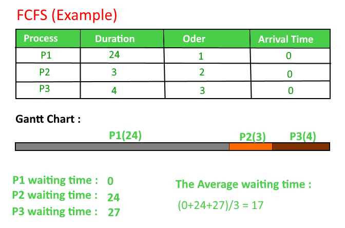

# 先来先服务（FCFS）CPU调度程序 | 第一部分

先来先服务（FCFS）是最简单的调度算法。FIFO（先进先出）简单地根据它们到达就绪队列的顺序对进程进行排队。在这个算法中，先来的第一个进程将首先被执行，下一个进程只有在前一个进程完全执行完毕后才开始。

## CPU调度中使用的术语

- **到达时间（Arrival Time）**：进程到达就绪队列的时间。
- **完成时间（Completion Time）**：进程完成执行的时间。
- **周转时间（Turn Around Time）**：完成时间和到达时间的时间差。周转时间 = 完成时间 - 到达时间
- **等待时间（W. T）**：周转时间和执行时间的时间差，即：等待时间 = 周转时间 - 执行时间。

在这个例子中，我们假设所有进程的到达时间是0，所以周转时间和完成时间是相同的。



## 实现

1. 输入进程及其执行时间（bt）。
2. 计算所有进程的等待时间（wt）。
3. 第一个到达的进程不需要等待，所以第一个进程的等待时间为0，即 wt[0] = 0。
4. 计算所有其他进程的等待时间，即对于进程 i：
   wt[i] = bt[i-1] + wt[i-1]。
5. 计算所有进程的周转时间 = 等待时间 + 执行时间。
6. 计算平均等待时间 = 总等待时间 / 进程数。
7. 同样，计算平均周转时间 = 总周转时间 / 进程数。

## 算法实现代码

::: code-group
```cpp [C++]
#include<iostream>
using namespace std;

// 函数：计算所有进程的等待时间
void findWaitingTime(int processes[], int n, int bt[], int wt[]) {
    wt[0] = 0;  // 第一个进程的等待时间是0
    for (int i = 1; i < n; i++) {
        wt[i] = bt[i - 1] + wt[i - 1];
    }
}

// 函数：计算所有进程的周转时间
void findTurnAroundTime(int processes[], int n, int bt[], int wt[], int tat[]) {
    for (int i = 0; i < n; i++) {
        tat[i] = bt[i] + wt[i];
    }
}

// 函数：计算平均时间
void findavgTime(int processes[], int n, int bt[]) {
    int wt[n], tat[n], total_wt = 0, total_tat = 0;

    findWaitingTime(processes, n, bt, wt);
    findTurnAroundTime(processes, n, bt, wt, tat);

    cout << "Processes  Burst time  Waiting time  Turn around time\n";
    for (int i = 0; i < n; i++) {
        total_wt += wt[i];
        total_tat += tat[i];
        cout << "   " << i+1 << "\t\t" << bt[i] <<"\t    "
             << wt[i] <<"\t\t  " << tat[i] <<endl;
    }
    cout << "Average waiting time = "
         << (float)total_wt / (float)n;
    cout << "\nAverage turn around time = "
         << (float)total_tat / (float)n;
}

// 驱动代码
int main() {
    int processes[] = { 1, 2, 3 };
    int n = sizeof processes / sizeof processes[0];
    int burst_time[] = {10, 5, 8};
    findavgTime(processes, n, burst_time);
    return 0;
}
```

```c [C]
#include<stdio.h>

void findWaitingTime(int processes[], int n, int bt[], int wt[]) {
    wt[0] = 0;
    for (int i = 1; i < n; i++) {
        wt[i] = bt[i - 1] + wt[i - 1];
    }
}

void findTurnAroundTime(int processes[], int n, int bt[], int wt[], int tat[]) {
    for (int i = 0; i < n; i++) {
        tat[i] = bt[i] + wt[i];
    }
}

void findavgTime(int processes[], int n, int bt[]) {
    int wt[n], tat[n], total_wt = 0, total_tat = 0;
    findWaitingTime(processes, n, bt, wt);
    findTurnAroundTime(processes, n, bt, wt, tat);

    printf("Processes   Burst time   Waiting time   Turn around time\n");
    for (int i = 0; i < n; i++) {
        total_wt += wt[i];
        total_tat += tat[i];
        printf("   %d ",(i+1));
        printf("       %d ", bt[i] );
        printf("       %d",wt[i] );
        printf("       %d\n",tat[i] );
    }
    float s = (float)total_wt / (float)n;
    float t = (float)total_tat / (float)n;
    printf("Average waiting time = %f\n", s);
    printf("Average turn around time = %f ", t);
}

int main() {
    int processes[] = { 1, 2, 3 };
    int n = sizeof processes / sizeof processes[0];
    int burst_time[] = {10, 5, 8};
    findavgTime(processes, n, burst_time);
    return 0;
}
```

```java [Java]
import java.text.ParseException;

class GFG {
    static void findWaitingTime(int processes[], int n, int bt[], int wt[]) {
        wt[0] = 0;
        for (int i = 1; i < n; i++) {
            wt[i] = bt[i - 1] + wt[i - 1];
        }
    }

    static void findTurnAroundTime(int processes[], int n, int bt[], int wt[], int tat[]) {
        for (int i = 0; i < n; i++) {
            tat[i] = bt[i] + wt[i];
        }
    }

    static void findavgTime(int processes[], int n, int bt[]) {
        int wt[] = new int[n];
        int tat[] = new int[n];
        int total_wt = 0, total_tat = 0;

        findWaitingTime(processes, n, bt, wt);
        findTurnAroundTime(processes, n, bt, wt, tat);

        System.out.printf("Processes Burst time Waiting time Turn around time\n");
        for (int i = 0; i < n; i++) {
            total_wt += wt[i];
            total_tat += tat[i];
            System.out.printf(" %d ", (i + 1));
            System.out.printf("     %d ", bt[i]);
            System.out.printf("     %d", wt[i]);
            System.out.printf("     %d\n", tat[i]);
        }
        float s = (float)total_wt / (float)n;
        float t = (float)total_tat / (float)n;
        System.out.printf("Average waiting time = %f", s);
        System.out.printf("\nAverage turn around time = %f ", t);
    }

    public static void main(String[] args) throws ParseException {
        int processes[] = {1, 2, 3};
        int n = processes.length;
        int burst_time[] = {10, 5, 8};
        findavgTime(processes, n, burst_time);
    }
}
```

```python [Python]
def findWaitingTime(processes, n, bt, wt):
    wt[0] = 0
    for i in range(1, n):
        wt[i] = bt[i - 1] + wt[i - 1]

def findTurnAroundTime(processes, n, bt, wt, tat):
    for i in range(n):
        tat[i] = bt[i] + wt[i]

def findavgTime(processes, n, bt):
    wt = [0] * n
    tat = [0] * n
    total_wt = 0
    total_tat = 0

    findWaitingTime(processes, n, bt, wt)
    findTurnAroundTime(processes, n, bt, wt, tat)

    print("Processes Burst time Waiting time Turn around time")
    for i in range(n):
        total_wt += wt[i]
        total_tat += tat[i]
        print(" " + str(i + 1) + "\t\t" + str(bt[i]) + "\t " + str(wt[i]) + "\t\t " + str(tat[i]))

    print("Average waiting time = " + str(total_wt / n))
    print("Average turn around time = " + str(total_tat / n))

if __name__ == "__main__":
    processes = [1,2, 3]
    n = len(processes)
    burst_time = [10, 5, 8]
    findavgTime(processes, n, burst_time)
```

```csharp [C#]
using System;

class GFG {
    static void findWaitingTime(int[] processes, int n, int[] bt, int[] wt) {
        wt[0] = 0;
        for (int i = 1; i < n; i++) {
            wt[i] = bt[i - 1] + wt[i - 1];
        }
    }

    static void findTurnAroundTime(int[] processes, int n, int[] bt, int[] wt, int[] tat) {
        for (int i = 0; i < n; i++) {
            tat[i] = bt[i] + wt[i];
        }
    }

    static void findavgTime(int[] processes, int n, int[] bt) {
        int[] wt = new int[n];
        int[] tat = new int[n];
        int total_wt = 0, total_tat = 0;

        findWaitingTime(processes, n, bt, wt);
        findTurnAroundTime(processes, n, bt, wt, tat);

        Console.Write("Processes Burst time Waiting time Turn around time\n");
        for (int i = 0; i < n; i++) {
            total_wt += wt[i];
            total_tat += tat[i];
            Console.Write(" {0} ", (i + 1));
            Console.Write("     {0} ", bt[i]);
            Console.Write("     {0}", wt[i]);
            Console.Write("     {0}\n", tat[i]);
        }
        float s = (float)total_wt / (float)n;
        float t = (float)total_tat / (float)n;
        Console.Write("Average waiting time = {0}", s);
        Console.Write("\nAverage turn around time = {0} ", t);
    }

    public static void Main(String[] args) {
        int[] processes = {1, 2, 3};
        int n = processes.Length;
        int[] burst_time = {10, 5, 8};
        findavgTime(processes, n, burst_time);
    }
}
```

```javascript [JavaScript]
<script>
function findWaitingTime(processes, n, bt, wt) {
    wt[0] = 0;
    for (let i = 1; i < n; i++) {
        wt[i] = bt[i - 1] + wt[i - 1];
    }
}

function findTurnAroundTime(processes, n, bt, wt, tat) {
    for (let i = 0; i < n; i++) {
        tat[i] = bt[i] + wt[i];
    }
}

function findavgTime(processes, n, bt) {
    let wt = new Array(n);
    let tat = new Array(n);
    for (let i = 0; i < n; i++) {
        wt[i] = 0;
        tat[i] = 0;
    }
    let total_wt = 0, total_tat = 0;

    findWaitingTime(processes, n, bt, wt);
    findTurnAroundTime(processes, n, bt, wt, tat);

    document.write("Processes Burst time Waiting time Turn around time<br>");
    for (let i = 0; i < n; i++) {
        total_wt += wt[i];
        total_tat += tat[i];
        document.write("    ", (i + 1) + " ");
        document.write("     " + bt[i] + " ");
        document.write("     " + wt[i]);
        document.write("     " + tat[i] + "<br>");
    }
    let s = total_wt / n;
    let t = Math.floor(total_tat / n);
    document.write("Average waiting time = " + s);
    document.write("<br>");
    document.write("Average turn around time = ", t + " ");
}

let processes = [1, 2, 3];
let n = processes.length;
let burst_time = [10, 5, 8];
findavgTime(processes, n, burst_time);
</script>
```
:::
**输出：**

```
Processes  Burst time  Waiting time  Turn around time
1        10     0         10
2        5     10         15
3        8     15         23
Average waiting time = 8.33333
Average turn around time = 16
```

## 重要点要记住

- 它是非抢占式的。
- 平均等待时间不是最优的。
- 无法并行利用资源：导致车队效应（考虑有很多I/O密集型进程，和一个CPU密集型进程的情况。当CPU密集型进程获得CPU时，I/O密集型进程必须等待。I/O密集型进程本可以在某个时间获得CPU，然后使用I/O设备）。

## FCFS的特点

- 进程按照它们到达的顺序执行。
- 这个算法的等待时间很长。
- 由于等待时间很长，这个算法的性能很差。
- 实现FCFS非常容易。

## FCFS的优点

- 它是进程执行的最简单调度算法。
- 实现部分非常简单。
- 进程按照到达顺序执行。

## FCFS的缺点

- FCFS是一种非抢占式算法。简单来说，CPU一次执行一个完整的进程。
- 由于执行顺序是顺序的，等待时间通常很长。
- 容易实现使其性能较差。
- 如果一个大进程先来，然后是小的，小的就必须等待更长时间。

## 结论

FCFS是最简单的CPU调度算法。它是非抢占式的。它根据到达顺序处理作业。它的性能较差，但实现起来很容易。


 
