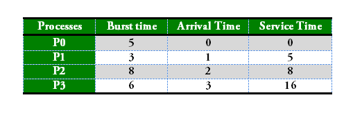
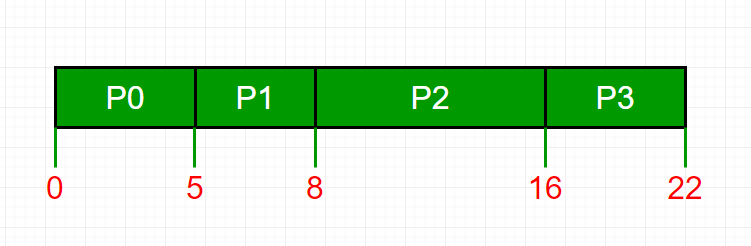
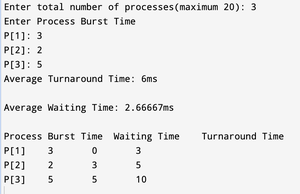

# 先来先服务（FCFS）CPU调度程序 | 第二部分（具有不同到达时间的进程）

我们已经讨论了具有相同到达时间的进程的FCFS调度。在这篇文章中，我们讨论了进程具有不同到达时间的场景。给定n个进程，以及它们的执行时间和到达时间，任务是使用FCFS（先来先服务）调度算法找到平均等待时间和平均周转时间。

FIFO（先进先出）简单地根据它们到达就绪队列的顺序对进程进行排队。在这里，先到的进程将首先被执行，下一个进程只有在前一个进程完全执行完毕后才开始。

1. **完成时间（Completion Time）**：进程完成执行的时间。
2. **周转时间（Turn Around Time）**：完成时间和到达时间的时间差。周转时间 = 完成时间 - 到达时间
3. **等待时间（Waiting Time, W.T）**：周转时间和执行时间的时间差。

等待时间 = 周转时间 - 执行时间。

 



```
进程     等待时间 : 服务时间 - 到达时间
   P0                        0 - 0   = 0
   P1                        5 - 1   = 4
   P2                        8 - 2   = 6
   P3                        16 - 3  = 13
平均等待时间: (0 + 4 + 6 + 13) / 4 = 5.75
```

**服务时间（Service Time）**：也称为执行时间，这是一个进程完成其在CPU上的执行所需的时间。它表示CPU执行该特定进程的指令所花费的时间。

**等待时间**：它指的是一个进程在就绪队列中等待，直到它有机会在CPU上执行的总时间。

> **与具有相同到达时间的FCFS代码相比的代码变化**：计算等待时间：当前进程之前所有进程开始执行所需的时间（即所有前一个进程的执行时间） - 当前进程的到达时间
>
> **wait\_time\[i\] = (bt\[0\] + bt\[1\] +…… bt\[i-1\] ) – arrival\_time\[i\]**

**实现：**

```
1- 输入进程及其执行时间(bt)和到达时间(at)
2- 计算所有其他进程的等待时间，即对于给定的进程i：
       wt[i] = (bt[0] + bt[1] +...... bt[i-1]) - at[i]
3- 现在计算周转时间
          = 等待时间 + 执行时间，对所有进程
4- 平均等待时间 =
                   总等待时间 / 进程数
5- 平均周转时间 =
                总周转时间 / 进程数
```

**示例1：**

::: code-group

```cpp [C++]
//Process Synced, dynamic input, c++ easy to understand code 
#include<iostream> 
#include<stdlib.h> 
using namespace std; 
//class process with all the time values and functions 
class Process{ 
	int id, bt, at, ct, tat, wt; 
	public: 
	void input(Process*,int ); 
	void calc(Process *,int); 
	void show(Process*,int); 
	void sort(Process *, int); 
}; 
//main function 
int main(){ 
	int n; 
	cout<<"\nEnter the no of processes in your system:\n"; 
	cin>>n; 
	Process *p = new Process[n]; 
	Process f; 
	f.input(p,n); 
	f.sort(p, n); 
	f.calc(p,n); 
	f.show(p,n); 
	return 0; 
} 
//taking input arrival and burst times for all processes 
void Process::input(Process *p,int n){ 
	for(int i = 0;i<n;i++){ 
		cout<<"\nEnter pival time for process "<<i+1<<":\n"; 
		cin>>p[i].at; 
		cout<<"\nEnter burst time for process "<<i+1<<":\n"; 
		cin>>p[i].bt; 
		p[i].id = i+1; 
	} 
} 
//calculating waiting, turn-around and completion time 
void Process::calc(Process*p, int n){ 
	int sum = 0; 
	sum = sum + p[0].at; 
	for(int i = 0;i<n;i++){ 
		sum = sum + p[i].bt; 
		p[i].ct = sum; 
		p[i].tat = p[i].ct - p[i].at; 
		p[i].wt = p[i].tat - p[i].bt; 
		if(sum<p[i+1].at){ 
			int t = p[i+1].at-sum; 
			sum = sum+t; 
		} 
	} 
} 
//Sorting processes with respect to arrival times (needed for synchronized input) 
void Process::sort(Process*p, int n){ 
	for(int i=0;i<n-1;i++){ 
		for(int j=0;j<n-i-1;j++){ 
			if(p[j].at>p[j+1].at){ 
				int temp; 
				//sorting burst times 
				temp = p[j].bt; 
				p[j].bt = p[j+1].bt; 
				p[j+1].bt = temp; 
				//sorting arrival times 
				temp = p[j].at; 
				p[j].at = p[j+1].at; 
				p[j+1].at = temp; 
				//sorting their respective IDs 
				temp = p[j].id; 
				p[j].id = p[j+1].id; 
				p[j+1].id = temp; 
			} 
		} 
	} 
} 
//display function 
void Process::show(Process*p, int n){ 
	cout<<"Process\tArrival\tBurst\tWaiting\tTurn Around\tCompletion\n"; 
	for(int i =0;i<n;i++){ 
		cout<<" P["<<p[i].id<<"]\t "<<p[i].at<<"\t"<<p[i].bt<<"\t"<<p[i].wt<<"\t "<<p[i].tat<<"\t\t"<<p[i].ct<<"\n"; 
	} 
}

```

```java [Java]
// Java program for implementation of FCFS 
// scheduling with different arrival time 
public class GFG{ 


// Function to find the waiting time for all 
// processes 
static void findWaitingTime(int processes[], int n, int bt[], int wt[], int at[]) 
{ 
	int service_time[] = new int[n]; 
	service_time[0] = at[0]; 
	wt[0] = 0; 

	// calculating waiting time 
	for (int i = 1; i < n ; i++) 
	{ 
		//representing wasted time in queue 
		int wasted=0; 
		// Add burst time of previous processes 
		service_time[i] = service_time[i-1] + bt[i-1]; 

		// Find waiting time for current process = 
		// sum - at[i] 
		wt[i] = service_time[i] - at[i]; 

		// If waiting time for a process is in negative 
		// that means it is already in the ready queue 
		// before CPU becomes idle so its waiting time is 0 
		// wasted time is basically time for process to wait after a process is over 
		if (wt[i] < 0) { 
			wasted = Math.abs(wt[i]); 
			wt[i] = 0; 
		} 
		//Add wasted time 
		service_time[i] = service_time[i] + wasted; 
	} 
} 

// Function to calculate turn around time 
static void findTurnAroundTime(int processes[], int n, int bt[], 
									int wt[], int tat[]) 
{ 
	// Calculating turnaround time by adding bt[i] + wt[i] 
	for (int i = 0; i < n ; i++) 
		tat[i] = bt[i] + wt[i]; 
} 

// Function to calculate average waiting and turn-around 
// times. 
static void findavgTime(int processes[], int n, int bt[], int at[]) 
{ 
	int wt[] = new int[n], tat[] = new int[n]; 

	// Function to find waiting time of all processes 
	findWaitingTime(processes, n, bt, wt, at); 

	// Function to find turn around time for all processes 
	findTurnAroundTime(processes, n, bt, wt, tat); 

	// Display processes along with all details 
	System.out.print("Processes " + " Burst Time " + " Arrival Time "
		+ " Waiting Time " + " Turn-Around Time "
		+ " Completion Time \n"); 
	int total_wt = 0, total_tat = 0; 
	for (int i = 0 ; i < n ; i++) 
	{ 
		total_wt = total_wt + wt[i]; 
		total_tat = total_tat + tat[i]; 
		int compl_time = tat[i] + at[i]; 
		System.out.println(i+1 + "\t\t" + bt[i] + "\t\t"
			+ at[i] + "\t\t" + wt[i] + "\t\t "
			+ tat[i] + "\t\t " + compl_time); 
	} 

	System.out.print("Average waiting time = "
		+ (float)total_wt / (float)n); 
	System.out.print("\nAverage turn around time = "
		+ (float)total_tat / (float)n); 
} 

// Driver code 

	public static void main(String args[]) { 
		// Process id's 
	int processes[] = {1, 2, 3}; 
	int n = processes.length; 

	// Burst time of all processes 
	int burst_time[] = {5, 9, 6}; 

	// Arrival time of all processes 
	int arrival_time[] = {0, 3, 6}; 

	findavgTime(processes, n, burst_time, arrival_time); 

	} 
} 

/*This code is contributed by PrinciRaj1992*/

```
```py [Python3]
# Python3 program for implementation of FCFS 
# scheduling with different arrival time 

# Function to find the waiting time 
# for all processes 
def findWaitingTime(processes, n, bt, wt, at): 
	service_time = [0] * n 
	service_time[0] = 0
	wt[0] = 0

	# calculating waiting time 
	for i in range(1, n): 
		
		# Add burst time of previous processes 
		service_time[i] = (service_time[i - 1] +
									bt[i - 1]) 

		# Find waiting time for current 
		# process = sum - at[i] 
		wt[i] = service_time[i] - at[i] 

		# If waiting time for a process is in 
		# negative that means it is already 
		# in the ready queue before CPU becomes 
		# idle so its waiting time is 0 
		if (wt[i] < 0): 
			wt[i] = 0
	
# Function to calculate turn around time 
def findTurnAroundTime(processes, n, bt, wt, tat): 
	
	# Calculating turnaround time by 
	# adding bt[i] + wt[i] 
	for i in range(n): 
		tat[i] = bt[i] + wt[i] 


# Function to calculate average waiting 
# and turn-around times. 
def findavgTime(processes, n, bt, at): 
	wt = [0] * n 
	tat = [0] * n 

	# Function to find waiting time 
	# of all processes 
	findWaitingTime(processes, n, bt, wt, at) 

	# Function to find turn around time for 
	# all processes 
	findTurnAroundTime(processes, n, bt, wt, tat) 

	# Display processes along with all details 
	print("Processes Burst Time Arrival Time	 Waiting", 
		"Time Turn-Around Time Completion Time \n") 
	total_wt = 0
	total_tat = 0
	for i in range(n): 

		total_wt = total_wt + wt[i] 
		total_tat = total_tat + tat[i] 
		compl_time = tat[i] + at[i] 
		print(" ", i + 1, "\t\t", bt[i], "\t\t", at[i], 
			"\t\t", wt[i], "\t\t ", tat[i], "\t\t ", compl_time) 

	print("Average waiting time = %.5f "%(total_wt /n)) 
	print("\nAverage turn around time = ", total_tat / n) 

# Driver code 
if __name__ =="__main__": 
	
	# Process id's 
	processes = [1, 2, 3] 
	n = 3

	# Burst time of all processes 
	burst_time = [5, 9, 6] 

	# Arrival time of all processes 
	arrival_time = [0, 3, 6] 

	findavgTime(processes, n, burst_time, 
							arrival_time) 

# This code is contributed 
# Shubham Singh(SHUBHAMSINGH10) 

```
```c# [C#]
// C# program for implementation of FCFS 
// scheduling with different arrival time 
using System; 
	
public class GFG{ 


// Function to find the waiting time for all 
// processes 
static void findWaitingTime(int []processes, int n, int []bt, int []wt, int []at) 
{ 
	int []service_time = new int[n]; 
	service_time[0] = 0; 
	wt[0] = 0; 

	// calculating waiting time 
	for (int i = 1; i < n ; i++) 
	{ 
		// Add burst time of previous processes 
		service_time[i] = service_time[i-1] + bt[i-1]; 

		// Find waiting time for current process = 
		// sum - at[i] 
		wt[i] = service_time[i] - at[i]; 

		// If waiting time for a process is in negative 
		// that means it is already in the ready queue 
		// before CPU becomes idle so its waiting time is 0 
		if (wt[i] < 0) 
			wt[i] = 0; 
	} 
} 

// Function to calculate turn around time 
static void findTurnAroundTime(int []processes, int n, int[] bt, 
									int []wt, int[] tat) 
{ 
	// Calculating turnaround time by adding bt[i] + wt[i] 
	for (int i = 0; i < n ; i++) 
		tat[i] = bt[i] + wt[i]; 
} 

// Function to calculate average waiting and turn-around 
// times. 
static void findavgTime(int []processes, int n, int []bt, int []at) 
{ 
	int []wt = new int[n]; int []tat = new int[n]; 

	// Function to find waiting time of all processes 
	findWaitingTime(processes, n, bt, wt, at); 

	// Function to find turn around time for all processes 
	findTurnAroundTime(processes, n, bt, wt, tat); 

	// Display processes along with all details 
	Console.Write("Processes " + " Burst Time " + " Arrival Time "
		+ " Waiting Time " + " Turn-Around Time "
		+ " Completion Time \n"); 
	int total_wt = 0, total_tat = 0; 
	for (int i = 0 ; i < n ; i++) 
	{ 
		total_wt = total_wt + wt[i]; 
		total_tat = total_tat + tat[i]; 
		int compl_time = tat[i] + at[i]; 
		Console.WriteLine(i+1 + "\t\t" + bt[i] + "\t\t"
			+ at[i] + "\t\t" + wt[i] + "\t\t "
			+ tat[i] + "\t\t " + compl_time); 
	} 

	Console.Write("Average waiting time = "
		+ (float)total_wt / (float)n); 
	Console.Write("\nAverage turn around time = "
		+ (float)total_tat / (float)n); 
} 

// Driver code 

	public static void Main(String []args) { 
		// Process id's 
	int []processes = {1, 2, 3}; 
	int n = processes.Length; 

	// Burst time of all processes 
	int []burst_time = {5, 9, 6}; 

	// Arrival time of all processes 
	int []arrival_time = {0, 3, 6}; 

	findavgTime(processes, n, burst_time, arrival_time); 

	} 
} 
// This code is contributed by Princi Singh 

```
```js [Javascript]
<script> 

// JavaScript program for implementation of FCFS 
// scheduling with different arrival time 

// Function to find the waiting time for all 
// processes 
function findWaitingTime(processes , n , bt , wt , at) 
{ 
	var service_time = Array.from({length: n}, (_, i) => 0); 
	service_time[0] = at[0]; 
	wt[0] = 0; 

	// calculating waiting time 
	for (var i = 1; i < n ; i++) 
	{ 
		//representing wasted time in queue 
		var wasted=0; 
		// Add burst time of previous processes 
		service_time[i] = service_time[i-1] + bt[i-1]; 

		// Find waiting time for current process = 
		// sum - at[i] 
		wt[i] = service_time[i] - at[i]; 

		// If waiting time for a process is in negative 
		// that means it is already in the ready queue 
		// before CPU becomes idle so its waiting time is 0 
		// wasted time is basically time for process to 
		// wait after a process is over 
		if (wt[i] < 0) { 
			wasted = Math.abs(wt[i]); 
			wt[i] = 0; 
		} 
		// Add wasted time 
		service_time[i] = service_time[i] + wasted; 
	} 
} 

// Function to calculate turn around time 
function findTurnAroundTime(processes , n , bt, wt , tat) 
{ 
	// Calculating turnaround time by adding bt[i] + wt[i] 
	for (var i = 0; i < n ; i++) 
		tat[i] = bt[i] + wt[i]; 
} 

// Function to calculate average waiting and turn-around 
// times. 
function findavgTime(processes , n , bt , at) 
{ 
	var wt = Array.from({length: n}, (_, i) => 0.0); 
	var tat = Array.from({length: n}, (_, i) => 0.0); 

	// Function to find waiting time of all processes 
	findWaitingTime(processes, n, bt, wt, at); 

	// Function to find turn around time for all processes 
	findTurnAroundTime(processes, n, bt, wt, tat); 

	// Display processes along with all details 
	document.write("Processes " + " Burst Time " + " Arrival Time "
		+ " Waiting Time " + " Turn-Around Time "
		+ " Completion Time <br>"); 
	var total_wt = 0, total_tat = 0; 
	for (var i = 0 ; i < n ; i++) 
	{ 
		total_wt = total_wt + wt[i]; 
		total_tat = total_tat + tat[i]; 
		var compl_time = tat[i] + at[i]; 
		document.write(i+1 + "??" + bt[i] 
		+ "??"
			+ at[i] + "??" + wt[i] + "??"
			+ tat[i] + "??" + compl_time+"<br>"); 
	} 

	document.write("<br>Average waiting time = "
		+ total_wt/n +"<br>"); 
	document.write("<br>Average turn around time = "
		+ total_tat/n+"<br>"); 
} 

// Driver code 

		
	// Process id's 
var processes = [1, 2, 3]; 
var n = processes.length; 

// Burst time of all processes 
var burst_time = [5, 9, 6]; 

// Arrival time of all processes 
var arrival_time = [0, 3, 6]; 

findavgTime(processes, n, burst_time, arrival_time); 


// This code is contributed by 29AjayKumar 

</script>

```
:::

**输出：**

```
Processes  Burst Time  Arrival Time  Waiting Time  Turn-Around Time  Completion Time
 1        5        0        0         5         5
 2        9        3        2         11         14
 3        6        6        8         14         20
Average waiting time = 3.33333
Average turn around time = 10.0
```

在这些程序中，用户被要求输入进程数量及其各自的执行时间。然后，程序计算每个进程的等待时间和周转时间，并输出平均等待时间和平均周转时间。最后，程序显示一个表格，显示每个进程的详细信息。

**示例2：**

::: 示例2

```cpp [C++]
#include<iostream> 
using namespace std; 

int main() 
{ 
	int n, burst_time[20], waiting_time[20], turnaround_time[20]; 
	float avg_waiting_time = 0, avg_turnaround_time = 0; 

	cout<<"Enter total number of processes(maximum 20): "; 
	cin>>n; 

	cout<<"\nEnter Process Burst Time\n"; 
	for(int i=0;i<n;i++) 
	{ 
		cout<<"P["<<i+1<<"]: "; 
		cin>>burst_time[i]; 
	} 

	waiting_time[0] = 0; // Waiting time for first process is 0 

	// Calculating waiting time 
	for(int i=1;i<n;i++) 
	{ 
		waiting_time[i] = 0; 
		for(int j=0;j<i;j++) 
		{ 
			waiting_time[i] += burst_time[j]; 
		} 
	} 

	// Calculating turnaround time by adding burst_time and waiting_time 
	for(int i=0;i<n;i++) 
	{ 
		turnaround_time[i] = burst_time[i] + waiting_time[i]; 
		avg_turnaround_time += turnaround_time[i]; 
	} 

	avg_turnaround_time /= n; 
	cout<<"\nAverage Turnaround Time: "<<avg_turnaround_time<<"ms\n"; 

	// Calculating average waiting time 
	for(int i=0;i<n;i++) 
	{ 
		avg_waiting_time += waiting_time[i]; 
	} 

	avg_waiting_time /= n; 
	cout<<"\nAverage Waiting Time: "<<avg_waiting_time<<"ms\n\n"; 

	cout<<"Process\tBurst Time\tWaiting Time\tTurnaround Time\n"; 
	for(int i=0;i<n;i++) 
	{ 
		cout<<"P["<<i+1<<"]\t"<<burst_time[i]<<"\t\t"<<waiting_time[i]<<"\t\t"<<turnaround_time[i]<<endl; 
	} 

	return 0; 
} 

```

```java [Java]
import java.util.Scanner; 

public class ProcessScheduling { 

	public static void main(String[] args) { 
		int n, burst_time[], waiting_time[], turnaround_time[]; 
		float avg_waiting_time = 0, avg_turnaround_time = 0; 

		Scanner sc = new Scanner(System.in); 
		System.out.print("Enter total number of processes (maximum 20): "); 
		n = sc.nextInt(); 
		burst_time = new int[n]; 
		waiting_time = new int[n]; 
		turnaround_time = new int[n]; 

		System.out.println("\nEnter Process Burst Time"); 
		for (int i = 0; i < n; i++) { 
			System.out.print("P[" + (i+1) + "]: "); 
			burst_time[i] = sc.nextInt(); 
		} 

		waiting_time[0] = 0; // Waiting time for first process is 0 

		// Calculating waiting time 
		for (int i = 1; i < n; i++) { 
			waiting_time[i] = 0; 
			for (int j = 0; j < i; j++) { 
				waiting_time[i] += burst_time[j]; 
			} 
		} 

		// Calculating turnaround time by adding burst_time and waiting_time 
		for (int i = 0; i < n; i++) { 
			turnaround_time[i] = burst_time[i] + waiting_time[i]; 
			avg_turnaround_time += turnaround_time[i]; 
		} 

		avg_turnaround_time /= n; 
		System.out.println("\nAverage Turnaround Time: " + avg_turnaround_time + "ms"); 

		// Calculating average waiting time 
		for (int i = 0; i < n; i++) { 
			avg_waiting_time += waiting_time[i]; 
		} 

		avg_waiting_time /= n; 
		System.out.println("\nAverage Waiting Time: " + avg_waiting_time + "ms\n"); 

		System.out.println("Process\tBurst Time\tWaiting Time\tTurnaround Time"); 
		for (int i = 0; i < n; i++) { 
			System.out.println("P[" + (i+1) + "]\t" + burst_time[i] + "\t\t" + waiting_time[i] + "\t\t" + turnaround_time[i]); 
		} 

		sc.close(); 
	} 

} 

```
```py [Python3]
# Python program to calculate 
# waiting time, turnaround time, 
# and average waiting time and 
# turnaround time of a process 

# Function to calculate waiting time, 
# turnaround time and average waiting time 
# and turnaround time of a process 
def calculateTime(n, burst_time): 
	waiting_time = [0] * n 
	turnaround_time = [0] * n 
	avg_waiting_time = 0
	avg_turnaround_time = 0

	waiting_time[0] = 0 # Waiting time for first process is 0 

	# Calculating waiting time 
	for i in range(1, n): 
		waiting_time[i] = 0
		for j in range(i): 
			waiting_time[i] += burst_time[j] 

	# Calculating turnaround time by adding burst_time and waiting_time 
	for i in range(n): 
		turnaround_time[i] = burst_time[i] + waiting_time[i] 
		avg_turnaround_time += turnaround_time[i] 

	avg_turnaround_time /= n 
	print(f"\nAverage Turnaround Time: {avg_turnaround_time}ms") 

	# Calculating average waiting time 
	for i in range(n): 
		avg_waiting_time += waiting_time[i] 

	avg_waiting_time /= n 
	print(f"\nAverage Waiting Time: {avg_waiting_time}ms\n") 

	print("Process\tBurst Time\tWaiting Time\tTurnaround Time") 
	for i in range(n): 
		print(f"P[{i+1}]\t{burst_time[i]}\t\t{waiting_time[i]}\t\t{turnaround_time[i]}") 

# Driver code 
if __name__ == '__main__': 
	n = int(input("Enter total number of processes(maximum 20): ")) 

	burst_time = [] 
	print("\nEnter Process Burst Time") 
	for i in range(n): 
		burst_time.append(int(input(f"P[{i+1}]: "))) 

	calculateTime(n, burst_time) 

```
```c# [C#]
using System; 

class Program { 
	static void Main(string[] args) 
	{ 
		int n; 
		int[] burst_time = new int[20]; 
		int[] waiting_time = new int[20]; 
		int[] turnaround_time = new int[20]; 
		float avg_waiting_time = 0; 
		float avg_turnaround_time = 0; 

		Console.Write( 
			"Enter total number of processes(maximum 20): "); 
		n = Convert.ToInt32(Console.ReadLine()); 

		Console.WriteLine("\nEnter Process Burst Time"); 
		for (int i = 0; i < n; i++) { 
			Console.Write("P[" + (i + 1) + "]: "); 
			burst_time[i] 
				= Convert.ToInt32(Console.ReadLine()); 
		} 

		waiting_time[0] 
			= 0; // Waiting time for first process is 0 

		// Calculating waiting time 
		for (int i = 1; i < n; i++) { 
			waiting_time[i] = 0; 
			for (int j = 0; j < i; j++) { 
				waiting_time[i] += burst_time[j]; 
			} 
		} 

		// Calculating turnaround time by adding burst_time 
		// and waiting_time 
		for (int i = 0; i < n; i++) { 
			turnaround_time[i] 
				= burst_time[i] + waiting_time[i]; 
			avg_turnaround_time += turnaround_time[i]; 
		} 

		avg_turnaround_time /= n; 
		Console.WriteLine("\nAverage Turnaround Time: "
						+ avg_turnaround_time + "ms\n"); 

		// Calculating average waiting time 
		for (int i = 0; i < n; i++) { 
			avg_waiting_time += waiting_time[i]; 
		} 

		avg_waiting_time /= n; 
		Console.WriteLine("\nAverage Waiting Time: "
						+ avg_waiting_time + "ms\n\n"); 

		Console.WriteLine( 
			"Process\tBurst Time\tWaiting Time\tTurnaround Time"); 
		for (int i = 0; i < n; i++) { 
			Console.WriteLine("P[" + (i + 1) + "]\t"
							+ burst_time[i] + "\t\t"
							+ waiting_time[i] + "\t\t"
							+ turnaround_time[i]); 
		} 
	} 
}

```
```js [Javascript]
let n, burst_time = [], waiting_time = [], turnaround_time = []; 
let avg_waiting_time = 0, avg_turnaround_time = 0; 

n = prompt("Enter total number of processes(maximum 20): "); 

console.log("\nEnter Process Burst Time\n"); 
for (let i = 0; i < n; i++) { 
	burst_time[i] = prompt(`P[${i + 1}]: `); 
} 

waiting_time[0] = 0; // Waiting time for first process is 0 

// Calculating waiting time 
for (let i = 1; i < n; i++) { 
	waiting_time[i] = 0; 
	for (let j = 0; j < i; j++) { 
		waiting_time[i] += parseInt(burst_time[j]); 
	} 
} 

// Calculating turnaround time by adding burst_time and waiting_time 
for (let i = 0; i < n; i++) { 
	turnaround_time[i] = parseInt(burst_time[i]) + parseInt(waiting_time[i]); 
	avg_turnaround_time += turnaround_time[i]; 
} 

avg_turnaround_time /= n; 
console.log(`\nAverage Turnaround Time: ${avg_turnaround_time}ms\n`); 

// Calculating average waiting time 
for (let i = 0; i < n; i++) { 
	avg_waiting_time += waiting_time[i]; 
} 

avg_waiting_time /= n; 
console.log(`\nAverage Waiting Time: ${avg_waiting_time}ms\n\n`); 

console.log("Process\tBurst Time\tWaiting Time\tTurnaround Time\n"); 
for (let i = 0; i < n; i++) { 
	console.log(`P[${i + 1}]\t${burst_time[i]}\t\t${waiting_time[i]}\t\t${turnaround_time[i]}`); 
}

```
:::

**输出：**



在此程序中，用户需要输入进程数及其各自的突发时间。然后，程序计算每个流程的等待时间和周转时间，并输出平均等待时间和平均周转时间。最后，程序会显示一个表格，其中显示了每个进程的详细信息。