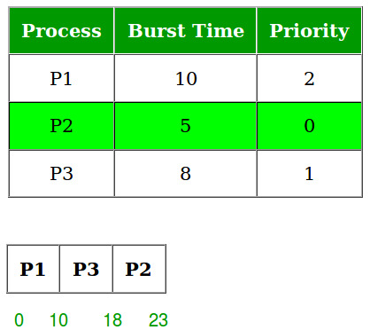

# 优先级CPU调度程序 | 第1部分

优先级调度是在批处理系统中最常见的调度算法之一。每个进程都被分配一个优先级。优先级最高的进程首先被执行，以此类推。具有相同优先级的进程按先来先服务的顺序执行。优先级可以根据内存需求、时间需求或任何其他资源需求来决定。优先级也可以根据平均I/O与平均CPU突发时间的比率来决定。

**实现步骤：**

1. 首先输入进程及其突发时间和优先级。
2. 根据优先级对进程、突发时间和优先级进行排序。
3. 现在简单地应用先来先服务（FCFS）算法。



> **注意：** 优先级调度的一个主要问题是不确定的阻塞或饥饿。解决低优先级进程不确定阻塞问题的解决方案是老化。老化是一种技术，逐渐增加在系统中等待很长时间的进程的优先级。

::: code-group
```cpp [C++]
// C++ program for implementation of FCFS 
// scheduling 
#include <bits/stdc++.h> 
using namespace std; 

struct Process { 
	int pid; // Process ID 
	int bt; // CPU Burst time required 
	int priority; // Priority of this process 
}; 

// Function to sort the Process acc. to priority 
bool comparison(Process a, Process b) 
{ 
	return (a.priority > b.priority); 
} 

// Function to find the waiting time for all 
// processes 
void findWaitingTime(Process proc[], int n, int wt[]) 
{ 
	// waiting time for first process is 0 
	wt[0] = 0; 

	// calculating waiting time 
	for (int i = 1; i < n; i++) 
		wt[i] = proc[i - 1].bt + wt[i - 1]; 
} 

// Function to calculate turn around time 
void findTurnAroundTime(Process proc[], int n, int wt[], 
						int tat[]) 
{ 
	// calculating turnaround time by adding 
	// bt[i] + wt[i] 
	for (int i = 0; i < n; i++) 
		tat[i] = proc[i].bt + wt[i]; 
} 

// Function to calculate average time 
void findavgTime(Process proc[], int n) 
{ 
	int wt[n], tat[n], total_wt = 0, total_tat = 0; 

	// Function to find waiting time of all processes 
	findWaitingTime(proc, n, wt); 

	// Function to find turn around time for all processes 
	findTurnAroundTime(proc, n, wt, tat); 

	// Display processes along with all details 
	cout << "\nProcesses "
		<< " Burst time "
		<< " Waiting time "
		<< " Turn around time\n"; 

	// Calculate total waiting time and total turn 
	// around time 
	for (int i = 0; i < n; i++) { 
		total_wt = total_wt + wt[i]; 
		total_tat = total_tat + tat[i]; 
		cout << " " << proc[i].pid << "\t\t" << proc[i].bt 
			<< "\t " << wt[i] << "\t\t " << tat[i] 
			<< endl; 
	} 

	cout << "\nAverage waiting time = "
		<< (float)total_wt / (float)n; 
	cout << "\nAverage turn around time = "
		<< (float)total_tat / (float)n; 
} 

void priorityScheduling(Process proc[], int n) 
{ 
	// Sort processes by priority 
	sort(proc, proc + n, comparison); 

	cout << "Order in which processes gets executed \n"; 
	for (int i = 0; i < n; i++) 
		cout << proc[i].pid << " "; 

	findavgTime(proc, n); 
} 

// Driver code 
int main() 
{ 
	Process proc[] 
		= { { 1, 10, 2 }, { 2, 5, 0 }, { 3, 8, 1 } }; 
	int n = sizeof proc / sizeof proc[0]; 
	priorityScheduling(proc, n); 
	return 0; 
}

```
```java [Java]
// Java program for implementation of FCFS 
// scheduling 
import java.util.*; 

class Process { 
	int pid; // Process ID 
	int bt; // CPU Burst time required 
	int priority; // Priority of this process 
	Process(int pid, int bt, int priority) 
	{ 
		this.pid = pid; 
		this.bt = bt; 
		this.priority = priority; 
	} 
	public int prior() { return priority; } 
} 

public class GFG { 

	// Function to find the waiting time for all 
	// processes 
	public void findWaitingTime(Process proc[], int n, 
								int wt[]) 
	{ 

		// waiting time for first process is 0 
		wt[0] = 0; 

		// calculating waiting time 
		for (int i = 1; i < n; i++) 
			wt[i] = proc[i - 1].bt + wt[i - 1]; 
	} 

	// Function to calculate turn around time 
	public void findTurnAroundTime(Process proc[], int n, 
								int wt[], int tat[]) 
	{ 
		// calculating turnaround time by adding 
		// bt[i] + wt[i] 
		for (int i = 0; i < n; i++) 
			tat[i] = proc[i].bt + wt[i]; 
	} 

	// Function to calculate average time 
	public void findavgTime(Process proc[], int n) 
	{ 
		int wt[] = new int[n], tat[] = new int[n], 
			total_wt = 0, total_tat = 0; 

		// Function to find waiting time of all processes 
		findWaitingTime(proc, n, wt); 

		// Function to find turn around time for all 
		// processes 
		findTurnAroundTime(proc, n, wt, tat); 

		// Display processes along with all details 
		System.out.print( 
			"\nProcesses Burst time Waiting time Turn around time\n"); 

		// Calculate total waiting time and total turn 
		// around time 
		for (int i = 0; i < n; i++) { 
			total_wt = total_wt + wt[i]; 
			total_tat = total_tat + tat[i]; 
			System.out.print(" " + proc[i].pid + "\t\t"
							+ proc[i].bt + "\t " + wt[i] 
							+ "\t\t " + tat[i] + "\n"); 
		} 

		System.out.print("\nAverage waiting time = "
						+ (float)total_wt / (float)n); 
		System.out.print("\nAverage turn around time = "
						+ (float)total_tat / (float)n); 
	} 

	public void priorityScheduling(Process proc[], int n) 
	{ 

		// Sort processes by priority 
		Arrays.sort(proc, new Comparator<Process>() { 
			@Override
			public int compare(Process a, Process b) 
			{ 
				return b.prior() - a.prior(); 
			} 
		}); 
		System.out.print( 
			"Order in which processes gets executed \n"); 
		for (int i = 0; i < n; i++) 
			System.out.print(proc[i].pid + " "); 

		findavgTime(proc, n); 
	} 

	// Driver code 
	public static void main(String[] args) 
	{ 
		GFG ob = new GFG(); 
		int n = 3; 
		Process proc[] = new Process[n]; 
		proc[0] = new Process(1, 10, 2); 
		proc[1] = new Process(2, 5, 0); 
		proc[2] = new Process(3, 8, 1); 
		ob.priorityScheduling(proc, n); 
	} 
} 

// This code is contributed by rahulpatil07109.

```
```python [Python3]
# Python3 program for implementation of 
# Priority Scheduling 

# Function to find the waiting time 
# for all processes 


def findWaitingTime(processes, n, wt): 
	wt[0] = 0

	# calculating waiting time 
	for i in range(1, n): 
		wt[i] = processes[i - 1][1] + wt[i - 1] 

# Function to calculate turn around time 


def findTurnAroundTime(processes, n, wt, tat): 

	# Calculating turnaround time by 
	# adding bt[i] + wt[i] 
	for i in range(n): 
		tat[i] = processes[i][1] + wt[i] 

# Function to calculate average waiting 
# and turn-around times. 


def findavgTime(processes, n): 
	wt = [0] * n 
	tat = [0] * n 

	# Function to find waiting time 
	# of all processes 
	findWaitingTime(processes, n, wt) 

	# Function to find turn around time 
	# for all processes 
	findTurnAroundTime(processes, n, wt, tat) 

	# Display processes along with all details 
	print("\nProcesses Burst Time Waiting", 
		"Time Turn-Around Time") 
	total_wt = 0
	total_tat = 0
	for i in range(n): 

		total_wt = total_wt + wt[i] 
		total_tat = total_tat + tat[i] 
		print(" ", processes[i][0], "\t\t", 
			processes[i][1], "\t\t", 
			wt[i], "\t\t", tat[i]) 

	print("\nAverage waiting time = %.5f " % (total_wt / n)) 
	print("Average turn around time = ", total_tat / n) 


def priorityScheduling(proc, n): 

	# Sort processes by priority 
	proc = sorted(proc, key=lambda proc: proc[2], 
				reverse=True) 

	print("Order in which processes gets executed") 
	for i in proc: 
		print(i[0], end=" ") 
	findavgTime(proc, n) 


# Driver code 
if __name__ == "__main__": 

	# Process id's 
	proc = [[1, 10, 1], 
			[2, 5, 0], 
			[3, 8, 1]] 
	n = 3
	priorityScheduling(proc, n) 

# This code is contributed 
# Shubham Singh(SHUBHAMSINGH10) 

```
```javascript [Javascript]
// JavaScript program for implementation of Priority Scheduling 
class Process { 
	constructor(pid, bt, priority) { 
		this.pid = pid; // Process ID 
		this.bt = bt; // CPU Burst time required 
		this.priority = priority; // Priority of this process 
	} 

	prior() { 
		return this.priority; 
	} 
} 

class GFG { 
	// Function to find the waiting time for all processes 
	findWaitingTime(proc, n, wt) { 
		// waiting time for first process is 0 
		wt[0] = 0; 
		// calculating waiting time 
		for (let i = 1; i < n; i++) { 
			wt[i] = proc[i - 1].bt + wt[i - 1]; 
		} 
	} 

	// Function to calculate turn around time 
	findTurnAroundTime(proc, n, wt, tat) { 
		// calculating turnaround time by adding bt[i] + wt[i] 
		for (let i = 0; i < n; i++) { 
			tat[i] = proc[i].bt + wt[i]; 
		} 
	} 

	// Function to calculate average time 
	findavgTime(proc, n) { 
		let wt = new Array(n); 
		let tat = new Array(n); 
		let total_wt = 0; 
		let total_tat = 0; 
		// Function to find waiting time of all processes 
		this.findWaitingTime(proc, n, wt); 

		// Function to find turn around time for all processes 
		this.findTurnAroundTime(proc, n, wt, tat); 

		// Display processes along with all details 
		console.log("Processes Burst time Waiting time Turn around time"); 

		// Calculate total waiting time and total turn around time 
		for (let i = 0; i < n; i++) { 
			total_wt = total_wt + wt[i]; 
			total_tat = total_tat + tat[i]; 
			console.log( 
				" " + proc[i].pid + "\t\t" + proc[i].bt + "\t " + wt[i] + "\t\t " + tat[i] 
			); 
		} 

		console.log( 
			"Average waiting time = " + total_wt / n 
		); 
		console.log( 
			"Average turn around time = " + total_tat / n 
		); 
	} 

	priorityScheduling(proc, n) { 
		// Sort processes by priority 
		proc.sort((a, b) => b.prior() - a.prior()); 
		console.log("Order in which processes get executed:"); 
		for (let i = 0; i < n; i++) { 
			console.log(proc[i].pid + " "); 
		} 

		this.findavgTime(proc, n); 
	} 
} 

// Driver code 
let ob = new GFG(); 
let n = 3; 
let proc = []; 
proc[0] = new Process(1, 10, 2); 
proc[1] = new Process(2, 5, 0); 
proc[2] = new Process(3, 8, 1); 
ob.priorityScheduling(proc, n); 
//This code is Contributed by chinmaya121221

```
```csharp [C#]
using System; 
using System.Collections.Generic; 

class Process 
{ 
public int pid; // Process ID 
	public int bt; // CPU Burst time required 
	public int priority; // Priority of this process 
public Process(int pid, int bt, int priority) 
{ 
	this.pid = pid; 
	this.bt = bt; 
	this.priority = priority; 
} 

public int Prior 
{ 
	get { return priority; } 
} 
} 

class GFG 
{ 
// Function to find the waiting time for all processes 
public void findWaitingTime(Process[] proc, int n, int[] wt) 
{ 
// waiting time for first process is 0 
wt[0] = 0; 
	// calculating waiting time 
	for (int i = 1; i < n; i++) 
		wt[i] = proc[i - 1].bt + wt[i - 1]; 
} 

// Function to calculate turn around time 
public void findTurnAroundTime(Process[] proc, int n, int[] wt, int[] tat) 
{ 
	// calculating turnaround time by adding 
	// bt[i] + wt[i] 
	for (int i = 0; i < n; i++) 
		tat[i] = proc[i].bt + wt[i]; 
} 

// Function to calculate average time 
public void findavgTime(Process[] proc, int n) 
{ 
	int[] wt = new int[n]; 
	int[] tat = new int[n]; 
	int total_wt = 0; 
	int total_tat = 0; 

	// Function to find waiting time of all processes 
	findWaitingTime(proc, n, wt); 

	// Function to find turn around time for all processes 
	findTurnAroundTime(proc, n, wt, tat); 

	// Display processes along with all details 
	Console.WriteLine("\nProcesses Burst time Waiting time Turn around time"); 

	// Calculate total waiting time and total turn around time 
	for (int i = 0; i < n; i++) 
	{ 
		total_wt = total_wt + wt[i]; 
		total_tat = total_tat + tat[i]; 
		Console.WriteLine(" " + proc[i].pid + "\t\t" + proc[i].bt + "\t " + wt[i] + "\t\t " + tat[i]); 
	} 

	Console.WriteLine("\nAverage waiting time = " + (float)total_wt / (float)n); 
	Console.WriteLine("Average turn around time = " + (float)total_tat / (float)n); 
} 

public void priorityScheduling(Process[] proc, int n) 
{ 
	// Sort processes by priority 
	Array.Sort(proc, new Comparison<Process>((a, b) => b.Prior.CompareTo(a.Prior))); 
	Console.WriteLine("Order in which processes gets executed "); 

	for (int i = 0; i < n; i++) 
		Console.Write(proc[i].pid + " "); 

	findavgTime(proc, n); 
} 

// Driver code 
static void Main(string[] args) 
{ 
	GFG ob = new GFG(); 
	int n = 3; 
	Process[] proc = new Process[n]; 
	proc[0] = new Process(1, 10, 2); 
	proc[1] = new Process(2, 5, 0); 
	proc[2] = new Process(3, 8, 1); 
	ob.priorityScheduling(proc, n); 
} 
} 

```
:::
**输出：**

```
Order in which processes gets executed
1 3 2
Processes  Burst time  Waiting time  Turn around time
 1        10     0         10
 3        8     10         18
 2        5     18         23

Average waiting time = 9.33333
Average turn around time = 17
```

### 优点：

- 基于优先级的调度确保高优先级进程首先被执行，这可以导致关键任务更快完成。
- 优先级调度对于需要进程满足严格时间约束的实时系统很有用。
- 优先级调度可以减少需要大量CPU时间的进程的平均等待时间。

### 缺点：

- **优先级反转：** 当低优先级进程持有高优先级进程所需的资源时，会发生优先级反转。这可能导致高优先级进程的执行延迟。
- **饥饿：** 如果系统负载很重，且充满了高优先级进程，低优先级进程可能永远没有机会执行。
- 避免优先级反转的技术，如优先级继承或优先级上限协议，可以给系统带来额外的复杂性。
- 设置优先级可能是一项困难的任务，特别是当有许多具有不同优先级的进程时。

在这篇文章中，讨论了到达时间为0的进程。在下一篇文章中，我们将考虑不同的到达时间来评估等待时间。
       
