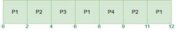
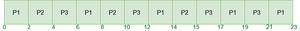

# 循环轮转调度算法程序（相同到达时间）

**循环轮转（Round Robin）** 是一种 CPU 调度算法，其中每个进程循环地被分配一个固定时间槽。它是先来先服务（First Come First Serve）CPU 调度算法的抢占版本。

- 循环轮转 CPU 算法通常关注时间共享技术。
- 在抢占方法中，允许进程或作业运行的时间段称为时间**量子**。
- 就绪队列中的每个进程或作业都被分配了 CPU 时间量子，如果在该时间段内完成了该进程的执行，则该进程将**结束**，否则该进程将返回到**等待队列**并等待下一次执行的机会。

## 循环轮转 CPU 调度算法的特点

- 它简单、易于实现，并且由于所有进程都获得公平的 CPU 分享，因此不会出现饥饿现象。
- CPU 调度中最常用的技术之一是核心。
- 它是抢占式的，因为进程最多只被分配了固定时间片的 CPU。
- 它的一个缺点是上下文切换的开销更大。

## 循环轮转 CPU 调度算法的优点

- 由于每个进程都获得平等的 CPU 分享，因此具有公平性。
- 新创建的进程被添加到就绪队列的末尾。
- 循环轮转调度通常采用时间共享，为每个作业分配一个时间槽或量子。
- 在执行循环轮转调度时，特定的时间量子被分配给不同的作业。
- 在这种调度中，每个进程在特定量子时间后都有机会重新调度。

## 循环轮转 CPU 调度算法的缺点

- 等待时间和响应时间较长。
- 吞吐量较低。
- 存在上下文切换。
- 如果量子时间较小（例如：1 毫秒的大调度），甘特图会显得过于庞大。
- 对于小量子的调度，时间消耗较大。

## 循环轮转调度算法的工作示例

**示例-1：** 考虑以下四个进程 **P1, P2, P3, 和 P4** 的到达时间和执行时间表，并给定 **时间量子 = 2**

| 进程 | 执行时间 | 到达时间 |
| --- | --- | --- |
| P1 | 5 毫秒 | 0 毫秒 |
| P2 | 4 毫秒 | 1 毫秒 |
| P3 | 2 毫秒 | 2 毫秒 |
| P4 | 1 毫秒 | 4 毫秒 |

循环轮转 CPU 调度算法将按照以下步骤工作：

**在时间 = 0 时，**

- 执行开始于进程 P1，其执行时间为 5。
- 在这里，每个进程执行 2 毫秒（**时间量子周期**）。P2 和 P3 仍在等待队列中。

| 时间实例 | 进程 | 到达时间 | 就绪队列 | 运行队列 | 执行时间 | 初始执行时间 | 剩余执行时间 |
| --- | --- | --- | --- | --- | --- | --- | --- |
| 0-2ms | P1 | 0ms | P2, P3 | P1 | 2ms | 5ms | 3ms |

**在时间 = 2 时，**

- 进程 P1 和 P3 到达就绪队列，P2 开始执行 **TQ** 周期

<table>
<tr>
<th>时间实例</th>
<th>进程</th>
<th>到达时间</th>
<th>就绪队列</th>
<th>运行队列</th>
<th>执行时间</th>
<th>初始执行时间</th>
<th>剩余执行时间</th>
</tr>
<tr>
<td rowspan="2">2 - 4ms</td>
<td>P1</td>
<td>0ms</td>
<td rowspan="2">P3, P1</td>
<td rowspan="2">P2</td>
<td>0ms</td>
<td>3ms</td>
<td>3ms</td>
</tr>
<tr>
<td>P2</td>
<td>1ms</td>
<td>2ms</td>
<td>4ms</td>
<td>2ms</td>
</tr>
</table>

**在时间 = 4 时，**

- 进程 P4 到达 **就绪队列**，
- 然后 P3 执行 **TQ** 周期。

<table>
<tr>
<th>时间实例</th>
<th>进程</th>
<th>到达时间</th>
<th>就绪队列</th>
<th>运行队列</th>
<th>执行时间</th>
<th>初始执行时间</th>
<th>剩余执行时间</th>
</tr>
<tr>
<td rowspan="3">4 - 6ms</td>
<td>P1</td>
<td>0ms</td>
<td rowspan="3">P1, P4, P2</td>
<td rowspan="3">P3</td>
<td>0ms</td>
<td>3ms</td>
<td>3ms</td>
</tr>
<tr>
<td>P2</td>
<td>1ms</td>
<td>0ms</td>
<td>2ms</td>
<td>2ms</td>
</tr>
<tr>
<td>P3</td>
<td>2ms</td>
<td>2ms</td>
<td>2ms</td>
<td>0ms</td>
</tr>
</table>

**在时间 = 6 时，**

- 进程 P3 完成执行
- 进程 P1 开始执行 **TQ** 周期，因为它在 b 中是下一个。

<table>
<tr>
<th>时间实例</th>
<th>进程</th>
<th>到达时间</th>
<th>就绪队列</th>
<th>运行队列</th>
<th>执行时间</th>
<th>初始执行时间</th>
<th>剩余执行时间</th>
</tr>
<tr>
<td  rowspan="2">6 - 8ms</td>
<td>P1</td>
<td>0ms</td>
<td rowspan="2">P4, P2</td>
<td rowspan="2">P1</td>
<td>2ms</td>
<td>3ms</td>
<td>1ms</td>
</tr>
<tr>
<td>P2</td>
<td>1ms</td>
<td>0ms</td>
<td>2ms</td>
<td>2ms</td>
</tr>
</table>

**在时间 = 8 时，**

- 进程 P4 开始执行，它不会在 **时间量子周期** 内执行，因为它的执行时间为 1
- 因此，它只会执行 1ms。

<table>
<tr>
<th>时间实例</th>
<th>进程</th>
<th>到达时间</th>
<th>就绪队列</th>
<th>运行队列</th>
<th>执行时间</th>
<th>初始执行时间</th>
<th>剩余执行时间</th>
</tr>
<tr>
<td rowspan="3">8 - 9ms</td>
<td>P1</td>
<td>0ms</td>
<td rowspan="3">P2, P1</td>
<td rowspan="3">P4</td>
<td>0ms</td>
<td>3ms</td>
<td>1ms</td>
</tr>
<tr>
<td>P2</td>
<td>1ms</td>
<td>0ms</td>
<td>2ms</td>
<td>2ms</td>
</tr>
<tr>
<td>P4</td>
<td>4ms</td>
<td>1ms</td>
<td>1ms</td>
<td>0ms</td>
</tr>
</table>

**在时间 = 9 时，**

- 进程 P4 完成执行
- 进程 P2 开始执行 **TQ** 周期，因为它在 **就绪队列** 中是下一个

<table>
<tr>
<th>时间实例</th>
<th>进程</th>
<th>到达时间</th>
<th>就绪队列</th>
<th>运行队列</th>
<th>执行时间</th>
<th>初始执行时间</th>
<th>剩余执行时间</th>
</tr>
<tr>
<td rowspan="2">9 - 11ms</td>
<td>P1</td>
<td>0ms</td>
<td rowspan="2">P1</td>
<td rowspan="2">P2</td>
<td>0ms</td>
<td>3ms</td>
<td>1ms</td>
</tr>
<tr>
<td>P2</td>
<td>1ms</td>
<td>2ms</td>
<td>2ms</td>
<td>0ms</td>
</tr>
</table>

**在时间 = 11 时，**

- 进程 P2 完成执行。
- 进程 P1 开始执行，它只会执行 1ms

| 时间实例 | 进程 | 到达时间 | 就绪队列 | 运行队列 | 执行时间 | 初始执行时间 | 剩余执行时间 |
| --- | --- | --- | --- | --- | --- | --- | --- |
| 11-12ms | ~~P1~~ | ~~0ms~~ | | ~~P1~~ | ~~1ms~~ | ~~1ms~~ | ~~0ms~~ |

**在时间 = 12 时，**

- 进程 P1 完成执行。
- 进程的总体执行情况如下所示：

<table>
<tr>
<th>时间实例</th>
<th>进程</th>
<th>到达时间</th>
<th>就绪队列</th>
<th>运行队列</th>
<th>执行时间</th>
<th>初始执行时间</th>
<th>剩余执行时间</th>
</tr>
<tr>
<td>0 - 2ms</td>
<td>P1</td>
<td>0ms</td>
<td>P2, P3</td>
<td>P1</td>
<td>2ms</td>
<td>5ms</td>
<td>3ms</td>
</tr>
<tr>
<td rowspan="2">2 - 4ms</td>
<td>P1</td>
<td>0ms</td>
<td rowspan="2">P3, P1</td>
<td rowspan="2">P2</td>
<td>0ms</td>
<td>3ms</td>
<td>3ms</td>
</tr>
<tr>
<td>P2</td>
<td>1ms</td>
<td>2ms</td>
<td>4ms</td>
<td>2ms</td>
</tr>
<tr>
<td rowspan="3">4 - 6ms</td>
<td>P1</td>
<td>0ms</td>
<td rowspan="3">P1, P4, P2</td>
<td rowspan="3">P3</td>
<td>0ms</td>
<td>3ms</td>
<td>3ms</td>
</tr>
<tr>
<td>P2</td>
<td>1ms</td>
<td>0ms</td>
<td>2ms</td>
<td>2ms</td>
</tr>
<tr>
<td>P3</td>
<td>2ms</td>
<td>2ms</td>
<td>2ms</td>
<td>0ms</td>
</tr>
<tr>
<td rowspan="2">6 - 8ms</td>
<td>P1</td>
<td>0ms</td>
<td rowspan="2">P4, P2</td>
<td rowspan="2">P1</td>
<td>2ms</td>
<td>3ms</td>
<td>1ms</td>
</tr>
<tr>
<td>P2</td>
<td>1ms</td>
<td>0ms</td>
<td>2ms</td>
<td>2ms</td>
</tr>
<tr>
<td rowspan="3">8 - 9ms</td>
<td>P1</td>
<td>0ms</td>
<td rowspan="3">P2, P1</td>
<td rowspan="3">P4</td>
<td>0ms</td>
<td>3ms</td>
<td>1ms</td>
</tr>
<tr>
<td>P2</td>
<td>1ms</td>
<td>0ms</td>
<td>2ms</td>
<td>2ms</td>
</tr>
<tr>
<td>P4</td>
<td>4ms</td>
<td>1ms</td>
<td>1ms</td>
<td>0ms</td>
</tr>
<tr>
<td rowspan="2">9 - 11ms</td>
<td>P1</td>
<td>0ms</td>
<td rowspan="2">P1</td>
<td rowspan="2">P2</td>
<td>0ms</td>
<td>3ms</td>
<td>1ms</td>
</tr>
<tr>
<td>P2</td>
<td>1ms</td>
<td>2ms</td>
<td>2ms</td>
<td>0ms</td>
</tr>
<tr>
<td>11 - 12ms</td>
<td>P1</td>
<td>0ms</td>
<td></td>
<td>P1</td>
<td>1ms</td>
<td>1ms</td>
<td>0ms</td>
</tr>
</table>

**甘特图** 如下所示：



循环轮转调度算法的甘特图

## 如何使用程序计算循环轮转的时间？

- **完成时间：** 进程完成执行的时间。
- **周转时间：** 完成时间和到达时间的时间差。**周转时间 = 完成时间 – 到达时间**
- **等待时间(W.T):** 周转时间和执行时间的时间差。

**等待时间 = 周转时间 – 执行时间**

现在，让我们计算平均等待时间和周转时间：

| 进程 | AT | BT | CT | TAT | WT |
| --- | --- | --- | --- | --- | --- |
| P1 | 0 | 5 | 12 | 12-0 = 12 | 12-5 = 7 |
| P2 | 1 | 4 | 11 | 11-1 = 10 | 10-4 = 6 |
| P3 | 2 | 2 | 6 | 6-2 = 4 | 4-2 = 2 |
| P4 | 4 | 1 | 9 | 9-4 = 5 | 5-1 = 4 |

现在，

> - **平均周转时间** = (12 + 10 + 4 + 5)/4 = 31/4 = 7.7
> - **平均等待时间** = (7 + 6 + 2 + 4)/4 = 19/4 = 4.7

**示例 2：** 考虑以下三个进程 P1, P2 和 P3 的到达时间和执行时间表，并给定 **时间量子 = 2**

| 进程 | 执行时间 | 到达时间 |
| --- | --- | --- |
| P1 | 10 毫秒 | 0 毫秒 |
| P2 | 5 毫秒 | 0 毫秒 |
| P3 | 8 毫秒 | 0 毫秒 |

类似地，**甘特图** 对于此示例：



示例 2 的甘特图

现在，让我们计算平均等待时间和周转时间：

| 进程 | AT | BT | CT | TAT | WT |
| --- | --- | --- | --- | --- | --- |
| P1 | 0 | 10 | 23 | 23-0 = 23 | 23-10 = 13 |
| P2 | 0 | 5 | 15 | 15-0 = 15 | 15-5 = 10 |
| P3 | 0 | 8 | 21 | 21-0 = 21 | 21-8 = 13 |

> 总周转时间 = 59 毫秒
>
> 因此，**平均周转时间** = 59/3 = 19.667 毫秒
>
> 并且，总等待时间 = 36 毫秒
>
> 因此，**平均等待时间** = 36/3 = 12.00 毫秒

## 所有进程到达时间为零的循环轮转调度程序

### 计算所有进程等待时间的步骤

> - 创建一个数组 **rem_bt\[\]** 来跟踪进程的剩余执行时间。这个数组最初是 bt\[\]（执行时间数组）的副本
> - 创建另一个数组 **wt\[\]** 来存储进程的等待时间。初始化这个数组为 0。
> - 初始化时间：t = 0
> - 继续遍历所有进程，直到它们都完成。对于 **第 i 个** 进程，如果它还没有完成，就做以下操作。
>   - 如果 rem_bt\[i\] > 量子
>     - t = t + 量子
>     - rem_bt\[i\] -= 量子；
>   - 否则 // 这是这个进程的最后一个周期
>     - t = t + rem_bt\[i\];
>     - wt\[i\] = t – bt\[i\]
>     - rem_bt\[i\] = 0; // 这个进程结束了

一旦我们有了等待时间，我们就可以计算进程的周转时间 tat\[i\]，即 wt\[i\] + bt\[i\]。

下面是上述步骤的实现。

::: code-group
```cpp [C++]
// C++ program for implementation of RR scheduling
#include <iostream>
using namespace std;

// Function to find the waiting time for all
// processes
void findWaitingTime(int processes[], int n, int bt[], int wt[], int quantum)
{
    // Make a copy of burst times bt[] to store remaining
    // burst times.
    int rem_bt[n];
    for (int i = 0; i < n; i++)
        rem_bt[i] = bt[i];

    int t = 0; // Current time

    // Keep traversing processes in round robin manner
    // until all of them are not done.
    while (1)
    {
        bool done = true;

        // Traverse all processes one by one repeatedly
        for (int i = 0; i < n; i++)
        {
            // If burst time of a process is greater than 0
            // then only need to process further
            if (rem_bt[i] > 0)
            {
                done = false; // There is a pending process

                if (rem_bt[i] > quantum)
                {
                    // Increase the value of t i.e. shows
                    // how much time a process has been processed
                    t += quantum;

                    // Decrease the burst_time of current process
                    // by quantum
                    rem_bt[i] -= quantum;
                }

                // If burst time is smaller than or equal to
                // quantum. Last cycle for this process
                else
                {
                    // Increase the value of t i.e. shows
                    // how much time a process has been processed
                    t = t + rem_bt[i];

                    // Waiting time is current time minus time
                    // used by this process
                    wt[i] = t - bt[i];

                    // As the process gets fully executed
                    // make its remaining burst time = 0
                    rem_bt[i] = 0;
                }
            }
        }

        // If all processes are done
        if (done == true)
            break;
    }
}

// Function to calculate turn around time
void findTurnAroundTime(int processes[], int n, int bt[], int wt[], int tat[])
{
    // calculating turnaround time by adding
    // bt[i] + wt[i]
    for (int i = 0; i < n; i++)
        tat[i] = bt[i] + wt[i];
}

// Function to calculate average time
void findavgTime(int processes[], int n, int bt[], int quantum)
{
    int wt[n], tat[n], total_wt = 0, total_tat = 0;

    // Function to find waiting time of all processes
    findWaitingTime(processes, n, bt, wt, quantum);

    // Function to find turn around time for all processes
    findTurnAroundTime(processes, n, bt, wt, tat);

    // Display processes along with all details
    cout << "PN\t "
         << " \tBT "
         << "  WT "
         << " \tTAT\n";

    // Calculate total waiting time and total turn
    // around time
    for (int i = 0; i < n; i++)
    {
        total_wt = total_wt + wt[i];
        total_tat = total_tat + tat[i];
        cout << " " << i + 1 << "\t\t" << bt[i] << "\t " << wt[i] << "\t\t " << tat[i] << endl;
    }

    cout << "Average waiting time = " << (float)total_wt / (float)n;
    cout << "\nAverage turn around time = " << (float)total_tat / (float)n;
}

// Driver code
int main()
{
    // process id's
    int processes[] = {1, 2, 3};
    int n = sizeof processes / sizeof processes[0];

    // Burst time of all processes
    int burst_time[] = {10, 5, 8};

    // Time quantum
    int quantum = 2;
    findavgTime(processes, n, burst_time, quantum);
    return 0;
}

```

```java [Java]
// Java program for implementation of RR scheduling

public class GFG {
    // Method to find the waiting time for all
    // processes
    static void findWaitingTime(int processes[], int n,
                                int bt[], int wt[],
                                int quantum)
    {
        // Make a copy of burst times bt[] to store
        // remaining burst times.
        int rem_bt[] = new int[n];
        for (int i = 0; i < n; i++)
            rem_bt[i] = bt[i];

        int t = 0; // Current time

        // Keep traversing processes in round robin manner
        // until all of them are not done.
        while (true) {
            boolean done = true;

            // Traverse all processes one by one repeatedly
            for (int i = 0; i < n; i++) {
                // If burst time of a process is greater
                // than 0 then only need to process further
                if (rem_bt[i] > 0) {
                    done = false; // There is a pending
                                  // process

                    if (rem_bt[i] > quantum) {
                        // Increase the value of t i.e.
                        // shows how much time a process has
                        // been processed
                        t += quantum;

                        // Decrease the burst_time of
                        // current process by quantum
                        rem_bt[i] -= quantum;
                    }

                    // If burst time is smaller than or
                    // equal to quantum. Last cycle for this
                    // process
                    else {
                        // Increase the value of t i.e.
                        // shows how much time a process has
                        // been processed
                        t = t + rem_bt[i];

                        // Waiting time is current time
                        // minus time used by this process
                        wt[i] = t - bt[i];

                        // As the process gets fully
                        // executed make its remaining burst
                        // time = 0
                        rem_bt[i] = 0;
                    }
                }
            }

            // If all processes are done
            if (done == true)
                break;
        }
    }

    // Method to calculate turn around time
    static void findTurnAroundTime(int processes[], int n,
                                   int bt[], int wt[],
                                   int tat[])
    {
        // calculating turnaround time by adding
        // bt[i] + wt[i]
        for (int i = 0; i < n; i++)
            tat[i] = bt[i] + wt[i];
    }

    // Method to calculate average time
    static void findavgTime(int processes[], int n,
                            int bt[], int quantum)
    {
        int wt[] = new int[n], tat[] = new int[n];
        int total_wt = 0, total_tat = 0;

        // Function to find waiting time of all processes
        findWaitingTime(processes, n, bt, wt, quantum);

        // Function to find turn around time for all
        // processes
        findTurnAroundTime(processes, n, bt, wt, tat);

        // Display processes along with all details
        System.out.println("PN "
                           + " B "
                           + " WT "
                           + " TAT");

        // Calculate total waiting time and total turn
        // around time
        for (int i = 0; i < n; i++) {
            total_wt = total_wt + wt[i];
            total_tat = total_tat + tat[i];
            System.out.println(" " + (i + 1) + "\t\t"
                               + bt[i] + "\t " + wt[i]
                               + "\t\t " + tat[i]);
        }

        System.out.println("Average waiting time = "
                           + (float)total_wt / (float)n);
        System.out.println("Average turn around time = "
                           + (float)total_tat / (float)n);
    }

    // Driver Method
    public static void main(String[] args)
    {
        // process id's
        int processes[] = { 1, 2, 3 };
        int n = processes.length;

        // Burst time of all processes
        int burst_time[] = { 10, 5, 8 };

        // Time quantum
        int quantum = 2;
        findavgTime(processes, n, burst_time, quantum);
    }
}

```

```python [Python]
# Python3 program for implementation of
# RR scheduling

# Function to find the waiting time
# for all processes


def findWaitingTime(processes, n, bt,
                    wt, quantum):
    rem_bt = [0] * n

    # Copy the burst time into rt[]
    for i in range(n):
        rem_bt[i] = bt[i]
    t = 0  # Current time

    # Keep traversing processes in round
    # robin manner until all of them are
    # not done.
    while(1):
        done = True

        # Traverse all processes one by
        # one repeatedly
        for i in range(n):

            # If burst time of a process is greater
            # than 0 then only need to process further
            if (rem_bt[i] > 0):
                done = False  # There is a pending process

                if (rem_bt[i] > quantum):

                    # Increase the value of t i.e. shows
                    # how much time a process has been processed
                    t += quantum

                    # Decrease the burst_time of current
                    # process by quantum
                    rem_bt[i] -= quantum

                # If burst time is smaller than or equal
                # to quantum. Last cycle for this process
                else:

                    # Increase the value of t i.e. shows
                    # how much time a process has been processed
                    t = t + rem_bt[i]

                    # Waiting time is current time minus
                    # time used by this process
                    wt[i] = t - bt[i]

                    # As the process gets fully executed
                    # make its remaining burst time = 0
                    rem_bt[i] = 0

        # If all processes are done
        if (done == True):
            break

# Function to calculate turn around time


def findTurnAroundTime(processes, n, bt, wt, tat):

    # Calculating turnaround time
    for i in range(n):
        tat[i] = bt[i] + wt[i]


# Function to calculate average waiting
# and turn-around times.
def findavgTime(processes, n, bt, quantum):
    wt = [0] * n
    tat = [0] * n

    # Function to find waiting time
    # of all processes
    findWaitingTime(processes, n, bt,
                    wt, quantum)

    # Function to find turn around time
    # for all processes
    findTurnAroundTime(processes, n, bt,
                       wt, tat)

    # Display processes along with all details
    print("Processes    Burst Time     Waiting",
          "Time    Turn-Around Time")
    total_wt = 0
    total_tat = 0
    for i in range(n):

        total_wt = total_wt + wt[i]
        total_tat = total_tat + tat[i]
        print(" ", i + 1, "\t\t", bt[i],
              "\t\t", wt[i], "\t\t", tat[i])

    print("\nAverage waiting time = %.5f " % (total_wt / n))
    print("Average turn around time = %.5f " % (total_tat / n))


# Driver code
if __name__ == "__main__":

    # Process id's
    proc = [1, 2, 3]
    n = 3

    # Burst time of all processes
    burst_time = [10, 5, 8]

    # Time quantum
    quantum = 2
    findavgTime(proc, n, burst_time, quantum)

# This code is contributed by
# Shubham Singh(SHUBHAMSINGH10)

```

```csharp [C#]
// C# program for implementation of RR
// scheduling
using System;

public class GFG {

    // Method to find the waiting time
    // for all processes
    static void findWaitingTime(int[] processes, int n,
                                int[] bt, int[] wt,
                                int quantum)
    {

        // Make a copy of burst times bt[] to
        // store remaining burst times.
        int[] rem_bt = new int[n];

        for (int i = 0; i < n; i++)
            rem_bt[i] = bt[i];

        int t = 0; // Current time

        // Keep traversing processes in round
        // robin manner until all of them are
        // not done.
        while (true) {
            bool done = true;

            // Traverse all processes one by
            // one repeatedly
            for (int i = 0; i < n; i++) {
                // If burst time of a process
                // is greater than 0 then only
                // need to process further
                if (rem_bt[i] > 0) {

                    // There is a pending process
                    done = false;

                    if (rem_bt[i] > quantum) {
                        // Increase the value of t i.e.
                        // shows how much time a process
                        // has been processed
                        t += quantum;

                        // Decrease the burst_time of
                        // current process by quantum
                        rem_bt[i] -= quantum;
                    }

                    // If burst time is smaller than
                    // or equal to quantum. Last cycle
                    // for this process
                    else {

                        // Increase the value of t i.e.
                        // shows how much time a process
                        // has been processed
                        t = t + rem_bt[i];

                        // Waiting time is current
                        // time minus time used by
                        // this process
                        wt[i] = t - bt[i];

                        // As the process gets fully
                        // executed make its remaining
                        // burst time = 0
                        rem_bt[i] = 0;
                    }
                }
            }

            // If all processes are done
            if (done == true)
                break;
        }
    }

    // Method to calculate turn around time
    static void findTurnAroundTime(int[] processes, int n,
                                   int[] bt, int[] wt,
                                   int[] tat)
    {
        // calculating turnaround time by adding
        // bt[i] + wt[i]
        for (int i = 0; i < n; i++)
            tat[i] = bt[i] + wt[i];
    }

    // Method to calculate average time
    static void findavgTime(int[] processes, int n,
                            int[] bt, int quantum)
    {
        int[] wt = new int[n];
        int[] tat = new int[n];
        int total_wt = 0, total_tat = 0;

        // Function to find waiting time of
        // all processes
        findWaitingTime(processes, n, bt, wt, quantum);

        // Function to find turn around time
        // for all processes
        findTurnAroundTime(processes, n, bt, wt, tat);

        // Display processes along with
        // all details
        Console.WriteLine("Processes "
                          + " Burst time "
                          + " Waiting time "
                          + " Turn around time");

        // Calculate total waiting time and total turn
        // around time
        for (int i = 0; i < n; i++) {
            total_wt = total_wt + wt[i];
            total_tat = total_tat + tat[i];
            Console.WriteLine(" " + (i + 1) + "\t\t" + bt[i]
                              + "\t " + wt[i] + "\t\t "
                              + tat[i]);
        }

        Console.WriteLine("Average waiting time = "
                          + (float)total_wt / (float)n);
        Console.Write("Average turn around time = "
                      + (float)total_tat / (float)n);
    }

    // Driver Method
    public static void Main()
    {
        // process id's
        int[] processes = { 1, 2, 3 };
        int n = processes.Length;

        // Burst time of all processes
        int[] burst_time = { 10, 5, 8 };

        // Time quantum
        int quantum = 2;
        findavgTime(processes, n, burst_time, quantum);
    }
}

// This code is contributed by nitin mittal.

```

```javascript [JavaScript]
<script>
    // JavaScript program for implementation of RR scheduling

    // Function to find the waiting time for all
    // processes
    const findWaitingTime = (processes, n, bt, wt, quantum) => {
        // Make a copy of burst times bt[] to store remaining
        // burst times.
        let rem_bt = new Array(n).fill(0);
        for (let i = 0; i < n; i++)
            rem_bt[i] = bt[i];

        let t = 0; // Current time

        // Keep traversing processes in round robin manner
        // until all of them are not done.
        while (1) {
            let done = true;

            // Traverse all processes one by one repeatedly
            for (let i = 0; i < n; i++) {
                // If burst time of a process is greater than 0
                // then only need to process further
                if (rem_bt[i] > 0) {
                    done = false; // There is a pending process

                    if (rem_bt[i] > quantum) {
                        // Increase the value of t i.e. shows
                        // how much time a process has been processed
                        t += quantum;

                        // Decrease the burst_time of current process
                        // by quantum
                        rem_bt[i] -= quantum;
                    }

                    // If burst time is smaller than or equal to
                    // quantum. Last cycle for this process
                    else {
                        // Increase the value of t i.e. shows
                        // how much time a process has been processed
                        t = t + rem_bt[i];

                        // Waiting time is current time minus time
                        // used by this process
                        wt[i] = t - bt[i];

                        // As the process gets fully executed
                        // make its remaining burst time = 0
                        rem_bt[i] = 0;
                    }
                }
            }

            // If all processes are done
            if (done == true)
                break;
        }
    }

    // Function to calculate turn around time
    const findTurnAroundTime = (processes, n, bt, wt, tat) => {
        // calculating turnaround time by adding
        // bt[i] + wt[i]
        for (let i = 0; i < n; i++)
            tat[i] = bt[i] + wt[i];
    }

    // Function to calculate average time
    const findavgTime = (processes, n, bt, quantum) => {
        let wt = new Array(n).fill(0), tat = new Array(n).fill(0);
        let total_wt = 0, total_tat = 0;

        // Function to find waiting time of all processes
        findWaitingTime(processes, n, bt, wt, quantum);

        // Function to find turn around time for all processes
        findTurnAroundTime(processes, n, bt, wt, tat);

        // Display processes along with all details
        document.write(`Processes Burst time Waiting time Turn around time<br/>`);

        // Calculate total waiting time and total turn
        // around time
        for (let i = 0; i < n; i++) {
            total_wt = total_wt + wt[i];
            total_tat = total_tat + tat[i];

            document.write(`${i + 1}&emsp;${bt[i]}&emsp;${wt[i]}&emsp;${tat[i]}<br/>`);
        }

        document.write(`Average waiting time = ${total_wt / n}`);
        document.write(`<br/>Average turn around time = ${total_tat / n}`);
    }

    // Driver code
    // process id's
    processes = [1, 2, 3];
    let n = processes.length;

    // Burst time of all processes
    let burst_time = [10, 5, 8];

    // Time quantum
    let quantum = 2;
    findavgTime(processes, n, burst_time, quantum);

    // This code is contributed by rakeshsahni

</script>

```
:::

**输出**

```
进程号    到达时间    执行时间    等待时间    周转时间
1               0           10          13          23
2               1           5           10          15
3               2           8           13          21
平均等待时间 = 12
平均周转时间 = 19.6667
```

## 所有进程到达时间相同、不同以及相同到达时间的循环轮转调度程序

::: code-group

```cpp [C++]
#include <climits>
#include <iostream>
using namespace std;

struct Process
{
    int AT, BT, ST[20], WT, FT, TAT, pos;
};

int quant;

int main()
{
    int n, i, j;

    // Taking Input
    cout << "Enter the no. of processes: ";
    cin >> n;
    Process p[n];

    cout << "Enter the quantum: " << endl;
    cin >> quant;

    cout << "Enter the process numbers: " << endl;
    for (i = 0; i < n; i++)
        cin >> p[i].pos;

    cout << "Enter the Arrival time of processes: " << endl;
    for (i = 0; i < n; i++)
        cin >> p[i].AT;

    cout << "Enter the Burst time of processes: " << endl;
    for (i = 0; i < n; i++)
        cin >> p[i].BT;

    // Declaring variables
    int c = n, s[n][20];
    float time = 0, mini = INT_MAX, b[n], a[n];

    // Initializing burst and arrival time arrays
    int index = -1;
    for (i = 0; i < n; i++)
    {
        b[i] = p[i].BT;
        a[i] = p[i].AT;
        for (j = 0; j < 20; j++)
        {
            s[i][j] = -1;
        }
    }

    int tot_wt, tot_tat;
    tot_wt = 0;
    tot_tat = 0;
    bool flag = false;

    while (c != 0)
    {
        mini = INT_MAX;
        flag = false;

        for (i = 0; i < n; i++)
        {
            float p = time + 0.1;
            if (a[i] <= p && mini > a[i] && b[i] > 0)
            {
                index = i;
                mini = a[i];
                flag = true;
            }
        }

        // if at =1 then loop gets out hence set flag to false
        if (!flag)
        {
            time++;
            continue;
        }

        // calculating start time
        j = 0;

        while (s[index][j] != -1)
        {
            j++;
        }

        if (s[index][j] == -1)
        {
            s[index][j] = time;
            p[index].ST[j] = time;
        }

        if (b[index] <= quant)
        {
            time += b[index];
            b[index] = 0;
        }
        else
        {
            time += quant;
            b[index] -= quant;
        }

        if (b[index] > 0)
        {
            a[index] = time + 0.1;
        }

        // calculating arrival, burst, final times
        if (b[index] == 0)
        {
            c--;
            p[index].FT = time;
            p[index].WT = p[index].FT - p[index].AT - p[index].BT;
            tot_wt += p[index].WT;
            p[index].TAT = p[index].BT + p[index].WT;
            tot_tat += p[index].TAT;
        }
    } // end of while loop

    // Printing output
    cout << "Process number ";
    cout << "Arrival time ";
    cout << "Burst time ";
    cout << "\tStart time";
    j = 0;
    while (j != 10)
    {
        j += 1;
        cout << " ";
    }
    cout << "\t\tFinal time";
    cout << "\tWait Time ";
    cout << "\tTurnAround Time" << endl;

    for (i = 0; i < n; i++)
    {
        cout << p[i].pos << "\t\t";
        cout << p[i].AT << "\t\t";
        cout << p[i].BT << "\t";
        j = 0;
        int v = 0;
        while (s[i][j] != -1)
        {
            cout << p[i].ST[j] << " ";
            j++;
            v += 3;
        }
        while (v != 40)
        {
            cout << " ";
            v += 1;
        }
        cout << p[i].FT << "\t\t";
        cout << p[i].WT << "\t\t";
        cout << p[i].TAT << endl;
    }

    // Calculating average wait time and turnaround time
    double avg_wt, avg_tat;
    avg_wt = tot_wt / static_cast<double>(n);
    avg_tat = tot_tat / static_cast<double>(n);

    // Printing average wait time and turnaround time
    cout << "The average wait time is: " << avg_wt << endl;
    cout << "The average TurnAround time is: " << avg_tat << endl;

    return 0;
}

```

```c [C]
#include <limits.h>
#include <stdbool.h>
#include <stdio.h>

struct P
{
    int AT, BT, ST[20], WT, FT, TAT, pos;
};

int quant;
int main()
{
    int n, i, j;
    // Taking Input
    printf("Enter the no. of processes :");
    scanf("%d", &n);
    struct P p[n];

    printf("Enter the quantum  \n");
    scanf("%d", &quant);

    printf("Enter the process numbers \n");
    for (i = 0; i < n; i++)
        scanf("%d", &(p[i].pos));

    printf("Enter the Arrival time of processes \n");
    for (i = 0; i < n; i++)
        scanf("%d", &(p[i].AT));

    printf("Enter the Burst time of processes \n");
    for (i = 0; i < n; i++)
        scanf("%d", &(p[i].BT));

    // Declaring variables
    int c = n, s[n][20];
    float time = 0, mini = INT_MAX, b[n], a[n];

    // Initializing burst and arrival time arrays
    int index = -1;
    for (i = 0; i < n; i++)
    {
        b[i] = p[i].BT;
        a[i] = p[i].AT;
        for (j = 0; j < 20; j++)
        {
            s[i][j] = -1;
        }
    }

    int tot_wt, tot_tat;
    tot_wt = 0;
    tot_tat = 0;
    bool flag = false;

    while (c != 0)
    {

        mini = INT_MAX;
        flag = false;

        for (i = 0; i < n; i++)
        {
            float p = time + 0.1;
            if (a[i] <= p && mini > a[i] && b[i] > 0)
            {
                index = i;
                mini = a[i];
                flag = true;
            }
        }
        // if at =1 then loop gets out  hence set flag to false
        if (!flag)
        {
            time++;
            continue;
        }

        // calculating start time
        j = 0;

        while (s[index][j] != -1)
        {
            j++;
        }

        if (s[index][j] == -1)
        {
            s[index][j] = time;
            p[index].ST[j] = time;
        }

        if (b[index] <= quant)
        {
            time += b[index];
            b[index] = 0;
        }
        else
        {
            time += quant;
            b[index] -= quant;
        }

        if (b[index] > 0)
        {
            a[index] = time + 0.1;
        }

        // calculating arrival,burst,final times
        if (b[index] == 0)
        {
            c--;
            p[index].FT = time;
            p[index].WT = p[index].FT - p[index].AT - p[index].BT;
            tot_wt += p[index].WT;
            p[index].TAT = p[index].BT + p[index].WT;
            tot_tat += p[index].TAT;
        }

    } // end of while loop

    // Printing output
    printf("Process number ");
    printf("Arrival time ");
    printf("Burst time ");
    printf("\tStart time");
    j = 0;
    while (j != 10)
    {
        j += 1;
        printf(" ");
    }
    printf("\t\tFinal time");
    printf("\tWait Time ");
    printf("\tTurnAround Time \n");

    for (i = 0; i < n; i++)
    {
        printf("%d \t\t", p[i].pos);
        printf("%d \t\t", p[i].AT);
        printf("%d \t", p[i].BT);
        j = 0;
        int v = 0;
        while (s[i][j] != -1)
        {
            printf("%d ", p[i].ST[j]);
            j++;
            v += 3;
        }
        while (v != 40)
        {
            printf(" ");
            v += 1;
        }
        printf("%d \t\t", p[i].FT);
        printf("%d \t\t", p[i].WT);
        printf("%d \n", p[i].TAT);
    }

    // Calculating average wait time and turnaround time
    double avg_wt, avg_tat;
    avg_wt = tot_wt / (float)n;
    avg_tat = tot_tat / (float)n;

    // Printing average wait time and turnaround time
    printf("The average wait time is : %lf\n", avg_wt);
    printf("The average TurnAround time is : %lf\n", avg_tat);

    return 0;
}

```
:::
**输出：**

```
输入进程数量： 4
输入时间量子： 2
输入进程编号： 1 2 3 4
输入进程到达时间： 0 1 2 3
输入进程执行时间： 5 4 2 1
程序号    到达时间    执行时间    等待时间    周转时间
1               0           5          7           12
2               1           4          6           10
3               2           2          2           4
4               3           1          5           6
平均等待时间： 5
平均周转时间： 8
```

## 具有不同到达时间的循环轮转调度程序

有关具有不同到达时间的所有进程的循环轮转算法的详细实现，请参见：具有不同到达时间的循环轮转调度程序。

## 循环轮转的应用

循环轮转调度在各个领域都有应用。

### 操作系统

许多操作系统使用循环轮转算法进行进程和线程调度。采用循环轮转调度的操作系统示例包括 Linux、Windows 和 UNIX 变体。通过为每个进程或线程提供公平的时间分配，循环轮转调度确保了高效的多任务处理，并防止了资源垄断。

### 网络和数据包调度

在网络中，循环轮转调度用于确保网络队列中数据的公平传输。循环轮转调度防止了任何特定连接占用过多的网络带宽。它还有助于在分布式系统和集群中进行负载均衡，确保跨多个节点或服务器的最优资源利用。

### 项目管理中的任务分配

在项目管理中，循环轮转调度可用于平等地在团队成员之间分配任务。通过基于轮转的方式分配工作，循环轮转调度最大化了项目执行的效率和公平性。它有助于防止任何个人被超负荷任务和不均衡的任务分配。

## 结论

总之，循环轮转 CPU 调度是一种公平且抢占式的算法，它为每个进程分配固定的时间量子，确保平等的 CPU 访问权。它简单易实现，但可能导致更高的上下文切换开销。虽然它促进了公平性并防止了饥饿，但根据时间量子的不同，可能会导致更长的等待时间和降低的吞吐量。有效的程序实现允许计算完成时间、周转时间和等待时间等关键指标，有助于性能评估和优化。


              


