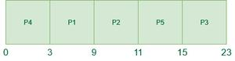

# 非抢占式最短作业优先（SJF）CPU调度程序 | 第一部分

最短作业优先（SJF）或最短作业下一个是一种调度策略，它选择等待队列中的执行时间最短的进程来执行下一个。SJN，也称为最短作业下一个（SJN），可以是抢占式的或非抢占式的。

## SJF调度的特点：

- 最短作业优先具有所有调度算法中最短平均等待时间的优势。
- 它是一种贪心算法。
- 如果不断有更短的进程到达，可能会导致饥饿问题。这个问题可以通过使用老化概念来解决。
- 由于操作系统可能不知道执行时间，因此可能无法对它们进行排序，这在实践中是不可行的。虽然无法预测执行时间，但可以使用几种方法来估算作业的执行时间，例如以前执行时间的加权平均值。
- SJF可以在有准确运行时间估计的专用环境中使用。

## 算法：

- 根据到达时间对所有进程进行排序。
- 然后选择具有最小到达时间和最短执行时间的进程。
- 完成一个进程后，将从上一个进程完成直到当前进程开始期间到达的所有进程组成一个池，并在池中选择具有最短执行时间的进程。


**如何使用程序计算SJF中以下时间？**

- **完成时间**：进程完成执行的时间。
- **周转时间**：完成时间和到达时间的时间差。

**周转时间 = 完成时间 – 到达时间**
- **等待时间(W.T)**：周转时间和执行时间的时间差。

**等待时间 = 周转时间 – 执行时间**

## 非抢占式最短作业优先CPU调度程序

非抢占式最短作业优先算法可以使用段树数据结构实现。有关非抢占式**最短作业优先**调度算法的详细实现，请参考：非抢占式最短作业优先CPU调度程序。

_**在本文中，我们假设到达时间为0，因此周转时间和完成时间相同。**_

## 非抢占式最短作业优先CPU调度算法的工作示例：

**示例-1**：考虑以下五个进程**P1, P2, P3, P4**和**P5**的到达时间和执行时间表。

| 进程 | 执行时间 | 到达时间 |
| --- | --- | --- |
| P1 | 6 ms | 2 ms |
| P2 | 2 ms | 5 ms |
| P3 | 8 ms | 1 ms |
| P4 | 3 ms | 0 ms |
| P5 | 4 ms | 4 ms |

最短作业优先CPU调度算法将按照以下步骤工作：

**在时间 = 0时，**

- 进程P4到达并开始执行

| 时间实例 | 进程 | 到达时间 | 等待表 | 执行时间 | 初始执行时间 | 剩余执行时间 |
| --- | --- | --- | --- | --- | --- | --- |
| 0-1ms | P4 | 0ms |  | 1ms | 3ms | 2ms |

**在时间 = 1时，**

- 进程P3到达。
- 但是，由于P4还需要2个执行单元才能完成。
- 因此，P3将等待P4执行完毕。

<table >
    <tr>
      <th>时间实例</th>
      <th>进程</th>
      <th>到达时间</th>
      <th>等待表</th>
      <th>执行时间</th>
      <th>初始突发时间</th>
      <th>剩余突发时间</th>
    </tr>
    <tr>
      <td rowspan="2">1 - 2ms</td>
      <td>P4</td>
      <td>0ms</td>
      <td></td>
      <td>1ms</td>
      <td>2ms</td>
      <td>1ms</td>
    </tr>
    <tr>
      <td>P3</td>
      <td>1ms</td>
      <td>P3</td>
      <td>0ms</td>
      <td>8ms</td>
      <td>8ms</td>
    </tr>
  </table>

**在时间 = 2时，**

- 进程P1到达并添加到等待表
- P4将继续执行。

  <table >
    <tr>
      <th>时间实例</th>
      <th>进程</th>
      <th>到达时间</th>
      <th>等待表</th>
      <th>执行时间</th>
      <th>初始突发时间</th>
      <th>剩余突发时间</th>
    </tr>
    <tr>
      <td rowspan="3">2 - 3ms</td>
      <td>P4</td>
      <td>0ms</td>
      <td></td>
      <td>1ms</td>
      <td>1ms</td>
      <td>0ms</td>
    </tr>
    <tr>
      <td>P3</td>
      <td>1ms</td>
      <td>P3</td>
      <td>0ms</td>
      <td>8ms</td>
      <td>8ms</td>
    </tr>
    <tr>
      <td>P1</td>
      <td>2ms</td>
      <td>P3, P1</td>
      <td>0ms</td>
      <td>6ms</td>
      <td>6ms</td>
    </tr>
  </table>

**在时间 = 3时，**

- 进程P4将完成执行。
- 然后，比较P3和P1的执行时间。
- 由于P1的执行时间较短，因此执行P1。

 <table >
    <tr>
      <th>时间实例</th>
      <th>进程</th>
      <th>到达时间</th>
      <th>等待表</th>
      <th>执行时间</th>
      <th>初始突发时间</th>
      <th>剩余突发时间</th>
    </tr>
    <tr>
      <td rowspan="2">3 - 4ms</td>
      <td>P3</td>
      <td>1ms</td>
      <td>P3</td>
      <td>0ms</td>
      <td>8ms</td>
      <td>8ms</td>
    </tr>
    <tr>
      <td>P1</td>
      <td>2ms</td>
      <td>P3</td>
      <td>1ms</td>
      <td>6ms</td>
      <td>5ms</td>
    </tr>
  </table>

**在时间 = 4时，**

- 进程P5到达并添加到等待表。
- P1将继续执行。

<table >
    <tr>
      <th>时间实例</th>
      <th>进程</th>
      <th>到达时间</th>
      <th>等待表</th>
      <th>执行时间</th>
      <th>初始突发时间</th>
      <th>剩余突发时间</th>
    </tr>
    <tr>
      <td rowspan="3">4 - 5ms</td>
      <td>P3</td>
      <td>1ms</td>
      <td>P3</td>
      <td>0ms</td>
      <td>8ms</td>
      <td>8ms</td>
    </tr>
    <tr>
      <td>P1</td>
      <td>2ms</td>
      <td>P3</td>
      <td>1ms</td>
      <td>5ms</td>
      <td>4ms</td>
    </tr>
    <tr>
      <td>P5</td>
      <td>4ms</td>
      <td>P3, P5</td>
      <td>0ms</td>
      <td>4ms</td>
      <td>4ms</td>
    </tr>
  </table>

**在时间 = 5时，**

- 进程P2到达并添加到等待表。
- P1将继续执行。

  <table >
    <tr>
      <th>时间实例</th>
      <th>进程</th>
      <th>到达时间</th>
      <th>等待表</th>
      <th>执行时间</th>
      <th>初始突发时间</th>
      <th>剩余突发时间</th>
    </tr>
    <tr>
      <td rowspan="4">5 - 6ms</td>
      <td>P3</td>
      <td>1ms</td>
      <td>P3</td>
      <td>0ms</td>
      <td>8ms</td>
      <td>8ms</td>
    </tr>
    <tr>
      <td>P1</td>
      <td>2ms</td>
      <td>P3</td>
      <td>1ms</td>
      <td>4ms</td>
      <td>3ms</td>
    </tr>
    <tr>
      <td>P5</td>
      <td>4ms</td>
      <td>P3, P5</td>
      <td>0ms</td>
      <td>4ms</td>
      <td>4ms</td>
    </tr>
    <tr>
      <td>P2</td>
      <td>5ms</td>
      <td>P3, P5, P2</td>
      <td>0ms</td>
      <td>2ms</td>
      <td>2ms</td>
    </tr>
  </table>

**在时间 = 6时，**

- 进程P1将完成执行。
- 比较P3、P5和P2的执行时间。
- 由于P2的执行时间最短，因此执行P2。

 <table >
    <tr>
      <th>时间实例</th>
      <th>进程</th>
      <th>到达时间</th>
      <th>等待表</th>
      <th>执行时间</th>
      <th>初始突发时间</th>
      <th>剩余突发时间</th>
    </tr>
    <tr>
      <td rowspan="4">6 - 9ms</td>
      <td>P3</td>
      <td>1ms</td>
      <td>P3</td>
      <td>0ms</td>
      <td>8ms</td>
      <td>8ms</td>
    </tr>
    <tr>
      <td>P1</td>
      <td>2ms</td>
      <td>P3</td>
      <td>3ms</td>
      <td>3ms</td>
      <td>0ms</td>
    </tr>
    <tr>
      <td>P5</td>
      <td>4ms</td>
      <td>P3, P5</td>
      <td>0ms</td>
      <td>4ms</td>
      <td>4ms</td>
    </tr>
    <tr>
      <td>P2</td>
      <td>5ms</td>
      <td>P3, P5, P2</td>
      <td>0ms</td>
      <td>2ms</td>
      <td>2ms</td>
    </tr>
  </table>

**在时间 = 9时，**

- 进程P2正在执行，P3和P5在等待表中。

  <table >
    <tr>
      <th>时间实例</th>
      <th>进程</th>
      <th>到达时间</th>
      <th>等待表</th>
      <th>执行时间</th>
      <th>初始突发时间</th>
      <th>剩余突发时间</th>
    </tr>
    <tr>
      <td rowspan="3">9 - 11ms</td>
      <td>P3</td>
      <td>1ms</td>
      <td>P3</td>
      <td>0ms</td>
      <td>8ms</td>
      <td>8ms</td>
    </tr>
    <tr>
      <td>P5</td>
      <td>4ms</td>
      <td>P3, P5</td>
      <td>0ms</td>
      <td>4ms</td>
      <td>4ms</td>
    </tr>
    <tr>
      <td>P2</td>
      <td>5ms</td>
      <td>P3, P5</td>
      <td>2ms</td>
      <td>2ms</td>
      <td>0ms</td>
    </tr>
  </table>

**在时间 = 11时，**

- 进程P2的执行完成。
- 比较P3和P5的执行时间。
- 由于P5的执行时间较短，因此执行P5。

  <table >
    <tr>
      <th>时间实例</th>
      <th>进程</th>
      <th>到达时间</th>
      <th>等待表</th>
      <th>执行时间</th>
      <th>初始突发时间</th>
      <th>剩余突发时间</th>
    </tr>
    <tr>
	  <td rowspan="2">11-15ms</td>
      <td>P3</td>
      <td>1ms</td>
      <td>P3</td>
      <td>0ms</td>
      <td>8ms</td>
      <td>8ms</td>
    </tr>
	<tr>
      <td>P5</td>
      <td>4ms</td>
      <td>P3</td>
      <td>4ms</td>
      <td>4ms</td>
      <td>0ms</td>
    </tr>
  </table>

**在时间 = 15时，**

- 进程P5将完成执行。

| 时间实例 | 进程 | 到达时间 | 等待表 | 执行时间 | 初始执行时间| 剩余执行时间 |
| --- | --- | --- | --- | --- | --- | --- |
| 15-23ms | P3 | 1ms | P3 | 0ms | 8ms | 8ms |

**在时间 = 23时，**

- 进程P3将完成执行。

<p>进程的总体执行情况如下所示：</p>
<table >
<tr>
<th>时间实例</th>
<th>进程</th>
<th>到达时间</th>
<th>等待表</th>
<th>执行时间</th>
<th>初始突发时间</th>
<th>剩余突发时间</th>
</tr>
<tr>
<td>0 - 1ms</td>
<td>P4</td>
<td>0ms</td>
<td></td>
<td>1ms</td>
<td>3ms</td>
<td>2ms</td>
</tr>
<tr>
<td rowspan="2">1 - 2ms</td>
<td>P4</td>
<td>0ms</td>
<td></td>
<td>1ms</td>
<td>2ms</td>
<td>1ms</td>
</tr>
<tr>
<td>P3</td>
<td>1ms</td>
<td>P3</td>
<td>0ms</td>
<td>8ms</td>
<td>8ms</td>
</tr>
<tr>
<td rowspan="3">2 - 3ms</td>
<td>P4</td>
<td>0ms</td>
<td></td>
<td>1ms</td>
<td>1ms</td>
<td>0ms</td>
</tr>
<tr>
<td>P3</td>
<td>1ms</td>
<td>P3</td>
<td>0ms</td>
<td>8ms</td>
<td>8ms</td>
</tr>
<tr>
<td>P1</td>
<td>2ms</td>
<td>P3, P1</td>
<td>0ms</td>
<td>6ms</td>
<td>6ms</td>
</tr>
<tr>
<td rowspan="2">3 - 4ms</td>
<td>P3</td>
<td>1ms</td>
<td>P3</td>
<td>0ms</td>
<td>8ms</td>
<td>8ms</td>
</tr>
<tr>
<td>P1</td>
<td>2ms</td>
<td>P3</td>
<td>1ms</td>
<td>6ms</td>
<td>5ms</td>
</tr>
<tr>
<td rowspan="3">4 - 5ms</td>
<td>P3</td>
<td>1ms</td>
<td>P3</td>
<td>0ms</td>
<td>8ms</td>
<td>8ms</td>
</tr>
<tr>
<td>P1</td>
<td>2ms</td>
<td>P3</td>
<td>1ms</td>
<td>5ms</td>
<td>4ms</td>
</tr>
<tr>
<td>P5</td>
<td>4ms</td>
<td>P3, P5</td>
<td>0ms</td>
<td>4ms</td>
<td>4ms</td>
</tr>
<tr>
<td rowspan="4">5 - 6ms</td>
<td>P3</td>
<td>1ms</td>
<td>P3</td>
<td>0ms</td>
<td>8ms</td>
<td>8ms</td>
</tr>
<tr>
<td>P1</td>
<td>2ms</td>
<td>P3</td>
<td>1ms</td>
<td>4ms</td>
<td>3ms</td>
</tr>
<tr>
<td>P5</td>
<td>4ms</td>
<td>P3, P5</td>
<td>0ms</td>
<td>4ms</td>
<td>4ms</td>
</tr>
<tr>
<td>P2</td>
<td>5ms</td>
<td>P3, P5, P2</td>
<td>0ms</td>
<td>2ms</td>
<td>2ms</td>
</tr>
<tr>
<td rowspan="4">6 - 9ms</td>
<td>P3</td>
<td>1ms</td>
<td>P3</td>
<td>0ms</td>
<td>8ms</td>
<td>8ms</td>
</tr>
<tr>
<td>P1</td>
<td>2ms</td>
<td>P3</td>
<td>3ms</td>
<td>3ms</td>
<td>0ms</td>
</tr>
<tr>
<td>P5</td>
<td>4ms</td>
<td>P3, P5</td>
<td>0ms</td>
<td>4ms</td>
<td>4ms</td>
</tr>
<tr>
<td>P2</td>
<td>5ms</td>
<td>P3, P5, P2</td>
<td>0ms</td>
<td>2ms</td>
<td>2ms</td>
</tr>
<tr>
<td rowspan="3">9 - 11ms</td>
<td>P3</td>
<td>1ms</td>
<td>P3</td>
<td>0ms</td>
<td>8ms</td>
<td>8ms</td>
</tr>
<tr>
<td>P5</td>
<td>4ms</td>
<td>P3, P5</td>
<td>0ms</td>
<td>4ms</td>
<td>4ms</td>
</tr>
<tr>
<td>P2</td>
<td>5ms</td>
<td>P3, P5</td>
<td>2ms</td>
<td>2ms</td>
<td>0ms</td>
</tr>
<tr>
<td rowspan="2">11 - 15ms</td>
<td>P3</td>
<td>1ms</td>
<td>P3</td>
<td>0ms</td>
<td>8ms</td>
<td>8ms</td>
</tr>
<tr>
<td>P5</td>
<td>4ms</td>
<td>P3</td>
<td>4ms</td>
<td>4ms</td>
<td>0ms</td>
</tr>
<tr>
<td>15 - 23ms</td>
<td>P3</td>
<td>1ms</td>
<td></td>
<td>8ms</td>
<td>8ms</td>
<td>0ms</td>
</tr>
</table>

**甘特图如下所示：**



现在，让我们计算上述示例的平均等待时间：

> P4 = 0 – 0 = 0
> P1 = 3 – 2 = 1
> P2 = 9 – 5 = 4
> P5 = 11 – 4 = 7
> P3 = 15 – 1 = 14
> **平均等待时间 = (0 + 1 + 4 + 7 + 14) / 5 = 26 / 5 = 5.2**

**SJF的优点：**

- SJF比先来先服务(FCFS)算法更好，因为它减少了平均等待时间。
- SJF通常用于长期调度。
- 它适用于批量运行的作业，其中运行时间已经已知。
- SJF在平均周转时间方面可能是最优的。

**SJF的缺点：**

- SJF可能会导致非常长的周转时间或饥饿问题。
- 在SJF中，作业完成时间必须提前知道，但有时很难预测。
- 有时，预测即将到来的CPU请求的长度变得复杂。
- 它会导致饥饿，不会减少平均周转时间。

**实现SJF算法：**

::: code-group

```cpp [C++]
#include <iostream>
using namespace std;

int main() {

	// Matrix for storing Process Id, Burst
	// Time, Average Waiting Time & Average
	// Turn Around Time.
	int A[100][4];
	int i, j, n, total = 0, index, temp;
	float avg_wt, avg_tat;

	cout << "Enter number of process: ";
	cin >> n;

	cout << "Enter Burst Time:" << endl;

	// User Input Burst Time and alloting Process Id.
	for (i = 0; i < n; i++) {
		cout << "P" << i + 1 << ": ";
		cin >> A[i][1];
		A[i][0] = i + 1;
	}

	// Sorting process according to their Burst Time.
	for (i = 0; i < n; i++) {
		index = i;
		for (j = i + 1; j < n; j++)
			if (A[j][1] < A[index][1])
				index = j;
		temp = A[i][1];
		A[i][1] = A[index][1];
		A[index][1] = temp;

		temp = A[i][0];
		A[i][0] = A[index][0];
		A[index][0] = temp;
	}

	A[0][2] = 0;
	// Calculation of Waiting Times
	for (i = 1; i < n; i++) {
		A[i][2] = 0;
		for (j = 0; j < i; j++)
			A[i][2] += A[j][1];
		total += A[i][2];
	}

	avg_wt = (float)total / n;
	total = 0;
	cout << "P	 BT	 WT	 TAT" << endl;

	// Calculation of Turn Around Time and printing the
	// data.
	for (i = 0; i < n; i++) {
		A[i][3] = A[i][1] + A[i][2];
		total += A[i][3];
		cout << "P" << A[i][0] << "	 " << A[i][1] << "	 " << A[i][2] << "	 " << A[i][3] << endl;
	}

	avg_tat = (float)total / n;
	cout << "Average Waiting Time= " << avg_wt << endl;
	cout << "Average Turnaround Time= " << avg_tat << endl;
}

```

```c [C]
#include <stdio.h>
int main()
{
	// Matrix for storing Process Id, Burst
	// Time, Average Waiting Time & Average
	// Turn Around Time.
	int A[100][4];
	int i, j, n, total = 0, index, temp;
	float avg_wt, avg_tat;
	printf("Enter number of process: ");
	scanf("%d", &n);
	printf("Enter Burst Time:\n");
	// User Input Burst Time and alloting Process Id.
	for (i = 0; i < n; i++) {
		printf("P%d: ", i + 1);
		scanf("%d", &A[i][1]);
		A[i][0] = i + 1;
	}
	// Sorting process according to their Burst Time.
	for (i = 0; i < n; i++) {
		index = i;
		for (j = i + 1; j < n; j++)
			if (A[j][1] < A[index][1])
				index = j;
		temp = A[i][1];
		A[i][1] = A[index][1];
		A[index][1] = temp;

		temp = A[i][0];
		A[i][0] = A[index][0];
		A[index][0] = temp;
	}
	A[0][2] = 0;
	// Calculation of Waiting Times
	for (i = 1; i < n; i++) {
		A[i][2] = 0;
		for (j = 0; j < i; j++)
			A[i][2] += A[j][1];
		total += A[i][2];
	}
	avg_wt = (float)total / n;
	total = 0;
	printf("P	 BT	 WT	 TAT\n");
	// Calculation of Turn Around Time and printing the
	// data.
	for (i = 0; i < n; i++) {
		A[i][3] = A[i][1] + A[i][2];
		total += A[i][3];
		printf("P%d	 %d	 %d	 %d\n", A[i][0],
			A[i][1], A[i][2], A[i][3]);
	}
	avg_tat = (float)total / n;
	printf("Average Waiting Time= %f", avg_wt);
	printf("\nAverage Turnaround Time= %f", avg_tat);
}

```

```java [Java]
import java.io.*
import java.util.*;

public class Main {
	public static void main(String[] args)
	{
		Scanner input = new Scanner(System.in);
		int n;
		// Matrix for storing Process Id, Burst
		// Time, Average Waiting Time & Average
		// Turn Around Time.
		int[][] A = new int[100][4];
		int total = 0;
		float avg_wt, avg_tat;
		System.out.println("Enter number of process:");
		n = input.nextInt();
		System.out.println("Enter Burst Time:");
		for (int i = 0; i < n; i++) {
			// User Input Burst Time and alloting
			// Process Id.
			System.out.print("P" + (i + 1) + ": ");
			A[i][1] = input.nextInt();
			A[i][0] = i + 1;
		}
		for (int i = 0; i < n; i++) {
			// Sorting process according to their
			// Burst Time.
			int index = i;
			for (int j = i + 1; j < n; j++) {
				if (A[j][1] < A[index][1]) {
					index = j;
				}
			}
			int temp = A[i][1];
			A[i][1] = A[index][1];
			A[index][1] = temp;
			temp = A[i][0];
			A[i][0] = A[index][0];
			A[index][0] = temp;
		}
		A[0][2] = 0;
		// Calculation of Waiting Times
		for (int i = 1; i < n; i++) {
			A[i][2] = 0;
			for (int j = 0; j < i; j++) {
				A[i][2] += A[j][1];
			}
			total += A[i][2];
		}
		avg_wt = (float)total / n;
		total = 0;
		// Calculation of Turn Around Time and printing the
		// data.
		System.out.println("P\tBT\tWT\tTAT");
		for (int i = 0; i < n; i++) {
			A[i][3] = A[i][1] + A[i][2];
			total += A[i][3];
			System.out.println("P" + A[i][0] + "\t"
							+ A[i][1] + "\t" + A[i][2]
							+ "\t" + A[i][3]);
		}
		avg_tat = (float)total / n;
		System.out.println("Average Waiting Time= "
						+ avg_wt);
		System.out.println("Average Turnaround Time= "
						+ avg_tat);
	}
}

```
```py [Python3]
# converting the code to python3


def main():
	# Taking the number of processes
	n = int(input("Enter number of process: "))
	# Matrix for storing Process Id, Burst Time, Average Waiting Time & Average Turn Around Time.
	A = [[0 for j in range(4)] for i in range(100)]
	total, avg_wt, avg_tat = 0, 0, 0
	print("Enter Burst Time:")
	for i in range(n): # User Input Burst Time and alloting Process Id.
		A[i][1] = int(input(f"P{i+1}: "))
		A[i][0] = i + 1
	for i in range(n): # Sorting process according to their Burst Time.
		index = i
		for j in range(i + 1, n):
			if A[j][1] < A[index][1]:
				index = j
		temp = A[i][1]
		A[i][1] = A[index][1]
		A[index][1] = temp
		temp = A[i][0]
		A[i][0] = A[index][0]
		A[index][0] = temp
	A[0][2] = 0 # Calculation of Waiting Times
	for i in range(1, n):
		A[i][2] = 0
		for j in range(i):
			A[i][2] += A[j][1]
		total += A[i][2]
	avg_wt = total / n
	total = 0
	# Calculation of Turn Around Time and printing the data.
	print("P	 BT	 WT	 TAT")
	for i in range(n):
		A[i][3] = A[i][1] + A[i][2]
		total += A[i][3]
		print(f"P{A[i][0]}	 {A[i][1]}	 {A[i][2]}	 {A[i][3]}")
	avg_tat = total / n
	print(f"Average Waiting Time= {avg_wt}")
	print(f"Average Turnaround Time= {avg_tat}")


if __name__ == "__main__":
	main()

```
```c# [C#]
//C# equivalents

using System;

namespace Main
{
class Program
{
	static void Main(string[] args)
	{
	// Matrix for storing Process Id, Burst
	// Time, Average Waiting Time & Average
	// Turn Around Time.
	int[,] A = new int[100, 4];
	int n;
	int total = 0;
	float avg_wt, avg_tat;
	Console.WriteLine("Enter number of process:");
	n = Convert.ToInt32(Console.ReadLine());
	Console.WriteLine("Enter Burst Time:");
	for (int i = 0; i < n; i++)
	{
		// User Input Burst Time and alloting
		// Process Id.
		Console.Write("P" + (i + 1) + ": ");
		A[i, 1] = Convert.ToInt32(Console.ReadLine());
		A[i, 0] = i + 1;
	}
	for (int i = 0; i < n; i++)
	{
		// Sorting process according to their
		// Burst Time.
		int index = i;
		for (int j = i + 1; j < n; j++)
		{
		if (A[j, 1] < A[index, 1])
		{
			index = j;
		}
		}
		int temp = A[i, 1];
		A[i, 1] = A[index, 1];
		A[index, 1] = temp;
		temp = A[i, 0];
		A[i, 0] = A[index, 0];
		A[index, 0] = temp;
	}
	A[0, 2] = 0;
	// Calculation of Waiting Times
	for (int i = 1; i < n; i++)
	{
		A[i, 2] = 0;
		for (int j = 0; j < i; j++)
		{
		A[i, 2] += A[j, 1];
		}
		total += A[i, 2];
	}
	avg_wt = (float)total / n;
	total = 0;
	// Calculation of Turn Around Time and printing the
	// data.
	Console.WriteLine("P\tBT\tWT\tTAT");
	for (int i = 0; i < n; i++)
	{
		A[i, 3] = A[i, 1] + A[i, 2];
		total += A[i, 3];
		Console.WriteLine("P" + A[i, 0] + "\t"
						+ A[i, 1] + "\t" + A[i, 2]
						+ "\t" + A[i, 3]);
	}
	avg_tat = (float)total / n;
	Console.WriteLine("Average Waiting Time= "
						+ avg_wt);
	Console.WriteLine("Average Turnaround Time= "
						+ avg_tat);
	}
}
}

```
```js [Javascript ]
// Javascript code
let A = [];
let total = 0;
let index, temp;
let avg_wt, avg_tat;
let n = prompt("Enter the number of process: ");

for (let i = 0; i < n; i++) {
	let input = prompt("P" + (i + 1) + ": ");
	A.push([i+1, parseInt(input)]);
}

for (let i = 0; i < n; i++) {
	index = i;
	for (let j = i + 1; j < n; j++) {
		if (A[j][1] < A[index][1]) {
			index = j;
		}
	}
	temp = A[i][1];
	A[i][1] = A[index][1];
	A[index][1] = temp;

	temp = A[i][0];
	A[i][0] = A[index][0];
	A[index][0] = temp;
}

A[0][2] = 0;
for (let i = 1; i < n; i++) {
	A[i][2] = 0;
	for (let j = 0; j < i; j++) {
		A[i][2] += A[j][1];
	}
	total += A[i][2];
}

avg_wt = total / n;
total = 0;
console.log("P	 BT	 WT	 TAT");
for (let i = 0; i < n; i++) {
	A[i][3] = A[i][1] + A[i][2];
	total += A[i][3];
	console.log("P" + A[i][0] + "	 " + A[i][1] + "	 " + A[i][2] + "	 " + A[i][3]);
}

avg_tat = total / n;
console.log("Average Waiting Time= " + avg_wt);
console.log("Average Turnaround Time= " + avg_tat);

```
:::

**时间复杂度：O(n^2)**

**辅助空间：O(n)**

**注意：在本文中，我们假设到达时间为0，因此周转时间和完成时间相同。**