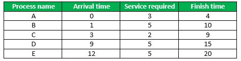
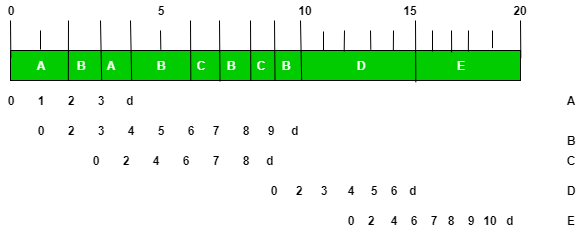

# 自私的循环轮转 CPU 调度

**先决条件 – 循环轮转调度程序**

在传统的循环轮转调度算法中，所有进程被平等对待进行处理。**自私的循环轮转**（Selfish Round Robin，SRR）的目标是为已经执行了一段时间的进程提供比新来者更好的服务。与普通循环轮转算法相比，它是一种更合理且更优越的实现方式。

## 什么是自私的循环轮转调度算法？

自私的循环轮转（SRR）调度算法是传统循环轮转算法的一种修改版。SRR 的目标是对已经执行了一段时间的进程提供比新来者更好的服务。在 SRR 中，就绪列表中的进程被划分为两个列表：NEW 和 ACCEPTED。新进程等待，而接受的进程则由循环轮转提供服务。新进程的优先级以 'a' 的速率增加，而接受进程的优先级以 'b' 的速率增加。

## SRR 调度如何确保进程间的公平性？

A: SRR 调度通过为每个进程提供等量的 CPU 时间来确保进程间的公平性。这是通过使用循环轮转方法实现的，其中每个进程都获得了一个时间量子来执行。一旦进程完成其时间量子，它就会被放置在队列的末尾，下一个进程就有机会执行。

## SRR 调度是否适合实时系统？

A: 不，SRR 调度不适合需要严格时间约束的实时系统。在这类系统中，必须确保高优先级进程在需要时获得 CPU 时间，这在 SRR 调度中是不可能的。

## 实现：

- 就绪列表中的进程被划分为两个列表：NEW 和 ACCEPTED。
- 新进程等待，而接受的进程则由循环轮转提供服务。
- 新进程的优先级以 'a' 的速率增加，而接受进程的优先级以 'b' 的速率增加。
- 当新进程的优先级达到接受进程的优先级时，该新进程就被接受了。
- 如果所有接受的进程都完成了，那么优先级最高的新进程就被接受。

让我们概述一下这个算法的一般工作过程：

**步骤 1:** 假设最初没有就绪进程，当第一个进程 A 到达时，它的优先级最初是 0。由于没有其他接受的进程，A 立即被接受。

**步骤 2:** 过了一段时间，另一个进程 B 到达。只要 b/a < 1，B 的优先级最终会赶上 A 的，因此它被接受了；现在 A 和 B 具有相同的优先级。

**步骤 3:** 所有接受的进程共享一个公共优先级（以速率 b 增加）；这使得这个策略易于实施，即任何新进程的优先级最终都会在接受点被接受。因此，没有进程会遭受饥饿。

**步骤 4:** 即使 b/a > 1，A 最终会完成，然后 B 可以被接受。

```
调整参数 a 和 b：
          -> 如果 b/a >= 1，新进程在接受所有接受进程完成后才被接受，所以 SRR 变成 FCFS。
          -> 如果 b/a = 1，所有进程立即被接受，所以 SRR 变成 RR。
          -> 如果 0 < b/a < 1，接受进程是自私的，但并非完全自私。

```

### 自私的循环轮转示例 –



**解决方案（其中 a = 2 且 b = 1）–**



**解释：**

进程 A 在时间 t = 0 时到达并立即被接受。因此，它的优先级每秒钟只增加 'b' 即 '1'。B 在时间 t = 1 进入并进入等待队列。因此，它的优先级在时间 t = 2 时以 'a' 即 '2' 增加。此时 A 的优先级 = B 的优先级 = 2。

现在，A 和 B 两个进程都在接受队列中，并以循环轮转的方式执行。在时间 t = 3，进程 C 进入等待队列。在时间 t = 6，进程 C 的优先级赶上了进程 B 的优先级，然后他们开始以循环轮转的方式执行。当 B 在时间 t = 10 完成执行时，D 自动被提升到接受队列。

类似地，当 D 在时间 t = 15 完成执行时，E 自动被提升到接受队列。

### 优点：

1. **公平性：** SRR 调度通过为每个进程提供等量的 CPU 时间来确保所有进程间的公平性。这使得它比其他一些优先级算法更公平。
2. **高效的 CPU 利用率：** SRR 调度通过允许进程只使用它们需要的 CPU 时间来确保高效的 CPU 利用率。这降低了进程被不必要阻塞的可能性，从而可以增加整体系统的吞吐量。
3. **低开销：** SRR 调度是一个简单的算法，实现它的开销很小。它易于理解和实现，使其成为简单系统的不错选择。

### 缺点：

1. **自私性：** SRR 调度的主要缺点之一是它允许进程表现出自私性，即使它们不需要，也使用它们分配的所有 CPU 时间。这可能导致一些进程占用 CPU 时间，从而导致系统性能下降。
2. **响应时间差：** SRR 调度可能导致需要快速用户输入的交互式进程的响应时间变差。这是因为这些进程可能被迫等待它们的时间量子，即使它们只需要很少的 CPU 时间。
3. **处理优先级能力差：** SRR 调度不擅长处理进程优先级。所有进程都平等对待，不管它们的优先级如何，这可能导致高优先级进程得不到 CPU 时间的情况。
4. **对实时系统的效率低：** SRR 调度不适合需要严格时间约束的实时系统。在这类系统中，必须确保高优先级进程在需要时获得 CPU 时间，这在 SRR 调度中是不可能的。


