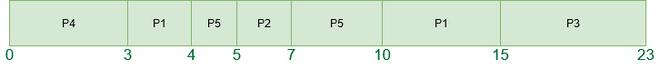

# 最短剩余时间优先（抢占式SJF）调度算法

在之前的文章中，我们讨论了非抢占式的最短作业优先（SJF）。在这篇文章中，我们将讨论SJF的抢占式版本，即最短剩余时间优先（SRTF）。

在**最短剩余时间优先（SRTF）调度算法**中，选择剩余完成时间最短的进程来执行。由于当前执行的进程根据定义具有最短的剩余时间，并且由于执行的进行，该时间应该只会减少，因此进程将总是运行直到它们完成或有一个新的进程到达且需要**更少的时间**。

## 展示抢占式最短作业优先CPU调度算法的工作示例：

**示例-1**：考虑以下五个进程**P1, P2, P3, P4**和**P5**的到达时间和执行时间表。

| 进程 | 执行时间 | 到达时间 |
| --- | --- | --- |
| P1 | 6 ms | 2 ms |
| P2 | 2 ms | 5 ms |
| P3 | 8 ms | 1 ms |
| P4 | 3 ms | 0 ms |
| P5 | 4 ms | 4 ms |

最短作业优先CPU调度算法将按照以下步骤工作：

**在时间 = 0时，**

- 进程P4到达并开始执行

| 时间实例 | 进程 | 到达时间 | 等待表 | 执行时间 | 初始执行时间 | 剩余执行时间 |
| --- | --- | --- | --- | --- | --- | --- |
| 0-1ms | P4 | 0ms |  | 1ms | 3ms | 2ms |

**在时间 = 1时，**

- 进程P3到达。
- 但是，由于P4的执行时间更短，它将继续执行。
- 因此，P3将等待P4执行完毕。

  <table >
    <tr>
      <th>时间实例</th>
      <th>进程</th>
      <th>到达时间</th>
      <th>等待表</th>
      <th>执行时间</th>
      <th>初始突发时间</th>
      <th>剩余突发时间</th>
    </tr>
    <tr>
      <td rowspan="2">1 - 2ms</td>
      <td>P4</td>
      <td>0ms</td>
      <td></td>
      <td>1ms</td>
      <td>2ms</td>
      <td>1ms</td>
    </tr>
    <tr>
      <td>P3</td>
      <td>1ms</td>
      <td>P3</td>
      <td>0ms</td>
      <td>8ms</td>
      <td>8ms</td>
    </tr>
  </table>

**在时间 = 2时，**

- 进程P1到达，执行时间为6。
- 由于P1的执行时间比P4长，
- 因此，P4将继续执行。

  <table >
    <tr>
      <th>时间实例</th>
      <th>进程</th>
      <th>到达时间</th>
      <th>等待表</th>
      <th>执行时间</th>
      <th>初始突发时间</th>
      <th>剩余突发时间</th>
    </tr>
    <tr>
      <td  rowspan="3">2 - 3ms</td>
      <td>P4</td>
      <td>0ms</td>
      <td  rowspan="3">P3, P1</td>
      <td>1ms</td>
      <td>1ms</td>
      <td>0ms</td>
    </tr>
    <tr>
      <td>P3</td>
      <td>1ms</td>
      <td>0ms</td>
      <td>8ms</td>
      <td>8ms</td>
    </tr>
    <tr>
      <td>P1</td>
      <td>2ms</td>
      <td>0ms</td>
      <td>6ms</td>
      <td>6ms</td>
    </tr>
  </table>

**在时间 = 3时，**

- 进程P4将完成执行。
- 然后，比较P3和P1的执行时间。
- 由于P1的执行时间比P3短，因此执行P1。

  <table >
    <tr>
      <th>时间实例</th>
      <th>进程</th>
      <th>到达时间</th>
      <th>等待表</th>
      <th>执行时间</th>
      <th>初始突发时间</th>
      <th>剩余突发时间</th>
    </tr>
    <tr>
      <td  rowspan="2">3 - 4ms</td>
      <td>P3</td>
      <td>1ms</td>
      <td  rowspan="2">P3</td>
      <td>0ms</td>
      <td>8ms</td>
      <td>8ms</td>
    </tr>
    <tr>
      <td>P1</td>
      <td>2ms</td>
      <td>1ms</td>
      <td>6ms</td>
      <td>5ms</td>
    </tr>
  </table>

**在时间 = 4时，**

- 进程P5到达。
- 然后比较P3、P5和P1的执行时间。
- 进程P5首先执行，因为它的执行时间最低，P1被**抢占**。

  <table >
    <tr>
      <th>时间实例</th>
      <th>进程</th>
      <th>到达时间</th>
      <th>等待表</th>
      <th>执行时间</th>
      <th>初始突发时间</th>
      <th>剩余突发时间</th>
    </tr>
    <tr>
      <td rowspan="3">4 - 5ms</td>
      <td>P3</td>
      <td>1ms</td>
      <td rowspan="3">P3, P1</td>
      <td>0ms</td>
      <td>8ms</td>
      <td>8ms</td>
    </tr>
    <tr>
      <td>P1</td>
      <td>2ms</td>
      <td>0ms</td>
      <td>5ms</td>
      <td>5ms</td>
    </tr>
    <tr>
      <td>P5</td>
      <td>4ms</td>
      <td>1ms</td>
      <td>4ms</td>
      <td>3ms</td>
    </tr>
  </table>

**在时间 = 5时，**

- 进程P2到达。
- 比较所有进程的执行时间，
- 进程P2开始执行，因为它的执行时间最短。
- 进程P5被抢占。

  <table >
    <tr>
      <th>时间实例</th>
      <th>进程</th>
      <th>到达时间</th>
      <th>等待表</th>
      <th>执行时间</th>
      <th>初始突发时间</th>
      <th>剩余突发时间</th>
    </tr>
    <tr>
      <td rowspan="4">5 - 6ms</td>
      <td>P3</td>
      <td>1ms</td>
      <td rowspan="4">P3, P5, P1</td>
      <td>0ms</td>
      <td>8ms</td>
      <td>8ms</td>
    </tr>
    <tr>
      <td>P1</td>
      <td>2ms</td>
      <td>0ms</td>
      <td>5ms</td>
      <td>5ms</td>
    </tr>
    <tr>
      <td>P5</td>
      <td>4ms</td>
      <td>0ms</td>
      <td>3ms</td>
      <td>3ms</td>
    </tr>
    <tr>
      <td>P2</td>
      <td>5ms</td>
      <td>1ms</td>
      <td>2ms</td>
      <td>1ms</td>
    </tr>
  </table>

**在时间 = 6时，**

- 进程P2将继续执行。
- 它将执行到时间 = 7，因为P2的执行时间是2ms

  <table >
    <tr>
      <th>时间实例</th>
      <th>进程</th>
      <th>到达时间</th>
      <th>等待表</th>
      <th>执行时间</th>
      <th>初始突发时间</th>
      <th>剩余突发时间</th>
    </tr>
    <tr>
      <td rowspan="4">6 - 7ms</td>
      <td>P3</td>
      <td>1ms</td>
      <td rowspan="4">P3, P5, P1</td>
      <td>0ms</td>
      <td>8ms</td>
      <td>8ms</td>
    </tr>
    <tr>
      <td>P1</td>
      <td>2ms</td>
      <td>0ms</td>
      <td>5ms</td>
      <td>5ms</td>
    </tr>
    <tr>
      <td>P5</td>
      <td>4ms</td>
      <td>0ms</td>
      <td>3ms</td>
      <td>3ms</td>
    </tr>
    <tr>
      <td>P2</td>
      <td>5ms</td>
      <td>1ms</td>
      <td>2ms</td>
      <td>0ms</td>
    </tr>
  </table>

**在时间 = 7时，**

- 进程P2完成执行。
- 再次比较所有剩余进程的执行时间。
- 进程P5执行，因为它的执行时间比其他进程短。

  <table >
    <tr>
      <th>时间实例</th>
      <th>进程</th>
      <th>到达时间</th>
      <th>等待表</th>
      <th>执行时间</th>
      <th>初始突发时间</th>
      <th>剩余突发时间</th>
    </tr>
    <tr>
      <td rowspan="3">7 - 10ms</td>
      <td>P3</td>
      <td>1ms</td>
      <td rowspan="3">P3, P1</td>
      <td>0ms</td>
      <td>8ms</td>
      <td>8ms</td>
    </tr>
    <tr>
      <td>P1</td>
      <td>2ms</td>
      <td>0ms</td>
      <td>5ms</td>
      <td>5ms</td>
    </tr>
    <tr>
      <td>P5</td>
      <td>4ms</td>
      <td>3ms</td>
      <td>3ms</td>
      <td>0ms</td>
    </tr>
  </table>

**在时间 = 10时，**

- 进程P5完成执行。
- 然后比较剩余进程P1和P3的执行时间。
- 因此，执行P1，因为它的执行时间比P3短。

  <table >
    <tr>
      <th>时间实例</th>
      <th>进程</th>
      <th>到达时间</th>
      <th>等待表</th>
      <th>执行时间</th>
      <th>初始突发时间</th>
      <th>剩余突发时间</th>
    </tr>
    <tr>
      <td rowspan="2">10 - 15ms</td>
      <td>P3</td>
      <td>1ms</td>
      <td rowspan="2">P3</td>
      <td>0ms</td>
      <td>8ms</td>
      <td>8ms</td>
    </tr>
    <tr>
      <td>P1</td>
      <td>2ms</td>
      <td>4ms</td>
      <td>5ms</td>
      <td>0ms</td>
    </tr>
  </table>

**在时间 = 15时，**

- 进程P1完成执行，只剩下P3进程。
- P3开始执行。

| 时间实例 | 进程 | 到达时间 | 等待表 | 执行时间 | 初始执行时间 | 剩余执行时间 |
| --- | --- | --- | --- | --- | --- | --- |
| 15-23ms | ~~P3~~ | ~~1ms~~ | | ~~8ms~~ | ~~8ms~~ | ~~0ms~~ |

**在时间 = 23时，**

- 进程P3完成执行。
- 总体进程执行如下所示：

<table >
<tr>
<th>时间实例</th>
<th>进程</th>
<th>到达时间</th>
<th>等待表</th>
<th>执行时间</th>
<th>初始突发时间</th>
<th>剩余突发时间</th>
</tr>
<tr>
<td >0 - 1ms</td>
<td>P4</td>
<td>0ms</td>
<td></td>
<td>1ms</td>
<td>3ms</td>
<td>2ms</td>
</tr>
<tr>
<td rowspan="2">1 - 2ms</td>
<td>P4</td>
<td>0ms</td>
<td rowspan="2">P3</td>
<td>1ms</td>
<td>2ms</td>
<td>1ms</td>
</tr>
<tr>
<td>P3</td>
<td>1ms</td>
<td>0ms</td>
<td>8ms</td>
<td>8ms</td>
</tr>
<tr>
<td rowspan="3">2 - 3ms</td>
<td>P4</td>
<td>0ms</td>
<td rowspan="3">P3, P1</td>
<td>1ms</td>
<td>1ms</td>
<td>0ms</td>
</tr>
<tr>
<td>P3</td>
<td>1ms</td>
<td>0ms</td>
<td>8ms</td>
<td>8ms</td>
</tr>
<tr>
<td>P1</td>
<td>2ms</td>
<td>0ms</td>
<td>6ms</td>
<td>6ms</td>
</tr>
<tr>
<td rowspan="2">3 - 4ms</td>
<td>P3</td>
<td>1ms</td>
<td rowspan="2">P3</td>
<td>0ms</td>
<td>8ms</td>
<td>8ms</td>
</tr>
<tr>
<td>P1</td>
<td>2ms</td>
<td>1ms</td>
<td>6ms</td>
<td>5ms</td>
</tr>
<tr>
<td rowspan="3">4 - 5ms</td>
<td>P3</td>
<td>1ms</td>
<td rowspan="3">P3, P1</td>
<td>0ms</td>
<td>8ms</td>
<td>8ms</td>
</tr>
<tr>
<td>P1</td>
<td>2ms</td>
<td>0ms</td>
<td>5ms</td>
<td>5ms</td>
</tr>
<tr>
<td>P5</td>
<td>4ms</td>
<td>1ms</td>
<td>4ms</td>
<td>3ms</td>
</tr>
<tr>
<td rowspan="4">5 - 6ms</td>
<td>P3</td>
<td>1ms</td>
<td rowspan="4">P3, P5, P1</td>
<td>0ms</td>
<td>8ms</td>
<td>8ms</td>
</tr>
<tr>
<td>P1</td>
<td>2ms</td>
<td>0ms</td>
<td>5ms</td>
<td>5ms</td>
</tr>
<tr>
<td>P5</td>
<td>4ms</td>
<td>0ms</td>
<td>3ms</td>
<td>3ms</td>
</tr>
<tr>
<td>P2</td>
<td>5ms</td>
<td>1ms</td>
<td>2ms</td>
<td>1ms</td>
</tr>
<tr>
<td rowspan="4">6 - 7ms</td>
<td>P3</td>
<td>1ms</td>
<td rowspan="4">P3, P5, P1</td>
<td>0ms</td>
<td>8ms</td>
<td>8ms</td>
</tr>
<tr>
<td>P1</td>
<td>2ms</td>
<td>0ms</td>
<td>5ms</td>
<td>5ms</td>
</tr>
<tr>
<td>P5</td>
<td>4ms</td>
<td>0ms</td>
<td>3ms</td>
<td>3ms</td>
</tr>
<tr>
<td>P2</td>
<td>5ms</td>
<td>1ms</td>
<td>2ms</td>
<td>0ms</td>
</tr>
<tr>
<td rowspan="3">7 - 10ms</td>
<td>P3</td>
<td>1ms</td>
<td rowspan="3">P3, P1</td>
<td>0ms</td>
<td>8ms</td>
<td>8ms</td>
</tr>
<tr>
<td>P1</td>
<td>2ms</td>
<td>0ms</td>
<td>5ms</td>
<td>5ms</td>
</tr>
<tr>
<td>P5</td>
<td>4ms</td>
<td>3ms</td>
<td>3ms</td>
<td>0ms</td>
</tr>
<tr>
<td rowspan="2">10 - 15ms</td>
<td>P3</td>
<td>1ms</td>
<td rowspan="2">P3</td>
<td>0ms</td>
<td>8ms</td>
<td>8ms</td>
</tr>
<tr>
<td>P1</td>
<td>4ms</td>
<td>4ms</td>
<td>5ms</td>
<td>0ms</td>
</tr>
<tr>
<td>15 - 23ms</td>
<td>P3</td>
<td>1ms</td>
<td></td>
<td>8ms</td>
<td>8ms</td>
<td>0ms</td>
</tr>
</table>

**甘特图：**



现在，让我们计算平均等待时间和周转时间：

如我们所知，

- **周转时间** = 完成时间 – 到达时间
- **等待时间** = 周转时间 – 执行时间

| 进程 | 完成时间 | 周转时间 | 等待时间 |
| --- | --- | --- | --- |
| P1 | 15 | 15-2 = 13 | 13-6 = 7 |
| P2 | 7 | 7-5 = 2 | 2-2 = 0 |
| P3 | 23 | 23-1 = 22 | 22-8 = 14 |
| P4 | 3 | 3-0 = 3 | 3-3 = 0 |
| P5 | 10 | 10-4 = 6 | 6-4 = 2 |

现在，

- **平均周转时间** = (13 + 2 + 22 + 3 + 6) / 5 = 9.2
- **平均等待时间** = (7 + 0 + 14 + 0 + 2) / 5 = 23 / 5 = 4.6

### SRTF的一些关键特性

- **抢占式**：SRTF是一种抢占式算法，这意味着当前运行的进程可以在有更短执行时间的新进程到达时被中断。这有助于确保执行时间最短的进程首先被执行。
- **动态**：SRTF是一种动态算法，这意味着它可以适应进程到达时间和执行时间的变化。它不断重新评估每个进程的剩余执行时间，并调度剩余时间最短的进程。
- **低等待时间**：SRTF以其低等待时间而闻名。通过选择剩余执行时间最短的进程，它确保了执行时间最短的进程首先被执行，从而减少了进程的平均等待时间。
- SRTF的复杂性高于其他调度算法，如FCFS（先来先服务）和RR（轮询），因为它需要频繁的上下文切换和抢占。

**SRTF算法的实现：**

**方法：**

- 遍历直到所有进程完全执行。
  - 在每个时间单位找到剩余时间最短的进程。
  - 将其时间减少1。
  - 检查其剩余时间是否变为0
  - 增加完成进程的计数。
  - 当前进程的完成时间 = 当前时间 + 1；
  - 计算每个完成进程的等待时间。
    - **wt[i] = 完成时间 – 到达时间 – 执行时间**
  - 增加时间单位。

**SRTF算法的程序实现：**

::: code-group

```cpp [C++]
// C++ program to implement Shortest Remaining Time First
// Shortest Remaining Time First (SRTF)

#include <bits/stdc++.h>
using namespace std;

struct Process {
    int pid; // Process ID
    int bt; // Burst Time
    int art; // Arrival Time
};

// Function to find the waiting time for all
// processes
void findWaitingTime(Process proc[], int n,
                                int wt[])
{
    int rt[n];

    // Copy the burst time into rt[]
    for (int i = 0; i < n; i++)
        rt[i] = proc[i].bt;

    int complete = 0, t = 0, minm = INT_MAX;
    int shortest = 0, finish_time;
    bool check = false;

    // Process until all processes gets
    // completed
    while (complete != n) {

        // Find process with minimum
        // remaining time among the
        // processes that arrives till the
        // current time`
        for (int j = 0; j < n; j++) {
            if ((proc[j].art <= t) &&
            (rt[j] < minm) && rt[j] > 0) {
                minm = rt[j];
                shortest = j;
                check = true;
            }
        }

        if (check == false) {
            t++;
            continue;
        }

        // Reduce remaining time by one
        rt[shortest]--;

        // Update minimum
        minm = rt[shortest];
        if (minm == 0)
            minm = INT_MAX;

        // If a process gets completely
        // executed
        if (rt[shortest] == 0) {

            // Increment complete
            complete++;
            check = false;

            // Find finish time of current
            // process
            finish_time = t + 1;

            // Calculate waiting time
            wt[shortest] = finish_time -
                        proc[shortest].bt -
                        proc[shortest].art;

            if (wt[shortest] < 0)
                wt[shortest] = 0;
        }
        // Increment time
        t++;
    }
}

// Function to calculate turn around time
void findTurnAroundTime(Process proc[], int n,
                        int wt[], int tat[])
{
    // calculating turnaround time by adding
    // bt[i] + wt[i]
    for (int i = 0; i < n; i++)
        tat[i] = proc[i].bt + wt[i];
}

// Function to calculate average time
void findavgTime(Process proc[], int n)
{
    int wt[n], tat[n], total_wt = 0,
                    total_tat = 0;

    // Function to find waiting time of all
    // processes
    findWaitingTime(proc, n, wt);

    // Function to find turn around time for
    // all processes
    findTurnAroundTime(proc, n, wt, tat);

    // Display processes along with all
    // details
    cout << " P\t\t"
        << "BT\t\t"
        << "WT\t\t"
        << "TAT\t\t\n";

    // Calculate total waiting time and
    // total turnaround time
    for (int i = 0; i < n; i++) {
        total_wt = total_wt + wt[i];
        total_tat = total_tat + tat[i];
        cout << " " << proc[i].pid << "\t\t"
            << proc[i].bt << "\t\t " << wt[i]
            << "\t\t " << tat[i] << endl;
    }

    cout << "\nAverage waiting time = "
        << (float)total_wt / (float)n;
    cout << "\nAverage turn around time = "
        << (float)total_tat / (float)n;
}

// Driver code
int main()
{
    Process proc[] = { { 1, 6, 2 }, { 2, 2, 5 },
                    { 3, 8, 1 }, { 4, 3, 0}, {5, 4, 4} };
    int n = sizeof(proc) / sizeof(proc[0]);

    findavgTime(proc, n);
    return 0;
}

```

```c [C]
// C program to implement Shortest Remaining Time First
// Shortest Remaining Time First (SRTF)

#include <stdio.h>
#include <limits.h>

struct Process {
    int pid; // Process ID
    int bt; // Burst Time
    int art; // Arrival Time
};

// Function to find the waiting time for all
// processes
void findWaitingTime(struct Process proc[], int n, int wt[]) {
    int rt[n];

    // Copy the burst time into rt[]
    for (int i = 0; i < n; i++)
        rt[i] = proc[i].bt;

    int complete = 0, t = 0, minm = INT_MAX;
    int shortest = 0, finish_time;
    int check = 0; // changed boolean to integer

    // Process until all processes gets
    // completed
    while (complete != n) {

        // Find process with minimum
        // remaining time among the
        // processes that arrives till the
        // current time
        for (int j = 0; j < n; j++) {
            if ((proc[j].art <= t) &&
            (rt[j] < minm) && rt[j] > 0) {
                minm = rt[j];
                shortest = j;
                check = 1; // changed boolean to integer
            }
        }

        if (check == 0) {
            t++;
            continue;
        }

        // Reduce remaining time by one
        rt[shortest]--;

        // Update minimum
        minm = rt[shortest];
        if (minm == 0)
            minm = INT_MAX;

        // If a process gets completely
        // executed
        if (rt[shortest] == 0) {

            // Increment complete
            complete++;
            check = 0; // changed boolean to integer

            // Find finish time of current
            // process
            finish_time = t + 1;

            // Calculate waiting time
            wt[shortest] = finish_time -
                        proc[shortest].bt -
                        proc[shortest].art;

            if (wt[shortest] < 0)
                wt[shortest] = 0;
        }
        // Increment time
        t++;
    }
}

// Function to calculate turn around time
void findTurnAroundTime(struct Process proc[], int n, int wt[], int tat[]) {
    // calculating turnaround time by adding
    // bt[i] + wt[i]
    for (int i = 0; i < n; i++)
        tat[i] = proc[i].bt + wt[i];
}

// Function to calculate average time
void findavgTime(struct Process proc[], int n) {
    int wt[n], tat[n], total_wt = 0,
                    total_tat = 0;

    // Function to find waiting time of all
    // processes
    findWaitingTime(proc, n, wt);

    // Function to find turn around time for
    // all processes
    findTurnAroundTime(proc, n, wt, tat);

    // Display processes along with all
    // details
    printf(" P\t\t"
        "BT\t\t"
        "WT\t\t"
        "TAT\t\t\n");

    // Calculate total waiting time and
    // total turnaround time
    for (int i = 0; i < n; i++) {
        total_wt = total_wt + wt[i];
        total_tat = total_tat + tat[i];
        printf(" %d\t\t"
            "%d\t\t %d"
            "\t\t %d\n", proc[i].pid,
            proc[i].bt, wt[i], tat[i]);
    }

    printf("\nAverage waiting time = "
        "%f", (float)total_wt / (float)n);
    printf("\nAverage turn around time = "
        "%f", (float)total_tat / (float)n);
}

// Driver code
int main() {
    struct Process proc[] = { { 1, 6, 2 }, { 2, 2, 5 },
                    { 3, 8, 1 }, { 4, 3, 0}, {5, 4, 4} };
    int n = sizeof(proc) / sizeof(proc[0]);

    findavgTime(proc, n);
    return 0;
}

```

```java [Java]
// Java program to implement Shortest Remaining Time First
// Shortest Remaining Time First (SRTF)

class Process
{
    int pid; // Process ID
    int bt; // Burst Time
    int art; // Arrival Time
    
    public Process(int pid, int bt, int art)
    {
        this.pid = pid;
        this.bt = bt;
        this.art = art;
    }
}

public class GFG 
{
    // Method to find the waiting time for all
    // processes
    static void findWaitingTime(Process proc[], int n,
                                     int wt[])
    {
        int rt[] = new int[n];
     
        // Copy the burst time into rt[]
        for (int i = 0; i < n; i++)
            rt[i] = proc[i].bt;
     
        int complete = 0, t = 0, minm = Integer.MAX_VALUE;
        int shortest = 0, finish_time;
        boolean check = false;
     
        // Process until all processes gets
        // completed
        while (complete != n) {
     
            // Find process with minimum
            // remaining time among the
            // processes that arrives till the
            // current time`
            for (int j = 0; j < n; j++) 
            {
                if ((proc[j].art <= t) &&
                  (rt[j] < minm) && rt[j] > 0) {
                    minm = rt[j];
                    shortest = j;
                    check = true;
                }
            }
     
            if (check == false) {
                t++;
                continue;
            }
     
            // Reduce remaining time by one
            rt[shortest]--;
     
            // Update minimum
            minm = rt[shortest];
            if (minm == 0)
                minm = Integer.MAX_VALUE;
     
            // If a process gets completely
            // executed
            if (rt[shortest] == 0) {
     
                // Increment complete
                complete++;
                check = false;
     
                // Find finish time of current
                // process
                finish_time = t + 1;
     
                // Calculate waiting time
                wt[shortest] = finish_time -
                             proc[shortest].bt -
                             proc[shortest].art;
     
                if (wt[shortest] < 0)
                    wt[shortest] = 0;
            }
            // Increment time
            t++;
        }
    }
     
    // Method to calculate turn around time
    static void findTurnAroundTime(Process proc[], int n,
                            int wt[], int tat[])
    {
        // calculating turnaround time by adding
        // bt[i] + wt[i]
        for (int i = 0; i < n; i++)
            tat[i] = proc[i].bt + wt[i];
    }
     
    // Method to calculate average time
    static void findavgTime(Process proc[], int n)
    {
        int wt[] = new int[n], tat[] = new int[n];
        int  total_wt = 0, total_tat = 0;
     
        // Function to find waiting time of all
        // processes
        findWaitingTime(proc, n, wt);
     
        // Function to find turn around time for
        // all processes
        findTurnAroundTime(proc, n, wt, tat);
     
        // Display processes along with all
        // details
        System.out.println("Processes " +
                           " Burst time " +
                           " Waiting time " +
                           " Turn around time");
     
        // Calculate total waiting time and
        // total turnaround time
        for (int i = 0; i < n; i++) {
            total_wt = total_wt + wt[i];
            total_tat = total_tat + tat[i];
            System.out.println(" " + proc[i].pid + "\t\t"
                             + proc[i].bt + "\t\t " + wt[i]
                             + "\t\t" + tat[i]);
        }
     
        System.out.println("Average waiting time = " +
                          (float)total_wt / (float)n);
        System.out.println("Average turn around time = " +
                           (float)total_tat / (float)n);
    }
    
    // Driver Method
    public static void main(String[] args)
    {
         Process proc[] = { new Process(1, 6, 1), 
                            new Process(2, 8, 1),
                            new Process(3, 7, 2), 
                            new Process(4, 3, 3)};
        
         findavgTime(proc, proc.length);
    }
}

```
```py [Python3]
# Python3 program to implement Shortest Remaining Time First
# Shortest Remaining Time First (SRTF)

# Function to find the waiting time 
# for all processes 
def findWaitingTime(processes, n, wt): 
    rt = [0] * n

    # Copy the burst time into rt[] 
    for i in range(n): 
        rt[i] = processes[i][1]
    complete = 0
    t = 0
    minm = 999999999
    short = 0
    check = False

    # Process until all processes gets 
    # completed 
    while (complete != n):
        
        # Find process with minimum remaining 
        # time among the processes that 
        # arrives till the current time`
        for j in range(n):
            if ((processes[j][2] <= t) and 
                (rt[j] < minm) and rt[j] > 0):
                minm = rt[j]
                short = j
                check = True
        if (check == False):
            t += 1
            continue
            
        # Reduce remaining time by one 
        rt[short] -= 1

        # Update minimum 
        minm = rt[short] 
        if (minm == 0): 
            minm = 999999999

        # If a process gets completely 
        # executed 
        if (rt[short] == 0): 

            # Increment complete 
            complete += 1
            check = False

            # Find finish time of current 
            # process 
            fint = t + 1

            # Calculate waiting time 
            wt[short] = (fint - proc[short][1] -    
                                proc[short][2])

            if (wt[short] < 0):
                wt[short] = 0
        
        # Increment time 
        t += 1

# Function to calculate turn around time 
def findTurnAroundTime(processes, n, wt, tat): 
    
    # Calculating turnaround time 
    for i in range(n):
        tat[i] = processes[i][1] + wt[i] 

# Function to calculate average waiting 
# and turn-around times. 
def findavgTime(processes, n): 
    wt = [0] * n
    tat = [0] * n 

    # Function to find waiting time 
    # of all processes 
    findWaitingTime(processes, n, wt) 

    # Function to find turn around time
    # for all processes 
    findTurnAroundTime(processes, n, wt, tat) 

    # Display processes along with all details 
    print("Processes    Burst Time     Waiting", 
                    "Time     Turn-Around Time")
    total_wt = 0
    total_tat = 0
    for i in range(n):

        total_wt = total_wt + wt[i] 
        total_tat = total_tat + tat[i] 
        print(" ", processes[i][0], "\t\t", 
                   processes[i][1], "\t\t", 
                   wt[i], "\t\t", tat[i])

    print("\nAverage waiting time = %.5f "%(total_wt /n) )
    print("Average turn around time = ", total_tat / n) 
    
# Driver code 
if __name__ =="__main__":
    
    # Process id's 
    proc = [[1, 6, 1], [2, 8, 1],
            [3, 7, 2], [4, 3, 3]]
    n = 4
    findavgTime(proc, n)
    
# This code is contributed
# Shubham Singh(SHUBHAMSINGH10)

```
```c# [C#]
// C# program to implement Shortest Remaining Time First
// Shortest Remaining Time First (SRTF)

using System;

public class Process
{
    public int pid; // Process ID
    public int bt; // Burst Time
    public int art; // Arrival Time
    
    public Process(int pid, int bt, int art)
    {
        this.pid = pid;
        this.bt = bt;
        this.art = art;
    }
}

public class GFG 
{
    // Method to find the waiting 
    // time for all processes
    static void findWaitingTime(Process []proc, int n,
                                    int []wt)
    {
        int []rt = new int[n];
    
        // Copy the burst time into rt[]
        for (int i = 0; i < n; i++)
            rt[i] = proc[i].bt;
    
        int complete = 0, t = 0, minm = int.MaxValue;
        int shortest = 0, finish_time;
        bool check = false;
    
        // Process until all processes gets
        // completed
        while (complete != n) 
        {
    
            // Find process with minimum
            // remaining time among the
            // processes that arrives till the
            // current time`
            for (int j = 0; j < n; j++) 
            {
                if ((proc[j].art <= t) &&
                (rt[j] < minm) && rt[j] > 0) 
                {
                    minm = rt[j];
                    shortest = j;
                    check = true;
                }
            }
    
            if (check == false) 
            {
                t++;
                continue;
            }
    
            // Reduce remaining time by one
            rt[shortest]--;
    
            // Update minimum
            minm = rt[shortest];
            if (minm == 0)
                minm = int.MaxValue;
    
            // If a process gets completely
            // executed
            if (rt[shortest] == 0) 
            {
    
                // Increment complete
                complete++;
                check = false;
    
                // Find finish time of current
                // process
                finish_time = t + 1;
    
                // Calculate waiting time
                wt[shortest] = finish_time -
                            proc[shortest].bt -
                            proc[shortest].art;
    
                if (wt[shortest] < 0)
                    wt[shortest] = 0;
            }
            // Increment time
            t++;
        }
    }
    
    // Method to calculate turn around time
    static void findTurnAroundTime(Process []proc, int n,
                            int []wt, int []tat)
    {
        // calculating turnaround time by adding
        // bt[i] + wt[i]
        for (int i = 0; i < n; i++)
            tat[i] = proc[i].bt + wt[i];
    }
    
    // Method to calculate average time
    static void findavgTime(Process []proc, int n)
    {
        int []wt = new int[n];int []tat = new int[n];
        int total_wt = 0, total_tat = 0;
    
        // Function to find waiting time of all
        // processes
        findWaitingTime(proc, n, wt);
    
        // Function to find turn around time for
        // all processes
        findTurnAroundTime(proc, n, wt, tat);
    
        // Display processes along with all
        // details
        Console.WriteLine("Processes " +
                        " Burst time " +
                        " Waiting time " +
                        " Turn around time");
    
        // Calculate total waiting time and
        // total turnaround time
        for (int i = 0; i < n; i++) 
        {
            total_wt = total_wt + wt[i];
            total_tat = total_tat + tat[i];
            Console.WriteLine(" " + proc[i].pid + "\t\t"
                            + proc[i].bt + "\t\t " + wt[i]
                            + "\t\t" + tat[i]);
        }
    
        Console.WriteLine("Average waiting time = " +
                        (float)total_wt / (float)n);
        Console.WriteLine("Average turn around time = " +
                        (float)total_tat / (float)n);
    }
    
    // Driver Method
    public static void Main(String[] args)
    {
        Process []proc = { new Process(1, 6, 1), 
                            new Process(2, 8, 1),
                            new Process(3, 7, 2), 
                            new Process(4, 3, 3)};
        
        findavgTime(proc, proc.Length);
    }
}

// This code has been contributed by 29AjayKumar

```
```js [Javascript ]
<script>
// Javascript program to implement 
// Shortest Remaining Time First
// Shortest Remaining Time First (SRTF)

class Process
{
    constructor(pid,bt,art)
    {
        this.pid = pid;    // Process ID
        this.bt = bt;    // Burst Time
        this.art = art;    // Arrival Time
    }
}

// Method to find the waiting time for all
    // processes
function findWaitingTime( proc,n,wt)
{
    let rt = new Array(n);
       
        // Copy the burst time into rt[]
        for (let i = 0; i < n; i++)
            rt[i] = proc[i].bt;
       
        let complete = 0, t = 0, minm = Number.MAX_VALUE;
        let shortest = 0, finish_time;
        let check = false;
       
        // Process until all processes gets
        // completed
        while (complete != n) {
       
            // Find process with minimum
            // remaining time among the
            // processes that arrives till the
            // current time`
            for (let j = 0; j < n; j++) 
            {
                if ((proc[j].art <= t) &&
                  (rt[j] < minm) && rt[j] > 0) {
                    minm = rt[j];
                    shortest = j;
                    check = true;
                }
            }
       
            if (check == false) {
                t++;
                continue;
            }
       
            // Reduce remaining time by one
            rt[shortest]--;
       
            // Update minimum
            minm = rt[shortest];
            if (minm == 0)
                minm = Number.MAX_VALUE;
       
            // If a process gets completely
            // executed
            if (rt[shortest] == 0) {
       
                // Increment complete
                complete++;
                check = false;
       
                // Find finish time of current
                // process
                finish_time = t + 1;
       
                // Calculate waiting time
                wt[shortest] = finish_time -
                             proc[shortest].bt -
                             proc[shortest].art;
       
                if (wt[shortest] < 0)
                    wt[shortest] = 0;
            }
            // Increment time
            t++;
        }
}

// Method to calculate turn around time
function findTurnAroundTime(proc,n,wt,tat)
{
     // calculating turnaround time by adding
        // bt[i] + wt[i]
        for (let i = 0; i < n; i++)
            tat[i] = proc[i].bt + wt[i];
}

// Method to calculate average time
function findavgTime(proc,n)
{
    let wt = new Array(n), tat = new Array(n);
        let  total_wt = 0, total_tat = 0;
       
        // Function to find waiting time of all
        // processes
        findWaitingTime(proc, n, wt);
       
        // Function to find turn around time for
        // all processes
        findTurnAroundTime(proc, n, wt, tat);
       
        // Display processes along with all
        // details
        document.write("Processes " +
                           " Burst time " +
                           " Waiting time " +
                           " Turn around time<br>");
       
        // Calculate total waiting time and
        // total turnaround time
        for (let i = 0; i < n; i++) {
            total_wt = total_wt + wt[i];
            total_tat = total_tat + tat[i];
            document.write(" " + proc[i].pid + 
            "&emsp;&emsp;&emsp;&emsp;&emsp;&emsp;"
            + proc[i].bt + "&emsp;&emsp;&emsp;&emsp;" + wt[i]
            + "&emsp;&emsp;&emsp;&emsp;" + tat[i]+"<br>");
        }
       
        document.write("Average waiting time = " +
                          total_wt / n+"<br>");
        document.write("Average turn around time = " +
                           total_tat / n+"<br>");
}

// Driver Method
let proc=[new Process(1, 6, 1), 
                            new Process(2, 8, 1),
                            new Process(3, 7, 2), 
                            new Process(4, 3, 3)];
findavgTime(proc, proc.length);


// This code is contributed by rag2127

</script>

```
:::

**输出**

```
Processes    Burst Time     Waiting Time     Turn-Around Time
 1        6         7         13
 2        2         0         2
 3        8         14         22
 4        3         0         3
 5        4         2         6

Average waiting time = 4.6
Average turn around time = 9.2
```

**时间复杂度：** O(N)

**辅助空间：** O(N)

**优点：**

- 短作业处理得非常快。
- 系统需要的开销很小，因为它只在进程完成或添加新进程时做出决策。
- 当添加新进程时，算法只需要将当前执行的进程与新进程进行比较，忽略所有其他当前等待执行的进程。

**缺点：**

- 像最短作业优先一样，它也有可能导致进程饥饿。
- 如果不断添加短作业，长作业可能会被无限期地推迟。

