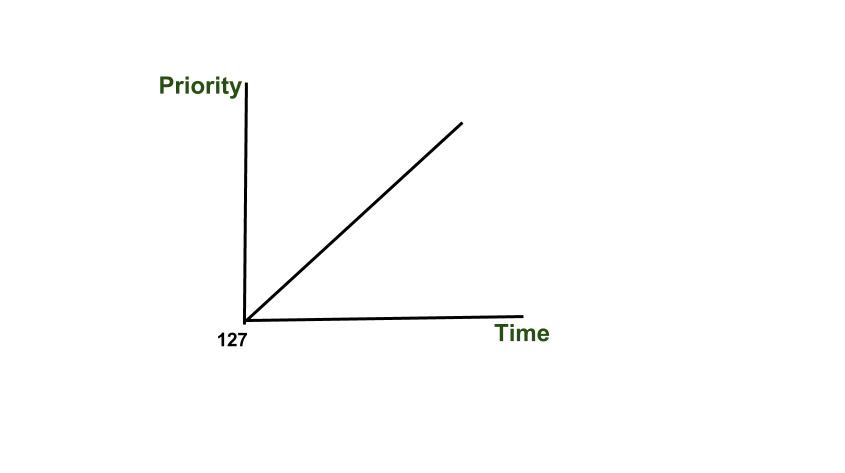

# 操作系统中的饥饿和老化问题

当操作系统中的一个进程因为其他进程占用资源而耗尽资源时，就会发生饥饿。这是资源管理中的一个问题，操作系统采用老化作为调度方法来防止它们饥饿。这是批处理系统中最常见的调度算法之一。每个进程都被分配一个优先级。优先级最高的进程将首先被执行，以此类推。这里，我们将讨论与优先级调度相关的一个主要问题及其解决方案。

## 什么是饥饿？

**饥饿**或称为无限期阻塞是与优先级调度算法相关的现象，其中一个准备运行CPU（资源）的进程可能因为优先级低而无限期等待。在负载较重的计算机系统中，持续不断的高优先级进程流可能会阻止低优先级进程获得CPU。有传言称，在1967年，MIT的IBM 7094使用了优先级调度，他们发现一个低优先级进程直到1973年还未被提交。

**示例：**

| 进程 | 执行时间 | 优先级 |
| --- | --- | --- |
| P1 | 4 | 10 |
| P2 | 7 | 1 |
| P3 | 10 | 2 |

**甘特图**

| P1 | P3 | P2 |
| --- | --- | --- |
| 0 | 4 | 14 | 21 |

如上例所示，P1进程比其他进程具有更高的优先级，因此更早获得CPU。我们可以设想这样一种情况：只有一个进程的优先级非常低（例如127），我们为另一个进程分配了高优先级，这可能导致该进程无限期等待CPU，从而导致**饥饿**。此外，我们还讨论了解决饥饿问题的方法。

## 饥饿的原因

- 在饥饿期间，没有足够的资源可供所有人使用，进程开始失去优先级。
- 如果高优先级进程持续垄断处理器，低优先级操作可能不得不无限期等待。由于低优先级程序不与任何内容通信，因此饥饿不会导致停滞。
- 如果采用随机选择进程的方法，进程可能需要等待很长时间才能被选中。
- 由于饥饿是一种确保系统不会陷入死锁的方法，它对系统整体的影响更为重要。
- 如果由于资源分配决策不当，进程从未获得执行所需的资源，可能会导致饥饿。

## 如何控制饥饿？

- 资源分配可以由一个公正的管理者来处理。为了防止饥饿，这个资源管理者公平地分配资源。
- 在分配处理器或资源时，最好避免随机选择进程，因为这会促进饥饿。
- 应该在资源分配优先级系统中包含老化原则，即进程等待的时间越长，其优先级就逐渐增加，以防止饥饿。

### 操作系统中死锁和饥饿的区别

- 当一组进程中的任何一个都无法向前推进，因为它们所需的资源被其他一些进程占用时，就会发生死锁，如图所示。另一方面，饥饿发生在一个进程无限期等待获取所需资源时。
- 死锁的另一个名称是**循环等待**。饥饿的另一个名称是**活锁**。
- 当发生死锁时，没有进程可以取得进展，而在饥饿中，除了受害进程外，其他进程可以取得进展或继续进行。

> **解决饥饿的方法：** 老化

## 什么是老化？

老化是一种逐渐增加在系统中等待很长时间的进程的优先级的技术。操作系统采用老化作为调度方法来防止它们饥饿。它本质上是逐步给予长时间等待的进程更多的重视。这使得它们更有可能获得执行所需的工具。因此，饥饿的可能性较小。如果等待的进程未被选中执行，则为其分配更高的优先级。它确保长时间等待的进程有平等的机会完成。老化与其他调度技术结合使用，以避免饥饿。以轮询或优先级调度为例，它通过保持即时和长期公平性之间的平衡来支持进程调度。例如，如果优先级范围从127（低）到0（高），我们可以每15分钟增加等待进程的优先级1。最终，即使是最初优先级为127的进程，也不会超过32小时，优先级127的进程就会老化为优先级0的进程。

## 老化的用途

- 在基于优先级的调度算法中，老化的主要目的是避免资源饥饿。通过逐步提高等待进程的优先级，老化确保即使是低优先级任务最终也有机会执行。这保持了资源分配的公平性，并确保没有进程会经历无限的资源短缺。
- 老化有助于资源在进程间的公平分配。操作系统通过逐步提高等待进程的优先级，确保每个进程无论最初优先级如何，都能获得其公平份额的资源和CPU时间。老化提高了系统的响应性。老化减少了一些低优先级进程长时间在等待队列中被拖延的可能性。随着它们的优先级逐步提高，它们被提供执行的机会，从而提高了系统性能。
- 随着人们年龄的增长，他们在进程的重要性水平上变得更加平衡。它通过防止系统中存在优先级差异极大的进程共存的情况，避免了低优先级任务被完全忽视。
- 老化对于优化长期性能非常有帮助。它避免了饥饿和优先级反转，这可能会对系统的整体效率和吞吐量产生不利影响。
- 老化有助于系统适应变化的工作负载和不同进程的需求。

## 老化的局限性

- **增加复杂性：** 老化需要定期调整等待进程的优先级，这可能会增加调度算法的整体复杂性。
- **开销：** 频繁的优先级调整可能会引入额外的开销，从而降低调度算法的整体效率。
- **不可预测的行为：** 如果老化速率设置不当，老化可能导致不可预测的行为。如果老化速率太慢，低优先级进程可能需要很长时间才能获得所需资源。另一方面，如果老化速率过快，它可能导致高优先级进程饥饿。
- **不公平：** 老化对新到达的进程也可能是不公平的，因为它优先考虑长时间等待的进程而不是新进程。这可能导致新进程在资源上饥饿，而长时间等待的进程继续获得资源。

## 饥饿和老化常见问题解答 - 常见问题解答

### 如何在操作系统中避免饥饿？

> 老化是一种方法，它通过在一定时间后提高低优先级进程的优先级来防止操作系统中的饥饿。因此，无论是高优先级进程还是最低优先级进程，都能够继续存在和运行。

### 老化会导致优先级反转问题吗？

> 是的，老化会导致优先级反转问题。

### 老化可以用于实时系统吗？

> 实时系统可以从老化的使用中受益，但其实施必须仔细规划，以节省处理成本并确保优先级反转问题不会干扰实时需求。

