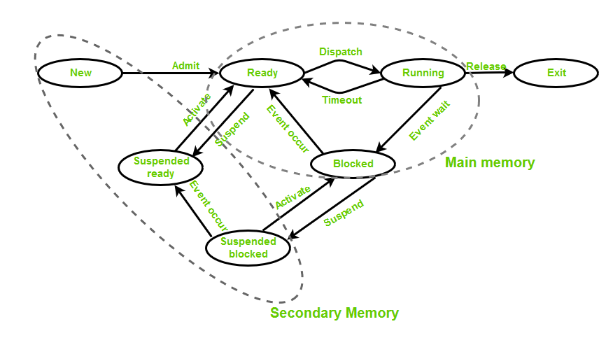

# 操作系统中的进程状态

## 操作系统中的进程状态

在操作系统中，进程是正在执行的程序。在其执行过程中，进程会经历不同的状态。理解这些状态有助于我们了解操作系统如何管理进程，确保计算机高效运行。

必须至少有五种状态。尽管在执行过程中进程可能处于这些状态之一，但这些状态的名称并不标准化。每个进程在其生命周期中都会经历几个阶段。在本文中，我们将详细讨论不同的状态。

## 操作系统中的进程状态

进程的状态如下：

- **新建状态**：在这一步中，进程即将被创建但尚未创建。它是存在于辅助存储器中的程序，将被操作系统选中以创建进程。

- **就绪状态**：新建 -> 准备运行。进程创建后，进程进入就绪状态，即进程已加载到主存储器中。这里的进程已准备好运行，正在等待获得CPU时间以执行。准备由CPU执行的进程被维护在一个称为就绪队列的队列中。

- **运行状态**：操作系统从就绪队列中选择进程进行执行，并由任何一个可用的CPU核心执行进程内的指令。

- **阻塞或等待状态**：每当进程请求访问I/O或需要用户输入或需要访问临界区（其锁已经被获取）时，它进入阻塞或等待状态。进程继续在主存储器中等待，不需要CPU。一旦I/O操作完成，进程进入就绪状态。

- **终止或完成状态**：进程被杀死，同时PCB被删除。分配给进程的资源将被释放或重新分配。

- **挂起就绪**：最初处于就绪状态的进程被调度器从主存储器中交换出去（参考虚拟内存主题），并被放置在外部存储器中，该进程被认为处于挂起就绪状态。当进程再次被加载到主存储器时，该进程将转换回就绪状态。

- **挂起等待或挂起阻塞**：与挂起就绪类似，但使用的进程正在执行I/O操作，由于缺乏主存储器导致它们被移动到辅助存储器。当工作完成后，它可能会进入挂起就绪状态。

- **CPU和I/O密集型进程**：如果进程在CPU操作上很密集，那么它被称为CPU密集型进程。同样，如果进程在I/O操作上很密集，那么它被称为I/O密集型进程。

## 进程如何从一个状态转移到另一个状态？

进程可以根据其执行状态和资源可用性在操作系统中不同状态之间移动。以下是进程如何在不同状态之间移动的一些示例：

- **新建到就绪**：当创建进程时，它处于新建状态。当操作系统为其分配资源并准备好执行时，它移动到就绪状态。

- **就绪到运行**：当CPU可用时，操作系统根据各种调度算法从就绪队列中选择一个进程，并将其移动到运行状态。

- **运行到阻塞**：当进程需要等待某个事件发生（I/O操作或系统调用）时，它移动到阻塞状态。例如，如果进程需要等待用户输入，它会移动到阻塞状态，直到用户提供输入。

- **运行到就绪**：当运行中的进程被操作系统抢占时，它移动到就绪状态。例如，如果有更高优先级的进程就绪，操作系统可能会抢占运行中的进程并将其移动到就绪状态。

- **阻塞到就绪**：当阻塞进程等待的事件发生时，进程移动到就绪状态。例如，如果进程正在等待用户输入，并且输入已提供，它将移动到就绪状态。

- **运行到终止**：当进程完成执行或被操作系统终止时，它移动到终止状态。

## 调度器类型

- **长期调度器**：决定应有多少进程保持在就绪状态。这决定了多道程序设计的度。一旦做出决定，它将持续很长时间，这也表明它运行不频繁。因此，它被称为长期调度器。

- **短期调度器**：短期调度器将决定哪个进程将被执行，然后调用调度程序。调度程序是一种将进程从就绪状态移动到运行状态的软件，反之亦然。换句话说，它是上下文切换。它频繁运行。短期调度器也称为CPU调度器。

- **中期调度器**：中期调度器做出挂起决定。中期调度器用于交换，即将进程从主存储器移动到辅助存储器，反之亦然。为了减少多道程序设计的度，会进行交换。

## 多道程序设计

我们有许多准备运行的进程。有两种类型的多道程序设计：

- **抢占**——进程被强制从CPU中移除。抢占也称为时分共享或多任务。
- **非抢占**——进程在完成执行前不会被移除。一旦将控制权交给CPU进行进程执行，直到CPU自行释放控制权，否则不能强行从CPU中取回控制权。

## 多道程序设计的度

可以驻留在就绪状态的最大进程数决定了多道程序设计的度，例如，如果程序设计度 = 100，这意味着最多有100个进程可以驻留在就绪状态。

## 进程上的操作

- **创建**：进程一旦被创建，就绪后进入就绪队列（主存储器），并准备执行。
- **计划**：操作系统从当前处于就绪队列中的众多进程中挑选一个进程开始执行。调度是从就绪状态选择下一个要运行的进程的过程。
- **应用**：处理器一旦被调度运行进程，就开始运行该进程。在执行过程中，进程可能会变得阻塞或等待，此时处理器转而执行其他进程。
- **杀死或删除**：进程的目的一旦实现，操作系统将终止该进程。进程的上下文将保留在那里。
- **阻塞**：当进程等待某个事件或资源时，它会阻塞。操作系统将其置于阻塞状态，并且直到事件或资源变得可用，它才能执行。
- **恢复**：当导致进程阻塞的事件或资源变得可用时，进程从阻塞状态中移除，并重新添加回就绪队列。
- **上下文切换**：当操作系统从执行一个进程切换到另一个进程时，它必须保存当前进程的上下文并加载下一个要执行的进程的上下文。这被称为上下文切换。
- **进程间通信**：进程可能需要相互通信以共享数据或协调行动。操作系统为进程间通信提供机制，如共享内存、消息传递和同步原语。
- **进程同步**：多个进程可能需要同时访问共享资源或代码的关键部分。操作系统提供同步机制，确保一次只有一个进程可以访问资源或关键部分。
- **进程状态**：进程可能处于几种状态之一，包括就绪、运行、等待和终止。操作系统管理进程状态和它们之间的转换。

## 进程状态的特点

- 进程可以从运行状态移动到等待状态，如果它需要等待资源变得可用。
- 进程可以从等待状态移动到就绪状态，当它等待的资源变得可用时。
- 进程可以从就绪状态移动到运行状态，当它被操作系统选中执行时。
- 操作系统使用的调度算法决定了从就绪状态选择哪个进程执行。
- 操作系统也可能将进程从运行状态移动到就绪状态，以允许其他进程执行。
- 进程可以从运行状态移动到终止状态，当它完成执行时。
- 进程可以从等待状态直接移动到终止状态，如果它被操作系统或其他进程中止或杀死。
- 进程在其生命周期中可以多次经历就绪、运行和等待状态，但新建和终止只发生一次。
- 进程状态包括有关程序计数器、CPU寄存器、内存分配和进程使用的其他资源的信息。
- 操作系统为每个进程维护一个进程控制块（PCB），其中包含有关进程状态、优先级、调度信息和其他与进程相关的数据。
- 进程状态图用于表示进程状态之间的转换，是操作系统进程管理中的一个基本概念。

## 结论

总之，理解操作系统中进程的状态对于理解系统如何有效管理多个进程至关重要。这些状态——新建、就绪、运行、等待和终止——代表了进程生命周期中的不同阶段。通过经历这些状态，操作系统确保进程顺利执行，有效分配资源，并优化计算机的整体性能。这些知识有助于我们欣赏现代计算背后的复杂性和效率。

