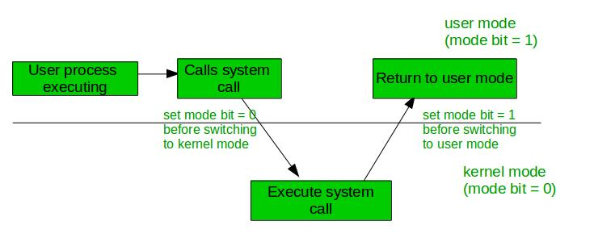

# 操作系统中的双模式操作

一个程序中的错误可能会对许多进程产生不利影响，它可能会修改另一个程序的数据，也可能会影响操作系统。例如，如果一个进程陷入无限循环，那么这个无限循环可能会影响其他进程的正确操作。为了确保操作系统的正确执行，存在两种操作模式：

**用户模式 –**

当计算机系统运行用户应用程序，如创建文本文档或使用任何应用程序时，系统处于用户模式。当用户应用程序请求操作系统服务或发生中断或系统调用时，将从用户模式过渡到内核模式以满足请求。

> **注意：** 要从内核模式切换到用户模式，模式位应为 1。

下图描述了发生中断时会发生什么：

**内核模式：** 当系统启动时，硬件在内核模式下启动，当操作系统加载时，它在用户模式下启动用户应用程序。为了保护硬件，我们有特权指令，这些指令仅在内核模式下执行。如果用户尝试在用户模式下运行特权指令，那么它将把指令视为非法的，并捕获到操作系统。一些特权指令包括：

1. 处理中断
2. 从用户模式切换到内核模式。
3. 输入/输出管理。

**双模式操作的需求：**

某些类型的任务不需要任何类型的硬件支持，这就是为什么某些类型的进程应该对用户隐藏。这些任务可以通过操作系统的双模式分别处理。

内核级别的程序执行操作系统的所有底层功能，如内存管理、进程管理等，因此操作系统需要在双模式下运行。双模式对于指定用户在操作系统中仅能访问其使用的任务是必要的。

基本上，每当操作系统处理用户应用程序时，它都处于用户模式。当用户请求某些硬件服务时，会发生从用户模式到内核模式的过渡，这是通过将模式位从 1 更改为 0 来完成的。同样，模式位再次更改为 1 以返回用户模式。

### 优点：

1. **保护：** 双模式操作在用户程序和操作系统之间提供了一层保护。在用户模式下，程序被限制访问特权资源，例如硬件设备或敏感系统数据。在内核模式下，操作系统可以完全访问这些资源，允许它保护系统免受恶意或未经授权的访问。
2. **稳定性：** 双模式操作有助于通过阻止用户程序干扰系统级操作来确保系统稳定性。通过在用户模式下限制对特权资源的访问，操作系统可以防止程序意外或恶意地导致系统崩溃或其他错误。
3. **灵活性：** 双模式操作允许操作系统支持广泛的应用程序和硬件设备。通过在用户程序和操作系统之间提供明确定义的接口，更容易开发和部署新应用程序和硬件。
4. **调试：** 双模式操作使得调试和诊断操作系统和应用程序的问题变得更加容易。通过在用户模式和内核模式之间切换，开发人员可以更快更容易地识别和修复问题。
5. **安全性：** 双模式操作通过防止未经授权访问关键系统资源来增强系统安全性。在用户模式下运行的用户程序无法修改系统数据或执行特权操作，降低了恶意软件攻击或其他安全威胁的风险。
6. **效率：** 双模式操作可以通过减少与系统级操作相关的开销来提高系统性能。通过允许用户程序在用户模式下直接访问资源，操作系统可以避免不必要的上下文切换和其他性能损失。
7. **兼容性：** 双模式操作确保与旧版应用程序和硬件设备的向后兼容性。通过为用户程序提供与操作系统交互的标准接口，更容易维护与旧软件和硬件的兼容性。
8. **隔离：** 双模式操作在用户程序之间提供隔离，防止一个程序干扰另一个程序。通过在各自受保护的内存空间中运行每个程序，操作系统可以防止程序访问彼此的数据或造成冲突。
9. **可靠性：** 双模式操作通过阻止用户程序引起的崩溃和其他错误来增强系统的可靠性。通过限制对关键系统资源的访问，操作系统可以确保正确且可靠地执行系统级操作。

### 缺点：

1. **性能：** 双模式操作可能会引入开销并降低系统性能。在用户模式和内核模式之间切换需要上下文切换，这可能既耗时又可能影响系统性能。
2. **复杂性：** 双模式操作可能会增加系统的复杂性，使得开发和维护操作系统变得更加困难。需要支持用户模式和内核模式的需求可能会使设计和实现系统功能更具挑战性，并确保系统稳定性。
3. **安全性：** 双模式操作可能会引入安全漏洞。恶意程序可能能够利用操作系统中的漏洞来获得对特权资源的访问或执行恶意代码。
4. **可靠性：** 双模式操作可能会引入可靠性问题，因为很难测试和验证用户模式和内核模式的正确操作。在任一模式中的 bug 或错误都可能导致系统崩溃、数据损坏或其他可靠性问题。
5. **兼容性：** 双模式操作可能会造成兼容性问题，因为不同的操作系统可能为用户模式和内核模式实现不同的接口或策略。这可能使得开发与多个操作系统兼容的应用程序变得困难，或在不同系统之间迁移应用程序。
6. **开发复杂性：** 双模式操作需要更高级别的技术专长和开发技能来设计和实现操作系统。这可能会增加创建新操作系统或更新现有操作系统的开发时间和成本。
7. **维护复杂性：** 双模式操作可能会使维护和支持变得更加复杂，因为需要确保用户模式和内核模式的兼容性和安全性。这可能会增加系统更新、补丁和升级所需的成本和时间。

> **注意：** 要从用户模式切换到内核模式，位应该为 0。

