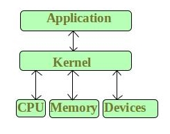
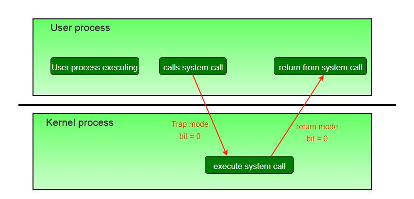
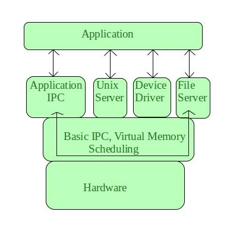

# 操作系统中的微内核

### 引言：

微内核是一种操作系统内核的设计，旨在仅提供操作系统运行所需的最基本服务，如内存管理和进程调度。其他服务，如设备驱动程序和文件系统，是作为用户级进程通过消息传递与微内核通信实现的。这种设计使得操作系统比传统的单体内核更加模块化和灵活，后者在内核空间实现所有操作系统服务。

微内核架构的主要优点是它提供了一个更安全和稳定的操作系统。由于只有最必要的服务在内核空间运行，操作系统的攻击面减少了，这使得攻击者更难以利用漏洞。此外，如果用户级进程崩溃，它不会影响整个系统的稳定性，因为微内核只负责管理进程和内存。

微内核架构的另一个优点是它使操作系统更加模块化和灵活。由于服务是作为用户级进程实现的，因此更容易添加、删除或替换服务，而不影响系统的其他部分。这使得更容易根据特定要求定制操作系统。

然而，微内核架构也有一些缺点。一个主要的缺点是用户级进程之间的消息传递可能比单体内核中的直接系统调用慢。这可能影响操作系统的性能，特别是在高性能应用中。此外，微内核的模块化设计可能导致复杂性增加，这可能使得开发和维护操作系统变得更加困难。

总体而言，微内核架构可以提供更安全和灵活的操作系统，但它也可能带来一些性能和复杂性的权衡。选择微内核和单体内核架构取决于正在开发的操作系统的具体需求和要求。

**内核** 是操作系统的核心部分，负责管理系统资源。它还充当应用程序与计算机硬件之间的桥梁。它是启动时首先加载的程序之一（在引导加载程序之后）。

**CPU操作的内核模式和用户模式**

CPU只有在内核模式下才能执行某些指令。这些指令称为特权指令。它们允许实现特殊操作，如果用户程序执行这些操作可能会影响操作系统的运行或其他用户程序的活动。例如，管理内存保护的指令。

- 当操作系统在内核中执行时，它会将CPU置于内核模式，以便内核可以执行一些特殊操作。
- 当用户程序正在执行时，操作系统会将CPU置于用户模式，这样用户程序就不能与操作系统程序交互。
- 用户级指令不需要特殊权限。例如 ADD、PUSH 等。

模式的概念可以扩展到两个以上，对于支持虚拟化的CPU，需要使用一个以上的模式位。它使用这些额外的位之一来指示虚拟机管理器（VMM）何时控制系统。VMM 拥有比普通用户程序更多的权限，但不如完整内核那么多。

系统调用通常以软件中断的形式实现，这会导致硬件的中断处理程序将控制权转移给操作系统的一部分，即适当的中断处理程序，并在此过程中将位模式切换到内核模式。中断处理程序检查到底生成了哪个中断，检查其他参数（通常通过寄存器传递），然后调用适当的内核服务例程来处理系统调用请求的服务。

用户程序尝试执行非法指令（特权或不存在的指令）或访问禁止的内存区域，也会产生软件中断，这些中断被中断处理程序捕获，控制权转移到操作系统，操作系统发出适当的错误消息，可能将数据转储到日志（核心）文件以供以后分析，然后终止违规程序。

**什么是微内核？**

微内核是内核的一种分类。作为一个内核，它管理所有系统资源。但在微内核中，**用户服务** 和 **内核服务** 在不同的地址空间中实现。用户服务保留在**用户地址空间**中，而内核服务保留在**内核地址空间**下，从而也减少了内核和操作系统的大小。

它提供最小化的进程和内存管理服务。通过消息传递在客户端程序/应用程序和在用户地址空间运行的服务之间建立通信，降低了微内核的执行速度。操作系统**不受影响**，因为用户服务和内核服务是隔离的，所以如果任何用户服务失败，它不会影响内核服务。因此，它增加了微内核的一个优点。它很容易**扩展**，即如果需要添加任何新服务，它们被添加到用户地址空间，因此不需要修改内核空间。它也是可移植的、安全的和可靠的。基于微内核的操作系统的示例包括 L4、QNX 和 MINIX。

**微内核架构 -**

由于内核是操作系统的核心部分，因此它只负责处理最重要的服务。因此，在这种架构中，只有最重要的服务位于内核内部，其余的操作系统服务存在于系统应用程序中。因此，用户能够在系统应用程序内与那些不那么重要的服务进行交互。微内核完全负责操作系统最重要的服务，它们被命名为：

- 进程间通信
- 内存管理
- CPU 调度

### 基于微内核的操作系统的一些关键特性包括：

**小巧且简单的内核：** 微内核旨在尽可能小巧简单，仅包含管理系统资源（如内存、进程和进程间通信）所需的基本功能。

**模块化设计：** 大多数操作系统的服务和驱动程序被移至用户空间，可以根据需要加载和卸载。这允许更模块化和灵活的设计，并使向系统添加或移除功能变得更加容易。

**消息传递：** 操作系统不同部分之间的通信通常使用消息传递而不是共享内存来完成。这提供了一种更安全、更可靠的信息交换方式，有助于防止错误和错误在系统中传播。

**可扩展性：** 微内核设计使得向操作系统添加新功能变得更加容易，因为可以在不修改内核本身的情况下将新服务和驱动程序添加到用户空间。

**安全性：** 通过将内核与操作系统的大部分服务分离，基于微内核的操作系统可以更安全，因为用户空间代码中的漏洞不太可能影响内核。此外，基于微内核的系统通常使用形式化验证技术来确保内核代码的正确性。

**微内核架构如何使操作系统更加模块化和灵活？**

服务作为用户级进程实现，这使得添加、删除或替换服务而不会影响系统的其他部分变得更加容易。这使得根据特定要求定制操作系统变得更加容易。

**微内核的优点 -**

- **模块化：** 由于内核和服务器可以独立开发和维护，微内核设计允许更大的模块化。这可以使向系统添加和移除功能和服务变得更加容易。
- **故障隔离：** 微内核设计有助于隔离故障并防止其影响整个系统。如果服务器或其他组件失败，可以在不干扰系统其余部分的情况下重新启动或替换。
- **性能：** 由于内核只包含管理系统所需的基本功能，微内核设计可以提高性能。这可以使系统更快、更高效。
- **安全性：** 微内核设计可以通过限制内核提供的功能来减少系统的攻击面，从而提高安全性。恶意软件可能会发现更难因此而破坏系统。
- **可靠性：** 微内核比单体内核更简单，这可以使它们更可靠，更不容易崩溃或其他问题。
- **可扩展性：** 微内核可以轻松扩展以支持不同的硬件架构，使它们更加通用。
- **可移植性：** 微内核可以轻松移植到不同的平台，这使它们对嵌入式系统和其他特殊应用非常有用。

**Eclipse IDE** 是微内核架构的一个好例子。

### 微内核架构的优点：

1. 由于减少了攻击面，因此操作系统更安全
2. 系统稳定性更好，因为用户级进程的崩溃不会影响整个系统
3. 更加模块化和灵活，使定制操作系统更容易
4. 开发过程简化，因为服务作为独立的用户级进程开发和测试

### 微内核架构的缺点：

1. 用户级进程之间的消息传递较慢，可能会影响性能，特别是在高性能应用中
2. 模块化设计增加了复杂性，可能使开发和维护操作系统变得更加困难
3. 由于内核和用户级进程的分离，性能优化有限
4. 与单体内核相比，内存使用量更高
5. 总体而言，微内核架构在安全性、灵活性和模块化方面提供了优势，但可能在性能和复杂性方面有所权衡。选择微内核和单体内核架构取决于正在开发的操作系统的具体需求和要求。
