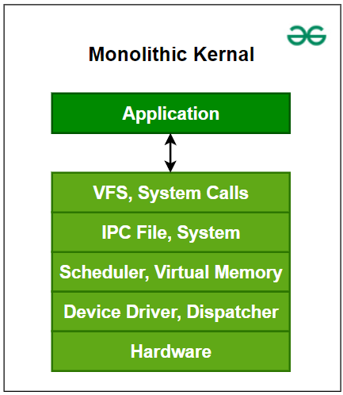

# 单体内核和与微内核的主要区别

除了微内核之外，**单体内核** 是内核的另一种分类。像微内核一样，单体内核也在应用程序和硬件之间管理系统资源，但 **用户** 和 **内核服务** 在相同的地址空间下实现。这增加了内核的大小，从而也增加了操作系统的大小。这种内核通过系统调用来提供 CPU 调度、内存管理、文件管理和其他操作系统功能。由于两种服务都在相同的地址空间下实现，操作系统的执行速度更快。

## 什么是单体内核？

单体内核是一种操作系统内核，在这种内核中，所有操作系统服务都在内核空间运行，这意味着它们都共享相同的内存空间。这种类型的内核以其系统服务的紧密集成和高性能而闻名。

下面是单体内核的图示：

单体内核

### 单体内核的优点

- 单体内核的一个主要优点是它通过系统调用来提供 CPU 调度、内存管理、文件管理和其他操作系统功能。
- 另一个优点是它是一个完全在单个地址空间中运行的单一大型进程。
- 它是一个单一的静态二进制文件。一些基于单体内核的操作系统示例包括 Unix、Linux、Open VMS、XTS-400、z/TPF。
- 不需要复杂的进程间通信 (IPC)，这加快了系统调用执行速度。

### 单体内核的缺点

- **稳定性问题**：单体内核的一个主要缺点是如果任何服务失败，它会导致整个系统失败。
- **缺乏模块化**：如果用户需要添加任何新服务，用户需要修改整个操作系统。
- **安全风险**：任何服务中的 bug 或漏洞都可能影响整个系统，因为所有服务都在内核模式下运行。
- **体积庞大**：随着更多服务的添加，内核可能变得非常大且复杂。

## 什么是微内核？

微内核是一种操作系统内核，其中只有最基本的服务在内核空间运行，其他服务在用户空间运行。这种类型的内核以其模块化、简单性和能够在相同硬件上运行多个操作系统而闻名。

微内核本身通常只包括最基本的服务，例如：

- **进程间通信 (IPC)**：进程之间通信和同步的机制。
- **基本调度**：管理进程的执行。
- **最小内存管理**：内存分配和保护的基本功能。

通常包含在单体内核中的其他功能，如设备驱动程序、文件系统和网络协议，作为用户空间中的独立进程实现。这与单体内核形成对比，在单体内核中，所有这些服务都在内核空间运行。

## 内核空间与用户空间

在比较内核类型之前，了解组件是在内核空间还是用户空间运行很重要，因为这会影响系统的工作方式。

在操作系统中，代码运行的两个主要区域是用户空间和内核空间。**用户空间是用户应用程序运行的地方，而内核空间是操作系统和其他重要部分运行的地方**。在内核空间中，代码可以直接访问内存和硬件等系统资源，允许它执行用户空间代码无法执行的特殊任务。

系统调用对于连接用户空间和内核空间很重要。它们允许用户应用程序请求内核提供特定服务。当应用程序进行系统调用时，它从用户空间切换到内核空间，允许内核完成应用程序请求的操作。

## 单体内核和微内核之间的主要区别

- **系统服务**：在单体内核中，所有系统服务都在内核空间运行，而在微内核中，只有最基本的服务（如内存管理和进程调度）在内核空间运行，其他服务在用户空间运行。
- **性能**：单体内核通常比微内核更快、更高效，因为与在内核空间和用户空间之间移动数据相关的开销较小。
- **模块化**：微内核比单体内核更模块化，因为服务被分离到用户空间中不同的进程中运行。这使得添加或移除服务而不会影响系统的其他部分变得更加容易。
- **安全性**：微内核通常被认为比单体内核更安全，因为在用户空间运行的服务中的 bug 或漏洞不太可能影响整个系统。
- **开发**：开发单体内核通常比开发微内核更简单、更快，因为所有系统服务都集成在一起并共享相同的内存空间。

## 单体内核与微内核的区别

| 基础 | 微内核 | 单体内核 |
| --- | --- | --- |
| **大小** | 更小 | 由于操作系统和用户都在同一地址空间中，因此更大。 |
| **执行速度** | 较慢 | 更快 |
| **可扩展性** | 易于扩展 | 扩展复杂 |
| **安全性** | 如果服务崩溃，则不影响微内核的工作。 | 如果进程/服务崩溃，整个系统都会崩溃，因为用户和操作系统都在同一地址空间中。 |
| **代码** | 编写微内核需要更多的代码。 | 编写单体内核需要较少的代码。 |
| **示例** | L4Linux, macOS | Windows, Linux BSD |
| **安全性** | 由于只有基本服务在内核模式下运行，因此更安全。 | 由于在内核模式下运行的代码量较大，因此容易受到安全漏洞的攻击。 |
| **平台独立性** | 由于大多数驱动程序和服务在用户空间运行，因此更可移植。 | 由于直接访问硬件，因此可移植性较低。 |
| **通信** | 用户空间服务器之间的消息传递 | 内核内直接函数调用 |
| **性能** | 由于消息传递和更多的开销，性能较低。 | 由于直接函数调用和较少的开销，性能较高。 |

## 结论

总之，单体内核的特点在于系统服务的紧密集成和高性能，而微内核的特点在于其模块化、简单性和安全性。选择单体内核和微内核架构取决于正在开发的操作系统的具体需求和要求。

