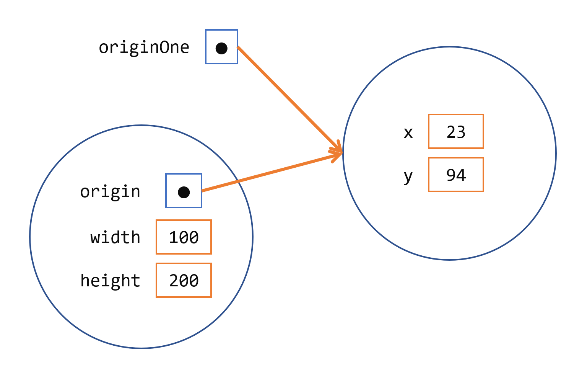

# 创建和使用对象

## 理解对象是什么

一个典型的Java程序会创建许多对象，它们通过调用方法进行交互。通过这些对象之间的交互，程序能够执行各种任务，例如实现图形用户界面、运行动画或通过网络发送和接收信息。一旦对象完成了它被创建的工作，它的资源将被回收供其他对象使用。

这里有一个名为 `CreateObjectDemo` 的小程序，它创建了三个对象：一个 `Point` 对象和两个 `Rectangle` 对象。您需要这三个源文件来编译此程序。

```java
public class CreateObjectDemo {
    public static void main(String[] args) {

        // 声明并创建一个点对象和两个矩形对象。
        Point originOne = new Point(23, 94);
        Rectangle rectOne = new Rectangle(originOne, 100, 200);
        Rectangle rectTwo = new Rectangle(50, 100);

        // 显示 rectOne 的宽度、高度和面积
        System.out.println("Width of rectOne: " + rectOne.width);
        System.out.println("Height of rectOne: " + rectOne.height);
        System.out.println("Area of rectOne: " + rectOne.getArea());

        // 设置 rectTwo 的位置
        rectTwo.origin = originOne;

        // 显示 rectTwo 的位置
        System.out.println("X Position of rectTwo: " + rectTwo.origin.x);
        System.out.println("Y Position of rectTwo: " + rectTwo.origin.y);

        // 移动 rectTwo 并显示其新位置
        rectTwo.move(40, 72);
        System.out.println("X Position of rectTwo: " + rectTwo.origin.x);
        System.out.println("Y Position of rectTwo: " + rectTwo.origin.y);
    }
}
```

这是 `Point` 类：

```java
public class Point {
    public int x = 0;
    public int y = 0;
    // 一个构造函数!
    public Point(int a, int b) {
        x = a;
        y = b;
    }
}
```

以及 `Rectangle` 类：

```java
public class Rectangle {
    public int width = 0;
    public int height = 0;
    public Point origin;

    // 四个构造函数
    public Rectangle() {
        origin = new Point(0, 0);
    }
    public Rectangle(Point p) {
        origin = p;
    }
    public Rectangle(int w, int h) {
        origin = new Point(0, 0);
        width = w;
        height = h;
    }
    public Rectangle(Point p, int w, int h) {
        origin = p;
        width = w;
        height = h;
    }

    // 移动矩形的方法
    public void move(int x, int y) {
        origin.x = x;
        origin.y = y;
    }

    // 计算矩形面积的方法
    public int getArea() {
        return width * height;
    }
}
```

这个程序创建、操作并显示有关各种对象的信息。这是输出结果：

```
Width of rectOne: 100
Height of rectOne: 200
Area of rectOne: 20000
X Position of rectTwo: 23
Y Position of rectTwo: 94
X Position of rectTwo: 40
Y Position of rectTwo: 72
```

接下来的三节使用上述示例来描述程序中对象的生命周期。从它们中，您将学习如何编写代码来在您自己的程序中创建和使用对象。您还将学习系统如何在对象生命周期结束时进行清理。

## 创建对象

如您所知，类为对象提供了蓝图；您从类中创建对象。以下每条语句均来自 `CreateObjectDemo` 程序，它们创建了一个对象并将其分配给一个变量：

```java
Point originOne = new Point(23, 94);
Rectangle rectOne = new Rectangle(originOne, 100, 200);
Rectangle rectTwo = new Rectangle(50, 100);
```

第一行创建了一个 `Point` 类的对象，第二行和第三行各自创建了一个 `Rectangle` 类的对象。

这些语句每条都有三个部分（下面详细讨论）：

1. 声明：加粗的代码是将变量名称与对象类型相关联的变量声明。
2. 实例化：`new` 关键字是一个Java操作符，用于创建对象。
3. 初始化：`new` 操作符后面跟着一个构造函数调用，该构造函数初始化了新对象。

### 声明引用对象的变量

之前，您了解到声明变量时，您会写：

```java
type name;
```

这通知编译器您将使用名称来引用数据类型为类型的数据。对于原始变量，此声明还为变量预留了适当数量的内存。

您也可以在自己的行上声明引用变量。例如：

```java
Point originOne;
```

如果您这样声明 `originOne`，它的值将在实际创建对象并分配给它之前是未确定的。仅声明引用变量并不会创建对象。为此，您需要使用 `new` 操作符，如下一节所述。您必须在代码中分配一个对象给 `originOne`，否则您将得到编译器错误。

处于此状态的变量，当前没有引用任何对象。

### 类的实例化

`new` 操作符通过为新对象分配内存并返回对该内存的引用来实例化类。`new` 操作符还调用对象构造函数。

> 注意："实例化一个类"这个短语与"创建一个对象"意思相同。当您创建一个对象时，您正在创建一个类的"实例"，因此"实例化"一个类。

`new` 操作符需要一个单独的后缀参数：对构造函数的调用。构造函数的名称提供了要实例化的类的名称。

`new` 操作符返回它创建的对象的引用。此引用通常分配给适当类型的变量，如：

```java
Point originOne = new Point(23, 94);
```

`new` 操作符返回的引用不必分配给变量。它也可以直接在表达式中使用。例如：

```java
int height = new Rectangle().height;
```

下面一节将讨论这个语句。

### 初始化对象

这是 `Point` 类的代码：

```java
public class Point {
    public int x = 0;
    public int y = 0;
    // 构造函数
    public Point(int a, int b) {
        x = a;
        y = b;
    }
}
```

这个类包含一个单一的构造函数。您可以从声明中识别构造函数，因为它的声明使用与类相同的名称，并且没有返回类型。`Point` 类中的构造函数接受两个整数参数，由代码 `(int a, int b)` 声明。以下语句为这些参数提供 23 和 94 作为值：

```java
Point originOne = new Point(23, 94);
```

执行这个语句的结果可以在下图中说明：


一个 Point 对象

这是包含四个构造函数的 `Rectangle` 类的代码：

```java
public class Rectangle {
    public int width = 0;
    public int height = 0;
    public Point origin;

    // 四个构造函数
    public Rectangle() {
        origin = new Point(0, 0);
    }

    public Rectangle(Point p) {
        origin = p;
    }

    public Rectangle(int w, int h) {
        origin = new Point(0, 0);
        width = w;
        height = h;
    }

    public Rectangle(Point p, int w, int h) {
        origin = p;
        width = w;
        height = h;
    }

    // 移动矩形的方法
    public void move(int x, int y) {
        origin.x = x;
        origin.y = y;
    }

    // 计算矩形面积的方法
    public int getArea() {
        return width * height;
    }
}
```

每个构造函数都允许您使用原始类型和引用类型为矩形的 `origin`、`width` 和 `height` 提供初始值。如果一个类有多个构造函数，它们必须具有不同的签名。Java编译器根据参数的数量和类型区分构造函数。当Java编译器遇到以下代码时，它知道要调用 `Rectangle` 类中需要一个 `Point` 参数然后是两个整数参数的构造函数：

```java
Rectangle rectOne = new Rectangle(originOne, 100, 200);
```

这个调用了 `Rectangle` 的一个构造函数，将 origin 初始化为 `originOne`。此外，构造函数将宽度设置为 100，高度设置为 200。现在有两个指向同一个 `Point` 对象的引用，下图显示了这一点：



一个 Rectangle 对象

以下代码行调用需要两个整数参数的 `Rectangle` 构造函数，这些参数为 `width` 和 `height` 提供初始值。如果您检查构造函数内的代码，您将看到它创建了一个新的`Point` 对象，其 `x` 和 `y` 值被初始化为 0：

```java
Rectangle rectTwo = new Rectangle(50, 100);
```

在以下语句中使用的 `Rectangle` 构造函数不接受任何参数，因此它被称为无参数构造函数：

```java
Rectangle rect = new Rectangle();
```

所有类至少有一个构造函数。如果一个类没有显式声明任何构造函数，Java编译器会自动提供一个无参数构造函数，称为默认构造函数。这个默认构造函数调用类父类的无参数构造函数，或者如果类没有其他父类，则调用 `Object` 构造函数。如果父类没有构造函数（`Object` 确实有一个），编译器将拒绝程序。

## 使用对象

一旦您创建了一个对象，您可能想要用它来做一些事情。您可能需要使用它的一个字段的值，更改它的一个字段，或者调用它的一个方法来执行一个动作。

### 引用对象的字段

通过名称访问对象字段。您必须使用一个明确无误的名称。

您可以在类内部使用字段的简单名称。例如，我们可以在 `Rectangle` 类内添加一个语句来打印 `width` 和 `height`：

```java
System.out.println("Width and height are: " + width + ", " + height);
```

在这种情况下，`width` 和 `height` 是简单名称。

在对象类之外的代码必须使用对象引用或表达式，后跟点（`.`）运算符，然后是简单的字段名称，如：

```java
objectReference.fieldName
```

例如，`CreateObjectDemo` 类中的代码在 `Rectangle` 类的代码之外。因此，要引用名为 `rectOne` 的 `Rectangle` 对象内的 `origin`、`width` 和 `height` 字段，`CreateObjectDemo` 类必须分别使用名称 `rectOne.origin`、`rectOne.width` 和 `rectOne.height`。程序使用这两个名称来显示 `rectOne` 的 `width` 和 `height`：

```java
System.out.println("Width of rectOne: "  + rectOne.width);
System.out.println("Height of rectOne: " + rectOne.height);
```

尝试在 `CreateObjectDemo` 类的代码中使用简单名称 `width` 和 `height` 是没有意义的 —— 这些字段只存在于对象内部 —— 并将导致编译器错误。

稍后，程序使用类似的代码来显示有关 `rectTwo` 的信息。相同类型的多个对象拥有各自独立副本的实例字段。因此，每个 `Rectangle` 对象都有名为 `origin`、`width` 和 `height` 的字段。当您通过对象引用访问一个实例字段时，您引用的是特定对象的字段。`CreateObjectDemo` 程序中的 `rectOne` 和 `rectTwo` 两个对象拥有不同的 `origin`、`width` 和 `height` 字段。

要访问一个字段，您可以使用对对象的命名引用，如前面的示例，或者您可以使用任何返回对象引用的表达式。回想一下，`new` 操作符返回一个对象引用。因此，您可以使用从 new 返回的值来访问新对象的字段：

```java
int height = new Rectangle().height;
```

这条语句创建了一个新的 `Rectangle` 对象，并立即获取它的 `height`。本质上，这个语句计算了 `Rectangle` 的默认高度。请注意，执行此语句后，程序不再拥有对创建的 `Rectangle` 的引用，因为程序从未在任何地方存储过该引用。该对象未被引用，其资源可以由Java虚拟机回收。

### 调用对象的方法

您也使用对象引用来调用对象的方法。您将方法的简单名称附加到对象引用上，中间有一个点操作符（`.`）。此外，您在括号内提供任何方法的参数。如果方法不需要任何参数，请使用空括号。

```java
objectReference.methodName(argumentList);
```

或：

```java
objectReference.methodName();
```

`Rectangle` 类有两个方法：`getArea()` 来计算矩形的面积和 `move()` 来改变矩形的原点。以下是调用这两个方法的 `CreateObjectDemo` 代码：

```java
System.out.println("Area of rectOne: " + rectOne.getArea());
...
rectTwo.move(40, 72);
```

第一条语句调用 `rectOne` 的 `getArea()` 方法并显示结果。第二行移动 `rectTwo`，因为 `move()` 方法为对象的 `origin.x` 和 `origin.y` 分配了新值。

与实例字段一样，`objectReference` 必须是对对象的引用。您可以使用变量名称，但您也可以使用任何返回对象引用的表达式。`new` 操作符返回对象引用，因此您可以使用从 `new` 返回的值来调用新对象的方法：

```java
new Rectangle(100, 50).getArea()
```

表达式 `new Rectangle(100, 50)` 返回一个引用，该引用引用一个 `Rectangle` 对象。如上所示，您可以使用点表示法调用新 `Rectangle` 的 `getArea()` 方法来计算新矩形的面积。

一些方法，如 `getArea()`，返回一个值。对于返回值的方法，您可以在表达式中使用方法调用。您可以将返回值分配给变量，使用它进行决策，或控制循环。这段代码将 `getArea()` 返回的值分配给变量 `areaOfRectangle`：

```java
int areaOfRectangle = new Rectangle(100, 50).getArea();
```

在这种情况下，`getArea()` 被调用的对象是构造函数返回的矩形。

## 垃圾收集器

一些面向对象的语言要求您跟踪您创建的所有对象，并在不再需要时显式销毁它们。显式管理内存既繁琐又容易出错。Java平台允许您创建尽可能多的对象（当然，受到您的系统能够处理的限制），您不必担心销毁它们。Java运行时环境在确定它们不再被使用时会删除对象。这个过程称为垃圾收集。

当没有更多引用指向某个对象时，该对象就有资格进行垃圾收集。通常当变量离开作用域时，持有在变量中的引用会被丢弃。或者，您可以通过将变量设置为特殊值 `null` 来显式丢弃对象引用。记住，程序可以对同一个对象有多个引用；在对象符合垃圾收集条件之前，必须丢弃对对象的所有引用。

Java运行时环境有一个垃圾收集器，它定期释放不再被引用的对象所使用的内存。垃圾收集器在确定时机成熟时会自动执行其工作。

