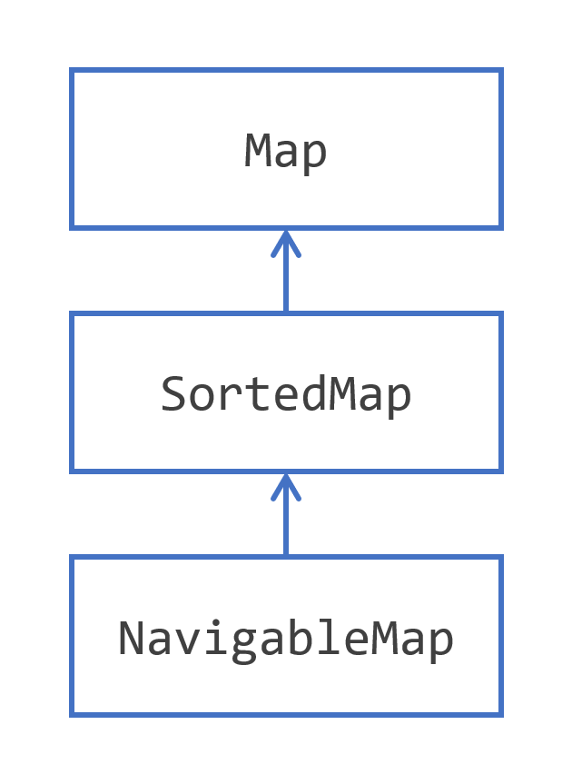

# 使用映射存储键值对

## 映射层次结构介绍
集合框架提供的第二种主要结构是非常经典的数据结构实现：哈希映射结构。这个概念并不新鲜，并且在数据结构化方面至关重要，无论是内存中还是其他方面。它是如何工作的，又是如何在集合框架中实现的呢？

哈希映射是一种能够存储键值对的结构。值是应用程序需要处理的任何对象，而键是能够表示该对象的东西。

假设您需要创建一个应用程序来处理发票，发票由 `Invoice` 类的实例表示。然后，您的值就是这些 `Invoice` 实例，而键可以是发票号码。每个发票都有一个号码，且在所有发票中该号码是唯一的。

一般来说，每个值都绑定到一个键上，就像发票绑定到其发票号码一样。如果您有一个给定的键，您可以检索到值。通常，键是一个简单的对象：想象几个字符的字符串或一个数字。另一方面，值可以是您需要的那样复杂。这就是哈希映射的用途：您可以操作键，将它们从应用程序的一个部分移动到另一个部分，通过网络传输它们，当您需要完整对象时，然后您可以使用其键检索它。

在您看到 `Map` 接口的所有细节之前，这里有一些您需要记住的概念。
- 哈希映射可以存储键值对
- 键作为给定值的符号
- 键是一个简单的对象，值可以是所需的那样复杂
- 在哈希映射中，键是唯一的，值不必是唯一的
- 存储在哈希映射中的每个值都必须绑定到一个键上，在映射中的键值对形成该映射的一个 _条目_
- 可以使用键检索其绑定的值

集合框架为您提供了一个实现这一概念的 `Map` 接口，以及两个扩展，`SortedMap` 和 `NavigableMap`，如下所示。



这个层次结构非常简单，看起来像 `Set` 层次结构，有 `SortedSet` 和 `NavigableSet`。实际上，`SortedMap` 与 `SortedSet` 共享相同类型的语义：`SortedMap` 是一个按其键排序的映射。`NavigableMap` 也是如此：这个接口添加的方法与 `NavigableSet` 添加到 `SortedSet` 的方法相同。

JDK为您提供了几种 `Map` 接口的实现，最广泛使用的是 `HashMap` 类。

以下是另外两种实现。
- `LinkedHashMap` 是一个带有内部结构的 `HashMap`，用于保持键值对的顺序。迭代键或键值对将遵循您添加键值对的顺序。
- `IdentityHashMap` 是一个特殊的 `Map`，您应该只在非常特定的情况下使用。这个实现不打算在应用程序中普遍使用。它不是使用 `equals()` 和 `hashCode()` 来比较键对象，而是只使用等式运算符 (`==`) 比较这些键的引用。谨慎使用它，只有在确定这是您需要的时候才使用。

您可能听说过多映射。多映射是一个概念，其中单个键可以与多个值关联。这个概念在集合框架中没有直接支持。然而，这个特性可能是有用的，您将在本教程后面看到如何创建实际上是值列表的映射。这种模式允许您创建类似多映射的结构。

## 使用集合的便捷工厂方法创建映射
正如您已经看到的，Java SE 9为 `List` 和 `Set` 接口添加了创建不可变列表和集合的方法。

`Map` 接口上也有这样的方法，用于创建不可变的映射和不可变的条目。

您可以轻松地使用以下模式创建映射。
```java
Map<Integer, String> map =
    Map.of(
        1, "one",
        2, "two",
        3, "three"
    );
```
不过有一个注意事项：如果您有超过10个键值对，就只能使用这种模式。

如果您有更多，那么您需要使用另一种模式：
```java
Map.Entry<Integer, String> e1 = Map.entry(1, "one");
Map.Entry<Integer, String> e2 = Map.entry(2, "two");
Map.Entry<Integer, String> e3 = Map.entry(3, "three");

Map<Integer, String> map = Map.ofEntries(e1, e2, e3);
```
您也可以以这种方式编写这种模式，并使用静态导入进一步提高其可读性。
```java
Map<Integer, String> map3 =
    Map.ofEntries(
        Map.entry(1, "one"),
        Map.entry(2, "two"),
        Map.entry(3, "three")
    );
```
这些由工厂方法创建的映射和条目与集合有限制：
- 您获得的映射和条目是不可变对象
- 不允许空条目、空键和空值
- 尝试以这种方式创建具有重复键的映射是没有意义的，因此作为警告，您将在映射创建时得到一个 `IllegalArgumentException`。

## 在映射中存储键/值对
键与其绑定值之间的关系遵循以下两个简单规则。
- 一个键只能绑定到一个值
- 一个值可以绑定到多个键

这对映射的内容有几个影响。
- 所有键的集合不能有重复项，因此具有 `Set` 的结构
- 所有键/值对的集合也不能有重复项，因此也具有 `Set` 的结构
- 所有值的集合可能有重复项，因此具有普通 `Collection` 的结构

然后，您可以在映射上定义以下操作：
- 将键/值对放入映射中。如果映射中已经定义了该键，则可能失败
- 从键中获取值
- 从映射中移除键及其值

您还可以定义经典的类似集合的操作：
- 检查映射是否为空
- 获取映射中包含的键值对数量
- 将另一个映射的所有内容放入此映射
- 清除映射的内容

所有这些操作和概念都实现在 `Map` 接口中，还有一些您将在下面看到。

## 探索 Map 接口
`Map` 接口是 JDK 中建模映射概念的基类型。

在选择映射的键类型时应该非常小心。简而言之，选择可变键不是禁止的，但很危险且不鼓励。一旦键被添加到映射中，修改它可能导致其哈希码值和身份发生变化。这可能会使您的键值对无法恢复，或者在查询映射时得到不同的值。稍后您将通过一个示例看到这一点。

`Map` 定义了一个成员接口：`Map.Entry` 来建模键值对。这个接口定义了三种访问键和值的方法：
- `getKey()`：读取键；
- `getValue()` 和 `setValue(value)`：读取和更新绑定到该键的值。

您可以从给定映射中获得的 `Map.Entry` 对象是映射内容的视图。因此，修改条目对象的值会反映在映射中，反之亦然。这就是您不能在此对象中更改键的原因：它可能会破坏您的映射。


