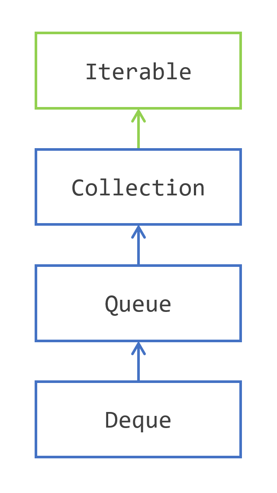

# 队列层次结构中的导航

Java SE 5在集合框架中增加了一个新的接口：`Queue` 接口，Java SE 6 通过 `Deque` 接口进一步扩展。`Queue` 接口是 `Collection` 接口的扩展。

## 入栈、出栈和窥视
栈和队列是计算中的经典数据结构。栈也称为后进先出（LIFO）栈。队列被称为先进先出（FIFO）。

这些结构非常简单，为您提供了三个主要操作：
- `push(element)`：向队列或栈中添加元素
- `pop()`：从栈中移除元素，即最后添加的最年轻的元素
- `poll()`：从队列中移除元素，即最先添加的最老的元素
- `peek()`：允许您查看将通过 `pop()` 或 `poll()` 获取的元素，但不会将其从队列或栈中移除

这些结构在计算中的成功有两个原因。第一个是它们的简单性。即使在计算的早期，实现这些也很简单。第二个是它们的有用性。许多算法使用栈来实现。

## 模拟队列和栈
集合框架为您提供了两个接口来模拟队列和栈：
- `Queue` 接口模拟队列；
- `Deque` 接口模拟双端队列（因此得名）。您可以在 `Deque` 的两端进行 push、pop、poll 和 peek 元素，使其既是队列又是栈。

栈和队列也在并发编程中广泛使用。这些接口通过添加在该领域有用的方法进一步扩展。这些接口，`BlockingQueue`、`BlockingDeque` 和 `TransferQueue`，位于集合框架和 Java 并发编程的交叉点，这不在本教程的范围内。

`Queue` 和 `Deque` 接口为这三个基本操作添加了行为，以处理两个特殊情况：
- 队列可能已满，无法接受更多元素
- 队列可能为空，无法通过 `pop`、`poll` 或 `peek` 操作返回元素

实际上，需要回答这个问题：实现在这两种情况下应该如何表现？

## 使用队列模拟 FIFO 队列
`Queue` 接口为您提供了两种处理这些特殊情况的方法。可以抛出异常，或者可以返回一个特殊值。

这是 `Queue` 为您提供的方法表：

| 操作 | 方法 | 队列满或空时的行为 |
| --- | --- | --- |
| push | `add(element)` | 抛出 `IllegalStateException` |
|  | `offer(element)` | 返回 `false` |
| poll | `remove()` | 抛出 `NoSuchElementException` |
|  | `poll()` | 返回 `false` |
| peek | `element()` | 抛出 `NoSuchElementException` |
|  | `peek()` | 返回 `null` |

## 使用 Deque 模拟 LIFO 栈和 FIFO 队列
Java SE 6 增加了 `Deque` 接口作为 `Queue` 接口的扩展。当然，`Queue` 中定义的方法在 `Deque` 中仍然可用，但 `Deque` 引入了新的命名约定。因此，这些方法已根据这个新的命名约定在 `Deque` 中复制。

这是 `Deque` 为 FIFO 操作定义的方法表：

| FIFO 操作 | 方法 | 队列满或空时的行为 |
| --- | --- | --- |
| push | `addLast(element)` | 抛出 `IllegalStateException` |
|  | `offerLast(element)` | 返回 `false` |
| poll | `removeFirst()` | 抛出 `NoSuchElementException` |
|  | `pollFirst()` | 返回 `null` |
| peek | `getFirst()` | 抛出 `NoSuchElementException` |
|  | `peekFirst()` | 返回 `null` |

这是 `Deque` 为 LIFO 操作定义的方法表：

| LIFO 操作 | 方法 | 队列满或空时的行为 |
| --- | --- | --- |
| push | `addFirst(element)` | 抛出 `IllegalStateException` |
|  | `offerFirst(element)` | 返回 `false` |
| pop | `removeFirst()` | 抛出 `NoSuchElementException` |
|  | `pollFirst()` | 返回 `null` |
| peek | `getFirst()` | 抛出 `NoSuchElementException` |
|  | `peekFirst()` | 返回 `null` |

`Deque` 的命名约定简单明了，与 `Queue` 接口中遵循的命名约定相同。但有一点不同：`peek` 操作在 `Deque` 中命名为 `getFirst()` 和 `getLast()`，在 `Queue` 中为 `element()`。

此外，`Deque` 还定义了您在任何队列或栈类中预期的方法：
- `push(element)`：将给定的 `element` 添加到双端队列的头部
- `pop()`：移除并返回双端队列头部的元素
- `poll()`：在双端队列的尾部执行相同的操作
- `peek()`：显示双端队列尾部的元素

如果没有元素可供 `pop`、`poll` 或 `peek`，则这些方法将返回 null 值。

## 实现队列和双端队列
集合框架为您提供了三种 `Queue` 和 `Deque` 的实现，这些实现不在并发编程空间中：
- `ArrayDeque`：实现两者。此实现由数组支持。这个类的容量随着添加元素而自动增长。因此，此实现始终接受新元素。
- `LinkedList`：也实现两者。此实现由链表支持，使得访问其第一个和最后一个元素非常高效。`LinkedList` 始终接受新元素。
- `PriorityQueue`：仅实现 `Queue`。此队列由数组支持，根据元素的自然顺序或通过 `Comparator` 指定的顺序保持其元素排序。此队列的头部始终是队列中最小的元素。这个类的容量随着添加元素而自动增长。

## 避免使用 Stack 类
使用 JDK 提供的 `Stack` 类可能看起来很诱人。这个类易于使用和理解。它具有预期的三个方法 `push(element)`、`pop()` 和 `peek()`，看到此类在代码中的引用使其完全可读。

事实证明，这个类是 `Vector` 类的扩展。在集合框架引入之前，`Vector` 是您处理列表的最佳选择。尽管 `Vector` 没有被弃用，但其使用不推荐。`Stack` 类的使用也是如此。

`Vector` 类是线程安全的，`Stack` 也是。如果您不需要线程安全性，那么您可以安全地用 `Deque` 和 `ArrayDeque` 替换它的使用。如果您需要线程安全的栈，那么您应该探索 `BlockingQueue` 接口的实现。

