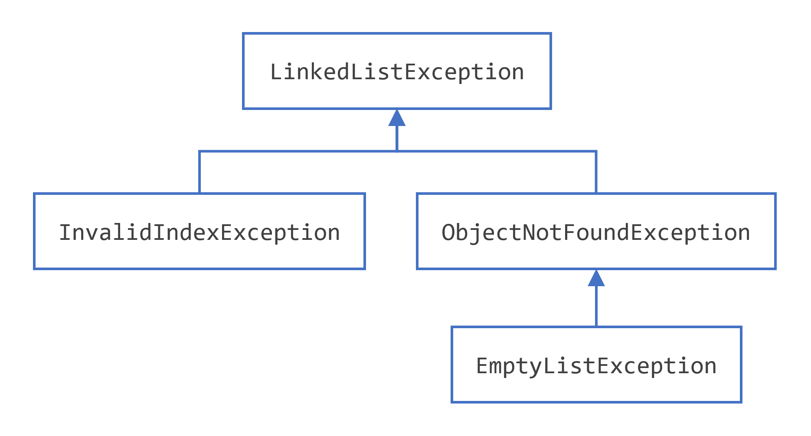

# Java 中的异常抛出（Throwing Exceptions）

## 指定方法抛出的异常
前面的部分展示了如何为`ListOfNumbers`类的`writeList()`方法编写异常处理程序。有时，代码捕获其内部可能发生的异常是合适的。然而，在其他情况下，让调用堆栈中更高层的方法处理异常更好。例如，如果您将`ListOfNumbers`类作为类包的一部分提供，您可能无法预料到所有用户的需求。在这种情况下，最好不要捕获异常，而是让调用堆栈中更高层的方法来处理它。
如果`writeList()`方法不捕获其内部可能发生的检查型异常，则`writeList()`方法必须指定它可以抛出这些异常。让我们修改原始的`writeList()`方法，以指定它可以抛出的异常，而不是捕获它们。为了提醒您，这里是原始版本的`writeList()`方法，它无法编译。
```java
public void writeList() {
    PrintWriter out = new PrintWriter(new FileWriter("OutFile.txt"));
    for (int i = 0; i < SIZE; i++) {
        out.println("Value at: " + i + " = " + list.get(i));
    }
    out.close();
}
```
要指定`writeList()`可以抛出两个异常，在`writeList()`方法的声明中添加一个`throws`子句。`throws`子句由`throws`关键字后跟该方法抛出的所有异常的逗号分隔列表组成。该子句位于方法名称和参数列表之后，方法范围定义的大括号之前；例如：
```java
public void writeList() throws IOException, IndexOutOfBoundsException {

}
```
请记住，`IndexOutOfBoundsException`是一个未检查异常；将其包含在`throws`子句中不是强制性的。您可以只写以下内容：
```java
public void writeList() throws IOException {

}
```

## 如何抛出异常
在您能够捕获异常之前，某个地方的某些代码必须抛出一个异常。任何代码都可以抛出异常：您的代码、其他人编写的包中的代码（例如 Java 平台附带的包）或 Java 运行时环境。无论抛出异常的是什么，它总是使用`throw`语句抛出。
正如您可能已经注意到的，Java 平台提供了许多异常类。所有这些类都是`Throwable`类的后代，并且都允许程序区分在程序执行期间可能发生的各种类型的异常。
您还可以创建自己的异常类来表示您编写的类中可能发生的问题。实际上，如果您是一个包开发人员，您可能必须创建自己的一组异常类，以允许用户区分您的包中发生的错误与 Java 平台或其他包中发生的错误。
您还可以创建链式异常。有关更多信息，请参阅“链式异常”部分。

## `throw`语句
所有方法都使用`throw`语句来抛出异常。`throw`语句需要一个单一的参数：一个可抛出对象。可抛出对象是任何`Throwable`子类的实例。以下是一个`throw`语句的示例：
```java
throw someThrowableObject;
```
让我们在上下文中查看`throw`语句。以下`pop()`方法来自一个实现常见堆栈对象的类。该方法从堆栈中删除顶部元素并返回该对象。
```java
public Object pop() {
    Object obj;

    if (size == 0) {
        throw new EmptyStackException();
    }

    obj = objectAt(size - 1);
    setObjectAt(size - 1, null);
    size--;
    return obj;
}
```
`pop()`方法检查堆栈上是否有任何元素。如果堆栈为空（其大小等于 0），`pop`实例化一个新的`EmptyStackException`对象（`java.util`的成员）并抛出它。本章的“创建异常类”部分解释了如何创建自己的异常类。现在，您只需要记住，您只能抛出继承自`java.lang.Throwable`类的对象。
请注意，`pop()`方法的声明不包含`throws`子句。`EmptyStackException`不是检查型异常，因此`pop`不需要声明它可能发生。

## `Throwable`类及其子类
从`Throwable`类继承的对象包括直接后代（直接从`Throwable`类继承的对象）和间接后代（从`Throwable`类的子子孙孙继承的对象）。下面的图说明了`Throwable`类及其最重要的子类的类层次结构。如您所见，`Throwable`有两个直接后代：`Error`和`Exception`。


## `Error`类
当 Java 虚拟机中发生动态链接失败或其他严重故障时，虚拟机会抛出一个`Error`。简单的程序通常不会捕获或抛出`Error`的实例。
## `Exception`类
大多数程序抛出和捕获从`Exception`类派生的对象。`Exception`表示发生了问题，但不是严重的系统问题。您编写的大多数程序将抛出和捕获`Exception`的实例，而不是`Error`的实例。
Java 平台定义了`Exception`类的许多后代。这些后代表示可能发生的各种类型的异常。例如，`IllegalAccessException`表示找不到特定的方法，`NegativeArraySizeException`表示程序试图创建一个大小为负的数组。
`Exception`的一个子类`RuntimeException`用于表示 API 使用不正确的异常。`NullPointerException`就是一个运行时异常的例子，当一个方法试图通过空引用访问对象的成员时会发生。“未检查异常 - 争议”部分讨论了为什么大多数应用程序不应该抛出运行时异常或继承`RuntimeException`。

## 链式异常
应用程序通常通过抛出另一个异常来响应异常。实际上，第一个异常导致了第二个异常。知道一个异常导致另一个异常是非常有帮助的。链式异常帮助程序员做到这一点。
以下是`Throwable`中支持链式异常的方法和构造函数：
```java
Throwable getCause()
Throwable initCause(Throwable)
Throwable(String, Throwable)
Throwable(Throwable)
```
`initCause()`和`Throwable`构造函数的`Throwable`参数是导致当前异常的异常。`getCause()`返回导致当前异常的异常，`initCause()`设置当前异常的原因。
以下示例展示了如何使用链式异常：
```java
try {

} catch (IOException e) {
    throw new SampleException("Other IOException", e);
}
```
在这个例子中，当捕获到`IOException`时，会创建一个新的`SampleException`异常，并将原始原因附加到它上面，然后将异常链抛给下一个更高层次的异常处理程序。

## 访问堆栈跟踪信息
现在假设更高层次的异常处理程序想要以自己的格式转储堆栈跟踪。
定义：堆栈跟踪提供有关当前线程执行历史的信息，并列出在异常发生时调用的类和方法的名称。堆栈跟踪是一个有用的调试工具，通常在抛出异常时会使用它。
以下代码展示了如何在异常对象上调用`getStackTrace()`方法：
```java
catch (Exception cause) {
    StackTraceElement elements[] = cause.getStackTrace();
    for (int i = 0, n = elements.length; i < n; i++) {       
        System.err.println(elements[i].getFileName() 
            + ":" + elements[i].getLineNumber() 
            + ">> " 
            + elements[i].getMethodName() + "()");
    }
}
```

### 日志 API
下一个代码片段记录了异常在`catch`块中发生的位置。然而，它不是手动解析堆栈跟踪并将输出发送到`java.util.logging`，而是使用`java.util.logging`包中的日志功能将输出发送到一个文件：
```java
try {
    Handler handler = new FileHandler("OutFile.log");
    Logger.getLogger("").addHandler(handler);
    
} catch (IOException e) {
    Logger logger = Logger.getLogger("package.name");
    StackTraceElement elements[] = e.getStackTrace();
    for (int i = 0, n = elements.length; i < n; i++) {
        logger.log(Level.WARNING, elements[i].getMethodName());
    }
}
```

## 创建异常类
当面临选择要抛出的异常类型时，您可以使用其他人编写的异常（Java 平台提供了许多您可以使用的异常类），或者您可以自己编写一个。如果您对以下任何问题的回答是肯定的，您应该编写自己的异常类；否则，您可能可以使用其他人的异常类。
 - 您是否需要一个 Java 平台中没有表示的异常类型？
 - 如果用户能够区分您的异常和其他供应商编写的类抛出的异常，这对他们有帮助吗？
 - 您的代码是否抛出多个相关的异常？
 - 如果您使用其他人的异常，用户是否能够访问这些异常？一个类似的问题是，您的包是否应该独立且自包含？

### 示例
假设您正在编写一个链表类。该类支持以下方法，以及其他方法：
 - `objectAt(int n)` - 返回列表中第`n`个位置的对象。如果参数小于 0 或大于当前列表中对象的数量，则抛出异常。
 - `firstObject()` - 返回列表中的第一个对象。如果列表不包含任何对象，则抛出异常。
 - `indexOf(Object o)` - 在列表中搜索指定的`Object`并返回其在列表中的位置。如果传递给方法的对象不在列表中，则抛出异常。
链表类可以抛出多个异常，并且能够用一个异常处理程序捕获链表抛出的所有异常会很方便。此外，如果您计划在一个包中分发您的链表，所有相关的代码应该打包在一起。因此，链表应该提供自己的一组异常类。
下面的图说明了链表抛出的异常的一种可能的类层次结构。


#### 选择超类
任何`Exception`子类都可以用作`LinkedListException`的父类。然而，快速浏览这些子类会发现它们不合适，因为它们要么太专门化，要么与`LinkedListException`完全无关。因此，`LinkedListException`的父类应该是`Exception`。
您编写的大多数应用程序将抛出`Exception`的实例。`Error`的实例通常用于系统中的严重、硬性错误，例如阻止 JVM 运行的错误。
注意：为了使代码更具可读性，最好将字符串`Exception`附加到所有（直接或间接）从`Exception`类继承的类的名称上。