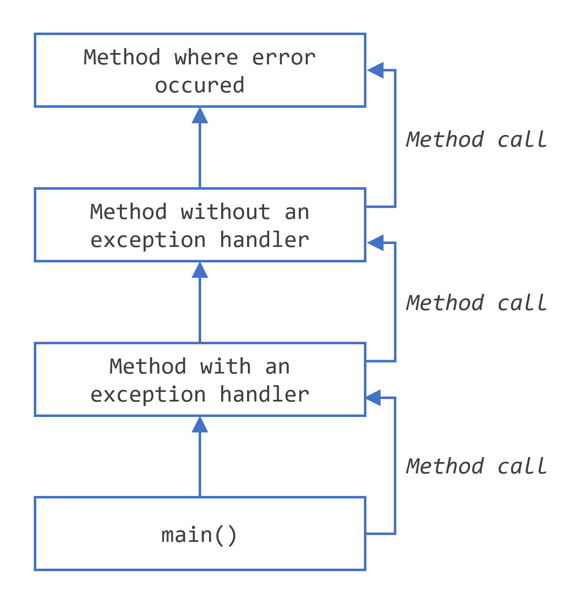

# Java 中的异常是什么？（What Is an Exception?）

## 异常的定义
异常是“异常事件”的简写。
> 定义：异常是在程序执行过程中发生的事件，它会扰乱程序指令的正常流程。
当方法中发生错误时，方法会创建一个对象并将其交给运行时系统。这个对象称为异常对象，它包含有关错误的信息，包括错误的类型和错误发生时程序的状态。创建异常对象并将其交给运行时系统的过程称为抛出异常。

在方法引发异常后，运行时系统会尝试查找要处理它的内容。用于处理异常的可能“某物”的集合是已调用的方法的有序列表，这些方法已被调用以访问发生错误的方法。方法列表称为调用堆栈（见下图）。

运行时系统在调用堆栈中搜索包含可以处理异常的代码块的方法。此代码块称为异常处理程序。搜索从发生错误的方法开始，然后以调用方法的相反顺序继续通过调用堆栈。当找到适当的处理程序时，运行时系统会将异常传递给处理程序。如果引发的异常对象的类型与处理程序可以处理的类型匹配，则认为异常处理程序是合适的。

据说所选的异常处理程序可以捕获异常。如果运行时系统详尽地搜索调用堆栈上的所有方法，而没有找到适当的异常处理程序（如下图所示），则发生错误的线程将终止。如果此线程是主线程，则运行时系统（以及程序）将终止。

与传统的错误管理技术相比，使用异常来管理错误具有一些优势。您可以在`异常的优点`中了解更多信息。
## 捕获或指定要求
有效的 Java 编程语言代码必须遵守捕获或指定要求。这意味着可能抛出某些异常的代码必须被以下两种情况之一包围：
 - 一个`try`语句来捕获异常。`try`必须提供一个处理异常的处理器，如在“捕获和处理异常”中所述。
 - 一个方法指定它可以抛出该异常。该方法必须提供一个`throws`子句来列出该异常，如在“指定方法抛出的异常”中所述。
不遵守捕获或指定要求的代码将无法编译。

并非所有异常都受捕获或指定要求的约束。为了理解为什么，我们需要查看异常的三个基本类别，其中只有一个类别受该要求的约束。

## 异常的三种类型
 - **检查型异常（Checked Exception）**：这些是编写良好的应用程序应该预料并从中恢复的异常情况。例如，假设一个应用程序提示用户输入文件名，然后通过将名称传递给`java.io.FileReader`的构造函数来打开文件。通常，用户提供的是现有可读文件的名称，因此`FileReader`对象的构造成功，应用程序的执行正常进行。但有时用户提供的是不存在的文件的名称，构造函数会抛出`java.io.FileNotFoundException`。编写良好的程序会捕获这个异常并通知用户错误，可能会提示用户输入更正后的文件名。
检查型异常受捕获或指定要求的约束。除了由`Error`、`RuntimeException`及其子类指示的异常外，所有异常都是检查型异常。
 - **错误（Error）**：这些是应用程序外部的异常情况，应用程序通常无法预料或从中恢复。例如，假设一个应用程序成功打开一个文件进行输入，但由于硬件或系统故障无法读取该文件。不成功的读取会抛出`java.io.IOError`。应用程序可以选择捕获这个异常，以便通知用户问题 - 但打印堆栈跟踪并退出程序也可能是有意义的。
错误不受捕获或指定要求的约束。错误是由`Error`及其子类指示的那些异常。
 - **运行时异常（RuntimeException）**：这些是应用程序内部的异常情况，应用程序通常无法预料或从中恢复。这些通常表示编程错误，例如逻辑错误或不当使用 API。例如，考虑前面描述的应用程序，它将文件名传递给`FileReader`的构造函数。如果逻辑错误导致`null`被传递给构造函数，构造函数将抛出`NullPointerException`。应用程序可以捕获这个异常，但消除导致异常发生的错误可能更有意义。
运行时异常不受捕获或指定要求的约束。运行时异常是由`RuntimeException`及其子类指示的那些异常。
错误和运行时异常统称为未检查异常。

## 绕过捕获或指定
一些程序员认为捕获或指定要求是异常机制的一个严重缺陷，并通过使用未检查异常代替检查异常来绕过它。一般来说，这不建议这样做。“未检查异常 - 争议”部分讨论了何时适合使用未检查异常。