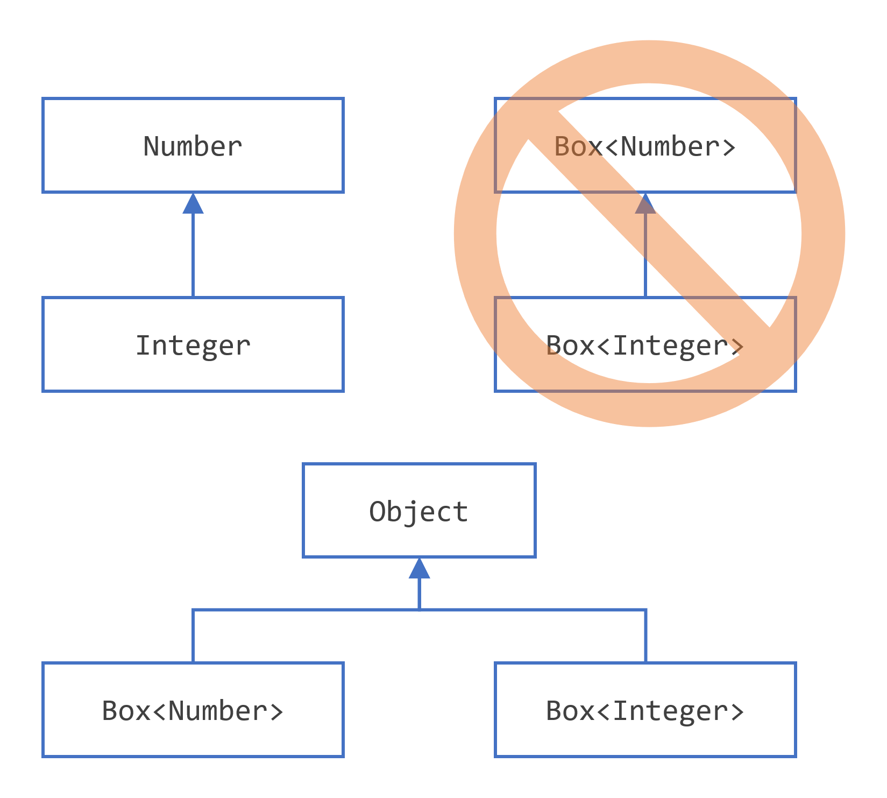

# 泛型介绍

## 为什么要使用泛型？

简而言之，泛型允许类型（类和接口）在定义类、接口和方法时作为参数。这与在方法声明中使用的更熟悉的形式参数类似，类型参数提供了一种使用不同输入重用相同代码的方式。不同之处在于形式参数的输入是值，而类型参数的输入是类型。

使用泛型的代码比非泛型代码有许多好处：
- 在编译时进行更严格的类型检查。Java编译器对泛型代码应用严格的类型检查，如果代码违反类型安全性则发出错误。修复编译时错误比修复运行时错误更容易，后者可能很难找到。
- 消除类型转换。以下代码段在没有泛型的情况下需要类型转换：

```java
List list = new ArrayList();
list.add("hello");
String s = (String) list.get(0);
```

当改写为使用泛型时，代码不需要类型转换：

```java
List<String> list = new ArrayList<String>();
list.add("hello");
String s = list.get(0);   // 无需类型转换
```

- 使程序员能够实现泛型算法。通过使用泛型，程序员可以实现在不同类型集合上工作的泛型算法，这些算法可以定制，并且是类型安全和易于阅读的。

## 泛型类型

### 一个简单的Box类

泛型类型是一个参数化类型的泛型类或接口。下面的`Box`类将被修改以演示这个概念。

```java
public class Box {
    private Object object;

    public void set(Object object) { this.object = object; }
    public Object get() { return object; }
}
```

由于它的方法接受或返回一个`Object`，你可以自由地传递任何你想要的东西，只要它不是原始类型。没有办法在编译时验证类是如何使用的。代码的一部分可能将一个`Integer`放入盒子中，并期望从中获取类型为`Integer`的对象，而另一部分代码可能错误地传递一个`String`，导致运行时错误。

### Box类的泛型版本

泛型类定义的格式如下：

```java
class ClassName<T1, T2, ..., Tn> { /* ... */ }
```

类型参数部分由尖括号(`< >`)分隔，跟在类名后面。它指定了类型参数（也称为类型变量）`T1`、`T2`等。

要更新`Box`类以使用泛型，你通过将代码" `public class Box`"更改为" `public class Box<T>`"来创建一个泛型类型声明。这引入了类型变量`T`，它可以在类内的任何地方使用。

有了这个改变，`Box`类变成了：

```java
/**
 * Box类的泛型版本。
 * @param <T> 被封装的值的类型
 */
public class Box<T> {
    // T代表"Type"
    private T t;

    public void set(T t) { this.t = t; }
    public T get() { return t; }
}
```

如你所见，所有的`Object`都被`T`替换了。类型变量可以是你指定的任何非原始类型：任何类类型、任何接口类型、任何数组类型，甚至是另一个类型变量。

同样的技术可以应用于创建泛型接口。

### 类型参数命名约定

按照惯例，类型参数名称是单个大写字母。这与你所知道的变量命名约定形成了鲜明的对比，并且有很好的理由：没有这个约定，就很难区分类型变量和普通的类或接口名称。

最常用的类型参数名称有：

- E - 元素（在Java Collections Framework中广泛使用）
- K - 键
- N - 数字
- T - 类型
- V - 值
- S、U、V等 - 第2、3、4种类型

你将在整个Java SE API和本节的其余部分中看到这些名称的使用。

### 调用和实例化泛型类型

要从你的代码中引用泛型`Box`类，你必须执行一个泛型类型调用，将`T`替换为一些具体的值，比如`Integer`：

```java
Box<Integer> integerBox;
```

你可以将泛型类型调用想象成与普通方法调用类似，但不是向方法传递参数，而是向`Box`类本身传递类型参数——在这种情况下是`Integer`。

> **类型参数和类型参数术语**：许多开发人员将"类型参数"和"类型参数"这两个术语互换使用，但这些术语并不相同。在编码时，为了创建参数化类型，提供类型参数。因此，`Foo<T>`中的`T`是类型参数，`Foo<String> f`中的`String`是类型参数。本节在使用这些术语时遵循这个定义。

像任何其他变量声明一样，这段代码实际上并没有创建一个新的`Box`对象。它只是声明`integerBox`将持有一个"Box of Integer"的引用，这就是`Box<Integer>`的读法。

泛型类型的调用通常被称为参数化类型。

要实例化这个类，像平常一样使用`new`关键字，但是在类名和括号之间放置`<Integer>`：

```java
Box<Integer> integerBox = new Box<Integer>();
```

### 钻石操作符

在Java SE 7及更高版本中，你可以用一个空的类型参数集合(`< >`)替换调用泛型类构造函数所需的类型参数，只要编译器可以从上下文中确定或推断出类型参数。这对尖括号，`< >`，被非正式地称为钻石。例如，你可以使用以下语句创建`Box<Integer>`的实例：

```java
Box<Integer> integerBox = new Box<>();
```

有关钻石操作符和类型推断的更多信息，请参见本教程的类型推断部分。

### 多个类型参数

如前所述，泛型类可以有多个类型参数。例如，泛型`OrderedPair`类实现了泛型`Pair`接口：

```java
public interface Pair<K, V> {
    public K getKey();
    public V getValue();
}

public class OrderedPair<K, V> implements Pair<K, V> {

    private K key;
    private V value;

    public OrderedPair(K key, V value) {
        this.key = key;
        this.value = value;
    }

    public K getKey() { return key; }
    public V getValue() { return value; }
}
```

以下语句创建了`OrderedPair`类的两个实例：

```java
Pair<String, Integer> p1 = new OrderedPair<>("Even", 8);
Pair<String, String>  p2 = new OrderedPair<>("hello", "world");
```

代码`new OrderedPair<String, Integer>()`实例化`K`为`String`，`V`为`Integer`。因此，`OrderedPair`的构造函数的参数类型分别是`String`和`Integer`。由于自动装箱，将`String`和`int`传递给类是有效的。

正如在钻石部分提到的，由于Java编译器可以从声明`OrderedPair<String, Integer>`推断出`K`和`V`类型，这些语句可以使用钻石符号缩短：

```java
OrderedPair<String, Integer> p1 = new OrderedPair<>("Even", 8);
OrderedPair<String, String>  p2 = new OrderedPair<>("hello", "world");
```

要创建泛型接口，请按照创建泛型类的相同约定进行。

### 参数化类型

你也可以将类型参数（即`K`或`V`）替换为参数化类型，即`List<String>`。例如，使用`OrderedPair<K, V>`示例：

```java
OrderedPair<String, Box<Integer>> p = new OrderedPair<>("primes", new Box<Integer>(...));
```

## 原始类型

原始类型是不带任何类型参数的泛型类或接口的名称。例如，给定泛型`Box`类：

```java
public class Box<T> {
    public void set(T t) { /* ... */ }
    // ...
}
```

要创建`Box<T>`的参数化类型，为形式类型参数`T`提供实际类型参数：

```java
Box<Integer> intBox = new Box<>();
```

如果省略实际类型参数，则会创建`Box<T>`的原始类型：

```java
Box rawBox = new Box();
```

因此，`Box`是泛型类型`Box<T>`的原始类型。然而，非泛型类或接口类型不是原始类型。

原始类型出现在旧代码中，因为许多API类（例如集合类）在JDK 5.0之前不是泛型的。使用原始类型时，你基本上得到了泛型之前的的行为——一个Box给你Objects。为了向后兼容，将参数化类型分配给其原始类型是允许的：

```java
Box<String> stringBox = new Box<>();
Box rawBox = stringBox;               // OK
```

但是，如果你将原始类型分配给参数化类型，你会得到一个警告：

```java
Box rawBox = new Box();           // rawBox是Box<T>的原始类型
Box<Integer> intBox = rawBox;     // 警告：未经检查的转换
```

如果你使用原始类型调用在相应泛型类型中定义的泛型方法，你也会得到一个警告：

```java
Box<String> stringBox = new Box<>();
Box rawBox = stringBox;
rawBox.set(8);  // 警告：未经检查的调用set(T)
```

警告显示原始类型绕过了泛型类型检查，将不安全代码的捕获推迟到运行时。因此，你应该避免使用原始类型。

有关Java编译器如何使用原始类型的更多信息，请参见类型擦除部分。

### 未经检查的错误消息

如前所述，当将旧代码与泛型代码混合使用时，你可能会碰到以下类似的警告消息：

```java
Note: Example.java uses unchecked or unsafe operations.
Note: Recompile with -Xlint:unchecked for details.
```

这可能发生在使用操作原始类型的旧API时，如下例所示：

```java
public class WarningDemo {
    public static void main(String[] args){
        Box<Integer> bi;
        bi = createBox();
    }

    static Box createBox(){
        return new Box();
    }
}
```

"未经检查"一词意味着编译器没有足够的类型信息来执行所有必要的类型检查以确保类型安全。"未经检查"警告默认是禁用的，尽管编译器给出了提示。要查看所有"未经检查"的警告，请使用`-Xlint:unchecked`重新编译。

使用`-Xlint:unchecked`重新编译前一个示例，会显示以下额外信息：

```java
WarningDemo.java:4: warning: [unchecked] unchecked conversion
found   : Box
required: Box<java.lang.Integer>
        bi = createBox();
                      ^
1 warning
```

要完全禁用未经检查的警告，请使用`-Xlint:-unchecked`标志。`@SuppressWarnings("unchecked")`注解可以抑制未经检查的警告。如果你不熟悉`@SuppressWarnings`的语法，请参见注解部分。

## 泛型方法

泛型方法是引入它们自己的类型参数的方法。这类似于声明泛型类型，但类型参数的作用域仅限于声明它的方法是。允许静态和非静态泛型方法，以及泛型类构造函数。

泛型方法的语法包括类型参数列表，放在尖括号内，出现在方法的返回类型之前。对于静态泛型方法，类型参数部分必须出现在方法的返回类型之前。

`Util`类包括一个泛型方法compare，它比较两个`Pair`对象：

```java
public class Util {
    public static <K, V> boolean compare(Pair<K, V> p1, Pair<K, V> p2) {
        return p1.getKey().equals(p2.getKey()) &&
               p1.getValue().equals(p2.getValue());
    }
}

public class Pair<K, V> {

    private K key;
    private V value;

    public Pair(K key, V value) {
        this.key = key;
        this.value = value;
    }

    public void setKey(K key) { this.key = key; }
    public void setValue(V value) { this.value = value; }
    public K getKey()   { return key; }
    public V getValue() { return value; }
}
```

调用此方法的完整语法将是：

```java
Pair<Integer, String> p1 = new Pair<>(1, "apple");
Pair<Integer, String> p2 = new Pair<>(2, "pear");
boolean same = Util.<Integer, String>compare(p1, p2);
```

类型已经明确提供，如加粗所示。通常，这可以省略，编译器将推断所需的类型：

```java
Pair<Integer, String> p1 = new Pair<>(1, "apple");
Pair<Integer, String> p2 = new Pair<>(2, "pear");
boolean same = Util.compare(p1, p2);
```

这个特性，称为类型推断，允许你像调用普通方法一样调用泛型方法，无需在尖括号内指定类型。这个主题在后续的类型推断部分进一步讨论。

## 有界类型参数

有时你可能想要限制可以用作参数化类型的类型参数。例如，一个操作数字的方法可能只想接受`Number`或其子类的实例。这就是有界类型参数的用途。

要声明一个有界类型参数，列出类型参数的名称，然后是`extends`关键字，然后是它的上界，在这个例子中是`Number`。注意，在这个上下文中，`extends`被普遍用来意味着"`extends`"（类中）或"`implements`"（接口中）。

```java
public class Box<T> {

    private T t;

    public void set(T t) {
        this.t = t;
    }

    public T get() {
        return t;
    }

    public <U extends Number> void inspect(U u){
        System.out.println("T: " + t.getClass().getName());
        System.out.println("U: " + u.getClass().getName());
    }

    public static void main(String[] args) {
        Box<Integer> integerBox = new Box<Integer>();
        integerBox.set(new Integer(10));
        integerBox.inspect("some text"); // error: this is still String!
    }
}
```

通过修改我们的泛型方法以包含这个有界类型参数，编译现在将失败，因为我们对inspect的调用仍然包括一个`String`：

```java
Box.java:21: <U>inspect(U) in Box<java.lang.Integer> cannot
  be applied to (java.lang.String)
                integerBox.inspect("10");
                                 ^
1 error
```

除了限制你可以用于实例化泛型类型的类型之外，有界类型参数还允许你调用在界限中定义的方法：

```java
public class NaturalNumber<T extends Integer> {

    private T n;

    public NaturalNumber(T n)  { this.n = n; }

    public boolean isEven() {
        return n.intValue() % 2 == 0;
    }

    // ...
}
```

`isEven()`方法通过`n`调用在Integer类中定义的`intValue()`方法。

### 多重界限

前面的例子说明了使用单个界限的类型参数，但类型参数可以有多个界限：

```java
<T extends B1 & B2 & B3>
```

具有多个界限的类型变量是所有在界限中列出的类型的子类型。如果其中一个界限是一个类，它必须首先被指定。例如：

```java
Class A { /* ... */ }
interface B { /* ... */ }
interface C { /* ... */ }

class D <T extends A & B & C> { /* ... */ }
```

如果界限`A`没有首先被指定，你将得到一个编译时错误：

```java
class D <T extends B & A & C> { /* ... */ }  // compile-time error
```

## 泛型方法和有界类型参数

有界类型参数是实现泛型算法的关键。考虑以下方法，它计算数组`T[]`中大于指定元素`elem`的元素数量。

```java
public static <T> int countGreaterThan(T[] anArray, T elem) {
    int count = 0;
    for (T e : anArray)
        if (e > elem)  // compiler error
            ++count;
    return count;
}
```

方法的实现是直接的，但它没有编译，因为大于运算符( `>`)只适用于像`short`、`int`、`double`、`long`、`float`、`byte`和`char`这样的原始类型。你不能使用`>`运算符来比较对象。要解决这个问题，使用一个由`Comparable<T>`接口限制的类型参数：

```java
public interface Comparable<T> {
    public int compareTo(T o);
}
```

生成的代码将是：

```java
public static <T extends Comparable<T>> int countGreaterThan(T[] anArray, T elem) {
    int count = 0;
    for (T e : anArray)
        if (e.compareTo(elem) > 0)
            ++count;
    return count;
}
```

## 泛型、继承和子类型

如你所知，只要类型兼容，就可以将一个类型的对象分配给另一个类型的对象。例如，你可以将`Integer`分配给`Object`，因为`Object`是`Integer`的超类型之一：

```java
Object someObject = new Object();
Integer someInteger = new Integer(10);
someObject = someInteger;   // OK
```

在面向对象的术语中，这被称为"是一个"关系。由于`Integer`是`Object`的一种，所以允许赋值。但是`Integer`也是`Number`的一种，所以以下代码也是有效的：

```java
public void someMethod(Number n) { /* ... */ }

someMethod(new Integer(10));   // OK
someMethod(new Double(10.1));   // OK
```

泛型也是如此。你可以执行泛型类型调用，传递`Number`作为其类型参数，并且只要参数与`Number`兼容，任何后续的add调用都将被允许：

```java
Box<Number> box = new Box<Number>();
box.add(new Integer(10));   // OK
box.add(new Double(10.1));  // OK
```

现在考虑以下方法：

```java
public void boxTest(Box<Number> n) { /* ... */ }
```

它接受什么类型的参数？通过查看它的签名，你可以看到它接受一个参数，其类型为`Box<Number>`。但这到底意味着什么？你是否被允许传递`Box<Integer>`或`Box<Double>`，正如你可能期望的那样？答案是"不"，因为`Box<Integer>`和`Box<Double>`不是`Box<Number>`的子类型。

这是使用泛型编程时常见的误解，但这是一个重要的概念要学习。即使`Integer`是`Number`的子类型，`Box<Integer>`也不是`Box<Number>`的子类型。


> 给定两个具体类型`A`和`B`，例如`Number`和`Integer`，`MyClass<A>`与`MyClass<B>`没有关系，不管`A`和`B`是否相关。`MyClass<A>`和`MyClass<B>`的共同父级是`Object`。

有关如何在类型参数相关时在两个泛型类之间创建类似子类型的关系的信息，请参见通配符和子类型部分。

### 泛型类和子类型

你可以通过扩展或实现泛型类或接口来对泛型类或接口进行子类型化。一个类或接口的类型参数与另一个类或接口的类型参数之间的关系由扩展和实现子句确定。

以集合类为例，`ArrayList<E>`实现了`List<E>`，而`List<E>`扩展了`Collection<E>`。所以`ArrayList<String>`是`List<String>`的子类型，而`List<String>`是`Collection<String>`的子类型。只要你不改变类型参数，类型之间的子类型关系就保持不变。

<p align="center">集合层次结构示例</p>

现在想象我们要定义我们自己的列表接口`PayloadList`，它将每个元素与可选的泛型类型`P`的值关联起来。它的声明可能如下所示：

```java
interface PayloadList<E, P> extends List<E> {
  void setPayload(int index, P val);
  ...
}
```

`PayloadList`的以下参数化是`List<String>`的子类型：

- `PayloadList<String,String>`
- `PayloadList<String,Integer>`
- `PayloadList<String,Exception>`


