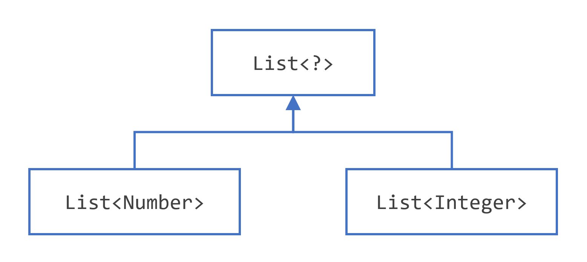
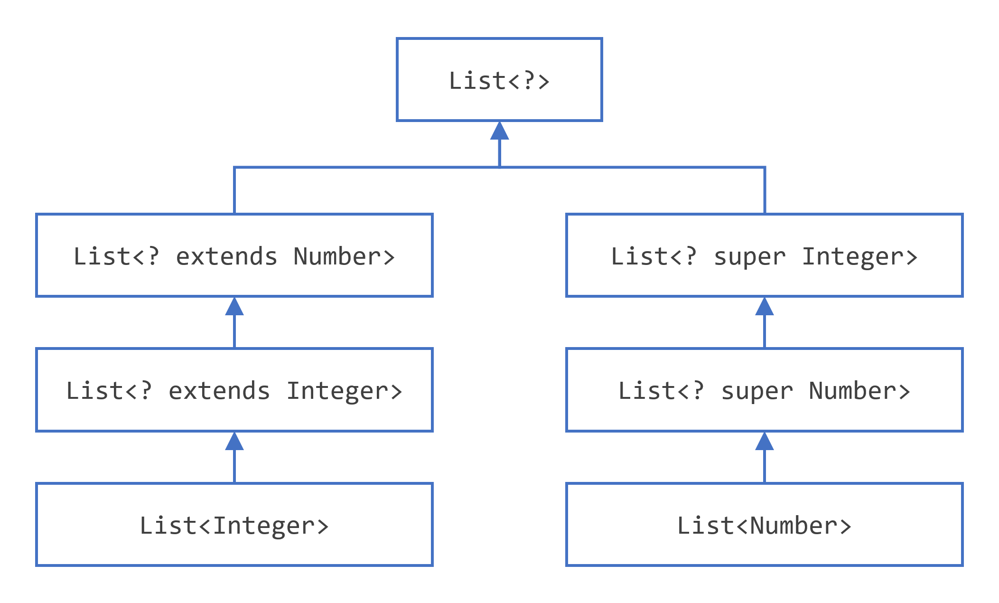
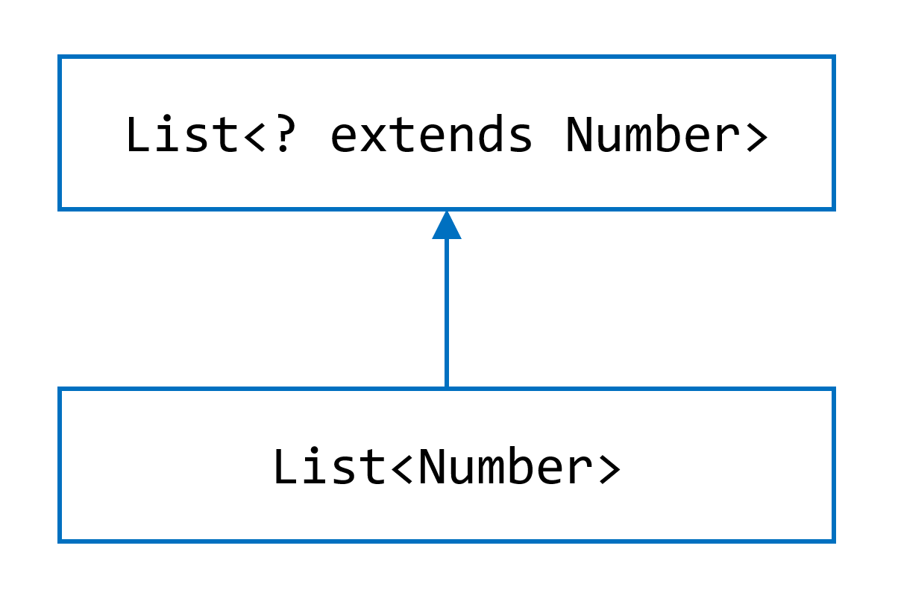
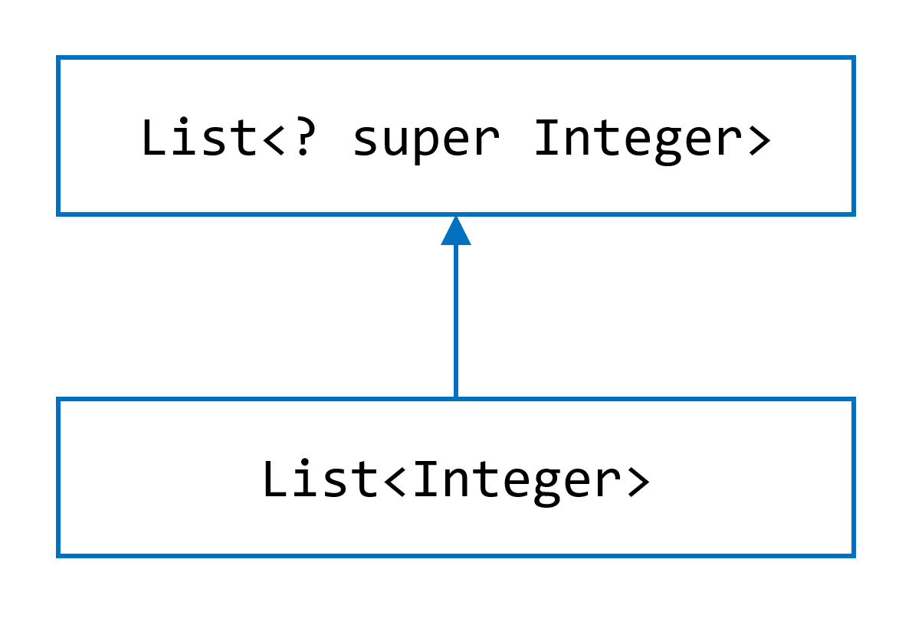

# 通配符

## 上界限定通配符
你可以使用上界限定通配符来放宽对变量的限制。例如，假设你想要编写一个适用于 `List<Integer>`、`List<Double>` 和 `List<Number>` 的方法；你可以通过使用上界限定通配符来实现这一点。

要声明一个上界限定通配符，使用通配符字符（`?`），后跟 `extends` 关键字，然后是它的上界。注意，在这种情况下，`extends` 被广义地使用，意味着要么是 " `extends`"（类中），要么是 " `implements`"（接口中）。

要编写一个适用于 `Number` 列表及其子类型（如 `Integer`、`Double` 和 `Float`）的方法，你会指定 `List<? extends Number>`。术语 `List<Number>` 比 `List<? extends Number>` 更具限制性，因为前者仅匹配类型为 `Number` 的列表，而后者匹配类型为 `Number` 或其任何子类的列表。

考虑以下 `process` 方法：

```java
public static void process(List<? extends Foo> list) { /* ... */ }
```

上界限定通配符 `<? extends Foo>`，其中 `Foo` 是任何类型，匹配 `Foo` 及 `Foo` 的任何子类型。`process` 方法可以访问类型为 `Foo` 的列表元素：

```java
public static void process(List<? extends Foo> list) {
    for (Foo elem : list) {
        // ...
    }
}
```

在 `foreach` 子句中，`elem` 变量遍历列表中的每个元素。现在可以在 `elem` 上使用 `Foo` 类中定义的任何方法。

`sumOfList()` 方法返回列表中数字的总和：

```java
public static double sumOfList(List<? extends Number> list) {
    double s = 0.0;
    for (Number n : list)
        s += n.doubleValue();
    return s;
}
```

以下代码，使用 `Integer` 对象的列表，打印 `sum = 6.0`：

```java
List<Integer> li = Arrays.asList(1, 2, 3);
System.out.println("sum = " + sumOfList(li));
```

`Double` 值的列表可以使用相同的 `sumOfList()` 方法。以下代码打印 `sum = 7.0`：

```java
List<Double> ld = Arrays.asList(1.2, 2.3, 3.5);
System.out.println("sum = " + sumOfList(ld));
```

## 无界限定通配符
无界限定通配符类型使用通配符字符（`?`）指定，例如 `List<?>`。这称为未知类型的列表。无界限定通配符在两个场景中是一个有用的方法：

- 如果你正在编写一个可以使用 `Object` 类中提供的功能实现的方法。
- 当代码使用的泛型类中的方法不依赖于类型参数时。例如，`List.size()` 或 `List.clear()`。实际上，`Class<?>` 经常使用，因为 `Class<T>` 中的大多数方法不依赖于 `T`。

考虑以下 `printList()` 方法：

```java
public static void printList(List<Object> list) {
    for (Object elem : list)
        System.out.println(elem + " ");
    System.out.println();
}
```

`printList()` 的目标是打印任何类型的列表，但它没有达到这个目标——它只打印 `Object` 实例的列表；它不能打印 `List<Integer>`、`List<String>`、`List<Double>` 等，因为它们不是 `List<Object>` 的子类型。要编写一个通用的 `printList()` 方法，使用 `List<?>`：

```java
public static void printList(List<?> list) {
    for (Object elem : list)
        System.out.print(elem + " ");
    System.out.println();
}
```

因为对于任何具体类型 `A`，`List<A>` 是 `List<?>` 的子类型，你可以使用 `printList()` 打印任何类型的列表：

```java
List<Integer> li = Arrays.asList(1, 2, 3);
List<String> ls = Arrays.asList("one", "two", "three");
printList(li);
printList(ls);
```

> 注意：`Arrays.asList()` 方法在本节的示例中使用。这个静态工厂方法将指定的数组转换并返回一个固定大小的列表。

重要的是要注意 `List<Object>` 和 `List<?>` 是不同的。你可以将 `Object` 或 `Object` 的任何子类型插入 `List<Object>`。但你只能在 `List<?>` 中插入 `null`。本节末尾的“通配符使用指南”段落提供了更多关于如何在特定情况下确定使用何种通配符（如果有）的信息。

## 下界限定通配符
上界限定通配符部分显示了上界限定通配符将未知类型限制为特定类型或该类型的子类型，并使用 `extends` 关键字表示。类似地，下界限定通配符将未知类型限制为特定类型或该类型的超类型。

下界限定通配符使用通配符字符（`?`），后跟 `super` 关键字，然后是它的下界：`<? super A>`。

> 注意：你可以为通配符指定上界，或者可以指定下界，但你不能同时指定两者。

假设你想编写一个将 `Integer` 对象放入列表中的方法。为了最大程度地提高灵活性，你希望该方法适用于 `List<Integer>`、`List<Number>` 和 `List<Object>` ——任何可以容纳 `Integer` 值的内容。

要编写一个适用于 `Integer` 列表及其超类型的方法，如 `Integer`、`Number` 和 `Object`，你会指定 `List<? super Integer>`。术语 `List<Integer>` 比 `List<? super Integer>` 更具限制性，因为前者仅匹配 `Integer` 类型的列表，而后者匹配任何类型的列表，只要是 `Integer` 的超类型。

以下代码将数字 1 到 10 添加到列表的末尾：

```java
public static void addNumbers(List<? super Integer> list) {
    for (int i = 1; i <= 10; i++) {
        list.add(i);
    }
}
```

本节末尾的“通配符使用指南”段落提供了关于何时使用上界限定通配符和何时使用下界限定通配符的指导。

## 通配符和子类型
正如前几节所描述的，泛型类或接口之间没有仅仅因为它们类型之间存在关系而存在关系。然而，你可以使用通配符在泛型类或接口之间创建关系。

给定以下两个常规（非泛型）类：

```java
class A { /* ... */ }
class B extends A { /* ... */ }
```

可以合理地编写以下代码：

```java
B b = new B();
A a = b;
```

这个示例表明，常规类的继承遵循子类型规则：如果 `B` 扩展了 `A`，则类 `B` 是类 `A` 的子类型。这条规则不适用于泛型类型：

```java
List<B> lb = new ArrayList<>(); // 假设B是Number的一个子类型
List<A> la = lb;   // 编译时错误
```

鉴于 `Integer` 是 `Number` 的子类型，`List<Integer>` 和 `List<Number>` 之间的关系是什么？



尽管 `Integer` 是 `Number` 的子类型，`List<Integer>` 并不是 `List<Number>` 的子类型，实际上这两种类型是没有任何关系的。`List<Number>` 和 `List<Integer>` 的共同父类型是 `List<?>`。

为了创建这些类之间的关系，以便代码可以通过 `List<Integer>` 的元素访问 `Number` 的方法，使用上界限定通配符：

```java
List<? extends Integer> intList = new ArrayList<>();
// 这是可以的，因为 List<? extends Integer> 是 List<? extends Number> 的子类型
List<? extends Number> numList = intList;
```

因为 `Integer` 是 `Number` 的子类型，并且 `numList` 是 `Number` 对象的列表，现在 `intList`（`Integer` 对象的列表）和 `numList` 之间存在关系。下图显示了使用上界限定和下界限定通配符声明的几个 `List` 类之间的关系。



遵循相同的规则，`List<? extends Number>` 可以被任何类型扩展的列表扩展，包括 `Number` 本身，如下图所示。



`List<Number>` 扩展了 `List<? extends Number>`。

对于 `List<? super Integer>` 和 `List<Integer>` 之间的关系也是如此。



`List<Integer>` 扩展了 `List<? super Integer>`。

本节末尾的“通配符使用指南”段落提供了更多关于使用上界限定和下界限定通配符的影响的信息。

## 通配符捕获和辅助方法
在某些情况下，编译器会推断通配符的类型。例如，一个列表可能被定义为 `List<?>`，但在评估表达式时，编译器会从代码中推断出特定类型。这种情况被称为通配符捕获。

大多数情况下，你不需要担心通配符捕获，除非你看到一个包含 "capture of" 短语的错误消息。

`WildcardError` 示例在编译时会产生捕获错误：

```java
import java.util.List;

public class WildcardError {

    void foo(List<?> i) {
        i.set(0, i.get(0));
    }
}
```

在这个示例中，编译器将 `i` 输入参数处理为 `Object` 类型。当 `foo` 方法调用 `List.set(int, E)` 时，编译器无法确认被插入列表的对象类型，并产生错误。当这种类型的错误发生时，通常意味着编译器认为你给变量赋错了类型。泛型被添加到Java语言中的原因是为了在编译时强制类型安全性。

`WildcardError` 示例在由 Oracle 的 JDK 7 `javac` 实现编译时生成以下错误：

```java
WildcardError.java:6: error: method set in interface List<E> cannot be applied to given types;
    i.set(0, i.get(0));
     ^

// ...（省略了错误消息的其余部分）
```

在这个示例中，代码尝试执行一个安全的操作，那么如何绕过编译器错误呢？你可以通过编写一个捕获通配符的私有辅助方法来修复它。在这种情况下，你可以通过创建私有辅助方法 `fooHelper()` 来解决问题，如下在 `WildcardFixed` 中所示：

```java
public class WildcardFixed {

    void foo(List<?> i) {
        fooHelper(i);
    }

    // 辅助方法创建，以便可以通过类型推断捕获通配符。
    private <T> void fooHelper(List<T> l) {
        l.set(0, l.get(0));
    }

}
```

由于辅助方法，编译器使用推断来确定在调用中 `T` 是捕获变量 `CAP#1`。示例现在可以成功编译。

按照惯例，辅助方法通常命名为 `originalMethodNameHelper()`。

现在考虑一个更复杂的例子，`WildcardErrorBad`：

```java
import java.util.List;

public class WildcardErrorBad {

    void swapFirst(List<? extends Number> l1, List<? extends Number> l2) {
      Number temp = l1.get(0);
      l1.set(0, l2.get(0)); // 期望 CAP#1 extends Number,
                            // 得到了 CAP#2 extends Number;
                            // 相同的界限，但类型不同
      l2.set(0, temp);        // 期望 CAP#1 extends Number,
                            // 得到了 Number
    }

}
```

在这个例子中，代码尝试执行一个不安全的操作。例如，考虑对 `swapFirst()` 方法的以下调用：

```java
List<Integer> li = Arrays.asList(1, 2, 3);
List<Double>  ld = Arrays.asList(10.10, 20.20, 30.30);
swapFirst(li, ld);
```

虽然 `List<Integer>` 和 `List<Double>` 都满足 `List<? extends Number>` 的标准，但从 `Integer` 值的列表中取出一个项目并尝试将其放入 `Double` 值的列表中显然是不正确的。

使用 Oracle 的 JDK `javac` 编译器编译代码会产生以下错误：

```java
WildcardErrorBad.java:7: error: method set in interface List<E> cannot be applied to given types;
      l1.set(0, l2.get(0)); // 期望 CAP#1 extends Number,
        ^

// ...（省略了错误消息的其余部分）
```

没有辅助方法可以绕过这个问题，因为代码根本上是错误的：从 `Integer` 值的列表中取出一个项目并尝试将其放入 `Double` 值的列表中显然是错误的。

## 通配符使用指南
学习泛型编程时一个更令人困惑的方面是确定何时使用上界限定通配符以及何时使用下界限定通配符。本页提供了在设计代码时应遵循的一些指导方针。

为了本讨论的目的，将变量视为提供两种功能之一是有帮助的：

- “输入”变量。“输入”变量向代码提供数据。想象一个有两个参数的复制方法：`copy(src, dest)`。`src` 参数提供了要复制的数据，所以它是“输入”参数。
- “输出”变量。“输出”变量保存数据以供其他地方使用。在复制示例中，`copy(src, dest)`，`dest` 参数接受数据，所以它是“输出”参数。

当然，有些变量既用于“输入”也用于“输出”——这种情况也在指导方针中得到解决。

你可以在使用“输入”和“输出”原则时决定是否使用通配符以及使用何种类型的通配符。以下列表提供了应遵循的指导方针：

- “输入”变量使用 `extends` 关键字定义的上界限定通配符。
- “输出”变量使用 `super` 关键字定义的下界限定通配符。
- 在“输入”变量可以使用 `Object` 类中定义的方法访问的情况下，使用无界限定通配符。
- 在代码需要将变量同时作为“输入”和“输出”变量访问的情况下，不要使用通配符。

这些指导方针不适用于方法的返回类型。应避免使用通配符作为返回类型，因为它迫使使用代码的程序员处理通配符。

由 `List<? extends ...>` 定义的列表可以被非正式地认为是只读的，但这不是严格的保证。假设你有以下两个类：

```java
class NaturalNumber {

    private int i;

    public NaturalNumber(int i) { this.i = i; }
    // ...

}

class EvenNumber extends NaturalNumber {

    public EvenNumber(int i) { super(i); }
    // ...

}

```

考虑以下代码：

```java
List<EvenNumber> le = new ArrayList<>();
List<? extends NaturalNumber> ln = le;
ln.add(new NaturalNumber(35));  // 编译时错误
```

由于 `List<EvenNumber>` 是 `List<? extends NaturalNumber>` 的子类型，你可以将 `le` 分配给 `ln`。但你不能使用 `ln` 向偶数列表中添加一个自然数。以下是列表上可能的操作：

- 你可以添加 `null`。
- 你可以调用 `clear()`。
- 你可以获取迭代器并调用 `remove()`。
- 你可以捕获通配符并写入你从列表中读取的元素。

你可以看到，由 `List<? extends NaturalNumber>` 定义的列表在最严格的意义上不是只读的，但你可以这样认为，因为你不能在列表中存储新元素或更改现有元素。

