# 入门指南：Java基础

## JDK的下载
1.首先，我们打开openjdk官网链接：https://jdk.java.net/  。

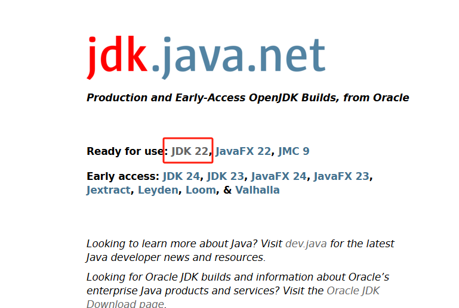

2.如图，我们点击后打开下载页面。

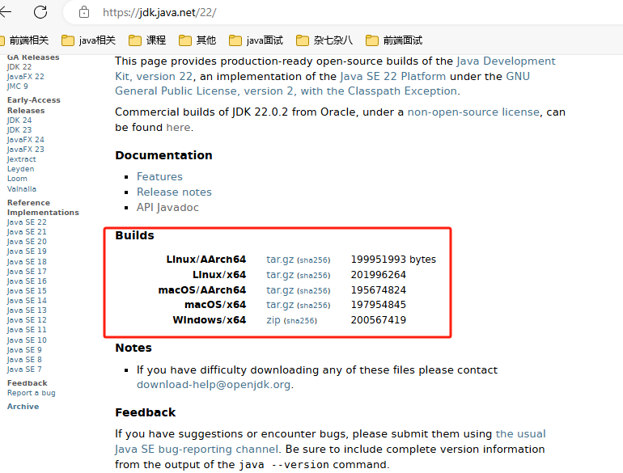

可以看到有如下五个版本，当前页面中是最新的包，如果需要指定版本，请在左侧选择即可：

- Linux/AArch64
- Linux/x64
- macOS/x64
- macOS/AArch64
- Windows/x64

## JDK的安装

### Windows/x64 系统下安装

1. 点击Windows/x64 的zip安装包下载到本地，然后解压到某个文件夹下（路径名不要包含中文）
 
2. 搜索`查看高级系统设置` 
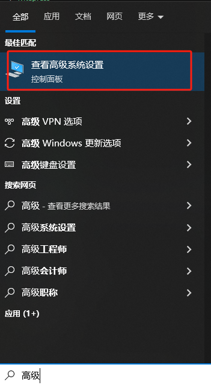
3. 点击 `环境变量` 
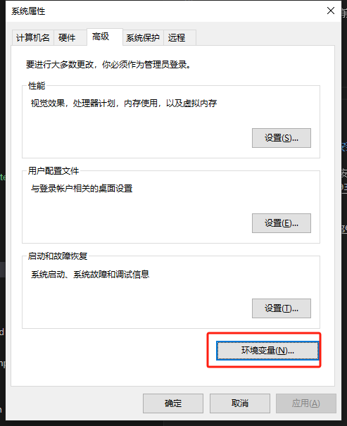
4. 在`系统变量`中点击 `新建` 
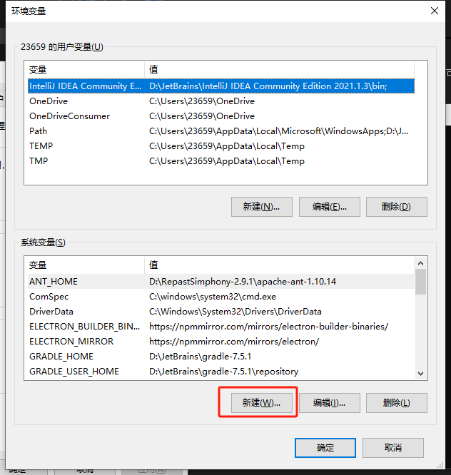
5. 输入变量名`JAVA_HOME`和变量值`D:\JetBrains\jdk-22.0.2`（对应JDK解压目录），点击确定。
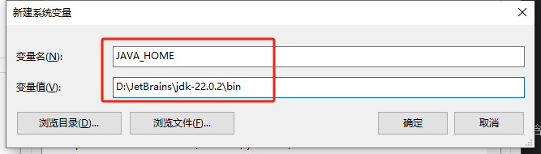
6. 选中Path 点击编辑
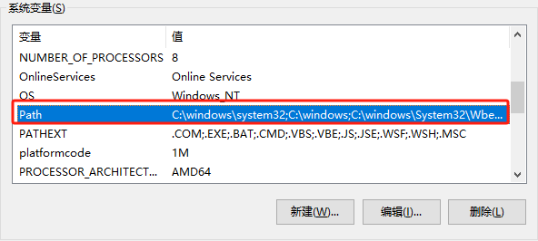
7. 点击 `新建` 增加 `%JAVA_HOME%\bin` 后确定。
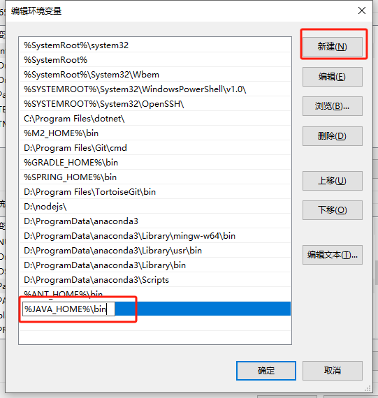
8. 打开命令行（快捷键 `win+R` 然后输入cmd 点击确定，
   然后输入命令
   ```
   java -version
   ```
   如果打印出如下信息则安装成功
   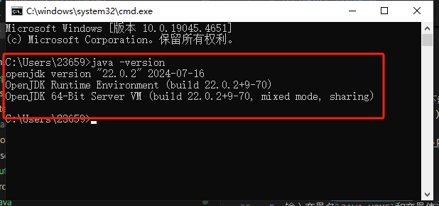

### Linux/x64系统下安装
1. jdk下载
如果你的Linux系统是基于x86_64架构的，你应该下载Linux/x64版本的JDK。如果你的系统是基于ARM 64位架构的，比如使用ARM处理器的设备，那么你应该下载Linux/AArch64版本的JDK
2. 解压缩下载的文件
使用 `tar` 命令解压到你选择的目录，例如：
```bash
tar -xvf openjdk-22.0.2_linux-x64_bin.tar.gz -C /opt/
```
请将 openjdk-22.0.2_linux-x64_bin.tar.gz 替换为你下载的文件名。
3. 设置环境变量
打开你的shell配置文件，例如 ~/.bashrc 或 ~/.zshrc，添加以下行：
```bash
export JAVA_HOME=/opt/jdk-22.0.2
export PATH=$PATH:$JAVA_HOME/bin
```
请将 /opt/jdk-22.0.2 替换为你的实际JDK安装路径。
4. 应用配置更改
运行以下命令使更改生效：
```bash
source ~/.bashrc  # 或者source ~/.zshrc，取决于你使用的shell
```
5. 验证安装
```bash
java -version
```   
这应该输出JDK 22的版本信息。

### macOS系统下安装
1. jdk下载
如果你的Linux系统是基于x86_64架构的，你应该下载Linux/x64版本的JDK。如果你的系统是基于ARM 64位架构的，比如使用ARM处理器的设备，那么你应该下载Linux/AArch64版本的JDK
2. 解压缩下载的文件
打开下载的.tar.gz或.dmg文件，并将JDK拖动到/Library/Java/JavaVirtualMachines/目录。
3. 设置环境变量
打开你的shell配置文件，如~/.bash_profile、~/.zshrc或~/.bashrc，添加以下行：
```bash
export JAVA_HOME=$(/usr/libexec/java_home -v 22)
export PATH=$JAVA_HOME/bin:$PATH
```
确保将22替换为你安装的JDK版本。
4. 应用配置更改
运行以下命令使更改生效：
```bash
source ~/.bash_profile # 或者source ~/.zshrc或source ~/.bashrc，取决于你使用的shell
```
5. 验证安装
```bash
java -version
```   
这里应该输出JDK 22的版本信息。

## 运行第一个程序
### 编写代码
在任意目录下名为`MyFirstClass.java`的文件，内容如下:
```java
public class MyFirstClass {

    public static void main(String... args) {
        System.out.println("Hello, World!");
    }
}

```
**请注意:**
1. 点击查看
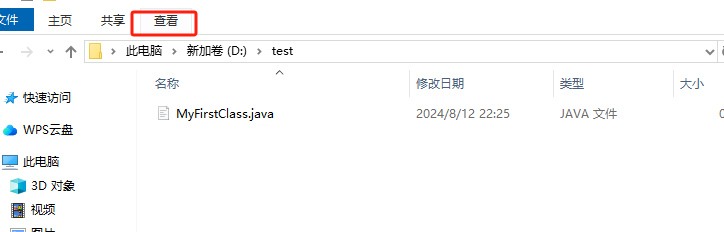
2. 确认勾选了`文件扩展名`复选框
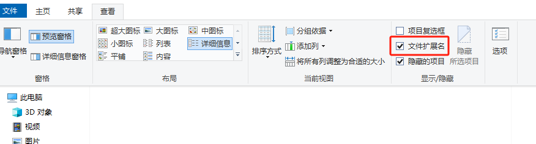
3. 确认文件扩展名为java
4. 文件名和类名必须一致，这里都是`MyFirstClass`
   
### 运行代码
1. 打开命令行
在如图位置输入cmd，回车
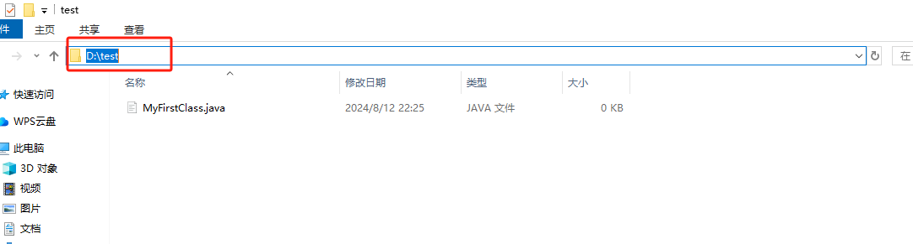
2. 在打开的界面输入如下命令，不出意外会出现一个class后缀的文件，

```
javac MyFirstClass.java
```
然后运行如下命令，会打印`Hello, World!` 
```
java MyFirstClass
```
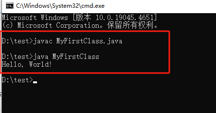

3. java11开始，也可以直接运行
```
java MyFirstClass.java
``` 
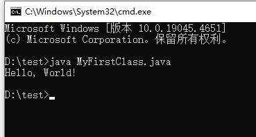

## IDEA下运行代码
### IDEA的下载和安装
这是IDEA的下载地址 [IDEA下载地址](https://www.jetbrains.com.cn/idea/download/?section=windows)。

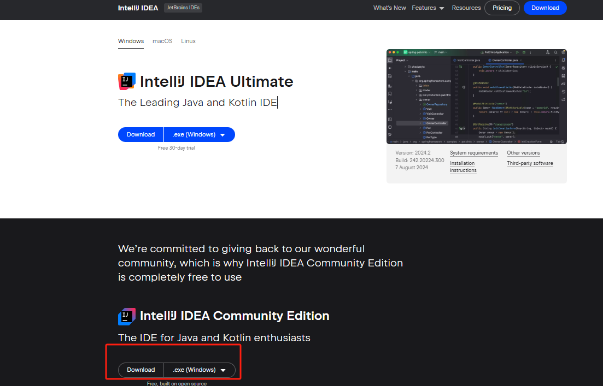

1. `IntelliJ IDEA Ultimate` 是旗舰版，需要收费。

2. `IntelliJ IDEA Community Edition`是社区版,免费。

 目前我们用社区版足够了，点击`Download`按钮即可下载社区版。

#### 安装
   
一路下一步即可，如果有疑问的话，可以参考
[IDEA安装](https://www.jetbrains.com/help/idea/installation-guide.html)

### IDEA的使用
#### 创建项目
1. 打开IDEA，点击`New Project`
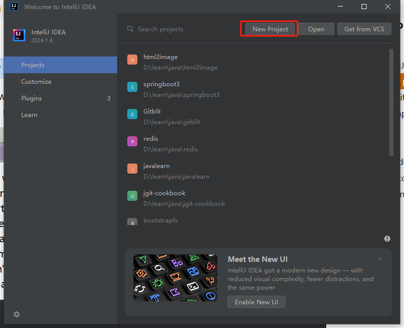

2. 在下图中输入参数
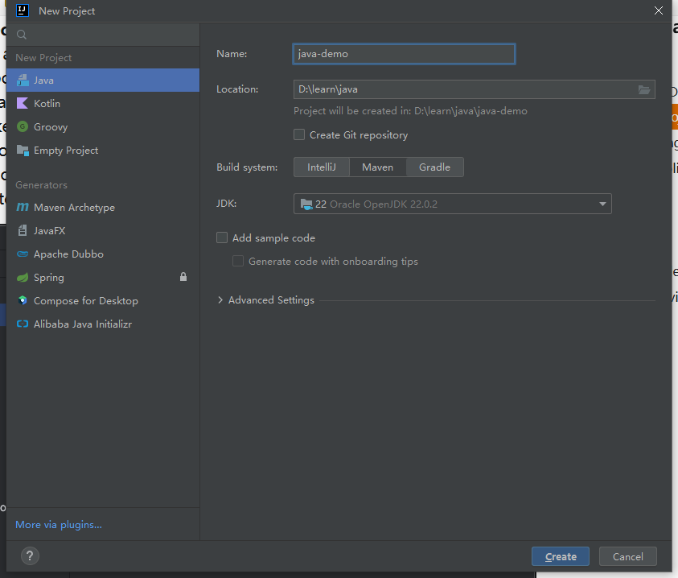
其中
- Name：项目名 
- Location：项目存储地址
- Build system：构建系统（这里选择`Intelij`）
- JDK：选择我们之前安装的JDK
- 
点击`Create` 完成创建。

3. 右键src目录->New->Java Class
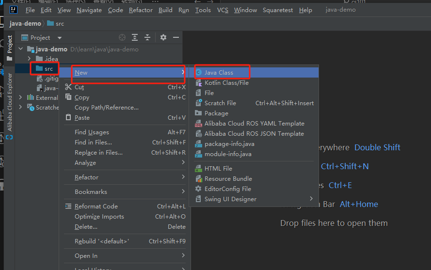

4. 输入文件名然后回车（或者双击Class）
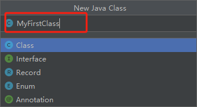  

5. 将新文件的内容修改为如下
```java
public class MyFirstClass {
    public static void main(String[] args) {
        System.out.println("Hello World!");
    }
}
```
6. 光标放在文件中右键，然后点击如下按钮
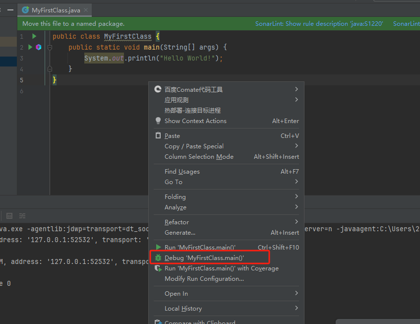  
  
控制台输出如下信息运行成功
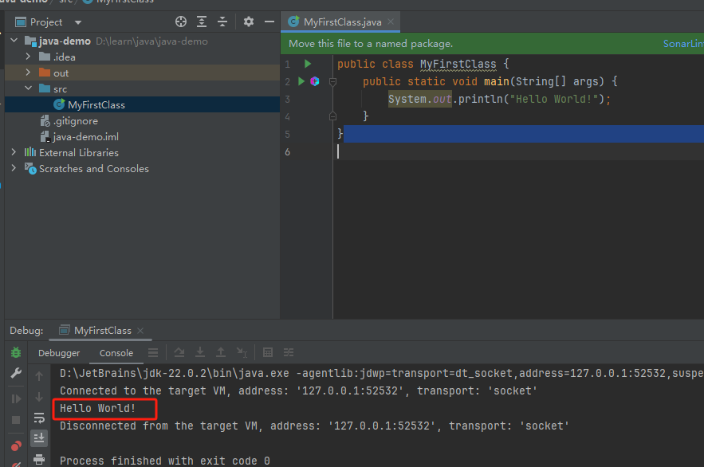 