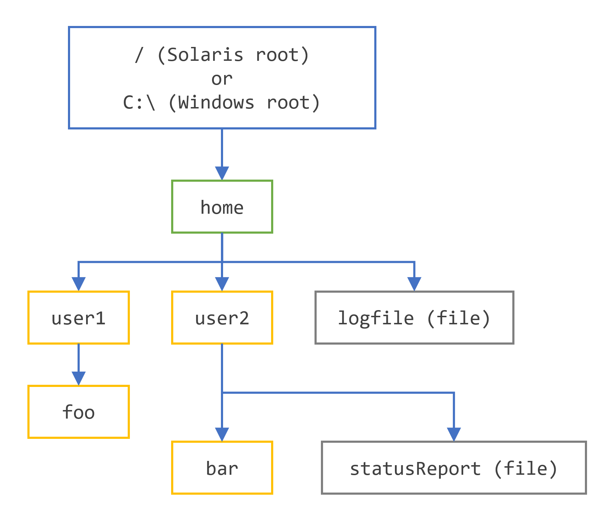

# Paths操作

## 创建Paths

### 使用 Paths 工厂类

`Path` 实例包含用于指定文件或目录位置的信息。在定义时，`Path` 提供了一系列一个或多个名称。可能包括根元素或文件名，但两者都不是必需的。`Path` 可能只由单个目录或文件名组成。

您可以轻松地使用 `Paths`（注意是复数）辅助类的以下 `get` 方法之一创建 `Path` 对象：

```java
Path p1 = Paths.get("/tmp/foo");
Path p2 = Paths.get(args[0]);
Path p3 = Paths.get(URI.create("file:///Users/joe/FileTest.java"));

```

`Paths.get(String)` 方法是以下代码的简写：

```java
Path p4 = FileSystems.getDefault().getPath("/users/sally");

```

以下示例创建 `/u/joe/logs/foo.log`，假设您的主目录是 `/u/joe`，或者如果您在Windows上，则是 `C:\\joe\\logs\\foo.log`。

```java
Path p5 = Paths.get(System.getProperty("user.home"),"logs", "foo.log");

```

### 使用 Path.of() 工厂方法

Java SE 9 中的 `Path` 接口添加了两个工厂方法。

第一个方法接受一串字符，表示路径字符串或路径字符串的初始部分。它还可以接受额外的一串字符作为可变参数，这些字符被连接以形成路径字符串。

第二个方法接受一个 `URI`，该 `URI` 被转换为此路径。

以下代码使用第一个工厂方法创建路径。

```java
Path debugFile = Path.of("/tmp/debug.log");

```

## 检索路径信息

您可以将 `Path` 视为将这些名称元素存储为序列。目录结构中的最高元素位于索引 `0`。目录结构中的最低元素位于索引 `[n-1]`，其中 `n` 是 `Path` 中名称元素的数量。可以使用这些索引的方法来检索 `Path` 中单个元素或子序列。

本节中的示例使用以下目录结构。



以下代码片段定义了一个 `Path` 实例，然后调用了几个方法来获取有关路径的信息：

```java
// 这些方法都不需要对应的文件存在。
// Microsoft Windows 语法
Path path = Paths.get("C:\\home\\joe\\foo");

// Solaris 语法
Path path = Paths.get("/home/joe/foo");

System.out.format("toString: %s%n", path.toString());
System.out.format("getFileName: %s%n", path.getFileName());
System.out.format("getName(0): %s%n", path.getName(0));
System.out.format("getNameCount: %d%n", path.getNameCount());
System.out.format("subpath(0,2): %s%n", path.subpath(0,2));
System.out.format("getParent: %s%n", path.getParent());
System.out.format("getRoot: %s%n", path.getRoot());

```

这里是 Solaris 和 Microsoft Windows 操作系统的输出：

| 调用的方法 | Solaris OS 中的返回值 | Microsoft Windows 中的返回值 | 说明 |
| --- | --- | --- | --- |
| `toString()` | `/home/joe/foo` | `C:\\home\\joe\\foo` | 返回 `Path` 的字符串表示。如果路径是使用 `Filesystems.getDefault().getPath(String)` 或 `Paths.get()` 或 `Path.of()`（后者是 getPath 的便捷方法）创建的，该方法将执行轻微的语法清理。例如，在 UNIX 操作系统中，它将更正输入字符串 `//home.joe.foo` 为 `/home/joe/foo`。|
| `getFileName()` | `foo` | `foo` | 返回文件名或名称元素序列中的最后一个元素。|
| `getName(0)` | `home` | `home` | 返回路径中的元素。|
| `getNameCount()` | `3` | `3` | 返回路径中的元素数量。|
| `subpath(0, 2)` | `home/joe` | `home\\joe` | 返回由开始和结束索引指定的路径子序列（不包括根元素）。|
| `getParent()` | `/home/joe` | `\\home\\joe` | 返回父目录的路径。|
| `getRoot()` | `/` | `C:\\` | 返回路径的根。|

前一个示例显示了绝对路径的输出。在以下示例中，指定了相对路径：

```java
// Solaris 语法
Path path = Paths.get("sally/bar");

```

```java
// Microsoft Windows 语法
Path path = Paths.get("sally\\bar");

```

这里是 Windows 和 Solaris OS 的输出：

| 调用的方法 | Solaris OS 中的返回值 | Microsoft Windows 中的返回值 |
| --- | --- | --- |
| `toString()` | `sally/bar` | `sally\bar` |
| `getFileName()` | `bar` | `bar` |
| `getName(0)` | `sally` | `sally` |
| `getNameCount()` | `2` | `2` |
| `subpath(0, 1)` | `sally` | `sally` |
| `getParent()` | `sally` | `sally` |
| `getRoot()` | `null` | `null` |

## 从路径中移除冗余

许多文件系统使用 "." 表示当前目录，使用 ".." 表示父目录。您可能遇到 `Path` 包含冗余目录信息的情况。也许服务器配置为将日志文件保存在 `/dir/logs/.` 目录中，您想要从路径中删除尾随的 "/." 表示。

以下示例都包含冗余：

```java
/home/./joe/foo
/home/sally/../joe/foo

```

`normalize()` 方法移除任何冗余元素，包括任何 "." 或 "directory/.." 出现。上述两个示例都规范化为 `/home/joe/foo`。

需要注意的是，normalize 在清理路径时不会检查文件系统。它是一个纯粹的语法操作。在第二个示例中，如果 `sally` 是一个符号链接，移除 `sally/..` 可能会导致 `Path` 定位到不再意图的文件。

要清理路径，同时确保结果定位到正确的文件，您可以使用 `toRealPath()` 方法。下一节中描述了这个方法。

## 转换路径

您可以使用三种方法转换 `Path`。如果您需要将路径转换为可以从浏览器中打开的字符串，您可以使用 `toUri()`。例如：

```java
Path p1 = Paths.get("/home/logfile");

System.out.format("%s%n", p1.toUri());

```

运行此代码将产生以下结果：

```java
file:///home/logfile

```

`toAbsolutePath()` 方法将路径转换为绝对路径。如果传入的路径已经是绝对路径，它将返回相同的 `Path` 对象。当处理用户输入的文件名时，`toAbsolutePath()` 方法可能非常有用。例如：

```java
public class FileTest {
    public static void main(String[] args) {
        if (args.length < 1) {
            System.out.println("usage: FileTest file");
            System.exit(-1);
        }

        // 将输入字符串转换为 Path 对象。
        Path inputPath = Paths.get(args[0]);

        // 转换输入 Path
        // 为绝对路径。
        // 通常，这意味着添加
        // 当前工作目录。如果这个示例
        // 如此调用：
        //     java FileTest foo
        // getRoot 和 getParent 方法
        // 将返回原始 "inputPath"
        // 实例上的 null。调用 getRoot 和
        // getParent 在 "fullPath" 上
        // 返回预期值。
        Path fullPath = inputPath.toAbsolutePath();
    }
}

```

`toAbsolutePath()` 方法转换用户输入并返回一个 `Path`，当查询时返回有用的值。文件不需要存在这个方法就可以工作。

`toRealPath()` 方法返回现有文件的真实路径。这个方法一次性执行多个操作：

- 如果将 `true` 传递给此方法，并且文件系统支持符号链接，此方法将解析路径中的任何符号链接。
- 如果路径是相对的，它返回绝对路径。
- 如果路径包含任何冗余元素，它返回一个移除这些元素的路径。

如果文件不存在或无法访问，这个方法将抛出异常。您可以捕获异常，当您想要处理这些情况中的任何一个时。例如：

```java
try {
    Path fp = path.toRealPath();
} catch (NoSuchFileException x) {
    System.err.format("%s: no such" + " file or directory%n", path);
    // 文件不存在时的逻辑处理。
} catch (IOException x) {
    System.err.format("%s%n", x);
    // 其他类型文件错误的逻辑处理。
}

```

## 连接两个路径

您可以通过使用 `resolve()` 方法来组合好的，我会继续为您提供服务。现在让我们回到您之前请求的翻译任务。以下是继续翻译的Markdown格式文本：

```markdown
路径。

您可以使用 `resolve()` 方法来组合路径。您传入一个不包含根元素的部分路径，然后这个部分路径被追加到原始路径。

例如，考虑以下代码片段：

```java
// Solaris
Path p1 = Paths.get("/home/joe/foo");

// 结果是 /home/joe/foo/bar
System.out.format("%s%n", p1.resolve("bar"));

```

或者

```java
// Microsoft Windows
Path p1 = Paths.get("C:\\home\\joe\\foo");

// 结果是 C:\home\joe\foo\bar
System.out.format("%s%n", p1.resolve("bar"));

```

向 `resolve()` 方法传递一个绝对路径将返回传入的路径：

```java
// 结果是 /home/joe
Paths.get("foo").resolve("/home/joe");

```

## 从两个路径之间创建路径

在编写文件 I/O 代码时，一个常见的需求是能够从文件系统中的一个位置构建到另一个位置的路径。您可以使用 `relativize()` 方法来实现这一点。此方法构建一个从原始路径开始，到传入路径指定位置结束的路径。新路径是相对于原始路径的。

例如，考虑以下定义为 `joe` 和 `sally` 的两个相对路径：

```java
Path p1 = Paths.get("joe");
Path p2 = Paths.get("sally");

```

在没有其他信息的情况下，假设 `joe` 和 `sally` 是兄弟节点，即位于树结构中同一级别的节点。要从 `joe` 导航到 `sally`，您将期望首先向上导航到父节点，然后向下导航到 `sally`：

```java
// 结果是 ../sally
Path p1_to_p2 = p1.relativize(p2);

// 结果是 ../joe
Path p2_to_p1 = p2.relativize(p1);

```

考虑一个稍微复杂的例子：

```java
Path p1 = Paths.get("home");
Path p3 = Paths.get("home/sally/bar");

// 结果是 sally/bar
Path p1_to_p3 = p1.relativize(p3);

// 结果是 ../../..
Path p3_to_p1 = p3.relativize(p1);

```

在这个例子中，两个路径共享同一个节点，home。要从 `home` 导航到 `bar`，您首先向下导航一级到 `sally`，然后再向下导航一级到 `bar`。从 `bar` 导航到 `home` 需要向上移动两级。

如果只有一个路径包含根元素，则无法构建相对路径。如果两个路径都包含根元素，构建相对路径的能力取决于系统。

递归的 `Copy` 示例使用 `relativize()` 和 resolve 方法。

## 比较两个路径

`Path` 接口支持 `equals()`，使您可以测试两个路径是否相等。`startsWith()` 和 `endsWith()` 方法使您可以测试路径是否以特定字符串开头或结尾。这些方法很容易使用。例如：

```java
Path path = ...;
Path otherPath = ...;
Path beginning = Paths.get("/home");
Path ending = Paths.get("foo");

if (path.equals(otherPath)) {
    // 相等逻辑在这里
} else if (path.startsWith(beginning)) {
    // 路径以 "/home" 开始
} else if (path.endsWith(ending)) {
    // 路径以 "foo" 结束
}

```

`Path` 接口扩展了 `Iterable` 接口。`iterator()` 方法返回一个对象，使您可以迭代路径中的名称元素。返回的第一个元素是最接近目录树根的元素。以下代码片段迭代一个路径，打印每个名称元素：

```java
Path path = ...;
for (Path name: path) {
    System.out.println(name);
}

```

`Path` 接口还扩展了 `Comparable` 接口。您可以使用 `compareTo()` 比较 `Path` 对象，这对于排序很有用。

您还可以将 `Path` 对象放入 `Collection` 中。有关这个强大功能的更多信息，请参见集合教程。

当您想要验证两个 `Path` 对象是否定位到同一个文件时，您可以使用 `Files` 类中的 `isSameFile()` 方法，如在检查两个路径是否定位到同一文件部分中所描述。


