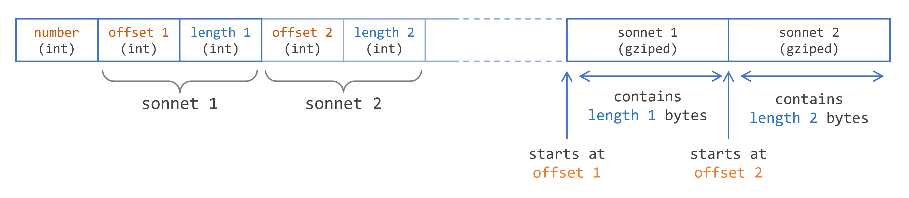

# 综合运用

## 综合运用

### 介绍莎士比亚十四行诗示例
莎士比亚创作了许多戏剧和 154 首十四行诗，您可以在古腾堡网站上找到它们。以下是第一首十四行诗：
```
  From fairest creatures we desire increase,
  That thereby beauty’s rose might never die,
  But as the riper should by time decease,
  His tender heir might bear his memory:
  But thou, contracted to thine own bright eyes,
  Feed’st thy light’s flame with self-substantial fuel,
  Making a famine where abundance lies,
  Thy self thy foe, to thy sweet self too cruel:
  Thou that art now the world’s fresh ornament,
  And only herald to the gaudy spring,
  Within thine own bud buriest thy content,
  And tender churl mak’st waste in niggarding:
    Pity the world, or else this glutton be,
    To eat the world’s due, by the grave and thee.
```

这个用例包括创建一个文件来以压缩方式存储所有这些诗。以下是您需要创建的文件的格式。

 

### 十四行诗文件格式
这个格式由几个元素组成。
- 十四行诗的总数。莎士比亚不太可能再写更多的十四行诗（他于 1616 年去世），但您仍然需要在这里写入这个数字。
- 对于每首十四行诗，您想要写入两个元素：一个偏移量和一个长度。长度是存储每首十四行诗所需的字节数。这个数字可能因一首十四行诗而异。偏移量是每首十四行诗在文件中第一个字节的偏移量。
- 然后是每首十四行诗的文本，使用 GZIP 压缩。

这个文件格式以压缩形式存储文本文件和整数数字。它需要 Java I/O API 的几个元素，您可以使用装饰器模式将它们混合在一起。

### 读取十四行诗文本文件
有两种方法可以读取这个文本文件。您可以直接下载并将其存储在本地机器上。或者您可以编写一些代码直接在线读取它。当然，这需要互联网连接。
以下是在线读取它的代码。它基于 HttpClient API 构建。它生成一个`InputStream`，您将在下一节中将其转换为`Reader`。
```java
URI sonnetsURI = URI.create("https://www.gutenberg.org/cache/epub/1041/pg1041.txt"); 
HttpRequest request = 
        HttpRequest.newBuilder(sonnetsURI) 
               .GET() 
               .build();
HttpClient client = 
        HttpClient.newBuilder().build();
HttpResponse<InputStream> response = client.send(request, HttpResponse.BodyHandlers.ofInputStream());
InputStream inputStream = response.body(); 
```
以下是使用`Files`工厂类从文件中读取的代码。
```java
Path path = Path.of("files/sonnets.txt"); 
BufferedReader reader = Files.newBufferedReader(path); 
```
这两段代码都不完整：缺少异常处理部分以及资源的关闭。

### 分析十四行诗文本文件
首先，您需要读取并分析古腾堡网站上提供的文本文件，并读取十四行诗的文本。
十四行诗的文本从文本文件的第 33 行开始。然后文件的结构如下：
- 一些空行，
- 十四行诗的编号，以罗马数字书写，
- 然后更多的空行，
- 然后是十四行诗的文本本身。
当您遇到以下行时，您知道没有更多的十四行诗要读取。
```
*** END OF THE PROJECT GUTENBERG EBOOK THE SONNETS ***
```

为了解决这个问题，您可以装饰`BufferedReader`类，保留其功能并添加自己的功能。这个问题有三个特定的功能：
- 跳过文本文件的前几行，
- 跳过十四行诗的标题，
- 读取十四行诗的文本，检查是否已到达文件末尾。

要读取十四行诗，您可以编写以下代码。缺少两个部分：`SonnetReader`类和`Sonnet`类。`inputStream`变量来自使用`HttpClient`代码示例读取文本文件或 URL 的结果。
```java
int start = 33; 

List<Sonnet> sonnets = new ArrayList<>(); 

try (var reader = new SonnetReader(inputStream);
) { 
    reader.skipLines(start); 
    List<Sonnet> sonnet = reader.readNextSonnet(); 
    while (sonnet!= null) { 
        sonnets.add(sonnet); 
        sonnet = reader.readNextSonnet(); 
    } 

} catch (IOException e) { 
    e.printStackTrace(); 
} 

System.out.println("# sonnets = " + sonnets.size()); 
```

`SonnetReader`类是`BufferedReader`类的装饰。以下是您可以编写的代码示例。
```java
class SonnetReader extends BufferedReader { 

    public SonnetReader(Reader reader) { 
        super(reader); 
    } 

    public SonnetReader(InputStream inputStream) { 
        this(new InputStreamReader(inputStream)); 
    } 

    public void skipLines(int lines) throws IOException { 
        for (int i = 0; i < lines; i++) { 
            readLine(); 
        } 
    } 

    private String skipSonnetHeader() throws IOException { 
        String line = readLine(); 
        while (line.isBlank()) { 
            line = readLine(); 
        } 
        if (line.equals("*** END OF THE PROJECT GUTENBERG EBOOK THE SONNETS ***")) { 
            return null; 
        } 
        line = readLine(); 
        while (line.isBlank()) { 
            line = readLine(); 
        } 
        return line; 
    } 

    private Sonnet readNextSonnet() throws IOException { 
        String line = skipSonnetHeader(); 
        if (line == null) { 
            return null; 
        } else { 
            var sonnet = new Sonnet(); 
            while (!line.isBlank()) { 
                sonnet.add(line); 
                line = readLine(); 
            } 
            return sonnet; 
        } 
    }
} 
```

运行此代码，您将在控制台上显示以下内容。
```
# sonnets = 154
```

`skipLines()`方法用于跳过文件头，其中包含有关文件本身的一些技术和法律信息。它调用`BufferedReader`类中定义的`readLine()`方法。
`skipSonnetHeader()`方法读取并丢弃文件中每首十四行诗的标题。它由一些空行、十四行诗的编号（以罗马数字表示）和更多空行组成。
`readNextSonnet()`方法读取十四行诗的文本。此文本中没有空行。如果遇到空行，则表示十四行诗已完全读取。

`Sonnet`类如下所示。
```java
class Sonnet { 
    private List<String> lines = new ArrayList<>(); 

    public void add(String line) { 
        lines.add(line); 
    }
} 
```

这个类是一个简单的`List<String>`包装器，具有一个简单的`add(String)`方法。使用这种简单的类可以使您的代码更具可读性和可维护性。处理`Sonnet`类的实例比处理`List<String>`更清晰。

因为它是`BufferedReader`类的装饰，所以您的`SonnetReader`类可以在`try - with - resources`语句中使用。该类的关闭将由该语句处理，而无需您实现任何`close()`方法。`try - with - resources`语句将调用`BufferedReader`类的`close()`方法。如果您需要，仍然可以实现自己的`close()`方法。在这种情况下，您需要调用所扩展的类的`close()`方法，以正确关闭该类打开的资源。

### 写入单个压缩十四行诗
让我们首先将单个十四行诗写入压缩文件。
这个压缩文件是一个使用 GZIP 压缩的二进制文件。幸运的是，Java I/O API 为您提供了`GZIPOutputStream`类来处理压缩。因为所有压缩的十四行诗都将写入文件，所以让我们首先将这个压缩流存储在字节数组中。
您可以将以下方法添加到`Sonnet`类中。
```java
byte[] getCompressedBytes() throws IOException { 
    ByteArrayOutputStream bos = new ByteArrayOutputStream(); 
    try (GZIPOutputStream gzos = new GZIPOutputStream(bos); 
         PrintWriter printWriter = new PrintWriter(gzos); ) { 

        for (String line : lines) { 
            printWriter.println(line); 
        } 
    } 

    return bos.toByteArray(); 
} 
```

此方法将十四行诗的行写入`ByteArrayOutputStream`，并使用`GZIPOutputStream`进行装饰，再使用`PrintWriter`进行装饰。这个`PrintWriter`对您非常方便，因为它提供了您需要的`println()`方法。
即使此方法中没有使用任何 I/O 资源，使用`try - with - resources`语句仍然非常有用：它将为您刷新`PrintWriter`和`GZIPOutputStream`的内部缓冲区，确保所有字节都写入数组。

### 写入所有十四行诗
写入所有十四行诗包括将所有压缩的十四行诗连接到一个字节数组中，并存储每首十四行诗的偏移量和长度。
一旦您拥有所有这些信息，就可以使用普通的`BufferedOutputStream`写入字节，并使用`DataOutputStream`写入偏移量和长度。因此，您再次需要使用装饰来生成此流。
您可以编写以下代码来创建最终文件。
```java
int numberOfSonnets = sonnets.size(); 
Path sonnetsFile = Path.of("files/sonnets.bin");
try (var sonnetFile = Files.newOutputStream(sonnetsFile); 
     var dos = new DataOutputStream(sonnetFile);) { 

    List<Integer> offsets = new ArrayList<>(); 
    List<Integer> lengths = new ArrayList<>(); 
    byte[] encodeSonnetsBytesArray = null; 

    try (ByteArrayOutputStream encodedSonnets = new ByteArrayOutputStream(); ) { 
        for (Sonnet sonnet : sonnets) { 
            byte[] sonnetCompressedBytes = sonnet.getCompressedBytes(); 

            offsets.add(encodedSonnets.size()); 
            lengths.add(sonnetCompressedBytes.length); 
            encodedSonnets.write(sonnetCompressedBytes); 
        } 

        dos.writeInt(numberOfSonnets); 
        for (int index = 0; index < numberOfSonnets; index++) { 
            dos.writeInt(offsets.get(index)); 
            dos.writeInt(lengths.get(index)); 
        } 
        encodeSonnetsBytesArray = encodedSonnets.toByteArray(); 
    } 
    sonnetFile.write(encodeSonnetsBytesArray); 

} catch (IOException e) { 
    e.printStackTrace(); 
} 
```

这段代码的第一部分遍历所有十四行诗并将它们压缩到第一个字节数组中。然后，将此十四行诗的偏移量和长度存储在相应的整数列表中，并将字节添加到类型为`ByteArrayOutputStream`的`encodedSonnets`中。
最终，您需要做的就是遵循文件的格式，即：
- 写入十四行诗的数量，
- 对于每首十四行诗：写入偏移量和长度，
- 然后写入包含所有压缩十四行诗的数组。

请注意，偏移量是从包含所有压缩十四行诗的数组的开头计算的，而不是从文件的开头计算的。如果您希望从文件的开头计算偏移量，只需将`4 + 2 * 4 * numberOfSonnets`添加到每个偏移量中，这表示文件头的大小。

### 读取单个十四行诗
回读单个十四行诗包括在文件中定位正确的压缩字节数组并对其进行解码。实际上，读取并不像写入那么复杂，因为您需要的所有信息都可以从文件中读取。
让我们首先编写代码来读取十四行诗的数量，以及每首十四行诗的偏移量和长度。
```java
Path path = Path.of("files/sonnets.bin"); 

try (var file = Files.newInputStream(path); 
     var bis = new BufferedInputStream(file); 
     var dos = new DataInputStream(file); ) { 

        int numberOfSonnets = dos.readInt(); 
        System.out.println("numberOfSonnets = " + numberOfSonnets); 
        List<Integer> offsets = new ArrayList<>(); 
        List<Integer> lengths = new ArrayList<>(); 
        for (int i = 0; i < numberOfSonnets; i++) { 
            offsets.add(dos.readInt()); 
            lengths.add(dos.readInt()); 
        } 

        // 此时，您拥有所有十四行诗的偏移量和长度
} 
```

假设您需要读取第 75 首十四行诗。您需要做的是跳过此之前的十四行诗，并读取正确数量的字节。
从 I/O 流中跳过固定数量的元素有点棘手。您需要记住，流可能非常长，太长而无法在内存中保存。因此，实际上，当您调用`skip(n)`方法时，系统可能没有跳过正确数量的字节。跳过固定数量字节的正确代码需要检查跳过的确切字节数，并尝试再次跳过。
```java
long skip(BufferedInputStream bis, int offset) throws IOException { 
    long skip = 0L; 
    while (skip < offset) { 
        skip += bis.skip(offset - skip); 
    } 
    return skip; 
} 
```

读取固定数量的字节也是如此。输入流读取的字节数可能小于您要求的数量。您的代码需要检查并确保所有字节都已正确读取。
```java
byte[] readBytes(BufferedInputStream bis, int length) throws IOException { 
    byte[] bytes = new byte[length]; 
    byte[] buffer = new byte[length]; 
    int read = bis.read(buffer); 
    int copied = 0; 
    while (copied < length) { 
        System.arraycopy(buffer, 0, bytes, copied, read); 
        copied += read; 
        read = bis.read(buffer); 
    } 
    return bytes; 
} 
```

有了这两个方法，您可以在读取偏移量和长度后添加以下代码。
```java
int sonnet = 75;  // 您正在读取的十四行诗
int offset = offsets.get(sonnet - 1); 
int length = lengths.get(sonnet - 1); 

skip(bis, offset);
byte[] bytes = readBytes(bis, length); 

try (ByteArrayInputStream bais = new ByteArrayInputStream(bytes); 
     GZIPInputStream gzbais = new GZIPInputStream(bais); 
     InputStreamReader isr = new InputStreamReader(gzbais); 
     BufferedReader reader = new BufferedReader(isr); ) { 

    List<String> sonnetLines = reader.lines().toList(); 
    sonnetLines.forEach(System.out::println);
} 
```

此代码读取压缩十四行诗的字节。然后，它在这个数组上构建一个`ByteArrayInputStream`，并使用`GZIPInputStream`对其进行装饰以解压缩。您需要读取的是一行行的文本，因此您需要使用字符流`InputStreamReader`进一步装饰这个二进制流。您可以从那里读取文本，但使用`BufferedReader`类的方法更简单，它允许您逐行读取此文本。

以下是应该在您的控制台上打印的这首十四行诗的文本。
```
  So are you to my thoughts as food to life,
  Or as sweet-season’d showers are to the ground;
  And for the peace of you I hold such strife
  As ’twixt a miser and his wealth is found.
  Now proud as an enjoyer, and anon
  Doubting the filching age will steal his treasure;
  Now counting best to be with you alone,
  Then better’d that the world may see my pleasure:
  Sometime all full with feasting on your sight,
  And by and by clean starved for a look;
  Possessing or pursuing no delight,
  Save what is had, or must from you be took.
    Thus do I pine and surfeit day by day,
    Or gluttoning on all, or all away.
```