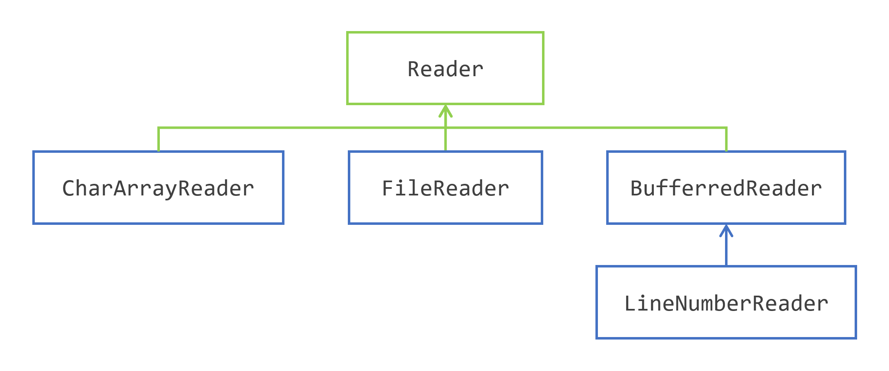

# 装饰 IO 流

## 装饰 IO 流

### 装饰的目的
装饰器模式是四人帮（Gang of Four）提出的 23 种设计模式之一。Java I/O API 使用此模式来扩展或修改其一些类的行为。
 `Reader`类层次结构说明了如何使用装饰来设计 Java I/O。
 

`Reader`类是一个抽象类，定义了读取字符的操作。它由三个具体类扩展：`CharArrayReader`、`StringReader`（此图中未显示）和`FileReader`，它们提供了从其中读取字符的介质。
然后，`BufferedReader`扩展了`Reader`并对其进行装饰。要创建`BufferedReader`的实例，您必须提供一个`Reader`对象，该对象作为`BufferedReader`对象的委托。`BufferedReader`类然后向基础`Reader`类添加了几个方法。
`BufferedReader`类的装饰允许覆盖`Reader`类现有的具体方法，以及添加新方法。
`LineNumberReader`类也是如此，它扩展了`BufferedReader`，并且需要一个`Reader`实例来构建。

### 向二进制流写入和读取字符
在本节的介绍中，您看到 Java I/O API 的类分为两类，一类用于处理字符，另一类用于处理字节。尝试从文本文件中读取或写入字节是没有意义的。但是，向二进制文件写入字符是应用程序中广泛使用的操作。
Java I/O API 为此提供了两个类：
- `InputStreamReader`是一个可以从`InputStream`读取字符的读取器，并且
- `OutputStreamWriter`是一个可以向`OutputStream`写入字符的写入器。
`InputStreamReader`是基于`InputStream`对象构建的对`Reader`类的装饰。如果需要，您可以提供字符集。`OutputStreamWriter`类也是如此，它扩展了`Writer`，并且需要一个`OutputStream`对象来构建。

### 使用`OutputStreamWriter`写入字符
让我们使用`OutputStreamWriter`将消息写入文本文件。
```java
String message = """
        From fairest creatures we desire increase,
        That thereby beauty's rose might never die,
        But as the riper should by time decease
        His tender heir might bear his memory:
        But thou, contracted to thine own bright eyes,
        Feed'st thy light's flame with self-substantial fuel,
        Making a famine where abundance lies,
        Thyself thy foe, to thy sweet self too cruel.
        Thou that art now the world's fresh ornament,
        And only herald to the gaudy spring,
        Within thine own bud buriest thy content,
        And, tender churl, mak'st waste in niggardly.
        Pity the world, or else this glutton be,
        To eat the world's due, by the grave and thee."""; 

Path path = Path.of("files/sonnet.txt");
try (var outputStream = Files.newOutputStream(path); 
     var writer = new OutputStreamWriter(outputStream);) { 

    writer.write(message); 

} catch (IOException e) { 
    e.printStackTrace(); 
} 

long size = Files.size(path); 
System.out.println("size = " + size); 
```
运行此代码将在`files`目录中创建一个名为`sonnet.txt`的文件，其中包含莎士比亚第一首十四行诗的文本。
在此示例中，有几件事情值得注意。
- `OutputStreamWriter`是通过装饰从`Files`类的工厂方法创建的`OutputStream`来创建的。
- 输出流和写入器都作为`try - with - resources`模式的参数创建，从而确保它们将以正确的顺序刷新和关闭。如果您错过了这一点，您的文件中可能会缺少字符，只是因为内部缓冲区没有正确刷新。
运行此代码将显示以下结果。
```
size =  609
```

### 使用`InputStreamReader`读取字符
读取在上一节中创建的`sonnet.txt`文件遵循相同的模式。以下是代码。
```java
Path path = Path.of("files/sonnet.txt");
String sonnet = null; 
try (var inputStream = Files.newInputStream(path); 
     var reader = new InputStreamReader(inputStream); 
     var bufferedReader = new BufferedReader(reader); 
     Stream<String> lines = bufferedReader.lines();) { 

    sonnet = lines.collect(Collectors.joining("\n")); 

} catch (IOException e) { 
    e.printStackTrace(); 
} 

System.out.println("sonnet = \n" + sonnet);
```
`reader`对象是通过装饰`inputStream`对象创建的，就像前面一样。不过，这段代码更进一步。
它装饰这个普通的`reader`对象来创建一个`BufferedReader`。`BufferedReader`类有几个方法可以逐行读取文本文件，我们将在这个示例中使用它们。
它调用`BufferedReader`对象上的`lines()`方法。此方法返回此文本文件行的流。因为流实现了`AutoCloseable`，您可以将其作为此`try - with - resources`模式的参数创建。
使用`Collectors.joining()`收集器收集流是一种非常简单的方法，可以连接此流的所有元素，并使用换行符（在此示例中）分隔。
运行此代码将产生以下结果。
```
sonnet = 
From fairest creatures we desire increase,
That thereby beauty's rose might never die,
But as the riper should by time decease
His tender heir might bear his memory:
But thou, contracted to thine own bright eyes,
Feed'st thy light's flame with self-substantial fuel,
Making a famine where abundance lies,
Thyself thy foe, to thy sweet self too cruel.
Thou that art now the world's fresh ornament,
And only herald to the gaudy spring,
Within thine own bud buriest thy content,
And, tender churl, mak'st waste in niggardly.
Pity the world, or else this glutton be,
To eat the world's due, by the grave and thee.
```

### 处理压缩二进制流
装饰器模式非常有效地用于读取和写入 gzip 文件。Gzip 是 deflate 算法的一种实现。此格式在 RFC 1952 中指定。JDK 中有两个类实现此算法：`GZIPInputStream`和`GZIPOutputStream`。
这两个类是基础类`InputStream`和`OutputStream`的扩展。它们只是覆盖了字节的读取和写入，而没有添加任何方法。这里使用装饰来覆盖默认行为。
由于装饰器模式，修改前面的两个示例以在压缩文件中写入和读取此文本只是对代码的小修改。

#### 使用`GZIPOutputStream`写入数据
以下是用于将文本写入 gzip 文件的代码。
```java
String message =...;  // 与之前相同的十四行诗
Path path = Path.of("files/sonnet.txt.gz");
try (var outputStream = Files.newOutputStream(path); 
     var gzipOutputStream = new GZIPOutputStream(outputStream); 
     var writer = new OutputStreamWriter(gzipOutputStream);) { 

    writer.write(message); 

} catch (IOException e) { 
    e.printStackTrace(); 
} 

long size = Files.size(path); 
System.out.println("size = " + size); 
```
请注意，`gzipOutputStream`对象是通过装饰常规的`outputStream`创建的，并用于创建`writer`对象。代码中的其他内容没有改变。
因为此文件现在已压缩，其大小较小。运行此代码将显示以下内容。
```
size =  377
```
请注意，您可以使用任何能够读取 gzip 文件的软件打开此文件。

#### 使用`GZIPInputStream`读取数据
以下代码读取文本。
```java
Path path = Path.of("files/sonnet.txt.gz");
String sonnet = null; 
try (var inputStream = Files.newInputStream(path); 
     var gzipInputStream = new GZIPInputStream(inputStream); 
     var reader = new InputStreamReader(gzipInputStream); 
     var bufferedReader = new BufferedReader(reader); 
     var stream = bufferedReader.lines();) { 

    sonnet = stream.collect(Collectors.joining("\n")); 

} catch (IOException e) { 
    e.printStackTrace(); 
} 

System.out.println("sonnet = \n" + sonnet);
```
请注意，`gzipInputStream`对象是通过装饰常规的`inputStream`创建的。然后，此`gzipInputStream`对象被装饰以创建`reader`对象。代码的其余部分保持不变。

### 处理原始类型的流
Java I/O API 提供了对`InputStream`和`OutputStream`的另外两个装饰：`DataInputStream`和`DataOutputStream`。
这些类添加了在二进制流上读取和写入原始类型的方法。

#### 写入原始类型
`DataOutputStream`类将其所有写入操作委托给它包装的`OutputStream`实例。该类提供以下方法来写入原始类型：
- `writeByte(int)`：将参数的八个低阶位写入底层流。参数的 24 个高阶位将被忽略。
其他方法不言自明。
- `writeBoolean(boolean)`
- `writeChar(char)`
- `writeShort(short)`
- `writeInt(int)`
- `writeLong(long)`
- `writeFloat(float)`
- `writeDouble(double)`
`DataOutputStream`类还提供了从数组写入字节和字符的方法。
- `writeBytes(String)`：将字符串的字符作为字节序列写入。每个字节对应于每个字符的 8 个低阶位。8 个高阶位将被忽略。
- `writeChars(String)`：写入字符串的字符。
- `writeUTF(String)`：使用`modified UTF - 8 encoding`将字符串写入底层输出流。
以下代码将 6 个`int`写入二进制文件。
```java
int[] ints = {3, 1, 4, 1, 5, 9}; 
Path path = Path.of("files/ints.bin");
try (var outputStream = Files.newOutputStream(path); 
     var dataOutputStream = new DataOutputStream(outputStream);) { 

    for (int i : ints) { 
        dataOutputStream.writeInt(i); 
    } 

} catch (IOException e) { 
    e.printStackTrace(); 
} 
System.out.printf("Wrote %d ints to %s [%d bytes]\n", 
                  ints.length, path, Files.size(path));
```
运行此代码将显示以下内容。
```
Wrote 6 ints to files\ints.bin [24 bytes] 
```
因为每个`int`是 4 个字节，所以文件的大小为 24 个字节，如控制台所示。

#### 读取原始类型
`DataInputStream`从二进制流中读取原始类型。它装饰您必须提供的`InputStream`，以构建任何`DataInputStream`的实例。这个新实例将所有读取操作委托给您提供的`InputStream`。
它提供了以下方法，这些方法不言自明。每个方法返回相应的类型。
- `readBoolean()`
- `readChar()`
- `readShort()`
- `readInt()`
- `readLong()`
- `readFloat()`
- `readDouble()`
它提供了读取无符号字节和短整型的方法：
- `readUnsignedByte()`：读取一个无符号字节，并以`int`的形式返回，范围为 0 到 255。
- `readUnsignedShort()`：读取两个字节，并将其解码为无符号 16 位整数。该值以`int`的形式返回，范围为 0 到 65535。
它还提供了读取多个字节并将它们排列成字符串的方法。
- `readUTF()`：此方法读取以修改后的 UTF - 8 格式编码的字符串。
- `readFully(byte[])`：此方法从输入流中读取字节并将它们存储在提供的数组中。它将尝试填充数组，如果需要，将阻塞。如果在数组填充之前遇到流的末尾，它将抛出`EOFException`。
- `readFully(byte[], int offset, int length)`：与前一个方法相同，从提供的`offset`开始填充`length`个字节。
以下是您可以编写的代码，用于读取在上一个示例中创建的文件中写入的整数。
```java
Path path = Path.of("files/ints.bin");
int[] ints = new int[6]; 
try (var inputStream = Files.newInputStream(path); 
     var dataInputStream = new DataInputStream(inputStream);) { 

    for (int index = 0; index < ints.length; index++) { 
        ints[index] = dataInputStream.readInt(); 
    } 

    System.out.println("ints = " + Arrays.toString(ints)); 

} catch (IOException e) { 
    e.printStackTrace(); 
} 
```