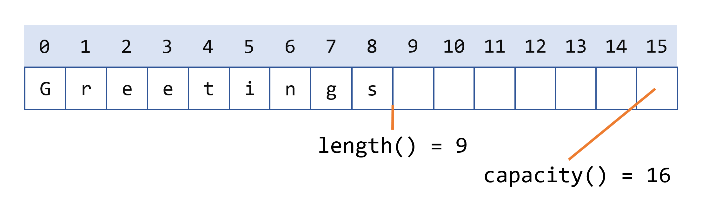

# StringBuilder
## StringBuilder类

`String`对象类似于`StringBuilder`对象，不同之处在于`StringBuilder`对象是可以修改的。在内部，这些对象被视为可变长度的字符序列数组。在任何时候，都可以通过方法调用更改序列的长度和内容。

除非`StringBuilder`在简化代码（请参阅本节末尾的示例程序）或提高性能方面提供优势，否则应始终使用字符串。在Java SE 9之前，如果您需要连接大量字符串，向`StringBuilder`对象追加内容可能更有效率。Java SE 9中优化了字符串连接，使得连接比`StringBuilder`追加更有效率。

## 长度和容量
`StringBuilder`类和`String`类一样，有一个`length()`方法，它返回生成器中字符序列的长度。

与字符串不同，每个字符串生成器还有一个容量，即已分配的字符空间数。通过`capacity()`方法返回的容量始终大于或等于长度（通常更大），并且必要时会自动扩展以适应对字符串生成器的添加。

您可以使用以下`StringBuilder`类的构造函数：

- `StringBuilder()`: 创建一个容量为16的空字符串生成器（16个空元素）。
- `StringBuilder(CharSequence cs)`: 构造一个字符串生成器，其中包含与指定的`CharSequence`相同的字符，再加上额外的16个空元素，位于`CharSequence`之后。
- `StringBuilder(int initCapacity)`: 创建一个具有指定初始容量的空字符串生成器。
- `StringBuilder(String s)`: 创建一个字符串生成器，其值由指定的字符串初始化，再加上额外的16个空元素，位于字符串之后。

例如，以下代码

```
// 创建容量为16的空生成器
StringBuilder sb = new StringBuilder();
// 在开头添加9个字符的字符串
sb.append("Greetings");
```

将生成一个长度为9、容量为16的字符串生成器：



`StringBuilder`类有一些与`String`类不同的长度和容量相关的方法：

- `void setLength(int newLength)`: 设置字符序列的长度。如果`newLength`小于`length()`，则字符序列中的最后字符将被截断。如果`newLength`大于`length()`，则在字符序列的末尾添加`null`字符。
- `void ensureCapacity(int minCapacity)`: 确保容量至少等于指定的最小值。

许多操作（例如，`append()`、`insert()`或`setLength()`）可以增加字符串生成器中字符序列的长度，使得结果的`length()`大于当前的`capacity()`。当这种情况发生时，容量会自动增加。

## StringBuilder操作
`StringBuilder`上的主要操作（在`String`中不可用）是`append()`和`insert()`方法，它们被重载以接受任何类型的数据。每个方法都将其参数转换为字符串，然后将该字符串的字符追加或插入到字符串生成器中的字符序列。

以下是`StringBuilder`类的一些方法：

- 您可以使用`append()`方法将任何原始类型或对象追加到字符串生成器。在执行追加操作之前，数据将转换为字符串。
- `delete(int start, int end)`方法从`StringBuilder`的字符序列中删除从`start`到`end - 1`（包括）的子序列。
- 您可以使用`deleteCharAt(int index)`方法删除索引`index`处的`char`。
- 您可以使用`insert(int offset)`方法之一在给定的`offset`插入任何原始类型或对象。这些方法将插入的元素作为第二个参数。在执行插入操作之前，数据将转换为字符串。
- 您可以使用`replace(int start, int end, String s)`和`setCharAt(int index, char c)`方法替换字符。
- 您可以使用`reverse()`方法反转此字符串生成器中的字符序列。
- 您可以使用`toString()`方法返回一个包含生成器中字符序列的字符串。

> 注意：您可以通过使用`StringBuilder`类的`toString()`方法先将字符串生成器转换为字符串，然后使用`StringBuilder(String string)`构造函数将字符串转换回字符串生成器，从而在`StringBuilder`对象上使用任何`String`方法。

## StringBuilder实践
在标题为“Strings”的部分中列出的`StringDemo`程序是一个示例，如果使用`StringBuilder`而不是`String`，程序将更有效。

`StringDemo`反转了一个回文。以下是它的列表：

```
public class StringDemo {
    public static void main(String[] args) {
        String palindrome = "Dot saw I was Tod";
        int len = palindrome.length();
        char[] tempCharArray = new char[len];
        char[] charArray = new char[len];

        // 将原始字符串放入字符数组中
        for (int i = 0; i < len; i++) {
            tempCharArray[i] =
                palindrome.charAt(i);
        }

        // 反转字符数组
        for (int j = 0; j < len; j++) {
            charArray[j] =
                tempCharArray[len - 1 - j];
        }

        String reversePalindrome =
            new String(charArray);
        System.out.println(reversePalindrome);
    }
}

```

运行程序会产生以下输出：

```
doT saw I was toD
```

为了实现字符串反转，程序将字符串转换为字符数组（第一个`for`循环），将数组反转为第二个数组（第二个`for`循环），然后将其转换回字符串。

如果您将回文字符串转换为字符串生成器，您可以使用`StringBuilder`类中的`reverse()`方法。它使代码更简单，更易于阅读：

```
public class StringBuilderDemo {
    public static void main(String[] args) {
        String palindrome = "Dot saw I was Tod";

        StringBuilder sb = new StringBuilder(palindrome);

        sb.reverse();  // 反转它

        System.out.println(sb);
    }
}

```

运行此程序会产生相同的输出：

```
doT saw I was toD
```

请注意，`println()`打印字符串生成器，如下所示：

```
System.out.println(sb);
```

因为`sb.toString()`被隐式调用，就像在任何其他对象的`println`调用中一样。

> 注意：还有一个`StringBuffer`类，它与`StringBuilder`类完全相同，只是由于其方法被同步，它是线程安全的。除非您绝对需要线程安全的类，否则您不需要使用`StringBuffer`。
