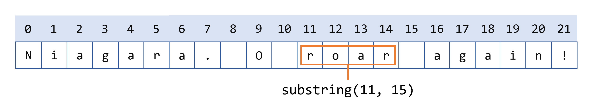

# 字符串

## 创建字符串

在Java编程中广泛使用的字符串是字符序列。在Java编程语言中，字符串是对象。

Java平台提供了`String`类来创建和操作字符串。

最直接的创建字符串的方式是编写：

```
String greeting = "Hello world!";
```

在这种情况下，"Hello world!" 是一个字符串字面量——代码中以双引号括起来的字符序列。每当编译器在代码中遇到字符串字面量时，它会创建一个带有其值的`String`对象——在这种情况下是 _Hello world!_。

和任何其他对象一样，您可以使用`new`关键字和构造函数来创建`String`对象。`String`类有十三个构造函数，允许您使用不同的来源提供字符串的初始值，例如字符数组：

```
char[] helloArray = {'h', 'e', 'l', 'l', 'o', '.'};
String helloString = new String(helloArray);
System.out.println(helloString);
```

这段代码的最后一行显示`hello`。

> 注意：`String`类是不可变的，所以一旦创建，`String`对象就不能更改。`String`类有许多方法，其中一些将在下面讨论，看起来像是修改字符串。由于字符串是不可变的，这些方法实际上做的是创建并返回一个包含操作结果的新字符串。

## 字符串长度

用于获取对象信息的方法称为访问器方法。您可以使用字符串的访问器方法是`length()`方法，它返回字符串对象中包含的字符数。在执行以下两行代码后，`len`等于17：

```
String palindrome = "Dot saw I was Tod";
int len = palindrome.length();
```

一个 _palindrome_ 是一个对称的单词或句子——忽略大小写和标点符号，它向前和向后拼写相同。这里有一个简短且效率低下的程序，用于反转一个回文字符串。它调用`String`方法`charAt(i)`，该方法返回字符串中的第 _i_ 个字符，从0开始计数。

## 字符串连接
`String`类包括一个用于连接两个字符串的方法：

```
string1.concat(string2);
```

这返回一个新字符串，即在`string1`末尾添加了`string2`。

您也可以使用字符串字面量与`concat()`方法，例如：

```
"My name is ".concat("Rumplestiltskin");
```

字符串更常用`+`运算符进行连接，例如

```
"Hello," + " world" + "!"
```

结果为

```
"Hello, world!"
```

`+`运算符在打印语句中广泛使用。例如：

```
String string1 = "saw I was ";
System.out.println("Dot " + string1 + "Tod");
```

这将打印

```
Dot saw I was Tod
```

这样的连接可以是任何对象的混合。对于不是`String`的对象，将调用它的`toString()`方法将其转换为`String`。

> 注意：直到Java SE 15，Java编程语言不允许字面字符串在源文件中跨行，因此您必须在多行字符串的每行末尾使用`+`连接运算符。例如：

```
String quote =
    "Now is the time for all good " +
    "men to come to the aid of their country.";
```

使用`+`连接运算符在`print`语句中再次非常常见。

从Java SE 15开始，您可以编写二维字符串字面量：

```
String html = """
              <html>
                  <body>
                      <p>Hello, world</p>
                  </body>
              </html>
              """;
```

## 创建格式化字符串
您已经看到使用`printf()`和`format()`方法打印带格式化数字的输出。`String`类有一个等价的类方法`format()`，它返回一个`String`对象，而不是`PrintStream`对象。

使用`String`的静态`format()`方法允许您创建一个您可以重复使用的格式化字符串，与一次性打印语句相对。例如，而不是

```
System.out.printf("The value of the float " +
                  "variable is %f, while " +
                  "the value of the " +
                  "integer variable is %d, " +
                  "and the string is %s",
                  floatVar, intVar, stringVar);
```

您可以编写

```
String fs;
fs = String.format("The value of the float " +
                   "variable is %f, while " +
                   "the value of the " +
                   "integer variable is %d, " +
                   " and the string is %s",
                   floatVar, intVar, stringVar);
System.out.println(fs);
```

## 将字符串转换为数字
通常，程序最终会得到一个包含在字符串对象中的数字数据——例如用户输入的值。

包装原始数字类型的`Number`子类（`Byte`、`Integer`、`Double`、`Float`、`Long`和`Short`）每个都提供了一个名为`valueOf()`的类方法，用于将字符串转换为该类型的一个对象。这里有一个例子，`ValueOfDemo`，它从命令行获取两个字符串，将它们转换为数字，并在这些值上执行算术运算：

## 将数字转换为字符串
有时您需要将数字转换为字符串，因为您需要在其字符串形式上操作该值。有几种简单的方法可以将数字转换为字符串：

```
int i;
// 将"i"与一个空字符串连接；转换为您处理。
String s1 = "" + i;

```

或

```
// valueOf类方法。
String s2 = String.valueOf(i);
```

每个`Number`子类都包括一个类方法`toString()`，它将原始类型转换为字符串。例如：

```
int i;
double d;
String s3 = Integer.toString(i);
String s4 = Double.toString(d);
```

`ToStringDemo`示例使用`toString()`方法将数字转换为字符串。然后，程序使用一些字符串方法计算小数点前后的位数：

## 通过索引获取字符和子字符串
`String`类有多种方法来检查字符串的内容，查找字符串中的字符或子字符串，更改大小写等任务。

您可以通过调用`charAt()`访问器方法来获取字符串中特定索引处的字符。第一个字符的索引是0，最后一个字符的索引是`length() - 1`。例如，以下代码获取字符串中索引9处的字符：

```
String anotherPalindrome = "Niagara. O roar again!";
char aChar = anotherPalindrome.charAt(9);
```

索引从0开始，所以索引9处的字符是'O'，如下图所示：


如果您想从字符串中获取多个连续字符，可以使用子字符串方法。子字符串方法有两个版本：

- `String substring(int beginIndex, int endIndex)`：返回此字符串的一个新字符串，该字符串是从此字符串指定的`beginIndex`开始到索引`endIndex - 1`的子字符串。
- `String substring(int beginIndex)`：返回此字符串的一个新字符串，该整数参数指定第一个字符的索引。在这里，返回的子字符串扩展到原始字符串的末尾。

以下代码从Niagara回文字符串中获取从索引11开始到索引15结束的子字符串，但不包括索引15，即单词"roar"：

```
String anotherPalindrome = "Niagara. O roar again!";
String roar = anotherPalindrome.substring(11, 15);
```



## 其他用于操作字符串的方法
以下是一些用于操作字符串的`String`方法：

- `String[] split(String regex)` 和 `String[] split(String regex, int limit)`：根据字符串参数指定的匹配项（包含正则表达式）搜索并相应地将此字符串拆分为字符串数组。可选的整数参数指定返回数组的最大大小。正则表达式在标题为“正则表达式”的部分中介绍。
- `CharSequence subSequence(int beginIndex, int endIndex)`：从`beginIndex`索引开始直到`endIndex - 1`返回新构建的字符序列。
- `String trim()`：返回此字符串的副本，去除前导和尾随空白。
- `String toLowerCase()` 和 `String toUpperCase()`：返回转换为小写或大写的此字符串的副本。如果不需要转换，则这些方法返回原始字符串。

## 在字符串中搜索字符和子字符串
以下是一些在字符串中查找字符或子字符串的`String`方法。`String`类提供了返回特定字符或子字符串在字符串中位置的访问器方法：`indexOf()` 和 `lastIndexOf()`。`indexOf()`方法从字符串开头向前搜索，`lastIndexOf()`方法从字符串末尾向后搜索。如果未找到字符或子字符串，`indexOf()` 和 `lastIndexOf()` 返回-1。

`String`类还提供了一个搜索方法contains，如果字符串包含特定的字符序列，则返回`true`。仅当您只需要知道字符串包含字符序列，但不需要精确位置时，请使用此方法。

搜索方法如下：

- `int indexOf(int ch)` 和 `int lastIndexOf(int ch)`：返回指定字符的第一次（最后一次）出现的索引。
- `int indexOf(int ch, int fromIndex)` 和 `int lastIndexOf(int ch, int fromIndex)`：从指定索引开始向前（向后）搜索，返回指定字符的第一次（最后一次）出现的索引。
- `int indexOf(String str)` 和 `int lastIndexOf(String str)`：返回指定子字符串的第一次（最后一次）出现的索引。
- `int indexOf(String str, int fromIndex)` 和 `int lastIndexOf(String str, int fromIndex)`：从指定索引开始向前（向后）搜索，返回指定子字符串的第一次（最后一次）出现的索引。
- `boolean contains(CharSequence s)`：如果字符串包含指定的字符序列，则返回`true`。

> 注意：`CharSequence`是一个接口，由`String`类实现。因此，您可以使用字符串作为`contains()`方法的参数。

## 替换字符串中的字符和子字符串
`String`类有一些方法用于将字符或子字符串插入字符串中。通常，它们不需要：您可以通过连接从字符串中删除的子字符串与您想要插入的子字符串来创建一个新的字符串。

`String`类确实有四个用于替换找到的字符或子字符串的方法。它们是：

- `String replace(char oldChar, char newChar)`：返回一个新字符串，该字符串是将此字符串中所有出现`oldChar`替换为`newChar`的结果。
- `String replace(CharSequence target, CharSequence replacement)`：将此字符串中匹配字面目标序列的每个子字符串替换为指定的字面替换序列。
- `String replaceAll(String regex, String replacement)`：将此字符串中匹配给定正则表达式的每个子字符串替换为给定的替换。
- `String replaceFirst(String regex, String replacement)`：将此字符串中匹配给定正则表达式的第一个子字符串替换为给定的替换。

正则表达式在标题为“正则表达式”的课程中讨论。

## 字符串类的实践
以下类`Filename`展示了使用`lastIndexOf()`和`substring()`来隔离文件名的不同部分。

> 注意：以下`Filename`类中的方法不执行任何错误检查，并假定它们的参数包含完整的目录路径和带扩展名的文件名。如果这些方法是生产代码，它们将验证它们的参数是否正确构造。

## 比较字符串和字符串部分
`String`类有多种方法用于比较字符串和字符串部分。以下表格列出了这些方法。

- `boolean endsWith(String suffix)` 和 `boolean startsWith(String prefix)`：如果此字符串以指定为方法参数的子字符串结束或开始，则返回`true`。
- `boolean startsWith(String prefix, int offset)`：从索引`offset`开始考虑字符串，并返回如果它以指定为参数的子字符串开始，则返回`true`。
- `int compareTo(String anotherString)`：字典顺序比较两个字符串。返回一个整数，指示此字符串是否大于（结果是\u003e 0）、等于（结果是 = 0）或小于（结果是 \u003c 0）参数。
- `int compareToIgnoreCase(String str)`：字典顺序比较两个字符串，忽略大小写差异。返回一个整数，指示此字符串是否大于（结果是 \u003e 0）、等于（结果是 = 0）或小于（结果是 \u003c 0）参数。
- `boolean equals(Object anObject)`：如果参数是代表与此对象相同的字符序列的`String`对象，则返回`true`。
- `boolean equalsIgnoreCase(String anotherString)`：如果参数是代表与此对象相同的字符序列的`String`对象，忽略大小写差异，则返回`true`。
- `boolean regionMatches(int toffset, String other, int ooffset, int len)`：测试此字符串的指定区域是否与`String`参数的指定区域匹配。区域长度为`len`，从索引`toffset`开始对于此字符串，从索引`ooffset`开始对于另一个字符串。
- `boolean regionMatches(boolean ignoreCase, int toffset, String other, int ooffset, int len)`：测试此字符串的指定区域是否与`String`参数的指定区域匹配。区域长度为`len`，从索引`toffset`开始对于此字符串，从索引`ooffset`开始对于另一个字符串。布尔参数表示是否应该忽略大小写；如果是`true`，则在比较字符时忽略大小写。
- `boolean matches(String regex)`：测试此字符串是否与指定的正则表达式匹配。正则表达式在标题为“正则表达式”的课程中讨论。

以下程序`RegionMatchesDemo`使用`regionMatches()`方法在另一个字符串中搜索字符串：
