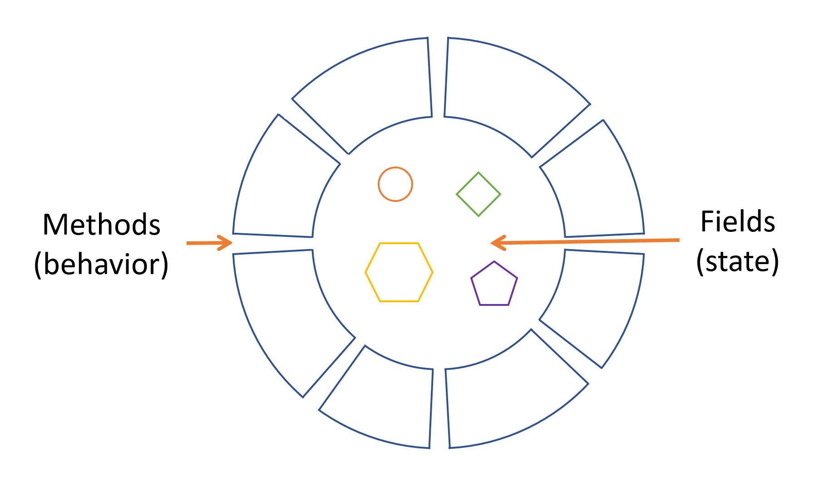
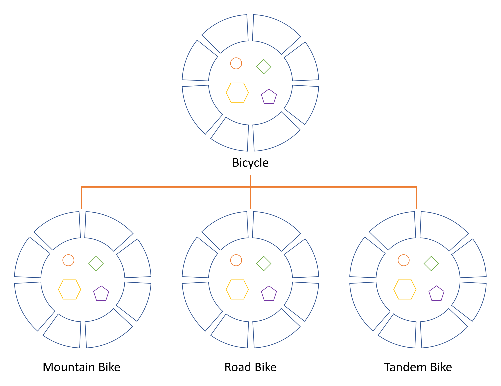

# 对象、类、接口、包和继承

如果您之前从未使用过面向对象编程语言，那么在开始编写任何代码之前，您需要学习一些基本概念。本节将向您介绍对象、类、继承、接口和包。每次讨论都侧重于这些概念如何与现实世界相关，同时提供Java编程语言语法的介绍。

## 什么是对象？

对象是相关状态和行为的软件捆绑。本节解释了对象内状态和行为的表示方式，介绍了数据封装的概念，并解释了以这种方式设计软件的好处。

对象有两个共同特点：它们都有状态和行为。狗有状态（名字、颜色、品种、饥饿）和行为（叫、取回、摇尾巴）。自行车也有状态（当前齿轮、当前踏板频率、当前速度）和行为（换齿轮、改变踏板频率、刹车）。识别现实世界对象的状态和行为是开始以面向对象编程方式思考的好方法。

现在花一分钟时间观察您周围现实世界中的对象。对于您看到的每个对象，问自己两个问题：“这个对象可能处于什么状态？”和“这个对象可能执行什么行为？”。确保记下您的观察。当您这样做时，您会发现现实世界对象的复杂性各不相同；您的台灯可能只有两种可能的状态（开和关）和两种可能的行为（打开、关闭），但您的台式收音机可能有额外的状态（开、关、当前音量、当前电台）和行为（打开、关闭、增大音量、减小音量、搜索、扫描和调谐）。您还可能注意到，一些对象反过来也会包含其他对象。这些现实世界的观察是理解面向对象编程世界的起点。

软件对象由状态和相关行为组成。对象在其内部状态中存储状态，并通过方法（某些编程语言中的函数）暴露其行为。方法操作对象的内部状态，并作为对象间通信的主要机制。隐藏内部状态并要求所有交互都通过对象的方法执行被称为数据封装——面向对象编程的基本原则。

以自行车为例：

### 将自行车建模为软件对象

通过赋予状态（当前速度、当前踏板频率和当前齿轮）并提供改变该状态的方法，对象保持了如何允许外部世界使用它的控制权。例如，如果自行车只有6个齿轮，一个换齿轮的方法可能会拒绝任何小于1或大于6的值。

将代码捆绑成单独的软件对象提供了许多好处，包括：

1. **模块化**：一个对象的源代码可以独立于其他对象的源代码编写和维护。一旦创建，对象可以轻松地在系统内部传递。
2. **信息隐藏**：通过仅与对象的方法交互，其内部实现的细节对外部世界保持隐藏。
3. **代码重用**：如果一个对象已经存在（可能由另一个软件开发人员编写），您可以在程序中使用该对象。这允许专家实现/测试/调试复杂、特定任务的对象，然后您可以信任它们在您自己的代码中运行。
4. **可插拔性和调试便利性**：如果某个特定的对象出现问题，您可以简单地将其从应用程序中移除，并插入一个不同的对象作为替代。这类似于解决现实世界中的机械问题。如果一个螺栓断了，您会替换它，而不是整个机器。

## 什么是类？

在您的应用程序中，您经常会发现许多相同类型的个别对象。可能有成千上万的其他自行车存在，都是相同的品牌和型号。每辆自行车都是根据同一套蓝图建造的，因此包含相同的组件。在面向对象的术语中，我们说您的自行车是被称为自行车的类的对象实例。一个类是创建单个对象的蓝图。

### 一个可能的`Bicycle`类实现

Java编程语言的语法对您来说可能是新的，但是这个类的设计是基于之前关于自行车对象的讨论。字段`cadence`、`speed`和`gear`表示对象的状态，方法（`changeCadence()`、`changeGear()`、`speedUp()`等）定义了它与外部世界的交互。

您可能已经注意到`Bicycle`类不包含`main()`方法。那是因为它不是一个完整的应用程序；它只是可能在应用程序中使用的自行车的蓝图。创建和使用新的`Bicycle`对象的责任属于应用程序中的其他类。

### `BicycleDemo`类

这里有一个`BicycleDemo`类，它创建了两个单独的`Bicycle`对象并调用它们的方法：

这次测试的输出打印了两辆自行车的最终踏板频率、速度和齿轮：

## 什么是继承？

不同类型的对象通常彼此之间有一些共同之处。例如，山地自行车、公路自行车和双人自行车都共享自行车的特征（当前速度、当前踏板频率、当前齿轮）。然而，每个也定义了使它们不同的额外功能：双人自行车有两个座位和两套把手；公路自行车有下弯把手；一些山地自行车有一个额外的链轮，使它们有更低的齿轮比。

面向对象编程允许类从其他类继承常用的状态和行为。在这个例子中，`Bicycle`现在成为`MountainBike`、`RoadBike`和`TandemBike`的超类。在Java编程语言中，每个类允许有一个直接超类，每个超类都有潜在的无限数量的子类：

### 自行车类的层次结构

创建子类的语法很简单。在类声明的开头，使用extends关键字，后跟要继承的类的名称：

这使`MountainBike`具有与`Bicycle`相同的字段和方法，但允许其代码专注于使其独特的功能。这使得您的子类代码易于阅读。但是，您必须注意正确记录每个超类定义的状态和行为，因为那些代码不会出现在每个子类的源文件中。

## 什么是接口？

正如您已经学到的，对象通过它们公开的方法定义了它们与外部世界的交互。方法形成了对象与外部世界的接口；例如，您电视机前面的按钮是您和其塑料外壳另一侧的电线之间的接口。您按下“电源”按钮来打开和关闭电视。

### 接口的常见形式

在最常见的形式中，接口是一组具有空体的相关方法。如果将自行车的行为指定为接口，可能如下所示：

要实现这个接口，您的类的名称将改变（例如，某种特定品牌的自行车，如`ACMEBicycle`），并且您将在类声明中使用`implements`关键字：

实现接口允许一个类更正式地承诺它将提供的行为。接口在类和外部世界之间形成了一个契约，这个契约由编译器在构建时强制执行。如果您的类声称实现了一个接口，那么该接口定义的所有方法都必须出现在其源代码中，类才能成功编译。

注意：要实际编译`ACMEBicycle`类，您需要在实现的接口方法的开头添加`public`关键字。您将在后面的类和对象、接口和继承部分中了解这样做的原因。

## 什么是包？

包是一个命名空间，它组织了一组相关的类和接口。从概念上讲，您可以将包想象成计算机上的不同文件夹。您可能在一个文件夹中保存HTML页面，在另一个文件夹中保存图像，在另一个文件夹中保存脚本或应用程序。因为用Java编程语言编写的软件可能由数百或数千个单独的类组成，所以将相关类和接口放入包中进行组织是有意义的。

### Java平台API

Java平台提供了一个庞大的类库（一组包），适合在您自己的应用程序中使用。这个库被称为“应用程序编程接口”，简称“API”。它的包代表了与通用编程最常关联的任务。例如，一个`String`对象包含字符字符串的状态和行为；一个`File`对象允许程序员轻松创建、删除、检查、比较或修改文件系统上的文件；一个`Socket`对象允许创建和使用网络套接字；各种GUI对象控制按钮和复选框以及与图形用户界面相关的任何其他内容。有成千上万的类可供选择。这使您，程序员，可以专注于特定应用程序的设计，而不是使其工作所需的基础设施。

Java平台API规范包含了Java SE平台提供的所有包、接口、类、字段和方法的完整列表。在浏览器中加载该页面并将其添加为书签。作为一个程序员，它将成为您最重要的参考文档。
