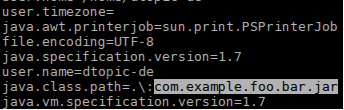
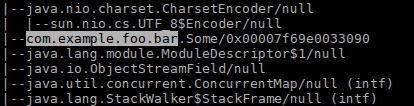
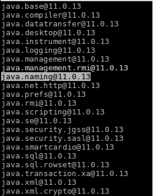

# 利用JDK工具和更新帮助保护Java应用程序

## JDK工具和功能概述

JDK 提供了一系列内置工具和功能，可以帮助系统管理员保持 Java 安装的安全。尽管这些工具和功能通常对经验丰富的 Java 开发人员来说非常熟悉，但对于需要保护 Java 应用程序的管理员来说，可能并不总是那么熟悉。

在本文中，我们将介绍一些内置工具和功能，并提供进一步资源的指针。管理员可以探索这些信息，为可能需要重新评估并采取措施提高其 Java 应用程序安全姿态的情况做准备。

简而言之，本文提供了一般性建议，用于保持 Java 应用程序的安全，而不是针对特定漏洞的缓解建议。

### jcmd 工具

`jcmd` 工具可以用来检索运行中应用程序的系统属性，通过运行 `jcmd $pid VM.system_properties`，其中 `$pid` 代表要检查的 Java 应用程序的进程 ID。如果使用 `jcmd` 时在类路径上发现了一个可能感兴趣的库名称，然后可以进一步检查该库，例如确定其版本。



在 JDK 9 及更高版本中，`jcmd` 可以使用 `VM.class_hierarchy` 子命令打印出在同一台机器上运行的 Java 应用程序加载的所有类的层次列表，通过调用 `jcmd $pid VM.class_hierarchy`。



在 JDK 7 及更高版本中，可以使用 `GC.class_histogram` 子命令代替，通过调用 `jcmd $pid GC.class_histogram` 来获取所有实例化类（及其内存使用情况）的列表。


管理员可以检查 `jcmd` 的输出，以确定是否有感兴趣的包，例如 `com.example.foo.bar`，以确定运行中的 Java 应用程序是否加载或实例化了具有这些名称的包中的类。

尚未加载或实例化的包和类将不会出现在 `jcmd` 的输出中。在这种情况下，它们在 `jcmd` 输出中的缺失不应被解释为指示它们不能在应用程序的后期被加载，前提是其配置和依赖项允许。

使用 JDK 9 及更高版本时，由于一个类在实例化之前必须先被加载，因此没有必要检查 GC 类直方图以查找可疑的类。

您应该使用与运行要检查的进程所使用的 JDK 相匹配的 `jcmd` 版本。

有关使用 `jcmd` 工具的更多信息，请参见 [JDK 故障排除指南](https://docs.oracle.com/en/java/javase/17/troubleshoot/index.html)。

#### 摘要

| 命令                             | 支持的版本 | 描述                             | 操作               |
| -------------------------------- | ------- | ------------------------------ | ---------------- |
| `jcmd <pid> VM.system_properties` | JDK 7  | 打印 JDK 设置的所有系统属性         | 检查特定库的类路径   |
| `jcmd <pid> GC.class_histogram`  | JDK 7  | 创建并打印类直方图               | 检查实例化的类       |
| `jcmd <pid> VM.class_hierarchy`  | JDK 9  | 打印类层次结构                  | 检查已加载的类       |

### jdeps

类和包可能在运行时作为依赖项加载。从 JDK 8 开始，开发人员和系统管理员可以使用 `jdeps` 静态分析 Java 库和类的依赖关系，以了解更多关于它们的包级或类级依赖关系。

开发人员可以使用 jdeps 检查单个 JAR 库，使用 `-p` 选项搜索对特定包的依赖，例如 `jdeps -p com.example.foo.bar some.jar` 将列出 some.jar 中依赖于 `-p` 指定包的包。`jdeps` 还可以使用正则表达式过滤包依赖关系。这允许开发人员和管理员搜索部分包名称，例如，查找打包的库。

有关使用 jdeps 的更多信息可以在相应的手册页中找到。

#### 摘要

| 命令                           | 支持的版本 | 描述                         | 操作                   |
| ------------------------------ | ------- | --------------------------- | --------------------- |
| `jdeps -package <package-name> <jar>` | JDK 8  | 静态分析 Java 库和类的依赖关系 | 检查包级或类级依赖关系 |

### 运行时配置选项

#### 系统属性、环境变量和命令行选项

另一个保持 Java 运行时更新的重要原因是，Oracle 不断改进运行时功能，并根据 JDK 发布说明中记录的最佳实践提供缓解措施。

最佳安全实践鼓励用户禁用其应用程序不需要的功能，并配置其系统尽可能限制所需功能。

例如，自 2017 年 1 月（在 8u121、7u131 和 6u141 中）以来，引入了几个选项来禁用或限制 Java 命名和目录接口（JNDI）的使用，那时通过 JNDI 对象工厂的远程类加载默认被禁用。自 2018 年 10 月（11.0.1、8u191、7u201 和 6u211）以来，默认启用了进一步的限制。

如果应用程序使用 JNDI 并且不需要工厂创建任何 Java LDAP 对象，管理员应在启动时使用 `JAVA_TOOL_OPTIONS` 环境变量来传递 Java 运行时命令行选项：`-Djdk.jndi.object.factoriesFilter=!* 和 -Dcom.sun.jndi.ldap.object.trustSerialData=false`。这些属性在 Oracle Java 17、11.0.11、8u291 和 7u301 及更高版本（自 2021 年 4 月以来）中可用。

这些属性的详细描述可在 Java SE API 文档中找到：

- `jdk.jndi.object.factoriesFilter`：这个系统和安全属性允许指定一个序列过滤器，该过滤器控制允许从命名/目录系统返回的对象引用实例化对象的对象工厂类的集合。在远程引用重建期间，引用实例的工厂类名称将与此过滤器匹配。该过滤器属性支持 JEP 290 指定的基于模式的过滤器语法：过滤传入的序列化数据。
- `com.sun.jndi.ldap.object.trustSerialData`：这个系统属性允许控制从 `javaSerializedData` LDAP 属性反序列化 Java 对象。为了防止从属性中反序列化 Java 对象，可以将系统属性设置为假值。默认情况下，允许从 `javaSerializedData` 属性中反序列化 Java 对象。

有关使用 `JAVA_TOOL_OPTIONS` 环境变量的更多信息，请参阅相应的故障排除指南。

如果您的应用程序使用序列化，Oracle 建议使用 JEP 290：过滤传入序列化数据和 JEP 415：上下文特定反序列化过滤器中描述的序列化过滤器，以限制可以反序列化的类。过滤传入的对象序列化数据流显著提高应用程序的安全性和健壮性。

#### 配置选项摘要

| 命令                             | 支持的版本      | 描述                                                             | 操作                                       |
| -------------------------------- | -------------- | ---------------------------------------------------------------- | ---------------------------------------- |
| `jdk.jndi.object.factoriesFilter` | 17, 11.0.11, 8u291, and 7u301 | 控制允许从命名/目录系统返回的对象引用实例化对象的对象工厂类的集合。 | `-Djdk.jndi.object.factoriesFilter=!*` 禁止 JNDI 使用任何对象工厂 |
| `com.sun.jndi.ldap.object.trustSerialData` | 17, 11.0.11, 8u291, and 7u301 | 允许控制从 `javaSerializedData` LDAP 属性反序列化 Java 对象。 | `-Dcom.sun.jndi.ldap.object.trustSerialData=false` 防止从 LDAP 属性反序列化 |
| `jdk.serialFilter`               | 9, 8u121, and 7u131 | 过滤传入的对象序列化流，以提高安全性和健壮性。               | JDK 21 指南和示例<br>JDK 17 指南和示例<br>JDK 11 指南和示例<br>JDK 7 和 8 指南和示例 |

### 使用 jlink 制作不包含不必要功能的专用运行时

最后，从 JDK 9 开始，开发人员可以利用 `jlink` 工具为其应用程序生成自定义 JDK 运行时映像，它只提供代码及其依赖库所需的 JDK 功能。

如果应用程序没有 GUI，例如，因此不需要桌面 API 及其实现，可以生成不包含 `java.desktop` 模块的 JDK 运行时映像，从而减少组合下载大小以及应用程序的潜在攻击面。

要以我们之前的例子继续，如果某人想要创建一个不使用 JNDI 的运行时，他可以创建一个不包含 `java.naming` 模块的自定义运行时，该功能位于该模块中。

可以使用 `java --list-modules` 命令找到 JDK 运行时映像中的所有模块集合。



开发人员可以通过向其提供要包含在运行时映像中的模块的显式列表来创建自定义 JDK 运行时映像。 要包含在映像中的模块集取决于要为其创建映像的应用程序的要求和 JDK 模块依赖项。 后者可以使用 确定。`jlinkjdeps`

从 JDK 11 开始，提供选项，该选项提供以逗号分隔的 JDK（和其他）模块列表， 可以通过创建仅包含这些模块及其传递依赖项的自定义运行时映像的选项来传递给它。`jdeps–print-module-depsjlink–add-modules`

可以在下面找到一个用于生成仅包含几个模块的自定义运行时映像的简单示例。 其他自定义 JDK 运行时可能包含 JDK 模块的更大子集，以及其代码最终依赖的其他文件，例如对不同区域设置或不同服务提供商实现的支持。 并非所有此类JDK依赖关系都可以通过单独执行的字节码静态分析来确定。 开发人员应仔细检查其自定义 JDK 运行时，以确保从生成的自定义运行时映像运行其应用程序所需的所有 JDK 功能都存在。`jlinkjdepsjava` `–list-modules`

```sh
$ jlink --module-path . --add-modules java.base,java.logging,java.net.http,java.xml --output my_runtime

$ my_runtime/bin/java --list-modules
java.base@11.0.13
java.logging@11.0.13
java.net.http@11.0.13
java.xml@11.0.13
```

通过创建的自定义 JDK 运行时映像是 JDK 的明确定义的子集。 系统管理员应对自定义 JDK 运行时映像应用与常规 JDK 升级相同的集成测试。jlink

您可以在其手册页面上了解有关使用该命令创建自定义 JDK 运行时映像的更多信息。jlink

如果无法创建自定义 JDK 运行时映像，则系统管理员可以在运行时使用 Java 选项 以限制应用程序可以观察到的 JDK 模块集。JDK 9 在 JEP 261： Module System 中引入了这个 Java 选项。 它允许指定精确的 JDK 模块集，包括它们的依赖项，这些模块将在运行时可供应用程序使用，而不是完整的 Java SE API。`–limit-modules`

如果运行代码期望能够在运行时使用 API，但 API 不可用，则可能会导致运行时异常。 使用通过 生成的自定义运行时图像时，或者使用标志来限制 JDK 模块的可观察性时，开发人员和管理员必须像应用 JDK 升级一样运行集成测试，这一点很重要。`jlink`

