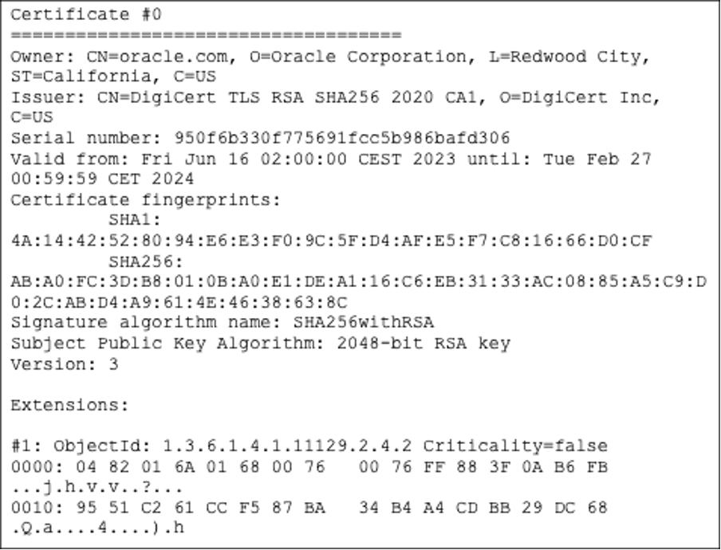

# 数字签名和证书的Java基础 

在我们的日常生活中，几乎可以在线访问任何事物并与他人互动已成为常态。然而，生活在线上世界意味着您必须质疑数据的合法性：每一封电子邮件都可信吗？当您登录到您最喜欢的网站时，您如何知道它是可靠的？您想要安装的软件更新是真实的，还是伪装成病毒，等待感染您的设备？

在这篇文章中，我们将更近距离地了解如何在Java代码中验证数字签名和检查证书。

## 在Java中实现数字签名

如果您需要一种机制来验证以下内容，您应该使用数字签名：

- 真实性：消息作者的身份是准确的。
- 完整性：在传输过程中消息没有被更改。
- 不可抵赖性：声称发送和接收消息的双方已经发送和接收了传输的消息。

要使用数字签名发送消息，您首先需要使用算法生成一个非对称密钥对，例如`Ed25519`：

```java
KeyPairGenerator keyPairGenerator = KeyPairGenerator.getInstance("Ed25519");
KeyPair keypair = keyPairGenerator.generateKeyPair();
```

接下来，您应该将消息输入到签名对象中，并调用`sign`方法：

```java
public static byte[] generateDigitalSignature(byte[] plainText, PrivateKey privateKey) throws Exception {
    Signature signature = Signature.getInstance("Ed25519");
    signature.initSign(privateKey);
    signature.update(plainText);
    return signature.sign();
}
```

在`generateDigitalSignature`方法中，您通过传递签名算法`Ed25519`来获取`Signature`对象的实例，这是一个使用`EdDSA`和`Curve25519`的椭圆曲线签名算法。然后，您用私钥初始化签名，传递消息，并将其存储为字节数组以完成签名操作。

要验证签名，您再次创建一个`Signature`实例，这次传递文本消息和公钥，如`verifyDigitalSignature`方法：

```java
public static boolean verifyDigitalSignature(byte[] plainText, byte[] digitalSignature, PublicKey publicKey) throws Exception {
    Signature signature = Signature.getInstance("Ed25519");
    signature.initVerify(publicKey);
    signature.update(plainText);
    return signature.verify(digitalSignature);
}
```

最后，您可以通过调用它的`verify`方法来检查签名。

您可以通过在`jshell`中运行以下代码片段来尝试前面的方法：

```java
import java.security.*;
import java.util.HexFormat;
import java.util.Scanner;

public class DigitalSignatureExample {
    public static final String Ed25519 = "Ed25519";

    public static byte[] generateDigitalSignature(byte[] plainText, PrivateKey privateKey) throws Exception {
        Signature signature = Signature.getInstance(Ed25519);
        signature.initSign(privateKey);
        signature.update(plainText);
        return signature.sign();
    }

    public static boolean verifyDigitalSignature(byte[] plainText, byte[] digitalSignature, PublicKey publicKey) throws Exception {
        Signature signature = Signature.getInstance(Ed25519);
        signature.initVerify(publicKey);
        signature.update(plainText);
        return signature.verify(digitalSignature);
    }

    public static void main(String[] args) throws Exception {
        KeyPairGenerator keyPairGenerator = KeyPairGenerator.getInstance("Ed25519");
        KeyPair keypair = keyPairGenerator.generateKeyPair();

        Scanner message = new Scanner(System.in);
        System.out.print("Enter the message you want to encrypt using Ed25519: ");
        String plainText = message.nextLine();
        byte[] bytes = plainText.getBytes();
        message.close();

        byte[] digitalSignature = generateDigitalSignature(bytes, keypair.getPrivate());

        System.out.println("Signature Value:\n " + HexFormat.of().formatHex(digitalSignature));
        System.out.println("Verification: " + verifyDigitalSignature(bytes, digitalSignature, keypair.getPublic()));
    }
}
```

在接下来的部分中，让我们更深入地了解数字证书以及它们如何帮助您将公钥所有权与拥有它的实体联系起来。

## Java中数字证书基础

在密码学中，证书是将一些信息绑定在一起的电子文档，例如用户的身份和公钥。一个受信任的第三方——证书颁发机构（CA）——发布数字证书以验证证书持有人的身份。


_图1: `keytool -printcert -sslserver oracle.com/java`输出的证书部分_

数字证书包含：

- 用于唯一标识证书、个体或由证书确定的实体的序列号。
- 有效期（不早于和不晚于）。
- 证书持有者（主题）的名称。
- 证书持有者的公钥副本。您需要这个来解密消息和数字签名。
- 证书颁发机构的数字签名。

为了更好地理解数字签名和证书，请查看下面的表格：

| 特征       | 数字签名             | 数字证书           |
| --------- | ------------------- | ------------------ |
| 目的       | 验证真实性、完整性、不可否认性。 | 验证发送者和接收者的身份。 |
| 过程       | 使用私钥对消息应用加密算法生成独特的数字签名。 | 由认证机构（CA）生成：密钥生成、注册、验证、创建。 |
| 标准       | 数字签名标准（DSS） | X.509标准格式     |

不是由已知的证书颁发机构发行，而是由托管证书的服务器发行的证书称为自签名证书。

您可以使用`keytool`生成一个有效期为365天的自签名证书，通过在终端窗口中运行以下命令：

```shell
$ keytool -genkeypair -keyalg ed25519 -alias mykey -keystore mykeystore.jks -storepass jkspass \
    -dname "CN=server.mycompany.com,OU=My Company Dev Team,O=My Company,c=NL" -validity 365

> Generating 255 bit Ed25519 key pair and self-signed certificate (Ed25519)
> with a validity of 365 days for: CN=server.mycompany.com, OU=My Company Dev Team, O=My Company, C=NL
```

之前的命令执行了多个操作：

- 创建名为`mykeystore`的密钥库，并分配密码`jkspass`。
- 为实体生成公/私钥对，其“可区分名称”有“server.company.com”的通用名称，“My Company”的组织单位，“My Company”的组织和“NL”的两位国家代码。
- 使用默认的`Ed25519`密钥生成算法创建密钥。
- 创建一个自签名证书，包括公钥和可区分名称信息。此证书有效期为365天，并与密钥库项中的私钥关联，该密钥库项由别名`mykey`引用。

您可以通过以下方式从密钥库中读取与别名关联的证书，并将其存储在文件`mycert.pem`中的可打印编码格式中：

```shell
$ keytool -exportcert -alias mykey \
    -keystore mykeystore.jks -storepass jkspass -rfc -file mycert.pem

> Certificate stored in file <mycert.pem>
```

要解析和管理此证书，使用`keytool`或`java.security.cert`包中的类来处理认证路径和证书吊销列表（CRLs）。

例如，您可以使用先前创建的自签名证书生成`java.security.cert.Certificate`并将其转换为`java.security.cert.X509Certificate`：

```java
import java.io.FileInputStream;
import java.io.IOException;
import java.io.InputStream;
import java.security.cert.CertificateException;
import java.security.cert.CertificateFactory;
import java.security.cert.X509Certificate;

public class CertificateManagementExample {

    public static void main(String[] args) throws Exception {
        //generate a certificate object
        X509Certificate cert = extractCertificate("mycert.pem");
    }

    private static X509Certificate extractCertificate(String filePath) throws IOException, CertificateException {
        try (InputStream is = new FileInputStream(filePath)) {
            CertificateFactory certificateFactory = CertificateFactory.getInstance("X.509");
            return (X509Certificate) certificateFactory.generateCertificate(is);
        }
    }

}
```

虽然`java.security.cert.Certificate`是具有不同格式的证书的抽象，但类`java.security.cert.X509Certificate`提供了一种标准的方式来访问所有`X.509`证书的属性。

如果您需要验证`X.509`认证路径，您应该使用`java.security.cert.TrustAnchor`和`java.security.cert.CertPathValidator`来处理证书链。

在处理数字证书时，您可以通过使用证书指纹快速在系统的凭据存储中定位特定证书。

证书的指纹是证书的唯一标识符，可以帮助您比较证书。您可以使用`java.security.MessageDigest`通过`java.security.cert.X509Certificate`对象轻松计算证书的指纹：

```java
import java.io.FileInputStream;
import java.io.IOException;
import java.io.InputStream;
import java.security.MessageDigest;
import java.security.cert.CertificateException;
import java.security.cert.CertificateFactory;
import java.security.cert.X509Certificate;
import java.util.HexFormat;

public class CertificateManagementExample {

    public static void main(String[] args) throws Exception {
        //generate a certificate object
        X509Certificate cert = extractCertificate("mycert.pem");
        //compute thumbprint
        MessageDigest md = MessageDigest.getInstance("SHA-256");
        byte[] der = cert.getEncoded();
        byte[] hash = md.digest(der);
        String thumbprint = HexFormat.of().formatHex(hash);
        System.out.println("Thumbprint: " + thumbprint);
    }

    //... rest of the code
}
```

在本教程中，我们介绍了如何在Java中使用数字签名和证书来验证消息的真实性、完整性和不可否认性，以及如何使用`keytool`和`java.security.cert`包来管理证书。

## 有用的链接：

- Oracle教程：数字签名
- Java安全架构：数字签名
- Java安全架构：证书
- RFC 7518：JSON Web Tokens（JWT）


