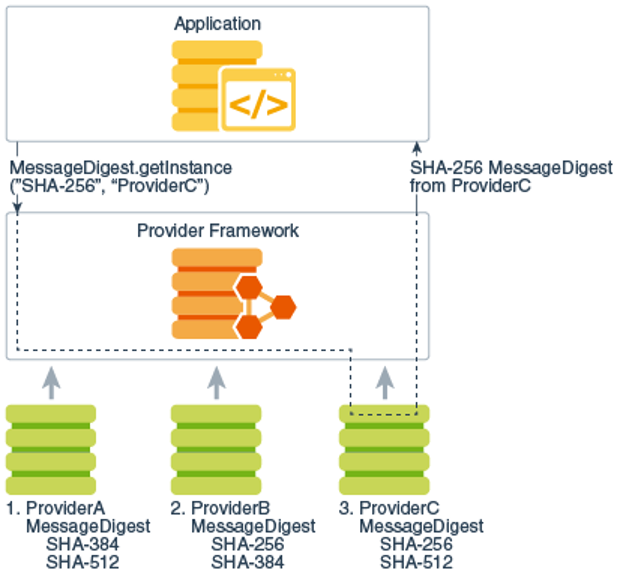
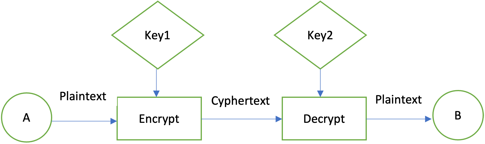

# Java加密/解密简介

## 密码学介绍

密码学是**使用代码和数字密钥来保护数据和通信的方法**，以确保信息未被篡改地传递给预期的发送者进行进一步处理。

理解密码学的核心概念，如加密和解密，对于开发人员至关重要，因为您可能会发现自己正在处理与以下功能相关的工作：

- **数字签名**：数字签名是一种密码学手段，通过它可以验证文档的来源、发送者的身份、文档签名或发送的时间和日期等。数字签名作为信息上的加密认证印章。
- **电子交易**：在电子货币系统中使用加密可以保护传统交易数据，如账户详情和交易金额。数字签名可以替代手写签名或信用卡授权，公钥加密可以提供保密性。
- 电子邮件系统中的**加密/解密**。
- **时间戳**以证明特定电子文档在特定时间存在或被送达。处理具有高度敏感信息的电子合同或档案是现实世界中的有效例子。

密码学操作的数据可以是**明文**（_cleartext_）或**密文**（_cryptogram_）。明文数据意味着消息以自然格式存在，攻击者可以阅读。密文数据意味着消息对攻击者来说是不可读的，但对预期的接收者来说是可读的。

您可以使用**加密**过程将消息从明文转换为密文。同样，您可以通过使用加密算法和用于创建原始消息的密钥，将密文转换为明文，这个过程称为**解密**。通常，加密或解密过程基于公开可用的算法，但通过使用安全的**密钥**来控制数据。

您可以使用**哈希**函数将任意大小的字节集映射到有限大小的相对唯一的字节集。一个设计良好的密码学哈希函数应该使用**盐**，这是一串随机（或伪随机）位的字符串，与密钥或密码连接。您可以通过引入额外的密码学变化来增加安全性，使用**初始化向量（IV）**对明文块序列进行加密。

> **_注意：_** 本文提供的代码片段旨在说明Java API在高层次上的工作原理。为了清晰起见，它们有时被简化了。安全性可能是一个复杂的话题，并且总是根据您的特定需求而独特的，因此您应该始终咨询您的安全专家关于您的特定需求。

## JDK中的可用密码学标准

Java密码学基于允许不同平台运行的明确定义的国际标准。这些标准包括：

- TLS（传输层安全）v1.2，v1.3 – RFC 5246，RFC 8446
- RSA密码学规范PKCS #1 – RFC 8017
- 密码学令牌接口标准（PKCS#11）
- ANSI X9.62中定义的ECDSA签名算法等

安全领域不断发展，例如更强的算法被引入，而旧的算法被认为不够安全。Oracle JDK定期更新以应对这些变化，并保持Java平台的安全性。Oracle JDK密码学路线图反映了Oracle JDK中由Oracle提供的安全提供商应用的最新和即将到来的更改。

Java密码学架构（JCA）是使用Java编程语言进行密码学工作的框架，是Java安全API的一部分。其目标是提供密码学算法独立性和可扩展性、互操作性和对安全提供商的实现不可知性。

JCA包括与特定类型的密码学服务交互的引擎类：

- 加密、数字签名、消息摘要等密码学操作。
- 密钥和算法参数。
- 封装密码学数据并可在更高层次的抽象中使用的密钥库或证书。

JDK包含了一系列提供者的密码学实现，例如`Sun`、`SunRSASign`、`SunJCE`等。要使用JCA，应用程序请求特定类型的对象（如MessageDigest）和特定算法或服务（如`SHA-256`算法），并从已安装的提供者之一获得实现。或者，您可以从特定提供者请求对象（如下图中的`ProviderC`）。


_图1: 请求ProviderC对象 `provider.MessageDigest.getInstance("SHA-256", "ProviderC")`_
来源：Java安全概述

如果您想获得已安装提供者的列表，只需调用`java.security.Security.getProviders()`。您可以在JShell中复制以下代码片段，以打印JDK中每个找到的提供者可用的密码学算法列表：

```java
jshell> import java.security.Security;
jshell> import java.util.Set;
jshell> import java.util.TreeSet;
jshell> Set<String> algos = new TreeSet<>();
jshell> for (Provider provider : Security.getProviders()){
jshell>     Set<Provider.Service> service = provider.getServices();
jshell>     service.stream().map(Provider.Service::getAlgorithm).forEach(algos::add);
jshell> }
jshell> algos.forEach(System.out::println);
jshell> 
algos ==> []
1.2.840.113554.1.2.2
1.3.6.1.5.5.2
AES
AES/GCM/NoPadding
AES/KW/NoPadding
AES/KW/PKCS5Padding
AES/KWP/NoPadding
AES_128/OFB/NoPadding
AES_192/CBC/NoPadding
// 列表为了显示目的被截断
```

一些流行的提供者示例包括：`SunPKCS11`、`SunMSCAPI (Windows)`、`BouncyCastle`、`RSA JSAFE`、`SafeNet`。如果您想使用的提供者不在打印列表中，您也可以按照以下步骤注册它：

1. 将提供者类放在`CLASSPATH`上。
2. 注册提供者，要么：
   - 通过修改_conf/security/java.security_配置文件，例如 `security.provider.5=SunJCEII`。请注意，在JDK 8中`java.security`文件位于_java.home/lib/security/java.security_。
   - 通过调用`Security.addProvider(java.security.Provider)`和`Security.insertProviderAt(java.security.Provider,int)`动态注册。
3. 提供者的优先顺序通过简单的数字排序来声明。

现在让我们更详细地检查如何在Java中使用加密/解密。

## Java中的基本加密/解密

在使用数据加密时，您可以使用这种安全控制机制来保护三种数据状态：

- **静态数据**是指不积极在设备或网络之间移动的信息，存储在数据库中，或保存在磁盘上。
- **动态数据**表示从一个网络点到另一个网络点的信息。
- **使用中的数据**指的是加载在内存中并被用户积极访问和处理的信息。

加密对于所有三种数据状态都很重要，可以提供额外的保护层以防止攻击。有两种加密方法：对称加密和非对称加密。

### 实现基本的对称加密/解密

对称或共享密钥加密是一种方法，其中双方共享一个密钥，由双方保密。例如，发送者`A`可以使用共享密钥加密消息，然后接收者`B`只能使用该密钥解密加密的消息。

_图2: 对称加密_

要在Java中实现对称加密，您首先需要生成一个共享密钥。您可以使用以下片段来实现：

```java
public static SecretKey generateKey() throws NoSuchAlgorithmException {
    KeyGenerator keygenerator = KeyGenerator.getInstance("AES");
    keygenerator.init(128);
    return keygenerator.generateKey();
}

```

在上述示例中，您首先实例化一个使用`AES`算法的密钥生成器。接下来，您为128位密钥大小初始化密钥生成器，并需要随机字节。

从JDK 19开始，`AES`算法的默认大小已从128位增加到256位（如果加密策略允许），否则默认回退到128位。

最后生成一个密钥。

为了增强加密/解密机制，您可以使用任意值初始化向量（IV）：

```java
public static IvParameterSpec generateIv() {
    byte[] initializationVector = new byte[16];
    SecureRandom secureRandom = new SecureRandom();
    secureRandom.nextBytes(initializationVector);
    return new IvParameterSpec(initializationVector);
}

```

由于对称加密将固定长度的明文数据块转换为密文块，它可以使用块密码中的几种模式：

- `ECB (Electronic Code Book Mode)`
- `CBC (Cipher Block Chain Mode)`
- `CCM (Counter/CBC Mode)`
- `CFB (Cipher Feedback Mode)`
- `OFB/OFBx (Output Feedback)`
- `CTR (Counter mode)`
- `GCM (Galois/Counter Mode)`
- `KW (Key Wrap Mode)`
- `KWP (Key Wrap Padding Mode)`
- `PCBC (Propagating Cipher Block Chaining)`

您可以在`Java Security Standard Algorithm Names Specification`的Cipher部分检查所有模式和支持的转换。接下来，当获取`Cipher`类的实例时，您需要指定加密方法中的块密码：

```java
public static byte[] encrypt(String input, SecretKey key, IvParameterSpec iv)
        throws Exception {
    Cipher cipher = Cipher.getInstance("AES/CFB8/NoPadding");
    cipher.init(Cipher.ENCRYPT_MODE, key, iv);
    return cipher.doFinal(input.getBytes(StandardCharsets.UTF_8));
}

```

要将密文转换回原始明文，您应该使用相同的块密码、密钥和IV：

```java
public static String decrypt(byte[] cipherText, SecretKey key, IvParameterSpec iv) throws Exception {
    Cipher cipher = Cipher.getInstance("AES/CFB8/NoPadding");
    cipher.init(Cipher.DECRYPT_MODE, key, iv);
    byte[] plainText = cipher.doFinal(cipherText);
    return new String(plainText);
}

```

`doFinal()`方法在密码上调用，用于单部分操作加密或解密数据，或完成多部分操作，并返回一个字节数组。

那么让我们将这些方法结合起来，加密和解密消息：

```java
public static void main(String[] args) throws Exception {
    SecretKey symmetricKey = generateKey();
    IvParameterSpec iv = generateIv();

    // 从键盘获取输入
    Scanner message = new Scanner(System.in);
    String plainText = message.nextLine();
    message.close();

    // 使用对称密钥加密消息
    byte[] cipherText = encrypt(plainText, symmetricKey, iv);

    System.out.println("The encrypted message is: " + cipherText);

    // 解密加密的消息
    String decryptedText = decrypt(cipherText, symmetricKey, iv);

    System.out.println("Your original message is: " + decryptedText);
}

```

如果您需要一种计算成本较低的加密方法，对称加密是一个有效的选择，因为它只需要创建一个短的单一密钥（40-512位），可供发送者和接收者使用。如果您正在寻找使用不同、更长的密钥进行加密和解密的选项，那么请继续阅读有关非对称加密和解密的内容。

### 实现基本的非对称加密/解密

非对称加密使用一对数学相关的密钥，一个用于加密，另一个用于解密。在下面的示例中，`Key1`用于加密，`Key2`用于解密。

_图3: 非对称加密_

在这样一个系统中，`A`可以使用接收者`B`的公钥加密消息，但只有`B`拥有的私钥才能解码消息。在一对密钥中，公钥对所有人可见。私钥是秘密密钥，主要用于解密或用于数字签名的加密。

要在Java中实现非对称加密，您首先需要通过获取`KeyPairGenerator`的实例（以RSA算法为例）来生成密钥对（公钥，私钥）。给定所选算法，`KeyPairGenerator`对象使用3072位密钥大小和通过`SecureRandom`类初始化的随机数：

```java
public static KeyPair generateRSAKKeyPair() throws Exception {
    KeyPairGenerator keyPairGenerator = KeyPairGenerator.getInstance("RSA");
    keyPairGenerator.initialize(3072);
    return keyPairGenerator.generateKeyPair();
}

```

如果您使用的是JDK 19或更高版本，您应该意识到`RSA`、`RSASSA-PSS`和`DH`算法的默认密钥大小已从2048位增加到3072位。

接下来，让我们实现将明文转换为密文的加密方法，使用公钥：

```java
public static byte[] encrypt(String plainText, PublicKey publicKey) throws Exception {
    Cipher cipher = Cipher.getInstance("RSA");
    cipher.init(Cipher.ENCRYPT_MODE, publicKey);
    return cipher.doFinal(plainText.getBytes(StandardCharsets.UTF_8));
}

```

要将密文转换回原始明文，您可以使用私钥：

```java
public static String decrypt(byte[] cipherText, PrivateKey privateKey) throws Exception {
    Cipher cipher = Cipher.getInstance("RSA");
    cipher.init(Cipher.DECRYPT_MODE, privateKey);
    byte[] result = cipher.doFinal(cipherText);
    return new String(result);
}

```

使用前面的方法，您可以编写一个小程序来模拟非对称加密和解密的工作方式：

```java
public static void main(String[] args) throws Exception {
    KeyPair keypair = generateRSAKKeyPair();

    // 从键盘获取输入
    Scanner message = new Scanner(System.in);
    System.out.print("Enter the message you want to encrypt using RSA: ");
    String plainText = message.nextLine();
    message.close();

    byte[] cipherText = encrypt(plainText, keypair.getPublic());

    System.out.print("The encrypted text is: ");

    System.out.println(HexFormat.of().formatHex(cipherText));

    String decryptedText = decrypt(cipherText, keypair.getPrivate());

    System.out.println("The decrypted text is: " + decryptedText);
}

```

您可以通过使用`MessageDigest`对消息进行哈希来确保发送者和通过不安全通道传输的消息的完整性。要实现这一点，您应该创建消息的摘要，并使用私钥进行加密：

```java
public static byte[] generateDigitalSignature(byte[] plainText, PrivateKey privateKey) throws Exception {
    MessageDigest md = MessageDigest.getInstance("SHA-256");
    byte[] messageHash = md.digest(plainText);

    Cipher cipher = Cipher.getInstance("RSA");
    cipher.init(Cipher.ENCRYPT_MODE, privateKey);
    return cipher.doFinal(messageHash);
}

```

这个摘要称为数字签名，只能由拥有发送者公钥的接收者解密。要验证消息和发送者的真实性，您应该使用公钥：

```java
public static boolean verify(byte[] plainText, byte[] digitalSignature, PublicKey publicKey) throws Exception {
    MessageDigest md = MessageDigest.getInstance("SHA-256");
    byte[] hashedMessage = md.digest(plainText);

    Cipher cipher = Cipher.getInstance("RSA");
    cipher.init(Cipher.DECRYPT_MODE, publicKey);
    byte[] decryptedMessageHash = cipher.doFinal(digitalSignature);

    return Arrays.equals(decryptedMessageHash, hashedMessage);
}

```

下面您可以找到一个示例调用，将使用上述方法：

```java
public static void main(String[] args) throws Exception {
    byte[] digitalSignature = generateDigitalSignature(plainText.getBytes(), keypair.getPrivate());
    System.out.println("Signature Value: " + HexFormat.of().formatHex(digitalSignature));
    System.out.println("Verification: " + verify(plainText.getBytes(), digitalSignature, keypair.getPublic()));
}

```

祝贺您，您已经学会了JCA如何在Java中支持密码学工作，以及如何使用Java安全API实现基本的加密和解密机制。

## 有用的链接：

- Oracle JDK密码学路线图
- Java安全标准算法名称规范
- RFC5246
- RFC8446
- RFC8017


