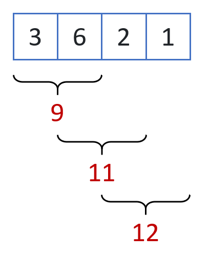
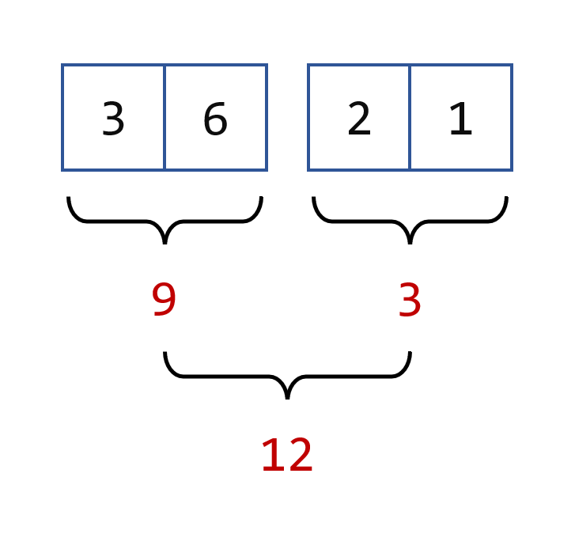
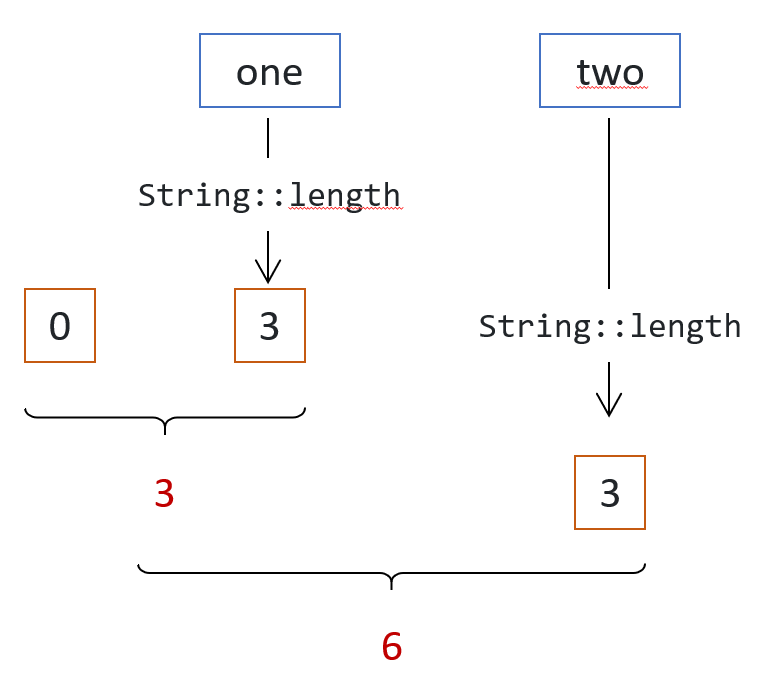

# 归约流

## 在流上调用终端操作
到目前为止，您在本教程中了解到，归约流包括以类似于SQL语言中所做操作的方式聚合流的元素。在您运行的示例中，您还使用 `collect(Collectors.toList())` 模式将构建的流中的元素收集到列表中。所有这些操作在Stream API中被称为终端操作，它们涉及归约您的流。

在对流调用终端操作时，您需要记住两件事：

1. 没有终端操作的流不会处理任何数据。如果您在应用程序中发现这样的流，它很可能是一个错误。
2. 给定的流实例只能有一个中间或终端操作调用。您不能重用流；如果您尝试这样做，将得到一个 `IllegalStateException`。

## 使用二元操作符归约流
`Stream` 接口中定义了三个重载的 `reduce()` 方法。它们都接受一个 `BinaryOperator` 对象作为参数。让我们探讨如何使用这个二元操作符。

以一个示例为例。假设您有一个整数列表，需要计算这些整数的总和。您可以编写以下代码，使用传统的for循环模式来计算这个总和。

```java
List<Integer> ints = List.of(3, 6, 2, 1);

int sum = ints.get(0);
for (int index = 1; index < ints.size(); index++) {
    sum += ints.get(index);
}
System.out.println("sum = " + sum);
```

运行它将打印出以下结果。

```
sum = 12
```

这段代码的作用如下：

1. 取出列表的前两个元素并将它们相加。
2. 然后取出下一个元素，将其加到已计算的部分和上。
3. 重复这个过程，直到到达列表的末尾。

这种计算方式可以用以下图表总结。



如果仔细检查这段代码，您会发现您可以用一个二元操作符来模拟_SUM_ 操作符以获得相同的结果。然后代码变成以下这样。

```java
List<Integer> ints = List.of(3, 6, 2, 1);
BinaryOperator<Integer> sum = (a, b) -> a + b;

int result = ints.get(0);
for (int index = 1; index < ints.size(); index++) {
    result = sum.apply(result, ints.get(index));
}
System.out.println("sum = " + result);
```

现在您可以看到，这段代码仅依赖于二元操作符本身。假设您需要计算_MAX_。您所需做的只是提供正确的二元操作符。

```java
List<Integer> ints = List.of(3, 6, 2, 1);
BinaryOperator<Integer> max = (a, b) -> a > b ? a : b;

int result = ints.get(0);
for (int index = 1; index < ints.size(); index++) {
    result = max.apply(result, ints.get(index));
}
System.out.println("max = " + result);
```

这表明，您确实可以通过仅提供一个在两个元素上操作的二元操作符来计算归约。这就是 Stream API 中 `reduce()` 方法的工作原理。

## 选择可在并行中使用的二元操作符
尽管您需要了解两点，第一点我们在这里讨论，第二点在下一部分讨论。

第一点是流可以在并行中计算。这一点将在本教程后面的部分详细讨论，但我们现在需要讨论它，因为它对这个二元操作符有影响。

Stream API 中是这样实现并行的。您的数据源被分成两部分，每部分分别处理。每个处理过程与您刚刚看到的使用您的二元操作符的过程相同。然后，当每部分处理完毕后，两个部分结果使用相同的二元操作符合并。

这个过程是如何进行的。



在并行中处理流数据非常容易：只需在给定的流上调用 `parallel()`。

让我们看看幕后是如何工作的，您可以编写以下代码。您只是模拟如何在并行中进行计算。这当然是并行流的过度简化版本，只是为了解释工作方式。

让我们创建一个 `reduce()` 方法，它接受一个二元操作符，并使用它来归约整数列表。代码如下。

```java
int reduce(List<Integer> ints, BinaryOperator<Integer> sum) {
    int result = ints.get(0);
    for (int index = 1; index < ints.size(); index++) {
        result = sum.apply(result, ints.get(index));
    }
    return result;
}

```

这是使用这个方法的主要代码。

```java
List<Integer> ints = List.of(3, 6, 2, 1);
BinaryOperator<Integer> sum = (a, b) -> a + b;

int result1 = reduce(ints.subList(0, 2), sum);
int result2 = reduce(ints.subList(2, 4), sum);

int result = sum.apply(result1, result2);
System.out.println("sum = " + result);

```

为了明确起见，我们已经将数据源分成两部分，并分别归约为两个整数：`reduce1` 和 `reduce2`。然后我们使用相同的二元操作符合并这些结果。这基本上就是并行流的工作方式。

这段代码非常简化，它只是用来展示您的二元操作符应该具有的一个特殊属性。您如何分割流的元素不应该影响计算结果。所有以下分割都应该给出相同的结果：

- `3 + (6 + 2 + 1)`
- `(3 + 6) + (2 + 1)`
- `(3 + 6 + 2) + 1`

这表明您的二元操作符应该具有一个众所周知的属性，称为_结合律_。传递给 `reduce()` 方法的二元操作符应该是结合律的。

Stream API 中 `reduce()` 方法的重载版本的 JavaDoc API 文档指出，您作为参数提供的二元操作符必须是结合律的。

如果不是会怎样？好吧，这正是问题所在：它既不会被编译器检测到，也不会被 Java 运行时检测到。所以您的数据将被处理，没有任何明显的错误。您可能得到正确的结果，也可能不是；这取决于您的数据将如何被内部处理。事实上，如果您多次运行代码，最终可能会得到不同的结果。这是您需要意识到的非常重要的一点。

您如何测试您的二元操作符是否具有结合律？在某些情况下，这可能非常容易：_SUM_、_MIN_、_MAX_ 是众所周知的结合律操作符。在其他情况下，可能要困难得多。检查该属性的一种方法是在随机数据上运行您的二元操作符，并验证是否始终获得相同的结果。如果没有，那么您就知道您的二元操作符不具有结合律。如果有，那么不幸的是，您不能可靠地得出结论。

## 管理具有恒等元素的二元操作符
第二个是您的二元操作符应该具有的结合律属性的后果。

这种结合律属性是由以下事实强加的：您数据的分割方式不应该影响计算结果。如果您将集合 _A_ 分成两个子集 _B_ 和 _C_，那么归约 _A_ 应该给出与归约归约 _B_ 和归约 _C_ 相同的结果。

您可以将上述属性写成更一般的表达式：

_A_ = _B_ ∪ _C_ ⇒ Red( _A_) = Red(Red( _B_), Red( _C_))

事实证明，这导致另一个后果。假设情况不佳，而 _B_ 实际上是空的。在这种情况下，_C_ = _A_。上述表达式变为以下内容：

Red( _A_) = Red(Red(∅), Red( _A_))

这仅当空集的归约（∅）是归约操作的恒等元素时才成立。

这是数据处理中的一个普遍属性：空集的归约是归约操作的恒等元素。

这确实是数据处理中的一个问题，特别是在并行数据处理中，因为一些非常经典的归约二元操作符没有恒等元素，即 _MIN_ 和 _MAX_。空集的最小元素是未定义的，因为 _MIN_ 操作没有恒等元素。

这个问题必须在 Stream API 中解决，因为您可能需要处理空流。您看到了创建空流的模式，并且很容易看出 `filter()` 调用可能会过滤掉流处理的所有数据，从而返回一个没有任何数据要处理的流。

Stream API 中做出的选择如下。一个未知恒等元素（要么不存在，要么未提供）的归约将返回 `Optional` 类的实例。我们将在本教程后面更详细地介绍这个类。目前您需要知道的是，`Optional` 类是一个可以为空的包装类。每次您在没有已知恒等元素的流上调用终端操作时，Stream API 都会将结果包装在该对象中。如果您处理的流是空的，那么这个可选也会是空的，您和您的应用程序将决定如何处理这种情况。

## 探索 Stream API 的归约方法
正如我们前面提到的，Stream API 有三个重载的 `reduce()` 方法，我们现在可以详细介绍它们。

### 使用恒等元素归约
第一个方法接受一个恒等元素和一个 `BinaryOperator` 的实例。因为您提供的第一个参数已知是二元操作符的恒等元素，实现可能使用它来简化计算。它不是取流的前两个元素来开始这个过程，而是不取任何元素，而是从这个恒等元素开始。使用的算法形式如下。

```java
List<Integer> ints = List.of(3, 6, 2, 1);
BinaryOperator<Integer> sum = (a, b) -> a + b;
int identity = 0;

int result = identity;
for (int i : ints) {
    result = sum.apply(result, i);
}

System.out.println("sum = " + result);

```

您可以注意到，即使您需要处理的列表为空，这种写法也能很好地工作。在这种情况下，它将返回恒等元素，这正是您需要的。

您提供给 API 的元素确实是二元操作符的恒等元素，这一点不会被 API 检查。如果提供了不是恒等元素的元素，将会返回损坏的结果。

您可以在以下示例中看到这一点。

```java
Stream<Integer> ints = Stream.of(0, 0, 0, 0);

int sum = ints.reduce(10, (a, b) -> a + b);
System.out.println("sum = " + sum);

```

您期望这段代码在控制台上打印出值 0。因为 `reduce()` 方法调用的第一个参数不是二元操作符的恒等元素，所以结果实际上是错误的。运行此代码将在您的控制台上打印出以下内容。

```
sum = 10
```

以下是您应该使用的正确的代码。

```java
Stream<Integer> ints = Stream.of(0, 0, 0, 0);

int sum = ints.reduce(0, (a, b) -> a + b);
System.out.println("sum = " + sum);

```

这个示例向您展示了传递错误的恒等元素在编译代码或运行时不会触发任何错误或异常。真正取决于您确保您传递的对象确实是您的二元操作符的恒等元素。

可以以与测试结合属性相同的方式测试此属性。尽可能多地将候选恒等元素与值组合。如果您发现一个通过组合而改变的元素，那么您的候选者就不是正确的。不幸的是，如果您找不到任何有缺陷的组合，并不一定意味着您的候选者是正确的。

### 使用恒等元素归约
`reduce()` 方法的第二个重载只接受一个 `BinaryOperator` 的实例，没有恒等元素。正如预期的那样，它返回一个 `Optional` 对象，包装了归约的结果。您可以做的最简单的事情就是打开它，看看里面有什么东西。

让我们举一个没有恒等元素的归约示例。

```java
Stream<Integer> ints = Stream.of(2, 8, 1, 5, 3);
Optional<Integer> optional = ints.reduce((i1, i2) -> i1 > i2 ? i1 : i2);

if (optional.isPresent()) {
    System.out.println("result = " + optional.orElseThrow());
} else {
    System.out.println("No result could be computed");
}

```

运行此代码将给出以下结果。

```
result = 8
```

请注意，此代码使用 `orElseThrow()` 方法打开可选，这是现在推荐的方式。这种模式已在 Java SE 10 中添加，取代了最初在 Java SE 8 中引入的更传统的 `get()` 方法。

`get()` 方法的问题在于，如果可选为空，则可能抛出 `NoSuchElementException`。将此方法命名为 `orElseThrow()` 而不是 `get()` 更好，因为它提醒您，如果您尝试打开一个空的可选，将会抛出异常。

您可以在本教程后面了解更多关于可选的操作。

### 将映射和归约融合在一个方法中
第三个更复杂一些。它结合了一个内部映射和具有多个参数的归约。

让我们检查这个方法的签名。

```java
<U> U reduce(U identity,
             BiFunction<U, ? super T, U> accumulator,
             BinaryOperator<U> combiner);

```

这个方法使用一个类型 `U`，该类型在这个方法中定义，并由二元操作符使用。二元操作符的工作原理与 `reduce()` 方法的前几个重载相同，只是它不应用于流的元素，而是仅应用于它们的映射版本。

实际上，这个映射和归约本身被组合成一个操作：累加器。请记住，在这部分开始时，您看到了归约是逐步进行的，并且每次只消费一个元素。在每一步，归约操作的第一个参数是到目前为止消费的所有元素的部分归约。

恒等元素是组合器的恒等元素。

这就是这里发生的事情。

假设您有一个 `String` 实例的流，并且您需要使用这种模式来求所有字符串长度的总和。

组合器组合两个整数：到目前为止处理的字符串长度的部分总和。所以您需要提供的恒等元素是恒等元素：0。

累加器从流中取出一个元素，将其映射到一个整数（该字符串的长度），并将其加到目前为止计算的部分总和。

这是算法的工作方式。



融合归约和映射

相应的代码如下。

```java
Stream<String> strings = Stream.of("one", "two", "three", "four");

BinaryOperator<Integer> combiner = (length1, length2) -> length1 + length2;
BiFunction<Integer, String, Integer> accumulator =
        (partialReduction, element) -> partialReduction + element.length();

int result = strings.reduce(0, accumulator, combiner);
System.out.println("sum = " + result);

```

运行此代码将产生以下结果。

```
sum = 15
```

在上面的示例中，映射器将是一个简单的函数。

```java
Function<String, Integer> mapper = String::length;

```

所以您可以将累加器重写为以下模式。这种写法清楚地展示了映射（由映射器建模）和归约（由二元操作符建模）的融合。

```java
Function<String, Integer> mapper = String::length;
BinaryOperator<Integer> combiner = (length1, length2) -> length1 + length2;

BiFunction<Integer, String, Integer> accumulator =
        (partialReduction, element) -> partialReduction + mapper.apply(element);

```


