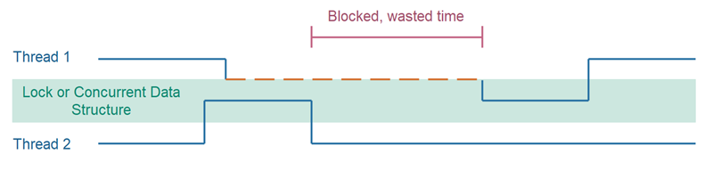
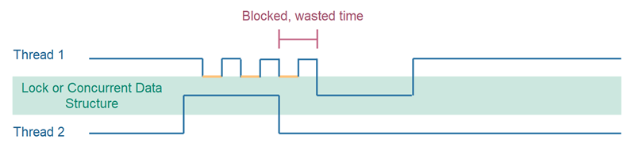

# 比较并交换 (Compare and Swap)

比较并交换是一种在设计并发算法时使用的技术。基本上，比较并交换先比较一个变量的值与预期值，如果值相等，则将变量的值交换为新值。比较并交换可能听起来有点复杂，但一旦你理解了它，实际上是相当简单的，让我进一步阐述这个话题。

顺便说一下，比较并交换有时缩写为CAS，所以如果你看到一些关于并发的文章或视频提到CAS，很可能它指的是比较并交换操作。

## 检查然后执行情况下的比较并交换
并发算法中常见的一种模式是“检查然后执行”模式。
当代码首先检查一个变量的值，然后基于该值执行操作时，就会出现检查然后执行模式。这里有一个简单的例子：

```java
public class ProblematicLock {
    private volatile boolean locked = false;

    public void lock() {
        while (this.locked) {
            // 忙等待 - 直到 this.locked == false
        }

        this.locked = true;
    }

    public void unlock() {
        this.locked = false;
    }
}
```

这段代码不是多线程锁的100%正确实现。这就是为什么我将其命名为`ProblematicLock`。然而，我创建了这个有缺陷的实现，是为了说明如何通过比较并交换功能来修复它的问题。

`lock()`方法首先检查`locked`成员变量是否等于`false`。这是在`while`循环内完成的。如果`locked`变量是`false`，`lock()`方法将退出`while`循环，并将`locked`设置为`true`。换句话说，`lock()`方法首先检查`locked`变量的值，然后基于该检查执行操作。检查，然后执行。

如果有多个线程访问相同的`ProblematicLock`实例，上述`lock()`方法不能保证正常工作。例如：

如果线程A检查`locked`的值并看到它是`false`（预期值），它将退出`while`循环以对该检查采取行动。如果线程B在线程A将`locked`的值设置为`true`之前也检查了`locked`的值，那么线程B也将退出`while`循环以对该检查采取行动。这是一个典型的竞态条件。

## 检查然后执行 - 必须是原子操作
为了在多线程应用程序中正常工作（避免竞态条件），检查然后执行操作必须是原子的。原子意味着检查和执行动作被执行为一个原子（不可分割的）代码块。任何开始执行该块的线程都将在没有其他线程干扰的情况下完成执行块。没有其他线程可以同时执行原子块。

使Java代码块成为原子的一个简单方法是使用`synchronized` Java关键字进行标记。有关更多详细信息，请参阅我的Java synchronized教程。以下是使用`synchronized`关键字将`lock()`方法变为原子代码块的`ProblematicLock`：

```java
public class ProblematicLock {
    private volatile boolean locked = false;

    public synchronized void lock() {
        while (this.locked) {
            // 忙等待 - 直到 this.locked == false
        }

        this.locked = true;
    }

    public void unlock() {
        this.locked = false;
    }
}
```

现在`lock()`方法是同步的，所以只有一个线程可以同时在同一个`MyLock`实例上执行它。`lock()`方法实际上是原子的。

## 阻塞线程代价高昂
当两个线程同时尝试进入Java中的同步块时，一个线程将被阻塞，另一个线程将被允许进入同步块。当进入同步块的线程再次退出块时，等待的线程将被允许进入该块。

如果线程被允许访问，进入同步块并不那么昂贵。但如果线程因为另一个线程已经在同步块内执行而被阻塞 - 线程的阻塞是昂贵的。

此外，当同步块再次空闲时，你不能确切保证被阻塞的线程何时被解除阻塞。这通常由操作系统或执行平台协调被阻塞线程的解除阻塞。当然，一个被阻塞的线程被解除阻塞并被允许进入不会需要几秒钟或几分钟，但被阻塞的线程可能会浪费一些时间，而这些时间本可以用来访问共享数据结构。这在这里进行了说明：



## 硬件提供的原子比较并交换操作
现代CPU内置了对原子比较并交换操作的支持。比较并交换操作有时可以作为同步块或其他阻塞数据结构的替代品。CPU保证一次只有一个线程可以执行比较并交换操作 - 即使在CPU核心之间也是如此。本教程后面包含了如何在代码中实现这一点的示例。

当使用硬件/CPU提供的比较并交换功能而不是操作系统或执行平台提供的同步、锁、互斥锁等时，操作系统或执行平台不需要处理线程的阻塞和解除阻塞。这导致线程等待执行比较并交换操作的时间更短，因此导致更少的拥堵和更高的吞吐量。这在下面的说明中进行了阐述：



如你所见，尝试进入共享数据结构的线程从未完全被阻塞。它不断尝试执行比较并交换操作，直到成功，并被允许访问共享数据结构。这样最小化了线程可以进入共享数据结构之前的延迟。

当然，如果线程在重复执行比较并交换等待了很长时间，它可能会浪费大量CPU周期，而这些周期本可以用于其他任务（其他线程）。然而，在许多情况下情况并非如此。这取决于共享数据结构被另一个线程使用的时长。在实践中，共享数据结构不会使用很长时间，所以上述情况不应该经常发生。但这又取决于具体情况、代码、数据结构、尝试访问数据结构的线程数量、系统的负载等。相比之下，被阻塞的线程根本不使用CPU。

## Java中的比较并交换
从Java 5开始，你可以通过`java.util.concurrent.atomic`包中的一些新原子类访问到CPU级别的比较并交换函数。这些类包括：

- AtomicBoolean
- AtomicInteger
- AtomicLong
- AtomicReference
- AtomicStampedReference
- AtomicIntegerArray
- AtomicLongArray
- AtomicReferenceArray

使用Java 5+提供的比较并交换特性而不是自己实现的优势在于，Java 5+内置的比较并交换特性可以让你利用应用程序运行所在的CPU的底层比较并交换特性。这使你的比较并交换代码更快。

## 作为守卫的比较并交换
比较并交换功能可以用来保护一个临界区 - 从而防止多个线程同时执行临界区。

以下是一个示例，展示了如何使用`AtomicBoolean`类实现前面展示的`lock()`方法，使用比较并交换功能作为守卫（一次只允许一个线程退出`lock()`方法）。

```java
public class CompareAndSwapLock {
    private AtomicBoolean locked = new AtomicBoolean(false);

    public void unlock() {
        this.locked.set(false);
    }

    public void lock() {
        while (!this.locked.compareAndSet(false, true)) {
            // 忙等待 - 直到 compareAndSet() 成功
        }
    }
}
```

注意`locked`变量不再是一个`boolean`而是一个`AtomicBoolean`。这个类有一个`compareAndSet()`函数，它将比较`AtomicBoolean`实例的值与预期值，如果有预期值，它会将值与新值交换。`compareAndSet()`方法如果值被交换则返回`true`，如果没有则返回`false`。

在上面的例子中，`compareAndSet()`方法调用将`locked`的值与`false`比较，如果是`false`，它将`AtomicBoolean`的新值设置为`true`。

由于一次只允许一个线程执行`compareAndSet()`方法，只有一个线程将能看到值为`false`的`AtomicBoolean`，并因此将其交换为`true`。因此，一次只有一个线程能够退出`while`循环 - 每次通过`unlock()`方法调用`locked.set(false)`解锁CompareAndSwapLock时，都有一个线程。

## 作为乐观锁定机制的比较并交换
也可以将比较并交换功能用作乐观锁定机制。乐观锁定机制允许多个线程同时进入临界区，但只允许其中一个线程在临界区结束时提交其工作。

以下是一个使用乐观锁定策略的并发计数器类的示例：

```java
public class OptimisticLockCounter {
    private AtomicLong count = new AtomicLong();

    public void inc() {
        boolean incSuccessful = false;
        while (!incSuccessful) {
            long value = this.count.get();
            long newValue = value + 1;

            incSuccessful = this.count.compareAndSet(value, newValue);
        }
    }

    public long getCount() {
        return this.count.get();
    }
}
```

注意`inc()`方法如何从`count`变量，一个`AtomicLong`实例中获取现有计数值。然后基于旧值计算新值。最后，`inc()`方法尝试通过调用`compareAndSet()`在`AtomicLong`实例中设置新值。

如果`AtomicLong`仍然具有与上次获取时相同的值，`compareAndSet()`将成功。但如果另一个线程在此期间增加了`AtomicLong`的值，`compareAndSet()`调用将失败，因为预期值（`value`）不再是存储在`AtomicLong`中的值。
在这种情况下，`inc()`方法将在`while`循环中再迭代一次，并再次尝试增加`AtomicLong`的值。

